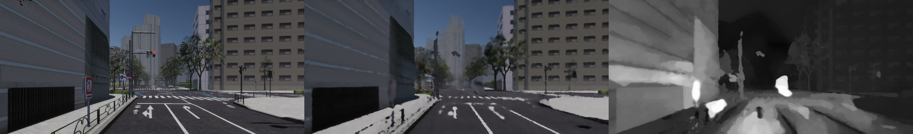
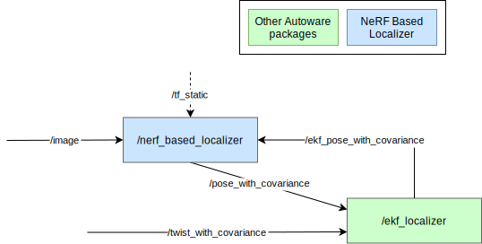

# NeRF Based Localizer

NeRFBasedLocalizer is a vision-based localization package.



## Node diagram



## Inputs / Outputs

### Input

| Name            | Type                                            | Description                      |
| :---------------| :---------------------------------------------- | :------------------------------- |
| `~/input/pose`  | `geometry_msgs::msg::PoseWithCovarianceStamped` | EKF Pose without IMU correction. |
| `~/input/image` | `sensor_msgs::msg::Image`                       | Camera Image                     |

### Output

| Name                            | Type                                            | Description                    |
| :------------------------------ | :---------------------------------------------- | :----------------------------- |
| `~/output/pose`                 | `geometry_msgs::msg::PoseStamped`               | estimated pose                 |
| `~/output/pose_with_covariance` | `geometry_msgs::msg::PoseWithCovarianceStamped` | estimated pose with covariance |
| `~/output/score`                | `std_msgs::msg::Float32`                        | estimated score of nerf        |
| `~/output/image`                | `sensor_msgs::msg::Image`                       | estimated image of nerf        |

## How to build

Download libtorch and extract it to the `nerf_based_localizer/external` directory.

For example,

```bash
cd nerf_based_localizer/external
wget https://download.pytorch.org/libtorch/cu117/libtorch-cxx11-abi-shared-with-deps-1.13.1%2Bcu117.zip
unzip ./libtorch-cxx11-abi-shared-with-deps-1.13.1+cu117.zip
```

If libtorch is prepared, `nerf_based_localizer` can be built as a normal package.
Otherwise, building `nerf_based_localizer` will be skipped.

## How to launch

Set the train result directory to the parameter `train_result_dir` in the `nerf_based_localizer/config/nerf_based_localizer.param.yaml`.

When launching Autoware, set `nerf` for `pose_source`.

```bash
ros2 launch autoware_launch ... \
    pose_source:=nerf \
    ...
```

For example, to run `logging_simulator`, the command is as follows.

```bash
ros2 launch autoware_launch logging_simulator.launch.xml \
    map_path:=/path/to/map \
    pose_source:=nerf \
    vehicle_model:=sample_vehicle \
    sensor_model:=awsim_sensor_kit \
    perception:=false \
    planning:=false \
    control:=false
```

[This trained weights](https://drive.google.com/file/d/1w4hLw7aJ_o6OM8XCCXyNPZTGIy4ah9aZ/view?usp=sharing) and [this rosbag data](https://drive.google.com/file/d/1uMVwQQFcfs8JOqfoA1FqfH_fLPwQ71jK/view) can be used as sample data.

## How to train

### Prepare training data

Use `prepare_data.py`.

```bash
python3 prepare_data.py /path/to/rosbag /path/to/prepared_data/
```

The rosbag must contain the following topics.

| Topic name                                                           | Message type                                    | Description                     |
| :------------------------------------------------------------------- | :---------------------------------------------- | :------------------------------ |
| `/tf_static`                                                         | `tf2_msgs::msg::TFMessage`                      | tf_static                       |
| `/localization/pose_twist_fusion_filter/biased_pose_with_covariance` | `geometry_msgs::msg::PoseWithCovarianceStamped` | EKF Pose without IMU correction |
| `/sensing/camera/traffic_light/image_raw`                            | `sensor_msgs::msg::Image`                       | Camera Image                    |
| `/sensing/camera/traffic_light/camera_info`                          | `sensor_msgs::msg::CameraInfo`                  | Camera Info                     |

For example, the following rosbag obtained from AWSIM can be used.

<https://drive.google.com/file/d/1JM8SgrqxZevyS9thnNMkMx8u8JF2oKhu/view?usp=drive_link>

### Execute training

Use training_tool.

```bash
cd nerf_based_localizer/training_tool/script
./build_and_exec_training.sh /path/to/result_dir/ /path/to/prepared_data/
```

Set the train result directory to the parameter `train_result_dir` in the `nerf_based_localizer/config/nerf_based_localizer.param.yaml`.

## Principle

[NeRF](https://www.matthewtancik.com/nerf), standing for Neural Radiance Fields, presents a novel approach to synthesize novel views of a scene by leveraging the power of neural networks. It was introduced with an aim to handle the challenges of view synthesis, which includes creating novel, previously unseen views of a 3D scene given a sparse set of input photographs.

Training Phase: The model is trained with a set of 2D images of a 3D scene and their corresponding camera parameters (position and orientation). The neural network learns to predict the color and transparency of rays cast through the scene, effectively learning a representation of the 3D scene. The objective is to minimize the difference between the rendered images and the input images.

Inference Phase: After training, NeRF synthesizes novel views of the scene by sampling and summing the colors of volumetric points along the rays cast from a new camera viewpoint. The synthesized images exhibit high-quality view synthesis even under significant viewpoint changes.

### Application in Localization

Implementing NeRF for localization involves utilizing the learned 3D scene representation to estimate the position and orientation of a camera (or observer) in the scene. By comparing the synthesized views and the actual camera view, the algorithm iteratively refines the estimated camera parameters to minimize the difference between the rendered and actual views.

This approach unlocks the potential to achieve accurate and robust self-localization in various environments, allowing devices and robots to comprehend their position and orientation within a previously learned 3D space.

## Acknowledgement

The code for this package is based on [F2-NeRF](https://github.com/Totoro97/f2-nerf) with significant code changes.
