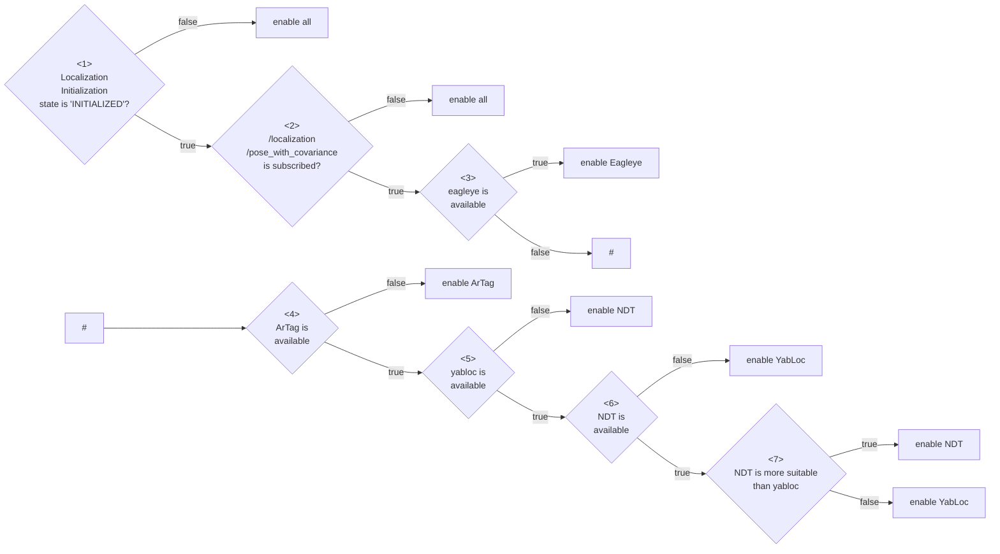

# pose_estimator_arbiter

Table of contents:

- [Abstract](#abstract)
- [Interface](#interfaces)
- [Architecture](#architecture)
- [How to launch](#how-to-launch)
- [Switching Rules](#switching-rules)
- [Pose Initialization](#pose-initialization)
- [Future Plans](#future-plans)

## Abstract

This package launches multiple pose estimators and provides the capability to stop or resume specific pose estimators based on the situation.
It provides provisional switching rules and will be adaptable to a wide variety of rules in the future.

Please refer to [this discussion](https://github.com/orgs/autowarefoundation/discussions/3878) about other ideas on implementation.

### Why do we need a stop/resume mechanism?

It is possible to launch multiple pose_estimators and fuse them using a Kalman filter by editing launch files.
However, this approach is not preferable due to computational costs.

Particularly, NDT and YabLoc are computationally intensive, and it's not recommended to run them simultaneously.
Also, even if both can be activated at the same time, the Kalman Filter may be affected by one of them giving bad output.

### Supporting pose_estimators

- [ndt_scan_matcher](https://github.com/autowarefoundation/autoware.universe/tree/main/localization/ndt_scan_matcher)
- [eagleye](https://autowarefoundation.github.io/autoware-documentation/main/how-to-guides/integrating-autoware/launch-autoware/localization-methods/eagleye-guide/)
- [yabloc](https://github.com/autowarefoundation/autoware.universe/tree/main/localization/yabloc)
- [landmark_based_localizer](https://github.com/autowarefoundation/autoware.universe/tree/main/localization/landmark_based_localizer)

### Demonstration

The following video demonstrates the switching of four different pose estimators.

TODO: change the video

<div><video controls src="https://user-images.githubusercontent.com/24854875/271473970-eb9f6412-a849-4b12-b487-4bd7aef6de09.mp4" muted="false" width="400"></video></div>

Users can reproduce the demonstration using the following data and launch command:

- rosbag: TODO:
- map: TODO:

```bash
ros2 launch autoware_launch logging_simulator.launch.xml \
  map_path:=<your-map-path> \
  vehicle_model:=sample_vehicle \
  sensor_model:=awsim_sensor_kit \
  pose_source:=ndt_yabloc_artag_eagleye
```

## Interfaces

### Parameters

| Name                                             | Type   | Description                                                                                 |
| ------------------------------------------------ | ------ | ------------------------------------------------------------------------------------------- |
| `pcd_occupancy_rule/pcd_density_upper_threshold` | double | If the number of occupied voxel around the self-position exceeds this, NDT is allowd        |
| `pcd_occupancy_rule/pcd_density_lower_threshold` | double | If the number of occupied voxel around the self-position is less than this, NDT is disabled |
| `ar_marker_rule/ar_marker_available_distance`    | double | If the distance to the nearest AR marker exceeds this, disable artag-based-localizer        |

### Services

There are no service server.

### Clients

| Name                  | Type                  | Description                       |
| --------------------- | --------------------- | --------------------------------- |
| `/yabloc_suspend_srv` | std_srv::srv::SetBool | service to stop or restart yabloc |

### Subscriptions

For pose estimator arbitration:

| Name                                  | Type                                          | Description    |
| ------------------------------------- | --------------------------------------------- | -------------- |
| `/input/artag/image`                  | sensor_msgs::msg::Image                       | ArTag input    |
| `/input/yabloc/image`                 | sensor_msgs::msg::Image                       | YabLoc input   |
| `/input/eagleye/pose_with_covariance` | geometry_msgs::msg::PoseWithCovarianceStamped | Eagleye output |
| `/input/ndt/pointcloud`               | sensor_msgs::msg::PointCloud2                 | NDT input      |

For swithing rule:

| Name                          | Type                                                         | Description                       |
| ----------------------------- | ------------------------------------------------------------ | --------------------------------- |
| `/input/pointcloud_map`       | sensor_msgs::msg::PointCloud2                                | point cloud map                   |
| `/input/vector_map`           | autoware_auto_mapping_msgs::msg::HADMapBin                   | vector map                        |
| `/input/pose_with_covariance` | geometry_msgs::msg::PoseWithCovarianceStamped                | localization final output         |
| `/input/initialization_state` | autoware_adapi_v1_msgs::msg::LocalizationInitializationState | localization initialization state |

### Publications

| Name                                   | Type                                          | Description                                            |
| -------------------------------------- | --------------------------------------------- | ------------------------------------------------------ |
| `/output/artag/image`                  | sensor_msgs::msg::Image                       | relayed ArTag input                                    |
| `/output/yabloc/image`                 | sensor_msgs::msg::Image                       | relayed YabLoc input                                   |
| `/output/eagleye/pose_with_covariance` | geometry_msgs::msg::PoseWithCovarianceStamped | relayed Eagleye output                                 |
| `/output/ndt/pointcloud`               | sensor_msgs::msg::PointCloud2                 | relayed NDT input                                      |
| `/output/debug/marker_array`           | visualization_msgs::msg::MarkerArray          | [debug topic] everything for visualization             |
| `/output/debug/string`                 | visualization_msgs::msg::MarkerArray          | [debug topic] debug information such as current status |

## Trouble Shooting

If it does not work, users can get more information in the following ways.

- visualize debug log

```bash
ros2 service call /localization/pose_estimator_arbiter/config_logger logging_demo/srv/ConfigLogger \
  '{logger_name: localization.pose_estimator_arbiter, level: debug}'
```

- check debug string topic

```bash
ros2 topic echo /localization/pose_estimator_arbiter/debug/string
```

## Architecture

### Case of running a single pose estimator

When each pose_estimator is run alone, this package does nothing.
Following figure shows the node configuration when NDT, YabLoc Eagleye and AR-Tag are run independently.


### Case of running multiple pose estimators

When running multiple pose_estimators, pose_estimator_arbiter is executed.
It comprises a **switching rule** and **sub arbiters** corresponding to each pose_estimator.

- Sub arbiters controls the pose_estimator activity by relaying inputs or outputs, or by requesting a suspend service.
- Switching rules determine which pose_estimator to use.

Which sub arbiters and switching rules are instantiated depends on the runtime arguments at startup.

Following figure shows the node configuration when all pose_estiamtor are run simultaneously.


- **NDT**

The NDT sub-arbiter relays topics in the frontside of the point cloud pre-processor.

- **YabLoc**

The YabLoc sub-arbiter relays input image topics in the frontend of the image pre-processor.
YabLoc includes a particle filter process that operates on a timer, and even when image topics are not streamed, the particle prediction process continues to work.
To address this, the YabLoc sub-arbiter also has a service client for explicitly stopping and resuming YabLoc.

- **Eagleye**

The Eagleye sub-arbiter relays Eagleye's output pose topics in the backend of Eagleye's estimation process.
Eagleye performs time-series processing internally, and it can't afford to stop the input stream.
Furthermore, Eagleye's estimation process is lightweight enough to be run continuously without a significant load, so the relay is inserted in the backend.

- **ArTag**

The ArTag sub-arbiter relays image topics in the frontside of the landmark localizer.

## How to launch

The user can launch the desired pose_estimators by giving the pose_estimator names as a concatenation of underscores for the runtime argument `pose_source`.

```bash
ros2 launch autoware_launch logging_simulator.launch.xml \
  map_path:=<your-map-path> \
  vehicle_model:=sample_vehicle \
  sensor_model:=awsim_sensor_kit \
  pose_source:=ndt_yabloc_artag_eagleye
```

Even if `pose_source` includes an unexpected string, it will be filtered appropriately.
Please see the table below for details.

| given runtime argument                       | parsed pose_estimator_arbiter's param (pose_sources) |
| -------------------------------------------- | ---------------------------------------------------- |
| `pose_source:=ndt`                           | `["ndt"]`                                            |
| `pose_source:=hoge`                          | `[]`                                                 |
| `pose_source:=yabloc_ndt`                    | `["ndt","yabloc"]`                                   |
| `pose_source:=yabloc_ndt_ndt_ndt`            | `["ndt","yabloc"]`                                   |
| `pose_source:=ndt_yabloc_eagleye`            | `["ndt","yabloc","eagleye"]`                         |
| `pose_source:=ndt_yabloc_hoge_eagleye_artag` | `["ndt","yabloc","eagleye","artag"]`                 |

## Switching Rules

Currently, only one rule (map based rule) is implemented, but in the future, multiple rules will be implemented.

### Map Based Rule



In the flowchart, any pose_estimators which are not enabled are disabled.
This rule basically allows only one pose_estimator to be activated.

| branch | condition description                                                                                                                                                                   |
| ------ | --------------------------------------------------------------------------------------------------------------------------------------------------------------------------------------- |
| 1      | If localization initialization state is not `INITIALIZED`, enable all pose_estimators. This is because system does not know which pose_estimator is available for initial localization. |
| 2      | If ego-position is not subscribed yet, enable all pose_estimators. This is bacause it is not possible to determine which pose_estimators are available.                                 |
| 3      | If ego-position enters Eagleye area, enable Eagley. See [Eagleye area](#eagleye-area) for more details                                                                                  |
| 4      | If there are landmarks in the surrounding area, enable AR tag based estimation.                                                                                                         |
| 5      | If YabLoc is not enabled as a runtime argument, enable NDT.                                                                                                                             |
| 6      | If NDT is not enabled as a runtime argument, enable YabLoc.                                                                                                                             |
| 7      | If PCD occupancy is above the threshold, enable NDT. See [PCD occupancy](#pcd-occupancy) for more details.                                                                              |

### Rule helpers

Rule helpers are auxiliary tools for describing switching rules.

- [PCD occupancy](#pcd-occupancy)
- [Eagleye area](#eagleye-area)
- [AR tag position](#ar-tag-position)

#### PCD occupancy


#### eagleye area

The eagleye area is a planar area described by polygon in lanelet2.
The height of the area is meaningless; it judges if the projection of its self-position is contained within the polygon or not.

A sample eagleye area is shown below. The values provided below are placeholders.

```xml
  <node id="1" lat="35.8xxxxx" lon="139.6xxxxx">
    <tag k="mgrs_code" v="54SUE000000"/>
    <tag k="local_x" v="10.0"/>
    <tag k="local_y" v="10.0"/>
    <tag k="ele" v="1.0"/>
  </node>
  <node id="2" lat="35.8xxxxx" lon="139.6xxxxx">
    <tag k="mgrs_code" v="54SUE000000"/>
    <tag k="local_x" v="10.0"/>
    <tag k="local_y" v="20.0"/>
    <tag k="ele" v="1.0"/>
  </node>
  <node id="3" lat="35.8xxxxx" lon="139.6xxxxx">
    <tag k="mgrs_code" v="54SUE000000"/>
    <tag k="local_x" v="20.0"/>
    <tag k="local_y" v="20.0"/>
    <tag k="ele" v="1.0"/>
  </node>
  <node id="4" lat="35.8xxxxx" lon="139.6xxxxx">
    <tag k="mgrs_code" v="54SUE000000"/>
    <tag k="local_x" v="10.0"/>
    <tag k="local_y" v="20.0"/>
    <tag k="ele" v="1.0"/>
  </node>

...

  <way id="5">
    <nd ref="1"/>
    <nd ref="2"/>
    <nd ref="3"/>
    <nd ref="4"/>
    <tag k="type" v="eagleye_area"/>
    <tag k="area" v="yes"/>
  </way>

```

#### AR tag position

This rule helper searches for near landmark tags in the neighborhood.

## Pose Initialization

When using multiple pose_estimators, it is necessary to appropriately adjust the parameters provided to the `pose_initializer`.

The following table is based on the runtime argument "pose_source," indicating which initial pose estimation methods are available and the parameters that should be provided to the pose_initialization node.
To avoid making the application too complicated, a priority is established so that NDT is always used when it is available.
(The pose_initializer will only perform NDT-based initial pose estimation when `ndt_enabled` and `yabloc_enabled` are both `true`).

This table's usage is described from three perspectives:

- **Autoware Users:** Autoware users do not need to consult this table.
  They simply provide the desired combinations of pose_estimators, and the appropriate parameters are automatically provided to the pose_initializer.
- **Autoware Developers:** Autoware developers can consult this table to know which parameters are assigned.
- **Who implements New Pose Estimator Switching:**
  Developers must extend this table and implement the assignment of appropriate parameters to the pose_initializer.

|         pose_source         | invoked initialization method | `ndt_enabled` | `yabloc_enabled` | `gnss_enabled` | `sub_gnss_pose_cov`                          |
| :-------------------------: | ----------------------------- | ------------- | ---------------- | -------------- | -------------------------------------------- |
|             ndt             | ndt                           | true          | false            | true           | /sensing/gnss/pose_with_covariance           |
|           yabloc            | yabloc                        | false         | true             | true           | /sensing/gnss/pose_with_covariance           |
|           eagleye           | vehicle needs run for a while | false         | false            | true           | /localization/pose_estimator/eagleye/...     |
|            artag            | 2D Pose Estimate (RViz)       | false         | false            | true           | /sensing/gnss/pose_with_covariance           |
|         ndt, yabloc         | ndt                           | ndt           | true             | true           | /sensing/gnss/pose_with_covariance           |
|        ndt, eagleye         | ndt                           | ndt           | false            | true           | /sensing/gnss/pose_with_covariance           |
|         ndt, artag          | ndt                           | ndt           | false            | true           | /sensing/gnss/pose_with_covariance           |
|       yabloc, eagleye       | yabloc                        | false         | true             | true           | /sensing/gnss/pose_with_covariance           |
|        yabloc, artag        | yabloc                        | false         | true             | true           | /sensing/gnss/pose_with_covariance           |
|       eagleye, artag        | vehicle needs run for a while | false         | false            | true           | /localization/pose_estimator/eagleye/pose... |
|    ndt, yabloc, eagleye     | ndt                           | ndt           | true             | true           | /sensing/gnss/pose_with_covariance           |
|     ndt, eagleye, artag     | ndt                           | ndt           | false            | true           | /sensing/gnss/pose_with_covariance           |
|   yabloc, eagleye, artag    | yabloc                        | ndt           | true             | true           | /sensing/gnss/pose_with_covariance           |
| ndt, yabloc, eagleye, artag | ndt                           | ndt           | true             | true           | /sensing/gnss/pose_with_covariance           |

## Future Plans

### gradually swithing

In the future, this package will provide not only ON/OFF switching, but also a mechanism for low frequency operation, such as 50% NDT & 50% YabLoc.

### sub_arbiters for pose_estimators to be added in the future

The basic strategy is to realize ON/OFF switching by relaying the input or output topics of that pose_estimator.
If pose_estimator involves time-series processing with heavy computations, it's not possible to pause and resume with just topic relaying.

In such cases, there may not be generally applicable solutions, but the following methods may help:

1. Completely stop and **reinitialize** time-series processing, as seen in the case of YabLoc.
2. Subscribe to `localization/kinematic_state` and **keep updating states** to ensure that the estimation does not break (relying on the output of the active pose_estimator).
3. The multiple pose_estimator **does not support** that particular pose_estimator.

It is important to note that this issue is fundamental to realizing multiple pose_estimators, and it will arise regardless of the architecture proposed in this case.
