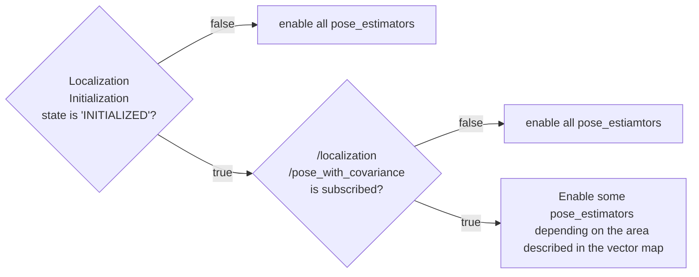

# example rule

## Demonstration

The following video demonstrates the switching of four different pose estimators.

<div><video controls src="https://github-production-user-asset-6210df.s3.amazonaws.com/24854875/295755577-62b26fdd-dcf0-4b1c-a1a0-ecd633413196.mp4" muted="false" width="800"></video></div>

Users can reproduce the demonstration using the following data and launch command:

[sample data (rosbag & map)](https://drive.google.com/file/d/1MxLo1Sw6PdvfkyOYf_9A5dZ9uli1vPvS/view)
The rosbag is simulated data created by [AWSIM](https://tier4.github.io/AWSIM/).
The map is an edited version of the [original map data](https://github.com/tier4/AWSIM/releases/download/v1.1.0/nishishinjuku_autoware_map.zip) published on the AWSIM documentation page to make it suitable for multiple pose_estimators.

## Interfaces

### Parameters

| Name                                             | Type   | Description                                                                                 |
| ------------------------------------------------ | ------ | ------------------------------------------------------------------------------------------- |
| `pcd_occupancy_rule/pcd_density_upper_threshold` | double | If the number of occupied voxel around the self-position exceeds this, NDT is allowed       |
| `pcd_occupancy_rule/pcd_density_lower_threshold` | double | If the number of occupied voxel around the self-position is less than this, NDT is disabled |
| `ar_marker_rule/ar_marker_available_distance`    | double | If the distance to the nearest AR marker exceeds this, disable artag-based-localizer        |

### Subscriptions

For switching rule:

| Name                          | Type                                                         | Description                       |
| ----------------------------- | ------------------------------------------------------------ | --------------------------------- |
| `/input/pointcloud_map`       | sensor_msgs::msg::PointCloud2                                | point cloud map                   |
| `/input/vector_map`           | autoware_auto_mapping_msgs::msg::HADMapBin                   | vector map                        |
| `/input/pose_with_covariance` | geometry_msgs::msg::PoseWithCovarianceStamped                | localization final output         |
| `/input/initialization_state` | autoware_adapi_v1_msgs::msg::LocalizationInitializationState | localization initialization state |

## Switching Rules

### Map Based Rule


In the flowchart, any pose_estimators which are not enabled are disabled.
This rule basically allows only one pose_estimator to be activated.

| branch | condition description                                                                                                                                                                   |
| ------ | --------------------------------------------------------------------------------------------------------------------------------------------------------------------------------------- |
| 1      | If localization initialization state is not `INITIALIZED`, enable all pose_estimators. This is because system does not know which pose_estimator is available for initial localization. |
| 2      | If ego-position is not subscribed yet, enable all pose_estimators. This is because it is not possible to determine which pose_estimators are available.                                 |
| 3      | If ego-position enters Eagleye's pose estimator area, enable Eagleye. See [Pose estimator area](../README.md#eagleye-area) for more details                                             |
| 4      | If there are landmarks in the surrounding area, enable AR tag based estimation.                                                                                                         |
| 5      | If YabLoc is not enabled as a runtime argument, enable NDT.                                                                                                                             |
| 6      | If NDT is not enabled as a runtime argument, enable YabLoc.                                                                                                                             |
| 7      | If PCD occupancy is above the threshold, enable NDT. See [PCD occupancy](#pcd-occupancy) for more details.                                                                              |

### Vector Map Based Rule



### Rule helpers

Rule helpers are auxiliary tools for describing switching rules.

- [Pose estmator area](#pose-estimator-area)
- [PCD occupancy](#pcd-occupancy)
- [AR tag position](#ar-tag-position)

#### Pose estimator area

The pose_estimator_area is a planar area described by polygon in lanelet2.
The height of the area is meaningless; it judges if the projection of its self-position is contained within the polygon or not.


A sample pose_estimator_area is shown below. The values provided below are placeholders.

```xml
  <node id="1" lat="35.8xxxxx" lon="139.6xxxxx">
    <tag k="mgrs_code" v="54SUE000000"/>
    <tag k="local_x" v="10.0"/>
    <tag k="local_y" v="10.0"/>
    <tag k="ele" v="1.0"/>
  </node>
  <node id="2" lat="35.8xxxxx" lon="139.6xxxxx">
    <tag k="mgrs_code" v="54SUE000000"/>
    <tag k="local_x" v="10.0"/>
    <tag k="local_y" v="20.0"/>
    <tag k="ele" v="1.0"/>
  </node>
  <node id="3" lat="35.8xxxxx" lon="139.6xxxxx">
    <tag k="mgrs_code" v="54SUE000000"/>
    <tag k="local_x" v="20.0"/>
    <tag k="local_y" v="20.0"/>
    <tag k="ele" v="1.0"/>
  </node>
  <node id="4" lat="35.8xxxxx" lon="139.6xxxxx">
    <tag k="mgrs_code" v="54SUE000000"/>
    <tag k="local_x" v="10.0"/>
    <tag k="local_y" v="20.0"/>
    <tag k="ele" v="1.0"/>
  </node>

...

  <way id="5">
    <nd ref="1"/>
    <nd ref="2"/>
    <nd ref="3"/>
    <nd ref="4"/>
    <tag k="type" v="pose_estimator_specify"/>
    <tag k="subtype" v="eagleye"/>
    <tag k="area" v="yes"/>
  </way>

  <way id="6">
    <nd ref="7"/>
    <nd ref="8"/>
    <nd ref="9"/>
    <nd ref="10"/>
    <tag k="type" v="pose_estimator_specify"/>
    <tag k="subtype" v="yabloc"/>
    <tag k="area" v="yes"/>
  </way>

```

#### PCD occupancy


#### AR tag position

This rule helper searches for near landmark tags in the neighborhood.
See [landmark_based_localizer](https://github.com/autowarefoundation/autoware.universe/tree/main/localization/landmark_based_localizer) for more details about AR tag.
