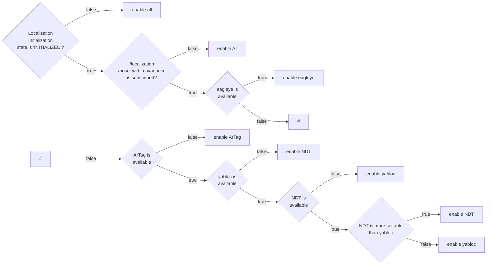

# pose_estimator_manager

Table of contents:

* [Purpose](#purpose)
* [Interface](#interfaces)
* [Architecture](#architecture)
* [How to launch](#how-to-launch)
* [Switching Rules](#switching-rules)

## Purpose

The `pose_estimator_manager` is the package for multi pose_estiamator mode.

[this discussion](https://github.com/orgs/autowarefoundation/discussions/3878)

### Demonstration

TODO: change the video

<div><video controls src="https://user-images.githubusercontent.com/24854875/271473970-eb9f6412-a849-4b12-b487-4bd7aef6de09.mp4" muted="false" width="400"></video></div>

Users can reproduce the demonstration using the following data and launch command:

* rosbag: TODO:
* map: TODO:

```bash
ros2 launch autoware_launch logging_simulator.launch.xml \
  map_path:=<your-map-path> \
  vehicle_model:=sample_vehicle \
  sensor_model:=awsim_sensor_kit \
  pose_source:=ndt_yabloc_artag_eagleye
```

## Interfaces

### Parameters

| Name                                             | Type   | Description                                                                                 |
|--------------------------------------------------|--------|---------------------------------------------------------------------------------------------|
| `pcd_occupancy_rule/pcd_density_upper_threshold` | double | If the number of occupied voxel around the self-position exceeds this, NDT is allowd        |
| `pcd_occupancy_rule/pcd_density_lower_threshold` | double | If the number of occupied voxel around the self-position is less than this, NDT is disabled |
| `ar_marker_rule/ar_marker_available_distance`    | double | If the distance to the nearest AR marker exceeds this, disable artag-based-localizer        |

### Services

There are no service server.

### Clients

| Name                  | Type                  | Description                       |
|-----------------------|-----------------------|-----------------------------------|
| `/yabloc_suspend_srv` | std_srv::srv::SetBool | service to stop or restart yabloc |

### Subscriptions

For pose estimator arbitration

| Name                                  | Type                                          | Description    |
|---------------------------------------|-----------------------------------------------|----------------|
| `/input/artag/image`                  | sensor_msgs::msg::Image                       | ArTag input    |
| `/input/yabloc/image`                 | sensor_msgs::msg::Image                       | YabLocinput    |
| `/input/eagleye/pose_with_covariance` | geometry_msgs::msg::PoseWithCovarianceStamped | Eagleye output |
| `/input/ndt/pointcloud`               | sensor_msgs::msg::PointCloud2                 | NDT output     |

For swithing rule

| Name                          | Type                                                         | Description                       |
|-------------------------------|--------------------------------------------------------------|-----------------------------------|
| `/input/pointcloud_map`       | sensor_msgs::msg::PointCloud2                                | point cloud map                   |
| `/input/vector_map`           | autoware_auto_mapping_msgs::msg::HADMapBin                   | vector map                        |
| `/input/pose_with_covariance` | geometry_msgs::msg::PoseWithCovarianceStamped                | localization final output         |
| `/input/initialization_state` | autoware_adapi_v1_msgs::msg::LocalizationInitializationState | localization initialization state |

### Publications

| Name                                   | Type                                          | Description                                            |
|----------------------------------------|-----------------------------------------------|--------------------------------------------------------|
| `/output/artag/image`                  | sensor_msgs::msg::Image                       | relayed ArTag input                                    |
| `/output/yabloc/image`                 | sensor_msgs::msg::Image                       | relayed YabLocinput                                    |
| `/output/eagleye/pose_with_covariance` | geometry_msgs::msg::PoseWithCovarianceStamped | relayed Eagleye output                                 |
| `/output/ndt/pointcloud`               | sensor_msgs::msg::PointCloud2                 | relayed NDT output                                     |
| `/output/debug/marker_array`           | visualization_msgs::msg::MarkerArray          | [debug topic] everything for visualization             |
| `/output/debug/string`                 | visualization_msgs::msg::MarkerArray          | [debug topic] debug information such as current status |


## Architecture

### Case of running a single pose estimator


### Case of running a single pose estimator


## How to launch

The user can launch the desired pose_estimators by giving the pose_estimator names as a concatenation of underscores for the runtime argument `pose_source`.

```bash
ros2 launch autoware_launch logging_simulator.launch.xml \
  map_path:=<your-map-path> \
  vehicle_model:=sample_vehicle \
  sensor_model:=awsim_sensor_kit \
  pose_source:=ndt_yabloc_artag_eagleye
```

Even if `pose_source`` includes an unexpected string, it will be filtered appropriately.
Please see the table below for details.

| given runtime argument                       | parsed pose_estimator_manager's param (pose_sources) |
|----------------------------------------------|------------------------------------------------------|
| `pose_source:=ndt`                           | `["ndt"]`                                            |
| `pose_source:=hoge`                          | `[]`                                                 |
| `pose_source:=yabloc_ndt`                    | `["ndt","yabloc"]`                                   |
| `pose_source:=yabloc_ndt_ndt_ndt`            | `["ndt","yabloc"]`                                   |
| `pose_source:=ndt_yabloc_eagleye`            | `["ndt","yabloc","eagleye"]`                         |
| `pose_source:=ndt_yabloc_hoge_eagleye_artag` | `["ndt","yabloc","eagleye","artag"]`                 |


## Switching Rules

Currently, only one rule is implemented, but in the future, multiple rules will be implemented so that different rules can be specified.

### Map Based Rule



| branch | description                                                             |
|--------|-------------------------------------------------------------------------|
| [1]    | Enable all pose_estimators, because system does not know which pose_estimator is  available for initial localization.|
| [2]    | Enable all pose_estimators, bacause it is not possible to determine which pose_estimators are available due to the current position.|
| [3]    |          |
| [4]    |          |


## Rule helpers


* [PCD occupancy](#pcd-occupancy)
* [Eagleye area](#eagleye-area)
* [AR tag position](#ar-tag-position)

### PCD occupancy 


### eagleye area

The values provided below are placeholders. Ensure to input the correct coordinates corresponding to the actual location where the area is specified, such as lat, lon, mgrs_code, local_x, local_y.
The following snipet is an example of eagleye area.

```xml
  <node id="1" lat="35.8xxxxx" lon="139.6xxxxx">
    <tag k="mgrs_code" v="54SUE000000"/>
    <tag k="local_x" v="10.0"/>
    <tag k="local_y" v="10.0"/>
    <tag k="ele" v="1.0"/>
  </node>
  <node id="2" lat="35.8xxxxx" lon="139.6xxxxx">
    <tag k="mgrs_code" v="54SUE000000"/>
    <tag k="local_x" v="10.0"/>
    <tag k="local_y" v="20.0"/>
    <tag k="ele" v="1.0"/>
  </node>
  <node id="3" lat="35.8xxxxx" lon="139.6xxxxx">
    <tag k="mgrs_code" v="54SUE000000"/>
    <tag k="local_x" v="20.0"/>
    <tag k="local_y" v="20.0"/>
    <tag k="ele" v="1.0"/>
  </node>
  <node id="4" lat="35.8xxxxx" lon="139.6xxxxx">
    <tag k="mgrs_code" v="54SUE000000"/>
    <tag k="local_x" v="10.0"/>
    <tag k="local_y" v="20.0"/>
    <tag k="ele" v="1.0"/>
  </node>

...

  <way id="5">
    <nd ref="1"/>
    <nd ref="2"/>
    <nd ref="3"/>
    <nd ref="4"/>
    <tag k="type" v="eagleye_area"/>
    <tag k="area" v="yes"/>
  </way>

```

### AR tag position


## For developers
