# pose_estimator_manager

* [Purpose](##urpose)
* [Interface](#Interface)
* [Architecture](#Architecture)
* [Switching Rules](#SwitchingRules)

## Purpose

The `pose_estimator_manager` is the package for multi pose_estiamator mode.


## Interfaces

### Parameters

| Name                                             | Type   | Description                                                                                 |
|--------------------------------------------------|--------|---------------------------------------------------------------------------------------------|
| `pcd_occupancy_rule/pcd_density_upper_threshold` | double | If the number of occupied voxel around the self-position exceeds this, NDT is allowd        |
| `pcd_occupancy_rule/pcd_density_lower_threshold` | double | If the number of occupied voxel around the self-position is less than this, NDT is disabled |
| `ar_marker_rule/ar_marker_available_distance`    | double | If the distance to the nearest AR marker exceeds this, disable artag-based-localizer        |

### Services

There are no service server.

### Clients

| Name                  | Type                  | Description                       |
|-----------------------|-----------------------|-----------------------------------|
| `/yabloc_suspend_srv` | std_srv::srv::SetBool | service to stop or restart yabloc |

### Subscriptions

For pose estimator arbitration

| Name                                  | Type                                          | Description    |
|---------------------------------------|-----------------------------------------------|----------------|
| `/input/artag/image`                  | sensor_msgs::msg::Image                       | ArTag input    |
| `/input/yabloc/image`                 | sensor_msgs::msg::Image                       | YabLocinput    |
| `/input/eagleye/pose_with_covariance` | geometry_msgs::msg::PoseWithCovarianceStamped | Eagleye output |
| `/input/ndt/pointcloud`               | sensor_msgs::msg::PointCloud2                 | NDT output     |

For swithing rule

| Name                          | Type                                                         | Description                       |
|-------------------------------|--------------------------------------------------------------|-----------------------------------|
| `/input/pointcloud_map`       | sensor_msgs::msg::PointCloud2                                | point cloud map                   |
| `/input/vector_map`           | autoware_auto_mapping_msgs::msg::HADMapBin                   | vector map                        |
| `/input/pose_with_covariance` | geometry_msgs::msg::PoseWithCovarianceStamped                | localization final output         |
| `/input/initialization_state` | autoware_adapi_v1_msgs::msg::LocalizationInitializationState | localization initialization state |

### Publications

| Name                                   | Type                                          | Description                                            |
|----------------------------------------|-----------------------------------------------|--------------------------------------------------------|
| `/output/artag/image`                  | sensor_msgs::msg::Image                       | relayed ArTag input                                    |
| `/output/yabloc/image`                 | sensor_msgs::msg::Image                       | relayed YabLocinput                                    |
| `/output/eagleye/pose_with_covariance` | geometry_msgs::msg::PoseWithCovarianceStamped | relayed Eagleye output                                 |
| `/output/ndt/pointcloud`               | sensor_msgs::msg::PointCloud2                 | relayed NDT output                                     |
| `/output/debug/marker_array`           | visualization_msgs::msg::MarkerArray          | [debug topic] everything for visualization             |
| `/output/debug/string`                 | visualization_msgs::msg::MarkerArray          | [debug topic] debug information such as current status |


## Architecture

### Case of running a single pose estimator


### Case of running a single pose estimator


## Switching Rules

Currently, only one rule is implemented, but in the future, multiple rules will be implemented so that different rules can be specified.

### Map Based Rule

```mermaid
flowchart LR
  A{Localization initialization\n state is 'INITIALIZED'？}
  A --false --> _A[enable all]
  A --true --> B{/localization\n/pose_with_covariance\n is subscribes?}
  B -- false --> _B[enable All]
  B -- true --> C{eagleye_is_available}
  C -- true --> _C[enable eagleye]
  C -- false --> D{artag_is_available}
  D -- false --> _D[enable ArTag]
  D -- true --> E{yabloc is available}
  E -- false --> _E[enable NDT]
  E -- true --> F{NDT is available}
  F -- false --> _F[enable yabloc]
  F -- true --> G{NDT is more suitable than yabloc}
  G -- true --> _G[enable NDT]
  G -- false --> __G[enable yabloc]
```



## Rule helpers

### PCD occupancy 


### Example of eagleye area

The values provided below are placeholders. Ensure to input the correct coordinates corresponding to the actual location where the area is specified, such as lat, lon, mgrs_code, local_x, local_y.
The following snipet is an example of eagleye area.

```xml
  <node id="1" lat="35.8xxxxx" lon="139.6xxxxx">
    <tag k="mgrs_code" v="54SUE000000"/>
    <tag k="local_x" v="10.0"/>
    <tag k="local_y" v="10.0"/>
    <tag k="ele" v="1.0"/>
  </node>
  <node id="2" lat="35.8xxxxx" lon="139.6xxxxx">
    <tag k="mgrs_code" v="54SUE000000"/>
    <tag k="local_x" v="10.0"/>
    <tag k="local_y" v="20.0"/>
    <tag k="ele" v="1.0"/>
  </node>
  <node id="3" lat="35.8xxxxx" lon="139.6xxxxx">
    <tag k="mgrs_code" v="54SUE000000"/>
    <tag k="local_x" v="20.0"/>
    <tag k="local_y" v="20.0"/>
    <tag k="ele" v="1.0"/>
  </node>
  <node id="4" lat="35.8xxxxx" lon="139.6xxxxx">
    <tag k="mgrs_code" v="54SUE000000"/>
    <tag k="local_x" v="10.0"/>
    <tag k="local_y" v="20.0"/>
    <tag k="ele" v="1.0"/>
  </node>

...

  <way id="5">
    <nd ref="1"/>
    <nd ref="2"/>
    <nd ref="3"/>
    <nd ref="4"/>
    <tag k="type" v="eagleye_area"/>
    <tag k="area" v="yes"/>
  </way>

```