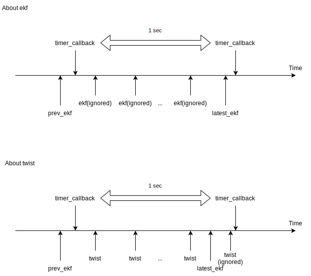
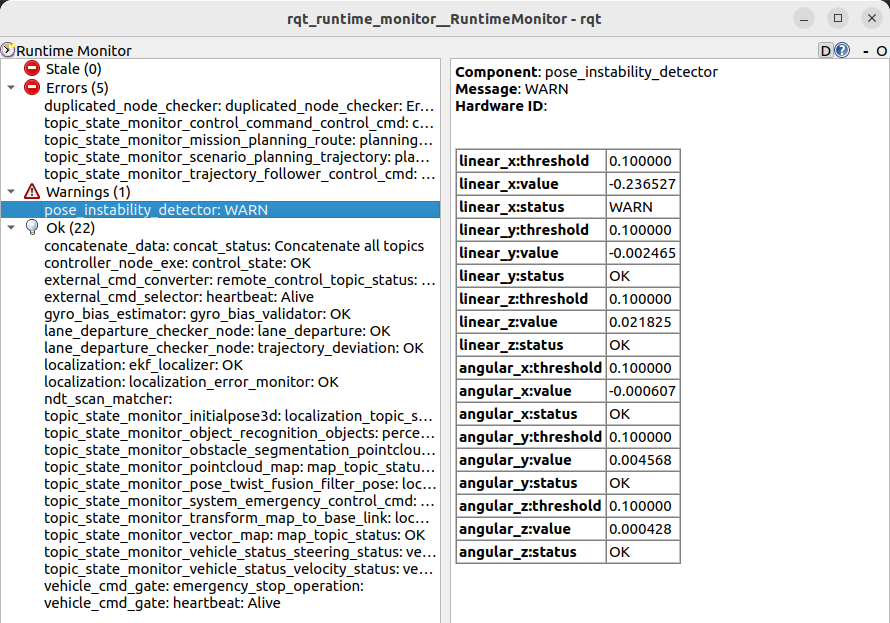

# pose_instability_detector

The `pose_instability_detector` package includes a node designed to monitor the stability of `/localization/kinematic_state`, which is an output topic of the Extended Kalman Filter (EKF).

This node triggers periodic timer callbacks to compare two poses:

- The pose obtained by integrating the twist values from the last received message on `/localization/kinematic_state` over a duration specified by `interval_sec`.
- The latest pose from `/localization/kinematic_state`.

The results of this comparison are then output to the `/diagnostics` topic.

If this node outputs WARN messages to `/diagnostics`, it means that the EKF output is significantly different from the integrated twist values.
This discrepancy suggests that there may be an issue with either the estimated pose or the input twist.

The following diagram provides an overview of what the timeline of this process looks like:

## Parameters

See [pose_instability_detector.param.yaml](config/pose_instability_detector.param.yaml).

| Name                        | Type   | Description                         |
| --------------------------- | ------ | ----------------------------------- |
| `interval_sec`              | double | Interval of timer callback (second) |
| `threshold_diff_position_x` | double | Threshold of diff_position x (m)    |
| `threshold_diff_position_y` | double | Threshold of diff_position y (m)    |
| `threshold_diff_position_z` | double | Threshold of diff_position z (m)    |
| `threshold_diff_angle_x`    | double | Threshold of diff_angle x (rad)     |
| `threshold_diff_angle_y`    | double | Threshold of diff_angle y (rad)     |
| `threshold_diff_angle_z`    | double | Threshold of diff_angle z (rad)     |

## Input

| Name               | Type                                           | Description           |
| ------------------ | ---------------------------------------------- | --------------------- |
| `~/input/odometry` | nav_msgs::msg::Odometry                        | Pose estimated by EKF |
| `~/input/twist`    | geometry_msgs::msg::TwistWithCovarianceStamped | Twist                 |

## Output

| Name           | Type                                  | Description |
| -------------- | ------------------------------------- | ----------- |
| `/diagnostics` | diagnostic_msgs::msg::DiagnosticArray | Diagnostics |

