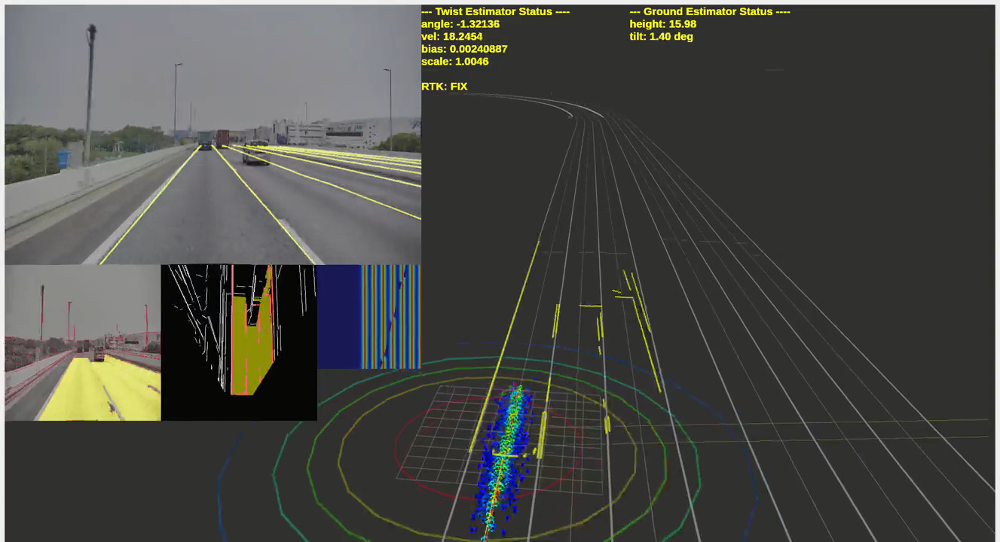
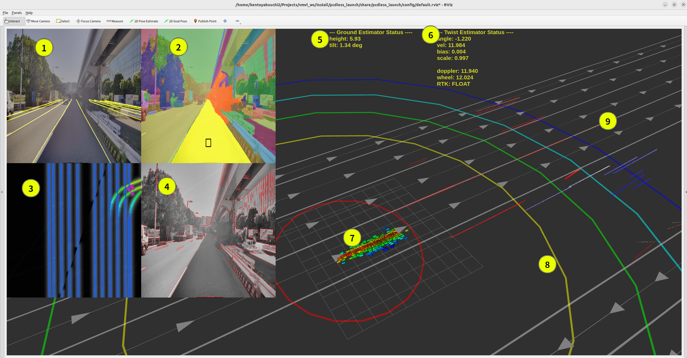

# YabLoc

**YabLoc** is vision-baed localization with vector map.

This has been developed as a new localization stack for [Autoware](https://github.com/autowarefoundation/autoware).



## Installation

### Prerequisites

**Supporting `Ubuntu 22.04` + `ROS2 humble` now.**

### Submodules

* [external/autoware_auto_msgs](https://github.com/tier4/autoware_auto_msgs)
* [external/autoware_msgs](https://github.com/autowarefoundation/autoware_msgs.git)
* [external/septentrio_gnss_driver](https://github.com/tier4/septentrio_gnss_driver.git)
* [external/tier4_autoware_msgs](https://github.com/tier4/tier4_autoware_msgs.git)

**NOTE:** Currently, this software is assumed to be built in a separate workspace in order not to contaminate the autoware workspace.
Someday this will be located in the workspace where Autoware blongs. These submodules will be removed at the time.

### How to build

```shell
mkdir yabloc_ws/src -p
cd yabloc_ws
git clone git@github.com:tier4/YabLoc.git src/YabLoc --recursive
colcon build --symlink-install --cmake-args -DCMAKE_BUILD_TYPE=Release
source install/setup.bash
```

<details><summary>The author often use this build command</summary><div>

```shell
colcon build --symlink-install --cmake-args -DCMAKE_BUILD_TYPE=Release -DCMAKE_EXPORT_COMPILE_COMMANDS=ON -DCMAKE_C_COMPILER_LAUNCHER=ccache -DCMAKE_CXX_COMPILER_LAUNCHER=ccache --continue-on-error
```

* (optional) ccache `(--cmake-args) -DCMAKE_C_COMPILER_LAUNCHER=ccache -DCMAKE_CXX_COMPILER_LAUNCHER=ccache`

* (optional) clang-tidy `(--cmake-args) -DCMAKE_EXPORT_COMPILE_COMMANDS=ON`

* (optional) test `(--cmake-args) -DBUILD_TESTING=ON`

</div></details>

## Quick Start Demo

rosbag made by AWSIM: [Google drive link](https://drive.google.com/drive/folders/1XVWfkDoz-0fncYC-_I6cmv1gkB6EfJ2Y?usp=share_link)



```shell
ros2 launch pcdless_launch sample_launch.xml
ros2 launch pcdless_launch rviz.launch.xml
ros2 bag play awsim_yabloc_rosbag_sample
```

## Demo with Autoware

**NOTE:** `use_sim_time` is TRUE as default.

### Run with rosbag

<details><summary>click to open </summary><div>


```shell
ros2 launch pcdless_launch sample_launch.xml
ros2 launch pcdless_launch rviz.launch.xml
ros2 launch autoware_launch logging_simulator.launch.xml \
  system:=false \
  localizaton:=false \
  sensing:=false \
  perception:=false \
  planning:=false \
  control:=false \
  rviz:=false \
  vehicle_model:=sample_vehicle \ 
  sensor_model:=sample_sensor_kit \
  vehicle_id:=default \
  map_path:=$HOME/Maps/odaiba

ros2 bag play your_rosbag --clock 100
```

</div></details>

### Run in real world

<details><summary>click to open </summary><div>


```shell
ros2 launch pcdless_launch sample_launch.xml use_sim_time:=false
ros2 launch pcdless_launch rviz.launch.xml
ros2 launch autoware_launch autoware.launch.xml \
  rviz:=false
```

</div></details>

### Run with [AWSIM](https://github.com/tier4/AWSIM) <ins>(UNDER CONSTRACTION)</ins>

<details><summary>click to open </summary><div>

**You have to change autoware.universe branch.**

```shell
ros2 launch pcdless_launch sample_launch.xml standalone:=false
ros2 launch pcdless_launch rviz.launch.xml
ros2 launch autoware_launch e2e_simulator.launch.xml
```

</div></details>

## How to set initial pose

### 1. When YabLoc works `standalone:=true`(default)  (without Autoware's pose_initializer)

1. `2D Pose Estimate` in Rviz

You can inidcate x, y and yaw manually in rviz.

2. GNSS Doppler initialization

If doppler (`ublox_msgs/msg/navpvt`) is available and the vehicle moves enough fast, YabLoc will estiamte the initial pose **automatically**.

### 2. When Yabloc works `standalone:=false` (through Autoware's pose_initializer)

<ins>UNDER CONSTRUCTION</ins>

## Architecture


### Input topics

from sesnors

|  topic name  |  msg type  | description |
| ---- | ---- | -- |
|  `/sensing/imu/tamagawa/imu_raw`                      |  `sensor_msgs/msg/Imu`                            |  |
|  `/sensing/camera/traffic_light/image_raw/compressed` |  `sensor_msgs/msg/CompressedImage`                |  |
|  `/sensing/camera/traffic_light/camera_info`          |  `sensor_msgs/msg/CameraInfo`                     |  |
|  `/sensing/gnss/ublox/navpvt`                         |  `ublox_msgs/msg/NavPVT`                          | If you use ublox |
|  `/sensing/gnss/septentrio/poscovgeodetic`            |  `septentrio_gnss_driver_msgs/msg/PosCovGeodetic` | If you use Septentrio |
|  `/vehicle/status/velocity_status`                    |  `autoware_auto_vehicle_msgs/msg/VelocityReport`  |  |

from autoware
|  topic name  |  msg type  | description |
| ---- | ---- | -- |
|  `/tf_static`      | `tf2_msgs/msg/TFMessage`                   | published from `sensor_kit`  |
|  `/map/vector_map` | `autoware_auto_mapping_msgs/msg/HADMapBin` | published from `/map/lanelet2_map_loader` |

#### about tf_static

<details><summary>click to open</summary><div>

Some nodes requires `/tf_static` from `/base_link` to the frame_id of `/sensing/camera/traffic_light/image_raw/compressed` (e.g. `/traffic_light_left_camera/camera_optical_link`).
You can verify that the tf_static is correct with the following command.

```shell
ros2 run tf2_ros tf2_echo base_link traffic_light_left_camera/camera_optical_link
```

If the wrong `/tf_static` are broadcasted because you are using a prototype vehicle, it is useful to give the frame_id in `override_camera_frame_id`.
If you give it a non-empty string, `/imgproc/undistort_node` will rewrite the frame_id in camera_info.
For example, you can give a different tf_static as follows.

```shell
ros2 launch pcdless_launch sample_launch.xml override_camera_frame_id:=fake_camera_optical_link
ros2 run tf2_ros static_transform_publisher \
  --frame-id base_link \
  --child-frame-id fake_camera_optical_link \
  --roll -1.57 \
  --yaw -1.570
```

</div></details>

### Output topics

|  topic name  |  msg type  | description |
| ---- | ---- | -- |
|  `/localicazation/pf/pose`                       | `geometry_msgs/msg/PoseStamped`      | estimated pose  |
|  `/localicazation/validation/overlay_image`      | `sensor_msgs/msg/Image`              | really nice image for demonstration  |
|  `/localicazation/pf/cost_map_image`             | `sensor_msgs/msg/Image`              | visualization of cost map for debug  |
|  `/localicazation/pf/predicted_particles_marker` | `visualization_msgs/msg/MarkerArray` | particles of particle filter |
|  `/localicazation/imgproc/lsd_image`             | `sensor_msgs/msg/Image`              | image |
|  `/localicazation/imgproc/projected_lsd_image`   | `sensor_msgs/msg/Image`              | image |

## Visualization

This project contains original rviz plugins. [rviz2_overlay_plugins](./rviz2_plugins/rviz2_overlay_plugins/README.md)



|  index | topic name | description |
| ---- | ---- | -- |
| 1  |  `/localicazation/validation/overlay_image`     | Projection of lanelet2 (yellow lines) onto image based on estimated pose. If they match well with the actual road markings, it means that the localization performs well.  |
| 2  |  `/localicazation/imgproc/segmented_image`      | result of graph-based segmetation. yellow area is identified as the road surface.|
| 3  |  `/localicazation/pf/cost_map_image`            | cost map generated from lanelet2. |
| 4  |  `/localicazation/imgproc/lsd_image`            | detected line segments |
| 5  |  `/localicazation/map/ground_status`            | ground height and tilt estimatation status |
| 6  |  `/localicazation/twist/kalman/status`          | twist estimation status |
| 7  |  `/localicazation/pf/predicted_particle_marker` | particle distribution of particle fitler (red means a probable candidate) |
| 8  |  `/localicazation/pf/gnss/range_marker`         | particle weight distribution by GNSS |
| 9  |  `/localicazation/pf/scored_cloud`              | 3D projected line segments. the color means the how match they are  |

## License

YabLoc is licensed under Apache License 2.0.
