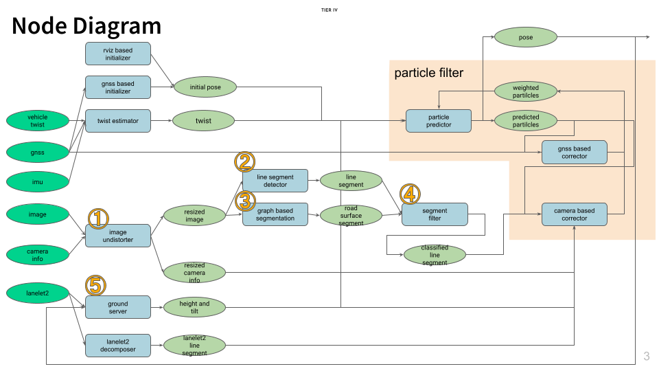

# Vector Map Visual Localization

* Supporting `Ubuntu22.04` + `ROS2 humble` now.
  * Some branches might support `ROS2 galactic`.

## How to build

```bash
mkdir pcdless_ws/src -p

cd pcdless_ws

git clone git@github.com:tier4/VectorMapVisualLocalizer.git src/vector_map_visual_localizer --recursive

colcon build --symlink-install --cmake-args -DCMAKE_BUILD_TYPE=Release -DBUILD_SOPHUS_TESTS=OFF

source install/setup.bash
```

* (optional) ccache `(--cmake-args) -DCMAKE_C_COMPILER_LAUNCHER=ccache -DCMAKE_CXX_COMPILER_LAUNCHER=ccache`

* (optional) clang-tidy `(--cmake-args) -DCMAKE_EXPORT_COMPILE_COMMANDS=ON`

* (optional) test `(--cmake-args) -DBUILD_TESTING=ON`

## Architecture



### Input topics from sesnors

This localizer requires following topics to work.

|  topic name  |  msg type  | description |
| ---- | ---- | -- |
|  `/sensing/imu/tamagawa/imu_raw`                      |  `sensor_msgs/msg/Imu`                            |  |
|  `/sensing/camera/traffic_light/image_raw/compressed` |  `sensor_msgs/msg/CompressedImage`                |  |
|  `/sensing/camera/traffic_light/camera_info`          |  `sensor_msgs/msg/CameraInfo`                     |  |
|  `/sensing/gnss/ublox/navpvt`                         |  `ublox_msgs/msg/NavPVT`                          | If you use ublox |
|  `/sensing/gnss/septentrio/poscovgeodetic`            |  `septentrio_gnss_driver_msgs/msg/PosCovGeodetic` | If you use Septentrio |
|  `/vehicle/status/velocity_status`                    |  `autoware_auto_vehicle_msgs/msg/VelocityReport`  |  |

### Input topics from autoware

|  topic name  |  msg type  | description |
| ---- | ---- | -- |
|  `/tf_static`      | `tf2_msgs/msg/TFMessage`                   | published from `vehicle_interface` ?  |
|  `/map/vector_map` | `autoware_auto_mapping_msgs/msg/HADMapBin` | published from `/map/lanelet2_map_loader` |

#### about tf_static

* XX1のデータだと `/base_link` から `/traffic_light_left_camera/camera_optical_link` のtf_staticがいる。
  * 厳密にはsubscribeしているcamera_infoの`frame_id`を参照して座標変換している
  * `/sensing/camera/traffic_light` 以外のカメラを使う場合は、それのcamera_infoの`frame_id`へのtf_staticがpublishされているかに注意
  * `ros2 run tf2_ros tf2_echo base_link traffic_light_left_camera/camera_optical_link`

* 実験用車両とかだと、pilot-auto側でもtf_staticを簡単に流せないことがあるので、回避策を用意している。
* `override_extrinsic`をtrueにすると、undistort_nodeの中でcamera_infoのframe_idを書き換えて、別の外部パラメータを使える。
  * デフォルトでは`override_extrinsic=false`
  * `override_extrinsic=true`だと`impl/imgproc.launch.xml`の中で上書き用のtf_statcがpublishされる

### Output

* デバッグととかに便利なものたち

|  topic name  |  msg type  | description |
| ---- | ---- | -- |
|  `/localicazation/pf/overlay_image`              | `sensor_msgs/msg/Image`  | Really nice image for demonstration  |
|  `/localicazation/pf/cost_map_image`             | `sensor_msgs/msg/Image`  | Visualization of cost map for debug  |
|  `/localicazation/pf/predicted_particles_marker` | `visualization_msgs/msg/MarkerArray`  | Particles of particle filter |
|  `/localicazation/imgproc/lsd_image`             | `sensor_msgs/msg/Image`  | image |
|  `/localicazation/imgproc/projected_lsd_image`   | `sensor_msgs/msg/Image`  | image |

## Sample data

 [Google drive link](https://drive.google.com/drive/folders/1uNxQ2uPFEGbYXUODQMc7GRO5r9c3Fj6o?usp=share_link)

The link contains *rosbag* and *lanelet2* but *pointcloud*.

## How to execute

**NOTE:** `use_sim_time` is TRUE as default.

### with ROSBAG



```bash
ros2 launch pcdless_launch odaiba_launch.xml 

ros2 launch autoware_launch logging_simulator.launch.xml \
  system:=false \
  localizaton:=false \
  sensing:=false \
  perception:=false \
  planning:=false \
  control:=false \
  rviz:=false \
  vehicle_model:=jpntaxi \ 
  sensor_model:=aip_xx1 \
  vehicle_id:=5 \
  map_path:=$HOME/Maps/odaiba

ros2 bag play sample_odaiba --clock 100
```

### in real world


```bash
ros2 launch pcdless_launch odaiba_launch.xml use_sim_time:=false
ros2 launch autoware_launch autoware.launch.xml \
  rviz:=false
```

### Rviz

```bash
ros2 launch pcdless_launch rviz.launch.xml
```

**NOTE:** This project contains original rviz plugins.
