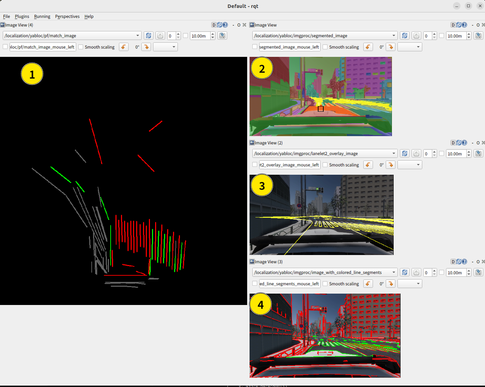

# YabLoc

**YabLoc** is vision-baed localization with vector map. [https://youtu.be/Eaf6r_BNFfk](https://youtu.be/Eaf6r_BNFfk)

## Packages

* [yabloc_common](yabloc_common/README.md)
* [yabloc_imgproc](yabloc_imgproc/README.md)
* [yabloc_particle_filter](yabloc_particle_filter/README.md)
* [yabloc_pose_initializer](yabloc_pose_initializer/README.md)

## Architecture

### Input topics

| topic name                                            | msg type                                       |
|-------------------------------------------------------|------------------------------------------------|
| `/sensing/camera/traffic_light/image_raw/compressed`  | `sensor_msgs/msg/CompressedImage`              |
| `/sensing/camera/traffic_light/camera_info`           | `sensor_msgs/msg/CameraInfo`                   |
| `/sensing/gnss/pose_with_covariance`                  | `geometry_msgs/msg/PoseWithCovarianceStamped`  |
| `/localization/twist_estimator/twist_with_covariance` | `geometry_msgs/msg/TwistWithCovarianceStamped` |
| `/map/vector_map`                                     | `autoware_auto_mapping_msgs/msg/HADMapBin`     |
| `/tf_static`                                          | `tf2_msgs/msg/TFMessage`                       |
| `/initialpose3d`                                      | `geometry_msgs/msg/PoseWithCovarianceStamped`  |

### Output pose topics

| topic name                                            | msg type                                      |
|-------------------------------------------------------|-----------------------------------------------|
| `/localicazation/pose_estimator/pose_with_covariance` | `geometry_msgs/msg/PoseWithCovarianceStamped` |

### Output topics for visualization

**These topics are not visualized by default.**

| index | topic name                                       | description                                                                                                                                                            |
|-------|--------------------------------------------------|------------------------------------------------------------------------------------------------------------------------------------------------------------------------|
| 1     | `/localicazation/pf/predicted_particle_marker`   | particle distribution of particle fitler. Red particles are probable candidate.                                                                                        |
| 2     | `/localicazation/pf/scored_cloud`                | 3D projected line segments. the color indicates how well they  match the map.                                                                                          |
| 3     | `/localicazation/imgproc/lanelet2_overlay_image` | overlay of lanelet2 (yellow lines) onto image based on estimated pose. If they match well with the actual road markings, it means that the localization performs well. |

### Output image topics for visualization

| index | topic name                                                | description                                                                                           |
|-------|-----------------------------------------------------------|-------------------------------------------------------------------------------------------------------|
| 1     | `/localicazation/pf/match_image`                          | projected line segments                                                                               |
| 2     | `/localicazation/imgproc/segmented_image`                 | graph based segmentation result                                                                       |
| 3     | `/localicazation/imgproc/lanelet2_overlay_image`          | overlay of lanelet2                                                                                   |
| 4     | `/localicazation/imgproc/image_with_colored_line_segment` | classifified line segments. green line segments are used in particle correction |