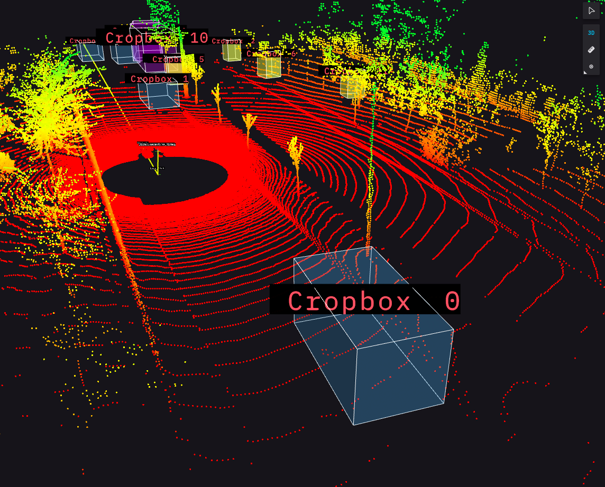
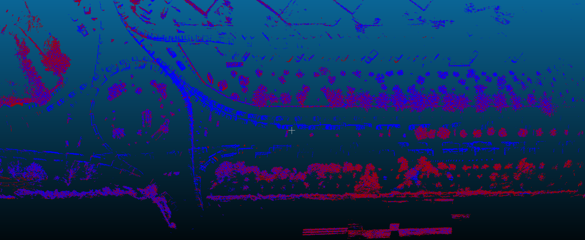

# Dynamic Object Removal

Dynamic Object Removal is a ROS2 package that removes dynamic objects from a point cloud by using a cropping technique. This node subscribes to a point cloud topic and a detected objects topic, synchronizes the incoming messages, and then performs object removal based on the detected object's pose and dimensions. The resulting point cloud with removed objects is then published as output.

## Table of Contents

- [Prerequisites](#prerequisites)
- [Installation](#installation)
- [Usage](#usage)
- [Parameters](#parameters)
- [ROS2 Topics](#ros2-topics)
- [Examples](#examples)

## Prerequisites

- ROS2 (Robot Operating System 2)
- PCL (Point Cloud Library)
- Eigen (C++ template library for linear algebra)

## Installation

1. Clone autoware.universe repository into your ROS2 workspace.
2. Build your ROS2 workspace.

## Usage

Run the dynamic_object_removal node by executing:

```bash
ros2 launch  dynamic_object_removal dynamic_object_removal_default.launch.xml demo:=true
```

Make sure to have the required topics for point cloud and detected objects(lidar_centerpoint) available. The node will subscribe to these topics and perform dynamic object removal.

## Parameters

The node takes the following parameters:

- min_point (default offset: [-0.25, -0.25, -0.1, 1.0]): Minimum point for cropping box dimensions.
- max_point (default offset: [0.25, 0.25, 0.25, 1.0]): Maximum point for cropping box dimensions.

These parameters define the dimensions offset of the cropping box used to remove objects. You can modify these parameters.

## ROS2 Topics

- Subscribed Topics:
  - /input/point_cloud: Input point cloud topic.
  - /objects: Detected objects topic.
- Published Topics:
  - output_pointcloud: Processed point cloud with removed objects.

## Examples




- Mapping example result in cloudcompare (offground), blue point mapping without DOR, red point mapping with DOR.
  
