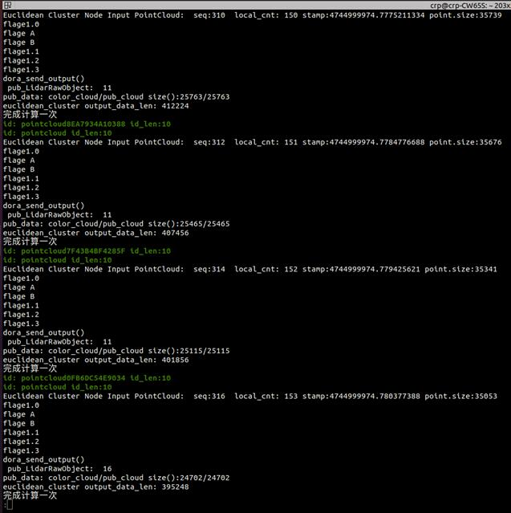

# 欧式聚类节点

## 问题描述

问题描述：雷达数据丢包严重



注：seq是雷达驱动距离的数据包编号，local_cnt是节点记录的接收到数据包的个数。


问题重现指令

step1: 启动dora 节点

```
dora up 
dora start dataflow_euclidean_cluster_detect.yml --name test
```

 step2：启动rviz2，即可看到如下现象


## 节点说明

该配置文件包含4个节点

- rslidar_driver: 从pcap数据文件中读取点云并发布

- ground_filter: 点云去地面节点，去除点云中地面部分

- euclidean_cluster: 点云聚类节点

- show_pointcloud_euclidean_cluster: 点云显示节点  显示聚类以后的点云
