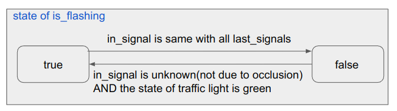
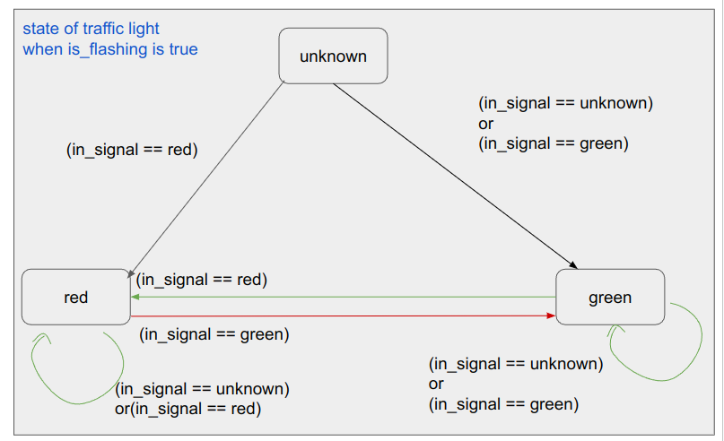

# autoware_crosswalk_traffic_light_estimator

## Purpose

`autoware_crosswalk_traffic_light_estimator` estimates pedestrian traffic signals which can be summarized as the following two tasks:

- Estimate pedestrian traffic signals that are not subject to be detected by perception pipeline.
- Estimate whether pedestrian traffic signals are flashing and modify the result.

This module works without `~/input/route`, but its behavior is outputting the subscribed results as is.

## Inputs / Outputs

### Input

| Name                                 | Type                                                  | Description        |
| ------------------------------------ | ----------------------------------------------------- | ------------------ |
| `~/input/vector_map`                 | autoware_map_msgs::msg::LaneletMapBin                 | vector map         |
| `~/input/route`                      | autoware_planning_msgs::msg::LaneletRoute             | optional: route    |
| `~/input/classified/traffic_signals` | autoware_perception_msgs::msg::TrafficLightGroupArray | classified signals |

### Output

| Name                         | Type                                                  | Description                                               |
| ---------------------------- | ----------------------------------------------------- | --------------------------------------------------------- |
| `~/output/traffic_signals`   | autoware_perception_msgs::msg::TrafficLightGroupArray | output that contains estimated pedestrian traffic signals |
| `~/debug/processing_time_ms` | autoware_internal_debug_msgs::msg::Float64Stamped     | pipeline latency time (ms)                                |

## Parameters

| Name                          | Type   | Description                                                                                                                                                                                                                                                                                                                                                                                                                                                                                                                                        | Default value |
| :---------------------------- | :----- | :------------------------------------------------------------------------------------------------------------------------------------------------------------------------------------------------------------------------------------------------------------------------------------------------------------------------------------------------------------------------------------------------------------------------------------------------------------------------------------------------------------------------------------------------- | :------------ |
| `use_last_detect_color`       | bool   | If this parameter is `true`, this module estimates pedestrian's traffic signal as RED not only when vehicle's traffic signal is detected as GREEN/AMBER but also when detection results change GREEN/AMBER to UNKNOWN. (If detection results change RED or AMBER to UNKNOWN, this module estimates pedestrian's traffic signal as UNKNOWN.) If this parameter is `false`, this module use only latest detection results for estimation. (Only when the detection result is GREEN/AMBER, this module estimates pedestrian's traffic signal as RED.) | true          |
| `last_detect_color_hold_time` | double | The time threshold to hold for last detect color. The unit is second.                                                                                                                                                                                                                                                                                                                                                                                                                                                                              | 2.0           |
| `last_colors_hold_time`       | double | The time threshold to hold for history detected pedestrian traffic light color. The unit is second.                                                                                                                                                                                                                                                                                                                                                                                                                                                | 1.0           |

## Inner-workings / Algorithms

When the pedestrian traffic signals **are detected** by perception pipeline

- If estimates the pedestrian traffic signals are flashing, overwrite the results
- Prefer the output from perception pipeline, but overwrite it if the pedestrian traffic signals are invalid(`no detection`, `backlight`, or `occlusion`)

When the pedestrian traffic signals **are NOT detected** by perception pipeline

- Estimate the color of pedestrian traffic signals based on detected vehicle traffic signals, HDMap, and route

### Estimate whether pedestrian traffic signals are flashing

```plantumul
start
if (the pedestrian traffic light classification result exists)then
    : update the flashing flag according to the classification result(in_signal) and last_signals
    if (the traffic light is flashing?)then(yes)
      : update the traffic light state
    else(no)
      : the traffic light state is the same with the classification result
if (the classification result not exists)
    : the traffic light state is the same with the estimation
 : output the current traffic light state
end
```

#### Update flashing flag

<div align="center">
  
</div>

#### Update traffic light status

<div align="center">
  
</div>

### Estimate the color of pedestrian traffic signals

```plantuml

start
:subscribe detected traffic signals, HDMap, and route;
:extract crosswalk lanelets from HDMap;
:extract road lanelets that conflicts crosswalk from route;
:initialize non_red_lanelets(lanelet::ConstLanelets);
if (Latest detection result is **GREEN** or **AMBER**?) then (yes)
  :push back non_red_lanelets;
else (no)
  if (use_last_detect_color is **true**?) then (yes)
    if (Latest detection result is **UNKNOWN** and last detection result is **GREEN** or **AMBER**?) then (yes)
     :push back non_red_lanelets;
    endif
  endif
endif
if (Is there **STRAIGHT-NON-RED** road lanelet in non_red_lanelets?) then (yes)
  :estimate related pedestrian's traffic signal as **RED**;
else if (Is there both **LEFT-NON-RED** and **RIGHT-NON-RED** road lanelet in non_red_lanelets?) then (yes)
  :estimate related pedestrian's traffic signal as **RED**;
else (no)
  :estimate related pedestrian's traffic signal as **UNKNOWN**;
endif
end

```

If traffic between pedestrians and vehicles is controlled by traffic signals, the crosswalk traffic signal maybe **RED** in order to prevent pedestrian from crossing when the following conditions are satisfied.

#### Situation1

- crosswalk conflicts **STRAIGHT** lanelet
- the lanelet refers **GREEN** or **AMBER** traffic signal (The following pictures show only **GREEN** case)

<div align="center">
  
</div>
<div align="center">
  
</div>

#### Situation2

- crosswalk conflicts different turn direction lanelets (STRAIGHT and LEFT, LEFT and RIGHT, RIGHT and STRAIGHT)
- the lanelets refer **GREEN** or **AMBER** traffic signal (The following pictures show only **GREEN** case)

<div align="center">
  
</div>

## Assumptions / Known limits

## Future extensions / Unimplemented parts
