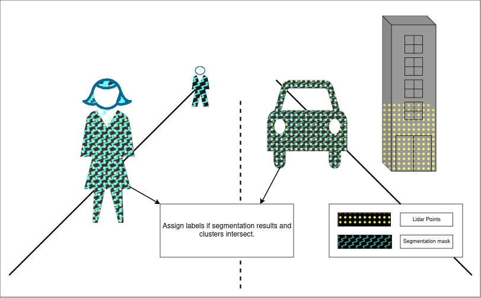

# mask_cluster_fusion

## Purpose

The `mask_cluster_fusion` package aims to assign the label of the mask to the cluster by using the mask information from the 2D instance segmentation model.

## Inner-workings / Algorithms

1. The clusters are projected onto the image plane.
2. Find the mask which intersects with the cluster with high IoU.
3. Assign the label of the mask to the cluster.
4. For all clusters with an assigned label, check if any cluster intersects with the same mask. Reassign the label of the mask to the cluster if its IoU is lower than the previously assigned cluster.

## Inputs / Outputs

### Input

| Name                     | Type                                                     | Description                                               |
| ------------------------ | -------------------------------------------------------- | --------------------------------------------------------- |
| `input`                  | `tier4_perception_msgs::msg::DetectedObjectsWithFeature` | clustered pointcloud                                      |
| `input/camera_info[0-7]` | `sensor_msgs::msg::CameraInfo`                           | camera information to project 3d points onto image planes |
| `input/masks[0-7]`       | `autoware_internal_msgs::msg::SegmentationMask`          | masks from each image                                     |
| `input/image_raw[0-7]`   | `sensor_msgs::msg::Image`                                | images for visualization                                  |

### Output

| Name                     | Type                                                     | Description                |
| ------------------------ | -------------------------------------------------------- | -------------------------- |
| `output`                 | `tier4_perception_msgs::msg::DetectedObjectsWithFeature` | labeled cluster pointcloud |
| `~/debug/image_raw[0-7]` | `sensor_msgs::msg::Image`                                | images for visualization   |

## Parameters

{{ json_to_markdown("perception/autoware_image_projection_based_fusion/schema/mask_cluster_fusion.schema.json") }}

## Assumptions / Known limits
