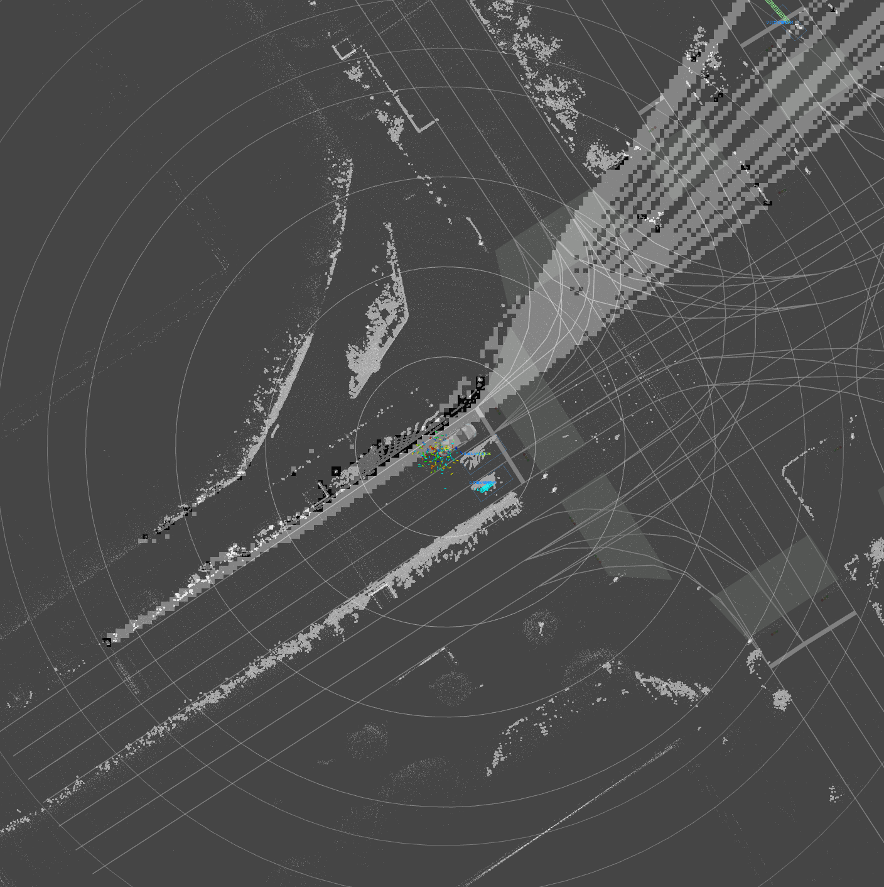
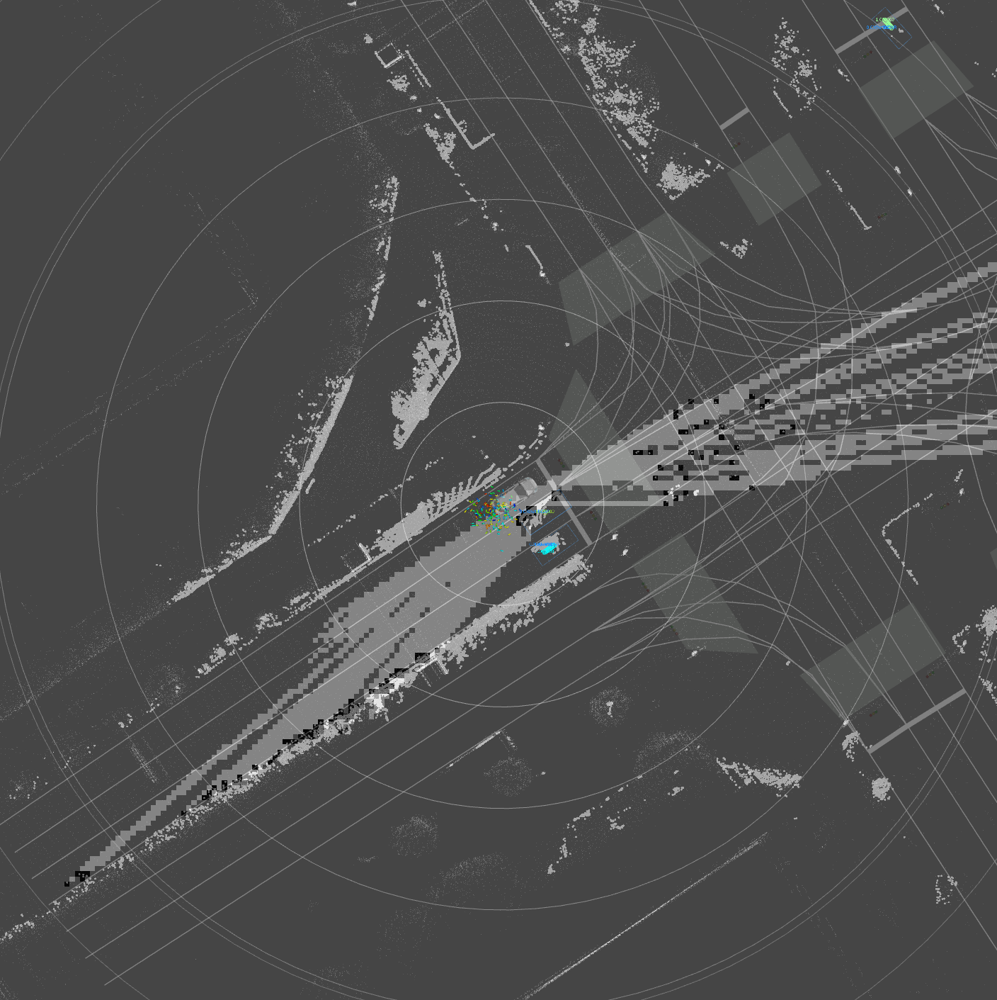
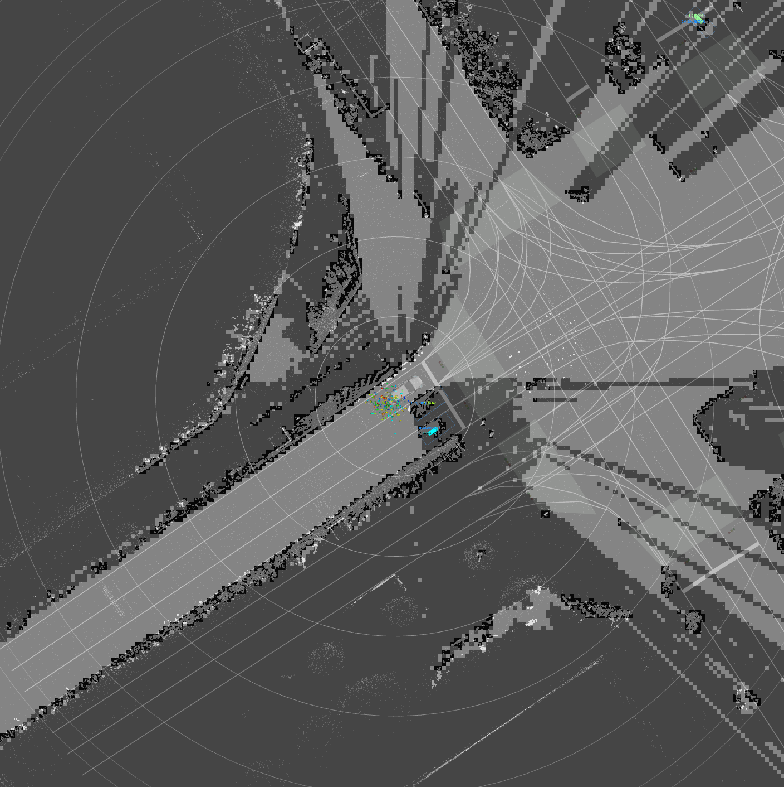

# synchronized OGM fusion

> For simplicity, we use OGM as the meaning of the occupancy grid map.

This package is used to fuse the OGMs from synchronized sensors. Especially for the lidar.

Here shows the example OGM for the this synchronized OGM fusion.

| left lidar OGM                    | right lidar OGM                     | top lidar OGM                   |
| --------------------------------- | ----------------------------------- | ------------------------------- |
|  |  |  |

OGM fusion with asynchronous sensor outputs is not suitable for this package. Asynchronous OGM fusion is under construction.

## Processing flow

The processing flow of this package is shown in the following figure.


- Single Frame Fusion
  - Single frame fusion means that the OGMs from synchronized sensors are fused in a certain time frame $t=t_n$.
- Multi Frame Fusion
  - In the multi frame fusion process, current fused single frame OGM in $t_n$ is fused with the previous fused single frame OGM in $t_{n-1}$.

## Fusion methods

For the single frame fusion, the following fusion methods are supported.

| Fusion Method in parameter | Description                                                                                                                                                                                                                                                                                               |
| -------------------------- | --------------------------------------------------------------------------------------------------------------------------------------------------------------------------------------------------------------------------------------------------------------------------------------------------------- |
| `overwrite`                | The value of the cell in the fused OGM is overwritten by the value of the cell in the OGM with the highest priority. <br> We set priority as `Occupied` > `Free` > `Unknown`.                                                                                                                             |
| `log-odds`                 | The value of the cell in the fused OGM is calculated by the log-odds ratio method, which is known as a Bayesian fusion method. <br> The log-odds of a probability $p$ can be written as $l_p = \log(\frac{p}{1-p})$. <br> And the fused log-odds is calculated by the sum of log-odds. $l_f = \Sigma l_p$ |
| `dempster-shafer`          | The value of the cell in the fused OGM is calculated by the Dempster-Shafer theory[1]. This is also popular method to handle multiple evidences. This package applied conflict escape logic in [2] for the performance. See references for the algorithm details.                                         |

For the multi frame fusion, currently only supporting `log-odds` fusion method.

## How to use

### launch fusion node

The minimum node launch will be like the following.

```xml
<node name="grid_map_fusion_node" exec="grid_map_fusion_node" pkg="probabilistic_occupancy_grid_map" output="screen">
  <remap from="~/output/occupancy_grid_map" to="/perception/occupancy_grid_map/fusion/map"/>
  <param name="fusion_method" value="log-odds"/>
  <!-- inputs -->
  <param name="each_ogm_output_topics" value='["top_ogm", "left_ogm", "right_ogm"]'/>
  <param name="each_ogm_reliabilities" value='[1.0, 0.6, 0.6]'/>
</node>
```

Minimum parameter

| Parameter                | Description                                                                                                                                             |
| ------------------------ | ------------------------------------------------------------------------------------------------------------------------------------------------------- |
| `fusion_method`          | The fusion method for the single frame fusion. Currently we support `overwrite`, `log-odds` and `dempster-shafer`. See the above table for the details. |
| `each_ogm_output_topics` | The input for the gird map fusion node, which means the output topics of the OGMs from synchronized sensors.                                            |
| `each_ogm_reliabilities` | The reliabilities of the OGMs from synchronized sensors. This reliabilities are used for the single frame fusion.                                       |

### (Optional) Generate OGMs in each sensor frame

You need to generate OGMs in each sensor frame before achieving grid map fusion.

`probabilistic_occupancy_grid_map` package supports to generate OGMs for the each from the point cloud data.

<details>
<summary> Example launch.xml (click to expand) </summary>

```xml
<include file="$(find-pkg-share tier4_perception_launch)/launch/occupancy_grid_map/probabilistic_occupancy_grid_map.launch.xml">
    <arg name="input/obstacle_pointcloud" value="/perception/obstacle_segmentation/single_frame/pointcloud_raw"/>
    <arg name="input/raw_pointcloud" value="/sensing/lidar/right/outlier_filtered/pointcloud_synchronized"/>
    <arg name="output" value="/perception/occupancy_grid_map/right_lidar/map"/>
    <arg name="map_frame" value="base_link"/>
    <arg name="scan_origin" value="velodyne_right"/>
    <arg name="use_intra_process" value="true"/>
    <arg name="use_multithread" value="true"/>
    <arg name="use_pointcloud_container" value="$(var use_pointcloud_container)"/>
    <arg name="container_name" value="$(var pointcloud_container_name)"/>
    <arg name="method" value="pointcloud_based_occupancy_grid_map"/>
    <arg name="param_file" value="$(find-pkg-share probabilistic_occupancy_grid_map)/config/pointcloud_based_occupancy_grid_map_fusion.param.yaml"/>
</include>


The minimum parameter for the OGM generation in each frame is shown in the following table.

|Parameter|Description|
|--|--|
|`input/obstacle_pointcloud`| The input point cloud data for the OGM generation. This point cloud data should be the point cloud data which is segmented as the obstacle.|
|`input/raw_pointcloud`| The input point cloud data for the OGM generation. This point cloud data should be the point cloud data which is not segmented as the obstacle. |
|`output`| The output topic of the OGM. |
|`map_frame`| The tf frame for the OGM center origin. |
|`scan_origin`| The tf frame for the sensor origin. |
|`method`| The method for the OGM generation. Currently we support `pointcloud_based_occupancy_grid_map` and `laser_scan_based_occupancy_grid_map`. The pointcloud based method is recommended. |
|`param_file`| The parameter file for the OGM generation. See [example parameter file](config/pointcloud_based_occupancy_grid_map_for_fusion.param.yaml) |

```

</details>

<br>

We recommend to use same `map_frame`, size and resolutions for the OGMs from synchronized sensors.  
Also, remember to set `enable_single_frame_mode` and `filter_obstacle_pointcloud_by_raw_pointcloud` to `true` in the `probabilistic_occupancy_grid_map` package (you do not need to set these parameters if you use the above example config file).

<br>

### Run both OGM generation node and fusion node

We prepared the launch file to run both OGM generation node and fusion node in [`grid_map_fusion_with_synchronized_pointclouds.launch.py`](launch/grid_map_fusion_with_synchronized_pointclouds.launch.py)

You can include this launch file like the following.

```xml
<include file="$(find-pkg-share probabilistic_occupancy_grid_map)/launch/grid_map_fusion_with_synchronized_pointclouds.launch.py">
  <arg name="output" value="/perception/occupancy_grid_map/fusion/map"/>
  <arg name="use_intra_process" value="true"/>
  <arg name="use_multithread" value="true"/>
  <arg name="use_pointcloud_container" value="$(var use_pointcloud_container)"/>
  <arg name="container_name" value="$(var pointcloud_container_name)"/>
  <arg name="method" value="pointcloud_based_occupancy_grid_map"/>
  <arg name="fusion_config_file" value="$(var fusion_config_file)"/>
  <arg name="ogm_config_file" value="$(var ogm_config_file)"/>
</include>
```

The minimum parameter for the launch file is shown in the following table.

| Parameter            | Description                                                                                                                                                                          |
| -------------------- | ------------------------------------------------------------------------------------------------------------------------------------------------------------------------------------ |
| `output`             | The output topic of the finally fused OGM.                                                                                                                                           |
| `method`             | The method for the OGM generation. Currently we support `pointcloud_based_occupancy_grid_map` and `laser_scan_based_occupancy_grid_map`. The pointcloud based method is recommended. |
| `fusion_config_file` | The parameter file for the grid map fusion. See [example parameter file](config/grid_map_fusion.param.yaml)                                                                          |
| `ogm_config_file`    | The parameter file for the OGM generation. See [example parameter file](config/pointcloud_based_occupancy_grid_map_for_fusion.param.yaml)                                            |

## References

- [1] Dempster, A. P., Laird, N. M., & Rubin, D. B. (1977). Maximum likelihood from incomplete data via the EM algorithm. Journal of the Royal Statistical Society. Series B (Methodological), 39(1), 1-38.
- [2] <https://www.diva-portal.org/smash/get/diva2:852457/FULLTEXT01.pdf>
