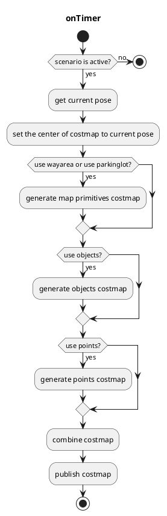

# costmap_generator

## costmap_generator_node

このノードは`PointCloud`と/または`DynamicObjectArray`を読み込み、`OccupancyGrid`と`GridMap`を作成します。`VectorMap(Lanelet2)`はオプションです。

### 入力トピック

| 名称 | タイプ | 説明 |
| --- | ---- | --- |
| `~input/objects` | `autoware_perception_msgs::PredictedObjects` | 障害物エリアの予測オブジェクト |
| `~input/points_no_ground` | `sensor_msgs::PointCloud2` | オブジェクトとして検出できない障害物エリアの地上除去ポイント |
| `~input/vector_map` | `autoware_map_msgs::msg::LaneletMapBin` | 走行可能エリアのベクターマップ |
| `~input/scenario` | `tier4_planning_msgs::Scenario` | ノードの有効化に使用するアクティブ化するシナリオ |

### 出力トピック

| 名前                     | タイプ                    | 説明                                                  |
| ------------------------ | ----------------------- | ------------------------------------------------------- |
| `~output/grid_map`       | grid_map_msgs::GridMap  | costmapをGridMapとして表したもの、値の範囲は0.0から1.0 |
| `~output/occupancy_grid` | nav_msgs::OccupancyGrid | costmapをOccupancyGridとして表したもの、値の範囲は0から100 |

### 出力 TF

なし

### 実行方法

1. 環境をセットアップするには、コマンド `source install/setup.bash` を実行します。

2. ノードを実行するには、`ros2 launch costmap_generator costmap_generator.launch.xml` を実行します。

### パラメータ

| 名前 | タイプ | 説明 |
|---|---|---|
| `update_rate` | double | タイマーの更新レート |
| `activate_by_scenario` | bool | true の場合、シナリオ（パーキング）によってアクティブ化します。それ以外の場合は、車両がパーキングロット内にある場合にアクティブ化します。 |
| `use_objects` | bool | `~input/objects` を使用するかどうかのフラグ |
| `use_points` | bool | `~input/points_no_ground` を使用するかどうかのフラグ |
| `use_wayarea` | bool | `~input/vector_map` の `wayarea` を使用するかどうかのフラグ |
| `use_parkinglot` | bool | `~input/vector_map` の `parkinglot` を使用するかどうかのフラグ |
| `costmap_frame` | string | 作成された Costmap の座標系 |
| `vehicle_frame` | string | 車両の座標系 |
| `map_frame` | string | マップの座標系 |
| `grid_min_value` | double | Gridmap の最小コスト |
| `grid_max_value` | double | Gridmap の最大コスト |
| `grid_resolution` | double | Gridmap の解像度 |
| `grid_length_x` | int | Gridmap の x 方向のサイズ |
| `grid_length_y` | int | Gridmap の y 方向のサイズ |
| `grid_position_x` | int | 座標系から x 方向へのオフセット |
| `grid_position_y` | int | 座標系から y 方向へのオフセット |
| `maximum_lidar_height_thres` | double | 点群データの最大高さしきい値 |
| `minimum_lidar_height_thres` | double | 点群データの最小高さしきい値 |
| `expand_rectangle_size` | double | オブジェクトの矩形をこの値で拡大します |
| `size_of_expansion_kernel` | int | オブジェクトの Costmap に対するぼかし効果のカーネルサイズ |

### フローチャート

