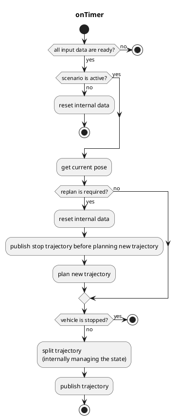

## Autoware_freespace_planner

## freespace_planner_node

`freespace_planner_node`は、静的/動的障害物のある空間でトラジェクトリを計画するグローバルパスプランナノードです。このノードは現在、`freespace_planning_algorithms`パッケージのハイブリッドA\*検索アルゴリズムに基づいています。rrt\*などの他のアルゴリズムも追加され、将来的には選択可能になります。

**注意**
トラジェクトリ追従の制約により、出力トラジェクトリは単一方向のパスのみを含むように分割されます。つまり、出力トラジェクトリは前進と後進の両方のトラジェクトリを同時に含みません。

### 入力トピック

| 名称                      | タイプ                          | 説明                                                    |
| ------------------------ | ----------------------------- | ---------------------------------------------------------- |
| `~input/route`           | autoware_planning_msgs::Route | ルートとゴールポーズ                                    |
| `~input/occupancy_grid`  | nav_msgs::OccupancyGrid       | 走行可能な領域のコストマップ                             |
| `~input/odometry`       | nav_msgs::Odometry            | 車両速度（車両の停止状態をチェックするために使用する） |
| `~input/scenario`       | tier4_planning_msgs::Scenario | ノードをアクティベートするためのアクティベートするシナリオ |

### 出力トピック

| 名称               | タイプ                               | 説明                               |
| -------------------- | ---------------------------------- | ------------------------------------------ |
| `~output/trajectory` | autoware_planning_msgs::Trajectory | 追従する軌道                            |
| `is_completed`       | bool (rosパラメータとして実装)     | すべての分割された軌道が公開されたかどうか |

### 出力TF

なし

### 起動方法

1. `freespace_planner.launch` にリマッピング情報を書き込むか、`roslaunch` を実行するときに引数を追加します。
2. `roslaunch freespace_planner freespace_planner.launch`

### パラメータ

{{json_to_markdown("planning/autoware_freespace_planner/schema/freespace_planner.schema.json")}}

#### ノードパラメータ

| パラメータ                          | 型   | 説明                                                                                               |
| --------------------------------- | ------ | ------------------------------------------------------------------------------------------------ |
| `planning_algorithms`              | 文字列 | ノードで使用されるアルゴリズム                                                                   |
| `vehicle_shape_margin_m`           | 浮動小数 | 計画アルゴリズムのコリジョンマージン                                                             |
| `update_rate`                      | 倍精度浮動小数 | タイマーの更新レート                                                                             |
| `waypoints_velocity`               | 倍精度浮動小数 | 出力軌道の速度（現時点では定速のみをサポート）                                                 |
| `th_arrived_distance_m`            | 倍精度浮動小数 | 車両が軌道のエンドポイントに到着したかどうかをチェックするしきい値距離                               |
| `th_stopped_time_sec`              | 倍精度浮動小数 | 車両が停止しているかどうかをチェックするしきい値時間                                             |
| `th_stopped_velocity_mps`          | 倍精度浮動小数 | 車両が停止しているかどうかをチェックするしきい値速度                                             |
| `th_course_out_distance_m`         | 倍精度浮動小数 | 車両がコースから外れたかどうかをチェックするしきい値距離                                             |
| `th_obstacle_time_sec`             | 倍精度浮動小数 | 障害物が軌道上にあるかどうかをチェックするしきい値時間                                            |
| `vehicle_shape_margin_m`           | 倍精度浮動小数 | 車両マージン                                                                                    |
| `replan_when_obstacle_found`       | ブール   | 障害物が軌道上で見つかったときに再計画するかどうか                                              |
| `replan_when_course_out`           | ブール   | 車両がコースから外れたときに再計画するかどうか                                                 |

#### Planner の共通パラメータ

| パラメータ                | 種類   | 説明                                               |
| ------------------------- | ------ | ---------------------------------------------------- |
| `time_limit`              | 数値   | Planning の時間制限                                |
| `maximum_turning_ratio`   | 数値   | 使用可能な実際の旋回範囲に対する最大比               |
| `turning_steps`           | 数値   | 旋回範囲内の旋回ステップ数                          |
| `theta_size`              | 数値   | 角度の離散化の数                                   |
| `lateral_goal_range`      | 数値   | 横位置の目標範囲                                   |
| `longitudinal_goal_range` | 数値   | 縦位置の目標範囲                                   |
| `angle_goal_range`        | 数値   | 角度の目標範囲                                       |
| `curve_weight`            | 数値   | 曲線操作に対する追加コスト係数                     |
| `reverse_weight`          | 数値   | バック動作に対する追加コスト係数                   |
| `direction_change_weight` | 数値   | 方向変更に対する追加コスト係数                     |
| `obstacle_threshold`      | 数値   | 特定のグリッドを障害物と見なすための閾値              |

#### A\* 探索パラメータ

| パラメーター                       | タイプ   | 説明                                                               |
| -------------------------------- | ------ | ------------------------------------------------------------------- |
| `search_method`                   | 文字列 | 検索方法、スタートからゴールへまたはその逆方向                        |
| `only_behind_solutions`           | ブール | ソリューションをゴールの後ろに制限するかどうか                            |
| `use_back`                        | ブール | 後方軌道を使用するかどうか                                            |
| `adapt_expansion_distance`        | ブール | 環境に基づいて展開距離を適応する場合                                  |
| `expansion_distance`              | double | ノード遷移の展開距離                                                 |
| `near_goal_distance`              | double | ゴール近傍距離のしきい値                                               |
| `distance_heuristic_weight`       | double | ノードのコストを推定するためのヒューリスティック重み                       |
| `smoothness_weight`                 | double | 曲率の変化に対するコストファクター                                       |
| `obstacle_distance_weight`        | double | 障害物までの距離に対するコストファクター                               |
| `goal_lat_distance_weight`        | double | ゴールからの横方向距離に対するコストファクター                           |

#### RRT*探索パラメータ

<!-- cspell:ignore Gammell -->

| パラメーター | 型 | 説明 |
| ------------------------ | ------ | ---------------------------------------------------------------------------- |
| `max planning time` | double | 最大計画時間 [msec] (`enable_update` が `true` の場合にのみ使用) |
| `enable_update` | bool | `max_planning time` が経過するまで実現可能なソリューションが見つかった後の更新の有無 |
| `use_informed_sampling` | bool | Informed RRT\*（Gammell et al.）の使用 |
| `neighbor_radius` | double | RRT\*アルゴリズムの近傍半径 |
| `margin` | double | RRT\*アルゴリズムにおけるパスの衝突チェックで確保される安全マージン |

### フローチャート

