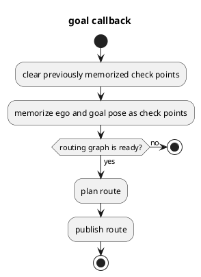
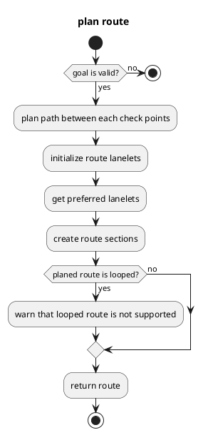

# ミッションプランナー

## 目的

`Mission Planner` は、所与のチェックポイントにしたがって目標位置まで自車位置から移動するための経路を算出します。
経路は、静的な地図上の車線のシーケンスで構成されています。
動的な物体（歩行者や他の車両など）や動的な地図情報（一部の車線を塞ぐ道路工事など）は、経路計画時に考慮されません。
したがって、出力トピックは、目標位置またはチェックポイントが与えられた場合にのみ発行され、新しい目標位置またはチェックポイントが与えられるまでラッチされます。

コア実装は、地図フォーマットに依存しません。任意の計画アルゴリズムをプラグインモジュールとして追加できます。
現在の Autoware.universe では、Lanelet2 地図フォーマットのプラグインのみがサポートされています。

このパッケージは、MRM のルートも管理します。 `route_selector` ノードは `mission_planner` インターフェイスを複製し、通常の MRM と MRM のそれぞれに提供します。
現在の MRM 操作ステータスに応じて、経路要求と計画結果を配信します。

## インターフェイス

### パラメーター

| 名称                               | 型   | 説明                                                                                                                                                                 |
| ---------------------------------- | ------ | ------------------------------------------------------------------------------------------------------------------------------------------------------------------------------------------- |
| `map_frame`                        | 文字列 | マップのフレーム名                                                                                                                                                                         |
| `arrival_check_angle_deg`          | double | ゴール点検の角度閾値                                                                                                                                                                  |
| `arrival_check_distance`           | double | ゴール点検の距離閾値                                                                                                                                                                |
| `arrival_check_duration`           | double | ゴール点検の期間閾値                                                                                                                                                               |
| `goal_angle_threshold`             | double | ゴールの承認のための目標ポーズの最大角度                                                                                                                                                   |
| `enable_correct_goal_pose`         | ブーリアン | 最も近いレーンレットの向きに従ってゴールポーズを修正するかどうか                                                                                                                    |
| `reroute_time_threshold`           | double | 現在速度での経路変更ポイントまでの時間がこの閾値よりも大きい場合、経路変更が可能となる                                                                                           |
| `minimum_reroute_length`           | double | 新しい経路を発行するための最小長                                                                                                                                                              |
| `consider_no_drivable_lanes`       | ブーリアン | 計画に走行不可のレーンレットを考慮するかどうかのフラグ                                                                                                                            |
| `allow_reroute_in_autonomous_mode` | ブーリアン | 自律運転モードでの経路変更を許可するフラグ。falseの場合は経路変更は失敗し、trueの場合は安全な経路変更のみが許可される                                                             |

### サービス

- **Planning (生成器)**
  - 経路生成
  - 自車位置予測
  - 障害物予測
- **Sensor Fusion (センサーフュージョン)**
  - センサーデータの融合
  - オプティカルフローによる自車位置推定
- **ObjDet (物体検出)**
  - 前方および周囲の物体検出
  - 2D/3D物体検出
- **CanBus (CANバス)**
  - 車両ステータスの読み書き
  - ステアリング角と速度制御
- **ROS通信 (ROS通信)**
  - 他のAutowareノードとの通信
- **Localization (局在化)**
  - IMU/GNSS/カメラによる自車位置推定
  - SLAMによるマップ構築と局在化

| Name                                                                | Type                                     | Description                                         |
| ------------------------------------------------------------------- | ---------------------------------------- | ---------------------------------------------------- |
| `/planning/mission_planning/mission_planner/clear_route`            | tier4_planning_msgs/srv/ClearRoute       | ルートクリア要求                                   |
| `/planning/mission_planning/mission_planner/set_waypoint_route`     | tier4_planning_msgs/srv/SetWaypointRoute | レーンレットウェイポイントを伴うルート要求       |
| `/planning/mission_planning/mission_planner/set_lanelet_route`      | tier4_planning_msgs/srv/SetLaneletRoute  | 座標ベースのウェイポイントを伴うルート要求        |
| `/planning/mission_planning/route_selector/main/clear_route`        | tier4_planning_msgs/srv/ClearRoute       | メインルートクリア要求                                |
| `/planning/mission_planning/route_selector/main/set_waypoint_route` | tier4_planning_msgs/srv/SetWaypointRoute | レーンレットウェイポイントを伴うメインルート要求      |
| `/planning/mission_planning/route_selector/main/set_lanelet_route`  | tier4_planning_msgs/srv/SetLaneletRoute  | 座標ベースのウェイポイントを伴うメインルート要求    |
| `/planning/mission_planning/route_selector/mrm/clear_route`         | tier4_planning_msgs/srv/ClearRoute       | MRMルートクリア要求                                 |
| `/planning/mission_planning/route_selector/mrm/set_waypoint_route`  | tier4_planning_msgs/srv/SetWaypointRoute | レーンレットウェイポイントを伴うMRMルート要求      |
| `/planning/mission_planning/route_selector/mrm/set_lanelet_route`   | tier4_planning_msgs/srv/SetLaneletRoute  | 座標ベースのウェイポイントを伴うMRMルート要求    |

### サブスクリプション

- `/current_pose` : ドライブ中に更新される`自車位置`
- `/planning/local_path` : Autoware Planningが計算した局所パス
- `/control/curvature` : Autoware Controlが計算した曲率
- `/control/acceleration` : Autoware Controlが計算した加速度
- `/control/deceleration` : Autoware Controlが計算した減速度
- `/control/jerk` : Autoware Controlが計算したジャーク
- `/control/steering_angle` : Autoware Controlが計算した操舵角
- `/carla/ego_vehicle/odometry` : CARLAエミュレータによって提供されるオドメトリデータ
- `/carla/ego_vehicle/sensor/camera/rgb/front/image` : CARLAエミュレータによって提供されるフロントRGBカメラの画像
- `/carla/ego_vehicle/sensor/lidar/top/front/point_cloud` : CARLAエミュレータによって提供されるフロントLiDARの点群

| 名前                         | 種類                                      | 説明            |
| ---------------------------- | ----------------------------------------- | ---------------------- |
| `input/vector_map`           | autoware_map_msgs/msg/LaneletMapBin       | Lanelet2のベクトルマップ |
| `input/modified_goal`        | geometry_msgs/PoseWithUuidStamped         | 修正されたゴールの姿勢     |
| `input/operation_mode_state` | autoware_adapi_v1_msgs/OperationModeState | 操作モードの状態   |

### 資料

- [Autoware tutorial: Introduction](https://arxiv.org/abs/2002.07901)
- [Open Robotics: Autoware.Auto](https://arxiv.org/abs/2204.09611)
- [Experimental validation of the Autoware.Auto planning module in simulated scenarios](https://arxiv.org/abs/2204.10510)

| 名称                                                  | タイプ                               | 説明                                             |
| ------------------------------------------------------ | ----------------------------------- | ------------------------------------------------ |
| `/planning/mission_planning/state`                    | tier4_planning_msgs/msg/RouteState | ルートの状態                                     |
| `/planning/mission_planning/route`                    | autoware_planning_msgs/LaneletRoute | ルート                                             |
| `/planning/mission_planning/route_selector/main/state` | tier4_planning_msgs/msg/RouteState | メインルートの状態                                  |
| `/planning/mission_planning/route_selector/main/route` | autoware_planning_msgs/LaneletRoute | メインルート                                       |
| `/planning/mission_planning/route_selector/mrm/state`  | tier4_planning_msgs/msg/RouteState | MRMルートの状態                                   |
| `/planning/mission_planning/route_selector/mrm/route`  | autoware_planning_msgs/LaneletRoute | MRMルート                                          |
| `~/debug/route_marker`                                | visualization_msgs/msg/MarkerArray | デバッグ用のルートマーカー                           |
| `~/debug/goal_footprint`                              | visualization_msgs/msg/MarkerArray | デバッグ用の目標フットプリント                       |

## ルートセクション

タイプが `autoware_planning_msgs/LaneletSegment` のルートセクションは、レーンを変更可能な複数のレーンをまとめた道路の「スライス」です。ルートの最小単位は `autoware_planning_msgs/LaneletPrimitive` であることに注意してください。この単位は、ベクターマップ内のレーンの固有 ID とそのタイプを持ちます。したがって、ルートメッセージにはレーンの幾何学的情報を含みません。これは、Planningモジュールのメッセージがマップデータ構造に依存しないようにするためです。

ルートセクションの ROS メッセージには、各ルートセクションに対して次の 3 つの要素が含まれます。

- `preferred_primitive`: 目標に向かう車線の追従優先レーン。
- `primitives`: 優先レーンを含む同じ方向のすべての近接レーン。

## ゴール検証

Mission Planner は、与えられたゴールポーズを検証してルートを作成するための制御メカニズムを備えています。ゴールポーズのレーンのゴールポーズ角度とゴールポーズのヨーが `goal_angle_threshold` パラメータより大きい場合、ゴールは拒否されます。もう 1 つの制御メカニズムは、車両の寸法に基づいてゴールポーズのフットプリントを作成し、このフットプリントがレーンの内側にあるかどうかを確認することです。ゴールのフットプリントがレーンを超えると、ゴールは拒否されます。

次の画像は、ゴールポーズ検証のサンプルケースです。

## 実装

### Mission Planner

2 つのコールバック（ゴールとチェックポイント）がルートプランニングのトリガーです。
レーンのルートを計画するルーティンググラフは、それらのコールバックの前に作成する必要があり、このルーティンググラフはベクターマップコールバックで作成されます。

`plan route` の詳細については、次のセクションで説明します。

### ルートプランナー

`plan route`は、自車位置と目標位置を含むチェックポイントで実行されます。

`各チェックポイント間のパスを計画` はまず、スタートとゴールの自車位置に最も近い車線を計算します。
次に、Lanelet2 のルーティンググラフがスタートとゴールの自車位置から最短経路を計画します。

`ルート車線を初期化` はルートハンドラーを初期化し、`route_lanelets` を計算します。
`route_lanelets` はすべてルートセクションに登録され、車線変更を計画するときに使用される、計画されたパスの車線に隣接する車線です。
`route_lanelets` を計算するには、

1. 車線変更可能な計画されたパスに対するすべての隣接車線 (右と左) が `route_lanelets` として記憶されます。
2. 車線変更できない計画されたパスに対するすべての隣接車線 (右と左) が `candidate_lanelets` として記憶されます。
3. 各 `candidate_lanelets` の前後車線が `route_lanelets` である場合、`candidate_lanelet` は `route_lanelets` として登録されます。
    - これは、`candidate_lanelet` (隣接車線) が車線変更できない場合でも、`candidate_lanelet` の前後車線が `route_lanelets` であれば車線変更せずに `candidate_lanelet` を通過できるためです。

`優先車線を取得` はルートハンドラーを使用して `route_lanelets` から `preferred_primitive` を抽出します。

`ルートセクションの作成` はルートハンドラーを使用して各ルートセクションの `route_lanelets` から `primitives` を抽出し、ルートセクションを作成します。

### 再ルーティング

ここで再ルーティングとは、走行中にルートを変更することを意味します。ルートの設定とは異なり、車両からルート変更地点までの一定の距離を維持する必要があります。
自車が自動運転状態ではない場合、安全確認プロセスはスキップされます。

そして、再ルーティングが必要となるユースケースは 3 つあります。

- ルート変更 API
- 緊急ルート
- ゴール変更

#### ルート変更 API

走行中に目的地を変更したり、分岐ループルートを走行したりするときに使用されます。車両が MRM ルートで走行している場合、このインターフェイスによる通常の再ルーティングは許可されません。

#### 緊急ルート

MRM が路肩に停車するためのインターフェイスです。できるだけ早く停止する必要があるため、再ルーティングが必要です。MRM ルートは通常ルートよりも優先されます。また、MRM ルートがクリアされた場合は、再ルーティング安全確認でも通常ルートに戻ろうとします。

##### ゴール変更

これは、プランニングコンポーネントによる停車、駐車車両の回避などのためのゴール変更です。修正されたゴールが計算されたルートの外にある場合、再ルーティングが必要です。このゴール変更は、車両が実際に目的地に近づくと、周辺環境とパスの安全性を確認して実行されます。また、この変更は通常ルートと mrm ルートの両方に対して許可されます。
ここで生成された新しいルートは AD API に送信されるため、アプリケーションからも参照できます。ただし、ここでの仕様は今後変更される可能性があることに注意してください。

#### 再ルーティングの制約

- 再ルーティングの安全判断は、軌跡または制御のレベルでは保証されません。したがって、安全のために再ルーティング変更までの距離は十分に長くなければなりません。
- `modified_goal` の有効性は、それが誤った車線に配置されていない、安全に再ルーティングできるなど、behavior_path_planner によって保証される必要があります。

## 制限

- 動的オブジェクト (例: 歩行者や他の車両) や動的マップ情報 (例: 一部の車線を塞ぐ道路工事) はルート計画中に考慮されません。
- ループルートはサポートされていません。

