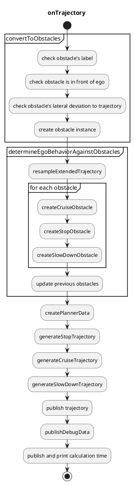

# Obstacle Cruise Planner

## Overview

The `autoware_obstacle_cruise_planner` package has following modules.

- Stop planning
  - stop when there is a static obstacle near the trajectory.
- Cruise planning
  - cruise a dynamic obstacle in front of the ego.
- Slow down planning
  - slow down when there is a static/dynamic obstacle near the trajectory.

## Interfaces

### Input topics

| Name                 | Type                                       | Description      |
| -------------------- | ------------------------------------------ | ---------------- |
| `~/input/trajectory` | autoware_planning_msgs::Trajectory         | input trajectory |
| `~/input/objects`    | autoware_perception_msgs::PredictedObjects | dynamic objects  |
| `~/input/odometry`   | nav_msgs::msg::Odometry                    | ego odometry     |

### Output topics

| Name                            | Type                                           | Description                      |
| ------------------------------- | ---------------------------------------------- | -------------------------------- |
| `~/output/trajectory`           | autoware_planning_msgs::Trajectory             | output trajectory                |
| `~/output/velocity_limit`       | tier4_planning_msgs::VelocityLimit             | velocity limit for cruising      |
| `~/output/clear_velocity_limit` | tier4_planning_msgs::VelocityLimitClearCommand | clear command for velocity limit |

## Design

Design for the following functions is defined here.

- Behavior determination against obstacles
- Stop planning
- Cruise planning
- Slow down planning

A data structure for cruise and stop planning is as follows.
This planner data is created first, and then sent to the planning algorithm.

```cpp
struct PlannerData
{
  rclcpp::Time current_time;
  autoware_planning_msgs::msg::Trajectory traj;
  geometry_msgs::msg::Pose current_pose;
  double ego_vel;
  double current_acc;
  std::vector<Obstacle> target_obstacles;
};
```

```cpp
struct Obstacle
{
  rclcpp::Time stamp;  // This is not the current stamp, but when the object was observed.
  geometry_msgs::msg::Pose pose;  // interpolated with the current stamp
  bool orientation_reliable;
  Twist twist;
  bool twist_reliable;
  ObjectClassification classification;
  std::string uuid;
  Shape shape;
  std::vector<PredictedPath> predicted_paths;
};
```

### Behavior determination against obstacles

Obstacles for cruising, stopping and slowing down are selected in this order based on their pose and velocity.
The obstacles not in front of the ego will be ignored.


The behavior determination flowchart is shown below.


#### Block diagram


## Implementation

### Flowchart

Successive functions consist of `autoware_obstacle_cruise_planner` as follows.

Various algorithms for stop and cruise planning will be implemented, and one of them is designated depending on the use cases.
The core algorithm implementation `generateTrajectory` depends on the designated algorithm.



## How To Debug

How to debug can be seen [here](docs/debug.md).

## Known Limits

- Common
  - When the obstacle pose or velocity estimation has a delay, the ego sometimes will go close to the front vehicle keeping deceleration.
  - Current implementation only uses predicted objects message for static/dynamic obstacles and does not use pointcloud. Therefore, if object recognition is lost, the ego cannot deal with the lost obstacle.
  - The current predicted paths for obstacle's lane change does not have enough precision for obstacle_cruise_planner. Therefore, we set `rough_detection_area` a small value.
- PID-based planner
  - The algorithm strongly depends on the velocity smoothing package (`motion_velocity_smoother` by default) whether or not the ego realizes the designated target speed. If the velocity smoothing package is updated, please take care of the vehicle's behavior as much as possible.
