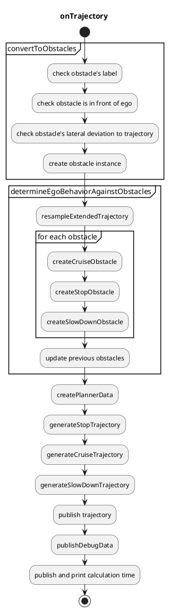

# 障害物巡航プランナー

## 概要

`autoware_obstacle_cruise_planner` パッケージには、以下のモジュールが含まれています。

- 停止プランニング
  - 進行経路の近くに静止した障害物がある場合に停止します。
- 巡航プランニング
  - 自車の前にある動的な障害物を巡航します。
- 減速プランニング
  - 進行経路の近くに静止した障害物や動的な障害物がある場合に減速します。

## インターフェース

### 入力トピック

| 名称               | 種類                                       | 説明                                   |
| -------------------- | ------------------------------------------ | -------------------------------------- |
| `~/input/trajectory` | `autoware_planning_msgs::Trajectory`       | 入力軌道                                |
| `~/input/objects`    | `autoware_perception_msgs::PredictedObjects` | 動的オブジェクト                        |
| `~/input/odometry`   | `nav_msgs::msg::Odometry`                    | 自車オドメトリ                          |

### 出力トピック

| 名前                            | 型                                           | 説明                                |
| ------------------------------- | ---------------------------------------------- | -------------------------------------- |
| `~/output/trajectory`           | autoware_planning_msgs::Trajectory             | 出力軌跡                              |
| `~/output/velocity_limit`       | tier4_planning_msgs::VelocityLimit             | 巡行時の速度制限                      |
| `~/output/clear_velocity_limit` | tier4_planning_msgs::VelocityLimitClearCommand | 速度制限のクリアコマンド                  |
| `~/output/stop_reasons`         | tier4_planning_msgs::StopReasonArray           | 車両を停止させる理由                      |

## 設計

以下の機能の設計がここに定義されています。

- 障害物対策
- 停止計画
- クルーズ計画
- 減速計画

クルーズ計画と停止計画のデータ構造は次のとおりです。
このプランナーデータは最初に作成され、その後、計画アルゴリズムに送信されます。


```cpp
struct PlannerData
{
  rclcpp::Time current_time;
  autoware_planning_msgs::msg::Trajectory traj;
  geometry_msgs::msg::Pose current_pose;
  double ego_vel;
  double current_acc;
  std::vector<Obstacle> target_obstacles;
};
```


```cpp
struct Obstacle
{
  rclcpp::Time stamp;  // This is not the current stamp, but when the object was observed.
  geometry_msgs::msg::Pose pose;  // interpolated with the current stamp
  bool orientation_reliable;
  Twist twist;
  bool twist_reliable;
  ObjectClassification classification;
  std::string uuid;
  Shape shape;
  std::vector<PredictedPath> predicted_paths;
};
```

### 障害物に対する動作決定

巡航、停止、減速の障害物は、自車位置と速度に基づいてこの順序で選択されます。
自車の前方にない障害物は無視されます。


#### 巡航車両の決定

次の条件を満たす障害物は、巡航障害物として決定されます。

- 物体から自車の軌道までの横方向距離が`behavior_determination.cruise.max_lat_margin`未満であること。

- 物体タイプが`common.cruise_obstacle_type.*`に従って巡航用であること。
- 物体は自車の軌道を横断していない（\*1）。
- 物体が軌道内にある場合。
  - 物体タイプが`common.cruise_obstacle_type.inside.*`に従って巡航内部用であること。
  - 物体速度が`behavior_determination.obstacle_velocity_threshold_from_cruise_to_stop`を超えていること。
- 物体が軌道外にある場合。
  - 物体タイプが`common.cruise_obstacle_type.outside.*`に従って巡航外部用であること。
  - 物体速度が`behavior_determination.cruise.outside_obstacle.obstacle_velocity_threshold`を超えていること。
  - 最も信頼性の高い予測経路が自車の軌道と衝突すること。
  - その衝突期間が`behavior_determination.cruise.outside_obstacle.ego_obstacle_overlap_time_threshold`を超えていること。

| パラメータ | 型 | 説明 |
|---|---|---|
| `common.cruise_obstacle_type.inside.unknown` | bool | クルーズに対して、不明なオブジェクトを考慮するフラグ |
| `common.cruise_obstacle_type.inside.car` | bool | クルーズに対して、乗用車オブジェクトを考慮するフラグ |
| `common.cruise_obstacle_type.inside.truck` | bool | クルーズに対して、トラックオブジェクトを考慮するフラグ |
| ... | bool | ... |
| `common.cruise_obstacle_type.outside.unknown` | bool | クルーズに対して、不明なオブジェクトを考慮するフラグ |
| `common.cruise_obstacle_type.outside.car` | bool | クルーズに対して、乗用車オブジェクトを考慮するフラグ |
| `common.cruise_obstacle_type.outside.truck` | bool | クルーズに対して、トラックオブジェクトを考慮するフラグ |
| ... | bool | ... |
| `behavior_determination.cruise.max_lat_margin` | double | クルーズ障害物の最大横方向マージン |
| `behavior_determination.obstacle_velocity_threshold_from_cruise_to_stop` | double | 軌道内のクルーズ障害物の最大障害物速度 |
| `behavior_determination.cruise.outside_obstacle.obstacle_velocity_threshold` | double | 軌道外のクルーズ障害物の最大障害物速度 |
| `behavior_determination.cruise.outside_obstacle.ego_obstacle_overlap_time_threshold` | double | 自車と障害物が衝突する最大重複時間 |

##### エゴ車の車線へ割り込んでくる可能性のある車両への譲歩

他車線の車両がエゴ車の現在の車線に割り込んでくる可能性がある場合、それらの車両の後ろで譲歩（巡航）することもできます。

以下の条件を満たす障害物は、譲歩（巡航）の障害物として判断されます。

- 物体タイプが `common.cruise_obstacle_type.*` に従って巡航用であり、速度が `behavior_determination.cruise.yield.stopped_obstacle_velocity_threshold` より大きい。
- 物体がエゴ車の軌跡を横断していない（*1）。
- 移動中の障害物の前に `common.cruise_obstacle_type.*` タイプの別の停止障害物がある。
- 両方の障害物間の横方向距離（エゴ車の軌跡を基準とする）が `behavior_determination.cruise.yield.max_lat_dist_between_obstacles` 未満である。
- 移動中および停止中の障害物は両方、エゴ車の軌跡からそれぞれ横方向距離で `behavior_determination.cruise.yield.lat_distance_threshold` と `behavior_determination.cruise.yield.lat_distance_threshold` + `behavior_determination.cruise.yield.max_lat_dist_between_obstacles` 内にある。

上記の条件を満たしている場合、エゴ車は移動障害物の後ろを巡航し、停止障害物を避けるためにエゴ車の車線に割り込んでくるのを譲歩します。

#### 停止車両の特定

巡航用ではない障害物の中で、以下の条件を満たす障害物は停止用の障害物として特定されます。

- 物体タイプが `common.stop_obstacle_type.*` に従って停止用である。
- 物体からエゴ車の軌跡への横方向距離が `behavior_determination.stop.max_lat_margin` 未満である。
- エゴ車の軌跡に沿った物体速度が `behavior_determination.obstacle_velocity_threshold_from_stop_to_cruise` より小さい。
- 物体は
  - エゴ車の軌跡を横断していない（*1）
  - 速度が `behavior_determination.crossing_obstacle.obstacle_velocity_threshold` 未満
  - 衝突時刻マージンが十分に大きい（*2）。

| パラメーター                                                        | 型   | 説明                                         |
| -------------------------------------------------------------------- | ------ | -------------------------------------------- |
| `common.stop_obstacle_type.unknown`                                   | ブール | 停止時の未知の障害物として考慮するフラグ     |
| `common.stop_obstacle_type.car`                                      | ブール | 停止時の不明な障害物として考慮するフラグ     |
| `common.stop_obstacle_type.truck`                                    | ブール | 停止時の不明な障害物として考慮するフラグ     |
| ...                                                                 | ブール | ...                                         |
| `behavior_determination.stop.max_lat_margin`                          | double | 停止障害物の最大横方向マージン             |
| `behavior_determination.crossing_obstacle.obstacle_velocity_threshold` | double | 無視する最大横断障害物速度                  |
| `behavior_determination.obstacle_velocity_threshold_from_stop_to_cruise` | double | 停止時の最大障害物速度                     |

#### 減速対象車両の特定

巡航および停止の妨げにならない障害物の中で、以下条件を満たす障害物が減速対象の障害物として特定されます。

- オブジェクトタイプが `common.slow_down_obstacle_type.*` に従って減速対象である。
- オブジェクトから自車軌跡までの横方向距離が `behavior_determination.slow_down.max_lat_margin` 未満である。

| パラメータ                                       | 型     | 説明                                                   |
| ---------------------------------------------- | ------ | ------------------------------------------------------ |
| `common.slow_down_obstacle_type.unknown`        | bool   | 不明なオブジェクトを減速で考慮するフラグ                   |
| `common.slow_down_obstacle_type.car`            | bool   | 不明なオブジェクトを減速で考慮するフラグ                   |
| `common.slow_down_obstacle_type.truck`          | bool   | 不明なオブジェクトを減速で考慮するフラグ                   |
| ...                                             | bool   | ...                                                    |
| `behavior_determination.slow_down.max_lat_margin` | double | 減速障害物の最大横マージン                                |

#### メモ

##### \*1: 交差障害物

交差障害物は、自己車両の軌道に対するヨー角が `behavior_determination.crossing_obstacle.obstacle_traj_angle_threshold` より小さい物体である。

| Parameter | Type | Description |
|---|---|---|
| `behavior_determination.crossing_obstacle.obstacle_traj_angle_threshold` | double | 自車軌跡に対する障害物の最大角度。この角度を超えると障害物が軌跡を横切っていると判断する [rad] |

##### \*2: 충돌 시간 여유 부족

우리는 자차가 일정한 속도로 이동하고 장애물이 예측 경로로 이동하는 경우 충돌 영역과 그 시간을 예측합니다.
그런 다음 충돌 영역 내에 자차가 진입할 시간과 장애물이 충돌 영역 내에 진입하는 시간의 차이인 충돌 시간 여유를 계산합니다.
이 여유 시간이 `behavior_determination.stop.crossing_obstacle.collision_time_margin`보다 작으면 여유가 부족합니다.

| パラメータ                                           | タイプ | 説明                                                     |
| ------------------------------------------------- | ------ | ------------------------------------------------------- |
| `behavior_determination.stop.crossing_obstacle.collision_time_margin` | double | 自車と障害物との最大衝突時間マージン                   |

### Stop Planning

| パラメータ                              | 型     | 説明                                                                                 |
| -------------------------------------- | ------ | ------------------------------------------------------------------------------------------ |
| `common.min_strong_accel`              | double | 自車の停止に必要な最小加速度 [m/ss]                                                  |
| `common.safe_distance_margin`          | double | 障害物との安全距離 [m]                                                               |
| `common.terminal_safe_distance_margin` | double | 安全距離の範囲を超えない、障害物との最終安全距離 [m]                                |

停止計画の役割は、静止車両物体または動的/静止非車両物体と安全な距離を保つことです。

停止計画は、障害物との距離を保つために停止点を軌道に挿入するだけです。安全距離は `common.safe_distance_margin` としてパラメータ化されます。軌道の最後に停止し、停止点に障害物が存在する場合、安全距離は `terminal_safe_distance_margin` になります。

停止点を挿入すると、自車が停止点の前で停止するために必要な加速度が計算されます。加速度が `common.min_strong_accel` より小さい場合、このパッケージは緊急時の急ブレーキを想定していないため、停止計画はキャンセルされます。

### クルーズプランニング

| パラメータ                      | 型   | 説明                                          |
| ------------------------------ | ------ | --------------------------------------------- |
| `common.safe_distance_margin` | double | 定速走行時の障害物との最小距離 [m]       |

**クルーズプランニング**

クルーズプランニングの役割は、滑らかな速度遷移により動的な車両オブジェクトとの安全車間距離を維持することです。これには、先行車両の追従だけでなく、割り込み・割り出し車両への対応も含まれます。

安全車間距離は、次の方程式による責任感応型安全（RSS）に基づいて動的に計算されます。

$$
d_{rss} = v_{ego} t_{idling} + \frac{1}{2} a_{ego} t_{idling}^2 + \frac{v_{ego}^2}{2 a_{ego}} - \frac{v_{obstacle}^2}{2 a_{obstacle}},
$$

ここで、$d_{rss}$ は計算された安全車間距離、$t_{idling}$ は先行車両の減速を自己車両が検出するまでのアイドリング時間、$v_{ego}$ は自己車両の現在の速度、$v_{obstacle}$ は先行障害物の現在の速度、$a_{ego}$ は自己車両の加速度、$a_{obstacle}$ は障害物の加速度と仮定します。
これらの値は以下のとおりにパラメータ化されます。自己車両の最小加速度などの他の一般的な値は `common.param.yaml` で定義されています。

| パラメータ | タイプ | 説明 |
|---|---|---|
| `common.idling_time` | double | 前走車の減速開始を自己車両が検出するまでのアイドル時間 [s] |
| `common.min_ego_accel_for_rss` | double | RSS時の自己車両の加速度 [m/ss] |
| `common.min_object_accel_for_rss` | double | RSS時の前方の障害物の加速度 [m/ss] |

詳細な定式は以下のとおりです。

$$
\begin{align}
d_{error} & = d - d_{rss} \\
d_{normalized} & = lpf(d_{error} / d_{obstacle}) \\
d_{quad, normalized} & = sign(d_{normalized}) *d_{normalized}*d_{normalized} \\
v_{pid} & = pid(d_{quad, normalized}) \\
v_{add} & = v_{pid} > 0 ? v_{pid}* w_{acc} : v_{pid} \\
v_{target} & = max(v_{ego} + v_{add}, v_{min, cruise})
\end{align}
$$

| 変数          | 説明                             |
| ----------------- | --------------------------------------- |
| `d`               |障害物までの実際の距離             |
| `d_{rss}`         |RSSに基づく障害物までの理想的な距離 |
| `v_{min, cruise}` | `min_cruise_target_vel`                 |
| `w_{acc}`         | `output_ratio_during_accel`             |
| `lpf(val)`        | `val`にローパスフィルタを適用           |
| `pid(val)`        | `val`にPIDを適用                      |

### 減速計画

Autowareの減速計画では、障害物やその他の危険な状況を回避するために、減速または停止する経路を計画します。

**コンポーネント**

* **Planningコンポーネント:** 障害物を検出し、減速計画を計算します。
* **Executionコンポーネント:** 減速計画を実行し、車両を所定の速度まで減速します。

**アルゴリズム**

減速計画アルゴリズムは次の手順で動作します。

1. **障害物の検出:** Planningコンポーネントは、ライダーセンサーやカメラからのデータを使用して障害物を検出します。
2. **危険性の評価:** 障害物との衝突の可能性と、その重症度を評価します。
3. **最適な減速計画の計算:** 障害物との衝突を回避しながら、所定の速度まで減速するための最適な計画を計算します。
4. **減速計画の実行:** Executionコンポーネントは、ブレーキやスロットルを制御して減速計画を実行します。

**パラメータ**

減速計画アルゴリズムは、次のパラメータで構成できます。

* **最小減速距離:** 障害物との衝突を回避するために必要とされる最小減速距離
* **最大減速率:** 車両が減速できる最大減速率
* **目標速度:** 障害物との衝突を回避するために減速する目標速度

**制限事項**

減速計画アルゴリズムには次のような制限があります。

* **センサーの制限:** 障害物の検出は、ライダーセンサーやカメラの能力に依存します。
* **計算コスト:** 減速計画の計算は、大量の計算リソースを必要とする場合があります。
* **環境の動的性:** 減速計画は、周囲環境の変化を考慮しません。

**アプリケーション**

減速計画は、次のような自動運転アプリケーションに使用できます。

* **衝突回避:** 障害物との衝突を回避します。
* **渋滞への対応:** 渋滞で安全な速度を維持します。
* **停止交差点での停止:** 交差点で安全に停止します。

| パラメーター                                                         | タイプ           | 説明                                                                                                                                                                                                                                                                                                  |
| ----------------------------------------------------------------- | -------------- | ------------------------------------------------------------------------------------------------------------------------------------------------------------------------------------------------------------------------------------------------------------------------------------------------------------ |
| `slow_down.labels`                                                | vector(文字列) | 障害物のラベルに基づいた減速動作をカスタマイズするためのラベルのベクトル。各ラベルは、減速の適用時に異なる扱いを受ける障害物のタイプを表します。使用可能なラベルは次のとおりです（「default」（必須）、「unknown」、「car」、「truck」、「bus」、「trailer」、「motorcycle」、「bicycle」または「pedestrian」） |
| `slow_down.default.static.min_lat_velocity`                       | double         | 減速速度を線形に計算するための最小速度 [m]。注: 検出された障害物のラベルが `slow_down.labels` のいずれとも一致せず、障害物が静止または移動していないと見なされた場合に、このデフォルト値が使用されます                                                                  |
| `slow_down.default.static.max_lat_velocity`                       | double         | 減速速度を線形に計算するための最大速度 [m]。注: 検出された障害物のラベルが `slow_down.labels` のいずれとも一致せず、障害物が静止または移動していないと見なされた場合に、このデフォルト値が使用されます                                                                  |
| `slow_down.default.static.min_lat_margin`                         | double         | 減速速度を線形に計算するための最小横方向のマージン [m]。注: 検出された障害物のラベルが `slow_down.labels` のいずれとも一致せず、障害物が静止または移動していないと見なされた場合に、このデフォルト値が使用されます                                                            |
| `slow_down.default.static.max_lat_margin`                         | double         | 減速速度を線形に計算するための最大横方向のマージン [m]。注: 検出された障害物のラベルが `slow_down.labels` のいずれとも一致せず、障害物が静止または移動していないと見なされた場合に、このデフォルト値が使用されます                                                            |
| `slow_down.default.moving.min_lat_velocity`                       | double         | 減速速度を線形に計算するための最小速度 [m]。注: 検出された障害物のラベルが `slow_down.labels` のいずれとも一致せず、障害物が移動していると見なされた場合に、このデフォルト値が使用されます                                                                                 |
| `slow_down.default.moving.max_lat_velocity`                       | double         | 減速速度を線形に計算するための最大速度 [m]。注: 検出された障害物のラベルが `slow_down.labels` のいずれとも一致せず、障害物が移動していると見なされた場合に、このデフォルト値が使用されます                                                                                 |
| `slow_down.default.moving.min_lat_margin`                         | double         | 減速速度を線形に計算するための最小横方向のマージン [m]。注: 検出された障害物のラベルが `slow_down.labels` のいずれとも一致せず、障害物が移動していると見なされた場合に、このデフォルト値が使用されます                                                                           |
| `slow_down.default.moving.max_lat_margin`                         | double         | 減速速度を線形に計算するための最大横方向のマージン [m]。注: 検出された障害物のラベルが `slow_down.labels` のいずれとも一致せず、障害物が移動していると見なされた場合に、このデフォルト値が使用されます                                                                           |
| `(オプション) slow_down."ラベル".(static & moving).min_lat_velocity` | double         | 減速速度を線形に計算するための最小速度 [m]。注: `slow_down.labels` で指定された障害物のみを使用します。`static` と `moving` の値が必要です                                                                                                                                            |
| `(オプション) slow_down."ラベル".(static & moving).max_lat_velocity` | double         | 減速速度を線形に計算するための最大速度 [m]。注: `slow_down.labels` で指定された障害物のみを使用します。`static` と `moving` の値が必要です                                                                                                                                            |
| `(オプション) slow_down."ラベル".(static & moving).min_lat_margin`   | double         | 減速速度を線形に計算するための最小横方向のマージン [m]。注: `slow_down.labels` で指定された障害物のみを使用します。`static` と `moving` の値が必要です                                                                                                                                      |
| `(オプション) slow_down."ラベル".(static & moving).max_lat_margin`   | double         | 減速速度を線形に計算するための最大横方向のマージン [m]。注: `slow_down.labels` で指定された障害物のみを使用します。`static` と `moving` の値が必要です                                                                                                                                      |

減速プランニングの役割は、障害物に近い軌跡のポイントに減速速度を挿入することです。障害物の種類（「slow_down.labels」を参照）に応じてパラメーターをカスタマイズすることができ、障害物が歩行者、自転車、車などであるかによって減速の動作を調整できます。各障害物タイプには「static」と「moving」のパラメーターセットがあり、障害物タイプとその動きに合わせて自己車両の減速レスポンスをカスタマイズできます。障害物が移動していると判断された場合、対応する「moving」パラメーターセットを使用して車両の減速を計算しますが、そうでない場合は「static」パラメーターを使用します。静的な「static」と移動中の「moving」の分離は、たとえば、視界を遮る可能性のある停止車両や、突然ドアを開ける可能性のある停止車両を追い越すときに大幅に減速するなど、自己車両の減速動作をカスタマイズするのに役立ちます。

障害物の合計速度が「moving_object_speed_threshold」パラメーター未満の場合、障害物は「static」に分類されます。さらに、ヒステリシスに基づくアプローチを使用してチャタリングを回避します。これには、「moving_object_hysteresis_range」パラメーター範囲および障害物の前の状態（「moving」または「static」）を使用して、障害物が移動しているかどうかを判断します。言い換えれば、障害物が以前に「static」として分類されていた場合、合計速度が「moving_object_speed_threshold」+「moving_object_hysteresis_range」より大きくならない限り、その分類は「moving」に変更されません。同様に、以前に「moving」として分類された障害物は、速度が「moving_object_speed_threshold」-「moving_object_hysteresis_range」より低くならない限り「static」に変更されません。

自己の軌跡に対する障害物上で自己の位置に最も近い点が計算されます。次に、減速速度は次のようにポイントと軌跡間の距離との線形補間によって計算されます。


| 変数   | 説明                                               |
| ---------- | ------------------------------------------------------ |
| `v_{out}`  | 減速の計算速度                                       |
| `v_{min}`  | `slow_down.min_lat_velocity`                            |
| `v_{max}`  | `slow_down.max_lat_velocity`                            |
| `l_{min}`  | `slow_down.min_lat_margin`                              |
| `l_{max}`  | `slow_down.max_lat_margin`                              |
| `l'_{max}` | `behavior_determination.slow_down.max_lat_margin` |

計算された速度は、障害物が「behavior_determination.slow_down.max_lat_margin」のある領域内にある軌跡に挿入されます。


## 実装

### フローチャート

連続的な機能は、以下のように「autoware_obstacle_cruise_planner」で構成されます。

停止およびクルーズプランニング用のさまざまなアルゴリズムが実装され、ユースケースに応じてそのうちの1つが指定されます。
コアアルゴリズム実装「generateTrajectory」は、指定されたアルゴリズムに依存します。




### クルーズプランナ用のアルゴリズム選択

現在は、PIDベースのプランナのみがサポートされています。
各プランナについては以下で説明します。

| パラメータ                | タイプ   | 説明                                          |
| ------------------------ | ------ | ------------------------------------------------- |
| `common.planning_method` | string | CruiseとStop計画アルゴリズム。「pid_base」から選択 |

### PIDベースプランナ

#### 停止プランニング

`pid_based_planner`名前空間で、

| パラメーター | タイプ | 説明 |
|---|---|---|
| `obstacle_velocity_threshold_from_cruise_to_stop` | double | 定速走行から停止へと移行する際の障害物速度閾値 [m/s] |

停止プランニングでは、障害物を1つだけ対象にします。

対象となる障害物候補から、速度が `obstacle_velocity_threshold_from_cruise_to_stop` 未満で、軌道上で自車に最も近い障害物を選択します。自車と障害物の間隔を `common.safe_distance_margin` 分確保した停止地点が挿入されます。

停止プランニングの設計で説明したように、強い加速度を必要とする停止プランニング（`common.min_strong_accel` 未満）はキャンセルされますのでご注意ください。

#### クルーズプランニング

`pid_based_planner` 名前空間では、

| パラメータ                   | 型   | 説明                                                                                                |
| --------------------------- | ------ | -------------------------------------------------------------------------------------------------------- |
| `kp`                        | double | PID制御のPゲイン [-]                                                                                     |
| `ki`                        | double | PID制御のIゲイン [-]                                                                                     |
| `kd`                        | double | PID制御のDゲイン [-]                                                                                     |
| `output_ratio_during_accel` | double | 加速時に、先行車両を追従するために、出力速度にこの係数を乗算します。 [-]                               |
| `vel_to_acc_weight`         | double | 目標加速度は目標速度 \* `vel_to_acc_weight` です。 [-]                                                   |
| `min_cruise_target_vel`     | double | 定速走行中の最低目標速度 [m/s]                                                                      |

安全距離を確保するために、目標速度と加速度が計算され、外部速度制限として速度平滑化パッケージ (`motion_velocity_smoother` が初期値) に送信されます。
目標速度と加速度はそれぞれ、基準安全距離と実際の距離の誤差に従って PID コントローラで計算されます。

### 最適化ベース計画

作成中

## マイナー関数

### 挙動モジュールの停止ポイントの優先順位

横断歩道で歩行している歩行者に対して停止する場合、挙動モジュールは横断歩道の前に軌道に 0 速度を挿入します。
`autoware_obstacle_cruise_planner` の停止計画も機能しますが、`autoware_obstacle_cruise_planner` で定義された安全距離が挙動モジュールの安全距離よりも長くなる可能性があるため、エゴは挙動モジュールの停止ポイントに到達しない場合があります。
挙動モジュールと `autoware_obstacle_cruise_planner` 間の停止ポイントの非整合を解決するために、`common.min_behavior_stop_margin` が定義されています。
先に説明した横断歩道の場合は、`autoware_obstacle_cruise_planner` は、エゴと障害物の間に少なくとも `common.min_behavior_stop_margin` の距離で停止ポイントを挿入します。

| パラメータ                         | 型   | 説明                                                            |
| --------------------------------- | ------ | ---------------------------------------------------------------------- |
| `common.min_behavior_stop_margin` | 数値 | ビヘイビアモジュールが有効な状態で停止した場合の最小停止マージン [m] |

### ターゲット障害物内の最も近い停止障害物を保持する機能

ターゲット障害物内の最も近い停止障害物を保持するために、`checkConsistency` 関数において、その障害物がターゲット障害物から消去されたかどうかを確認します。

前回の最も近い停止障害物がリストから削除された場合、`stop_obstacle_hold_time_threshold` 秒間リスト内に保持します。

新しい停止障害物が現れて以前の最も近い障害物がリストから削除された場合、その障害物をターゲット障害物に再び追加しないことに注意してください。

| パラメータ                                                | タイプ   | 説明                                          |
| ------------------------------------------------------------ | ------ | ------------------------------------------------ |
| `behavior_determination.stop_obstacle_hold_time_threshold` | double | 最近接停止障害物を保持する最大時間 [s] |

## デバッグ方法

デバッグ方法は[こちら](docs/debug.md)を参照のこと。

## 既知の制限事項

- 共通
  - 障害物の位置や速度推定に遅れがあると、自車が減速を維持しながら前方の車両に接近することがあります。
  - 現在の実装では静的・動的障害物の予測オブジェクトのメッセージのみを使用し、ポイントクラウドは使用しません。したがって、オブジェクト認識が失われると、自車は消失した障害物に対処できません。
  - 現在、障害物の車線変更の予測パスでは障害物クルーズプランナーの精度を確保できません。したがって、`rough_detection_area`は小さい値に設定します。
- PIDベースプランナー
  - アルゴリズムは、自車が指定された目標速度を実現するかどうかが、速度スムージングパッケージ（既定では`motion_velocity_smoother`）に大きく依存します。速度スムージングパッケージを更新した場合は、車両の挙動を可能な限り注意してください。

