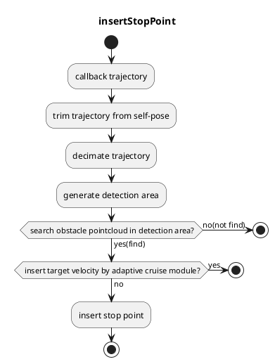
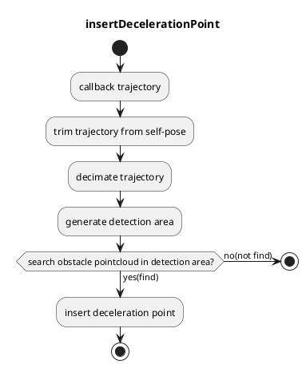
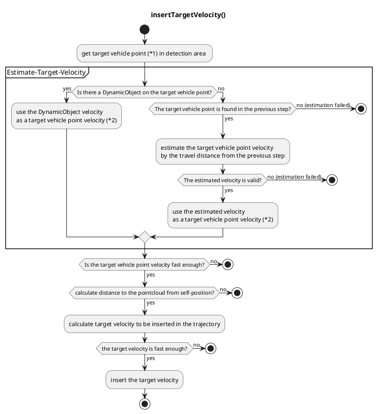

# 障害物停止計画

## 概要

`obstacle_stop_planner` には次のモジュールがあります。

- 障害物停止計画
  - 静的な点群が経路にある場合に、軌跡に停止点を入れます。
- 減速計画
  - 点群が経路近くにある場合に、軌跡に減速区間を入れます。
- アダプティブクルーズコントロール (ACC)
  - 動的な点群が経路にある場合に、軌跡に目標速度を組み込みます。

### 入力トピック

| 名称                        | タイプ                                       | 説明         |
| --------------------------- | ------------------------------------------ | ------------ |
| `~/input/pointcloud`        | `sensor_msgs::PointCloud2`                   | 障害物点群   |
| `~/input/trajectory`        | `autoware_planning_msgs::Trajectory`         | 経路          |
| `~/input/vector_map`        | `autoware_map_msgs::msg::LaneletMapBin`      | ベクターマップ |
| `~/input/odometry`          | `nav_msgs::Odometry`                         | 車両速度    |
| `~/input/dynamic_objects`   | `autoware_perception_msgs::PredictedObjects` | 動的物体     |
| `~/input/expand_stop_range` | `tier4_planning_msgs::msg::ExpandStopRange`  | 停止範囲の拡張 |

### 出力トピック

| 名称 | タイプ | 説明 |
|---|---|---|
| `~output/trajectory` | autoware_planning_msgs::Trajectory | 走行軌跡 |
| `~output/stop_reasons` | tier4_planning_msgs::StopReasonArray | 停止を引き起こす理由 |

### 共通パラメータ

{{ json_to_markdown("planning/autoware_obstacle_stop_planner/schema/common.schema.json") | ja-markdown }}

| パラメータ | 型 | 説明 |
|---|---|---|
| `enable_slow_down` | bool | 低速化プランナを有効にする [-] |
| `max_velocity` | double | 最大速度 [m/s] |
| `chattering_threshold` | double | 障害物が消滅しても、停止判定を一定時間続ける [s]（チャタリング防止） |
| `enable_z_axis_obstacle_filtering` | bool | z軸（高さ）方向の障害物をフィルタする [-] |
| `z_axis_filtering_buffer` | double | z軸フィルタのための追加バッファ [m] |
| `use_predicted_objects` | bool | 衝突検出と減速検出に予測オブジェクトを使用する [-] |
| `predicted_object_filtering_threshold` | double | 予測オブジェクトをフィルタするための閾値 [有効なのはpublish_obstacle_polygon trueの場合のみ] [m] |
| `publish_obstacle_polygon` | bool | use_predicted_objectsがtrueの場合、ノードが衝突ポリゴンを公開する [-] |

## 障害物停止プランナー

### 役割

このモジュールは、障害物に一定のマージンを持たせ、停止点を障害物の前に挿入します。通常、マージンは `baselink_to_front` と `max_longitudinal_margin` の合計です。`baselink_to_front` は `baselink`（後輪軸の中心）と車の前面との距離です。検出エリアは、次に示すように処理済みの軌跡に沿って生成されます（このモジュールは自己位置の後ろの軌跡をカットオフし、計算コストを削減するために軌跡ポイントを間引きします）。

<figure markdown>
  {width=1000}
  <figcaption>障害物停止プランナーのパラメーター</figcaption>
</figure>

<figure markdown>
  {width=1000}
  <figcaption>障害物停止プランナーのターゲット</figcaption>
</figure>

他のモジュールによって `max_longitudinal_margin` 内に別の停止点が挿入されている場合は、マージンは `baselink_to_front` と `min_longitudinal_margin` の合計になります。この機能は、不自然な位置での停止を防ぐために存在します（たとえば、歩行者が横断する横断歩道の停止線から、不自然に離れたところで自己停止します）。

<figure markdown>
  {width=1000}
  <figcaption>最小縦方向マージン</figcaption>
</figure>

このモジュールは、検出エリア内の障害物ポイントクラウドを検索します。ポイントクラウドが見つかると、`Adaptive Cruise Controller` モジュールが動作し始めます。`Adaptive Cruise Controller` モジュールがターゲット速度を挿入しない場合にのみ、停止点が軌跡に挿入されます。停止点は、速度が 0 のポイントを意味します。

### 再起動防止

車両の制御性能が悪い場合、車両が動き始めると停止するまでに X メートル（例: 0.5 メートル）が必要となるため、車両は、近くの停止点に接近するために動き始めると厳守すべき停止位置を超過します（例: 0.3 メートル離れています）。

このモジュールには、これらの冗長な再起動を防ぐために `hold_stop_margin_distance` パラメーターがあります。車両がモジュールの停止点から `hold_stop_margin_distance` メートル以内で停止した場合、モジュールは車両がすでにモジュールの停止点で停止していると判断し、他の要因で車両が停止しても停止を維持することを計画します。

<figure markdown>
  {width=1000}
  <figcaption>パラメーター</figcaption>
</figure>

<figure markdown>
  {width=1000}
  <figcaption>hold_stop_margin_distance の外側</figcaption>
</figure>

<figure markdown>
  {width=1000}
  <figcaption>hold_stop_margin_distance の内側</figcaption>
</figure>

{{ json_to_markdown("planning/autoware_obstacle_stop_planner/schema/obstacle_stop_planner.schema.json", "ja") }}

#### 停止位置

| パラメータ | データ型 | 説明 |
|---|---|---|
| `max_longitudinal_margin` | double | 障害物と本車両前面とのマージン [m] |
| `max_longitudinal_margin_behind_goal` | double | 停止点がゴールの後ろにある場合の障害物と本車両前面とのマージン [m] |
| `min_longitudinal_margin` | double | `max_longitudinal_margin` 内に障害物がある場合、モジュールは停止マージンの値を `min_longitudinal_margin` [m] に設定します |
| `hold_stop_margin_distance` | double | 再起動防止のパラメータ（上のセクションを参照） [m] |

#### 障害物検出領域

| パラメータ                              | 型          | 説明                                                                                         |
| -------------------------------------- | -------- | -------------------------------------------------------------------------------------------- |
| `lateral_margin`                       | double     | 障害物検知領域の車輪軌跡からの横マージン [m]                                         |
| `step_length`                          | double     | 点群検索範囲のステップ長 [m]                                                           |
| `enable_stop_behind_goal_for_obstacle` | bool       | 障害物検出のためにゴールレーンを超えてトラジェクトリを延長                                 |

### フローチャート

## スローダウン プランナー

### 役割

このモジュールは、前進マージンと後進マージンを使用して障害物前に減速区間を挿入します。前進マージンは `baselink_to_front` と `longitudinal_forward_margin` の合計であり、後退マージンは `baselink_to_front` と `longitudinal_backward_margin` の合計です。自車は減速区間に減速速度を維持します。速度は次の式で計算されます。

$v_{target} = v_{min} + \frac{l_{ld} - l_{vw}/2}{l_{margin}} (v_{max} - v_{min} )$

- $v_{target}$ : 減速目標速度 [m/s]
- $v_{min}$ : `min_slow_down_velocity` [m/s]
- $v_{max}$ : `max_slow_down_velocity` [m/s]
- $l_{ld}$ : 障害物と自車フットプリント間の横断偏差 [m]
- $l_{margin}$ : `lateral_margin` [m]
- $l_{vw}$ : 自車フットプリントの幅 [m]

上記の式は、ポイントクラウドの横断偏差が小さいほど、減速区間の速度が低くなることを意味します。

<figure markdown>
  {width=1000}
  <figcaption>減速プランナーのパラメータ</figcaption>
</figure>

<figure markdown>
  {width=1000}
  <figcaption>減速プランナーの目標</figcaption>
</figure>

### パラメータ

{{ json_to_markdown("planning/autoware_obstacle_stop_planner/schema/adaptive_cruise_control.schema.json") }}

#### 減速区間

| パラメーター                      | 型   | 説明                                     |
| ------------------------------ | ------ | ----------------------------------------------- |
| `longitudinal_forward_margin`  | double | 自車前面と障害物間のマージン [m] |
| `longitudinal_backward_margin` | double | 自車後面と障害物間のマージン [m]  |

#### 障害物検知領域

| パラメータ        | タイプ   | 説明                                                                               |
| ---------------- | ------ | ----------------------------------------------------------------------------------- |
| `lateral_margin` | double | 減速障害検出エリアの車両フットプリントからの横方向マージン [m]                      |

#### 減速目標速度

| パラメータ名              | 型   | 説明                                 |
| ------------------------- | ------ | ----------------------------------- |
| `max_slow_down_velocity` | double | 最大減速速度 [m/s]                  |
| `min_slow_down_velocity` | double | 最小減速速度 [m/s]                  |

### フローチャート

## アダプティブ・クルーズ・コントローラー

### 役割

`Adaptive Cruise Controller`モジュールは、軌道上に動的点群がある場合、軌道内の最大速度を組み込みます。最大速度の値は、自車速度、点群速度（=前走車速度）、および点群までの距離（=前走車までの距離）によって異なります。

| パラメータ                                                      | 型 | 説明                                                                                                                                                                                                                 |
| -------------------------------------------------------------- | --- | ---------------------------------------------------------------------------------------------------------------------------------------------------------------------------------------------------------------------------------- |
| `adaptive_cruise_control.use_object_to_estimate_vel`             | bool | 物体の速度を推定するために動的な物体を使用するかどうか（osp.use_predicted_objectsがfalseの場合にのみ有効）                                                                                                        |
| `adaptive_cruise_control.use_pcl_to_estimate_vel`                | bool | 物体の速度を推定するために生の点群を使用するかどうか（osp.use_predicted_objectsがfalseの場合にのみ有効）                                                                                                        |
| `adaptive_cruise_control.consider_obj_velocity`                  | bool | 追従走行時に目標速度を計算するために車両の速度を考慮するかどうか                                                                                                                                            |
| `adaptive_cruise_control.obstacle_velocity_thresh_to_start_acc`  | double | 前方障害物の速度がこの値を超えると追従走行を開始する [m/s]                                                                                                                                                         |
| `adaptive_cruise_control.obstacle_velocity_thresh_to_stop_acc`   | double | 前方障害物の速度がこの値を下回るとACCを停止する [m/s]                                                                                                                                                            |
| `adaptive_cruise_control.emergency_stop_acceleration`            | double | 緊急停止時の想定最小加速度（減速度）[m/ss]                                                                                                                                                                  |
| `adaptive_cruise_control.emergency_stop_idling_time`             | double | 緊急停止を開始するための想定停止時間 [s]                                                                                                                                                                    |
| `adaptive_cruise_control.min_dist_stop`                          | double | 緊急停止の最小距離 [m]                                                                                                                                                                                            |
| `adaptive_cruise_control.obstacle_emergency_stop_acceleration`   | double | 緊急停止時の想定最小加速度（減速度）[m/ss]                                                                                                                                                                  |
| `adaptive_cruise_control.max_standard_acceleration`              | double | 追従走行時の想定最大加速度 [m/ss]                                                                                                                                                                             |
| `adaptive_cruise_control.min_standard_acceleration`              | double | 追従走行時の想定最小加速度（減速度）[m/ss]                                                                                                                                                                   |
| `adaptive_cruise_control.standard_idling_time`                   | double | 追従走行時に物体に対して反応する想定停止時間 [s]                                                                                                                                                                 |
| `adaptive_cruise_control.min_dist_standard`                      | double | 追従走行時の最小距離 [m]                                                                                                                                                                                            |
| `adaptive_cruise_control.obstacle_min_standard_acceleration`     | double | 前方障害物の想定最小加速度 [m/ss]                                                                                                                                                                          |
| `adaptive_cruise_control.margin_rate_to_change_vel`              | double | 目標速度を挿入するための余裕距離率 [-]                                                                                                                                                                           |
| `adaptive_cruise_control.use_time_compensation_to_calc_distance` | bool | 前方車両との距離を計算するために時間補正を使用する                                                                                                                                                                |
| `adaptive_cruise_control.p_coefficient_positive`                 | double | PID制御における係数P（target_dist - current_dist &gt;=0の場合に使用）[-]                                                                                                                               |
| `adaptive_cruise_control.p_coefficient_negative`                 | double | PID制御における係数P（target_dist - current_dist &lt;0の場合に使用）[-]                                                                                                                                   |
| `adaptive_cruise_control.d_coefficient_positive`                 | double | PID制御における係数D（delta_dist &gt;=0の場合に使用）[-]                                                                                                                                                     |
| `adaptive_cruise_control.d_coefficient_negative`                 | double | PID制御における係数D（delta_dist &lt;0の場合に使用）[-]                                                                                                                                                       |
| `adaptive_cruise_control.object_polygon_length_margin`           | double | 点群オブジェクトマッチングでオブジェクトの多角形の長さを延長する距離 [m]                                                                                                                                            |
| `adaptive_cruise_control.object_polygon_width_margin`            | double | 点群オブジェクトマッチングでオブジェクトの多角形の幅を延長する距離 [m]                                                                                                                                             |
| `adaptive_cruise_control.valid_estimated_vel_diff_time`          | double | 点群を使用した速度推定で連続したポイントとして扱われる最大時間差 [s]                                                                                                                                 |
| `adaptive_cruise_control.valid_vel_que_time`                     | double | 点群を使用した速度推定で使用される情報の時間幅 [s]                                                                                                                                                            |
| `adaptive_cruise_control.valid_estimated_vel_max`                | double | 点群を使用した速度推定で有効な速度推定結果の最大値 [m/s]                                                                                                                                                |
| `adaptive_cruise_control.valid_estimated_vel_min`                | double | 点群を使用した速度推定で有効な速度推定結果の最小値 [m/s]                                                                                                                                                |
| `adaptive_cruise_control.thresh_vel_to_stop`                     | double | ACCにより計算された最大速度がこの速度よりも低い場合、停止線を埋め込む [m/s]                                                                                                                                 |
| `adaptive_cruise_control.lowpass_gain_of_upper_velocity`         | double | 目標速度のローパスゲイン                                                                                                                                                                                            |
| `adaptive_cruise_control.use_rough_velocity_estimation:`         | bool | 速度推定に失敗した場合にラフに速度を推定する（osp.use_predicted_objectsがfalseの場合にのみ有効）                                                                                                     |
| `adaptive_cruise_control.rough_velocity_rate`                    | double | ラフな速度推定では、前方の車両の速度は自車位置の現在の速度 ＊ この値として推定される                                                                                                                             |

### フローチャート

**自動運転ソフトウェア**

**内容**

**目標車両点の算出**

(\*1) 目標車両点は、経路に沿った自己位置からの最近傍障害物点群として算出されます。

(\*2) 速度推定のソースは、以下の ROS パラメータで変更できます。

- `adaptive_cruise_control.use_object_to_estimate_vel`
- `adaptive_cruise_control.use_pcl_to_estimate_vel`

**目標車両点の速度推定**

このモジュールは、「障害物停止プランナー」モジュールの検出領域内に目標点が検出された場合にのみ動作します。

このモジュールの最初の処理は、目標車両点の速度を推定することです。速度推定には、動的オブジェクトの速度情報または前のステップからの目標車両点の移動距離を使用します。

動的オブジェクト情報は一次的なものであり、移動距離推定は知覚障害時のバックアップとして使用されます。

目標車両点が動的オブジェクトの境界ボックスに幾何学的に含まれている場合、動的オブジェクトの速度が目標点速度として使用されます。

それ以外の場合は、目標点速度は、前のステップからの目標点の移動距離によって計算されます。つまり、`(current_position - previous_position) / dt` です。この移動距離ベースの推定は、目標点が最初に検出されたときに失敗することに注意してください（主に割り込み状況で発生します）。推定の安定性を向上させるために、複数のステップの計算結果のメディアンが使用されています。

計算された速度がしきい値範囲内であれば、目標点速度として使用されます。

**目標車両点への追従**

推定が成功し、推定速度が `obstacle_stop_velocity_thresh_*` の値を超えた場合のみ、自己位置から点群までの距離が計算されます。モード遷移時のチャタリングを防ぐために、`obstacle_velocity_thresh_to_start_acc` はアダプティブクルーズを開始するためのしきい値として使用され、`obstacle_velocity_thresh_to_stop_acc` はアダプティブクルーズを停止するためのしきい値として使用されます。計算された距離値が、緊急停止パラメータによって計算された緊急距離 $d\_{emergency}$ を超えると、挿入する目標速度が計算されます。

緊急距離 $d\_{emergency}$ は次のように計算されます。

$d_{emergency} = d_{margin_{emergency}} + t_{idling_{emergency}} \cdot v_{ego} + (-\frac{v_{ego}^2}{2 \cdot a_{ego_
{emergency}}}) - (-\frac{v_{obj}^2}{2 \cdot a_{obj_{emergency}}})$

- $d_{margin_{emergency}}$ は、障害物点群に対する最小マージンです。$d_{margin_{emergency}}$ の値は、パラメータ `min_dist_stop` に依存します。
- $t_{idling_{emergency}}$ は、想定されるアイドリング時間です。$t_{idling_{emergency}}$ の値は、パラメータ `emergency_stop_idling_time` に依存します。
- $v_{ego}$ は、自己車両の現在の速度です。
- $a_{ego_{_{emergency}}}$ は、自己車両の最小加速度（最大減速）です。$a_{ego_{_
  {emergency}}}$ の値は、パラメータ `emergency_stop_acceleration` に依存します。
- $v_{obj}$ は、障害物点群の現在の速度です。
- $a_{obj_{_{emergency}}}$ は、障害物点群の想定される最小加速度です。$a_{obj_{_
  {emergency}}}$ の値は、パラメータ `obstacle_emergency_stop_acceleration` に依存します。
- \*上記の $X_{_{emergency}}$ パラメータは、緊急時のみ使用されます。

目標速度は、障害物点群から自己車両までの距離を計算された標準距離 $d\_{standard}$ に維持するように決定されます。したがって、障害物点群までの距離が標準距離よりも長い場合、目標速度は現在の速度よりも高くなり、その逆も同様です。距離を維持するために、PID 制御器が使用されます。

$d_{standard} = d_{margin_{standard}} + t_{idling_{standard}} \cdot v_{ego} + (-\frac{v_{ego}^2}{2 \cdot a_{ego_
{standard}}}) - (-\frac{v_{obj}^2}{2 \cdot a_{obj_{standard}}})$

- $d_{margin_{standard}}$ は、障害物点群に対する最小マージンです。$d_{margin_{standard}}$ の値は、パラメータ `min_dist_stop` に依存します。
- $t_{idling_{standard}}$ は、想定されるアイドリング時間です。$t_{idling_{standard}}$ の値は、パラメータ `standard_stop_idling_time` に依存します。

- $a_{ego_{_{標準}}}$ は自車の最小加速度（最大減速度）です。$a_{ego_{_
  {標準}}}$ の値はパラメーター `min_standard_acceleration` に依存します。
- $v_{obj}$ は障害物の点群の現在の速度です。
- $a_{obj_{_{標準}}}$ は障害物の点群の想定される最小加速度です。$a_{obj_{_
  {標準}}}$ の値はパラメーター `obstacle_min_standard_acceleration` に依存します。
- \*上記の $X_{_{標準}}$ パラメーターは非緊急状態でのみ使用されます。

ターゲット速度が `thresh_vel_to_stop` の値を超えた場合、ターゲット速度が軌道に埋め込まれます。

## 制限事項

- `自適巡航制御` モジュールにより埋め込まれた目標速度に従って車が動くかどうかは、速度計画モジュールに大きく依存しています。速度計画モジュールが更新された場合は、可能な限り車両の挙動に注意し、常にオーバーライドの準備をしてください。

- `自適巡航制御` の速度推定アルゴリズムは、オブジェクト追跡モジュールに依存しています。オブジェクト追跡が失敗したり、追跡結果が誤っている場合、車両が危険な挙動をする可能性があることに注意してください。

- 後退走行では動作しませんが、入力されたパスをそのまま公開します。後退走行時に障害物に対して停止したい場合は、[obstacle_cruise_planner](../autoware_obstacle_cruise_planner/README.md) を使用してください。

