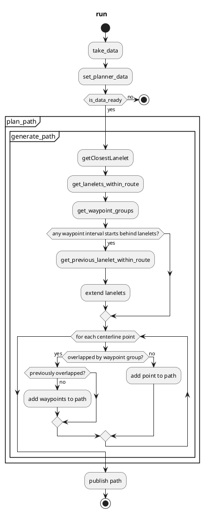

# Path Generator

The `path_generator` node receives a route from `mission_planner` and converts the centerline into a path.
If the route has waypoints set, it generates a path passing through them.

This package is a simple alternative of `behavior_path_generator`.

## Path generation

When input data is ready, it first searches for the lanelet closest to the vehicle.
If found, it gets the lanelets within a distance of `backward_path_length` behind and `forward_path_length` in front.
Their centerlines are concatenated to generate a path.

If waypoints exist in the route, it replaces the overlapped segment of the centerline with them.
The overlap interval is determined as shown in the following figure.

## Flowchart

## Input topics

| Name                 | Type                                        | Description                      |
| :------------------- | :------------------------------------------ | :------------------------------- |
| `~/input/odometry`   | `nav_msgs::msg::Odometry`                   | ego pose                         |
| `~/input/vector_map` | `autoware_map_msgs::msg::LaneletMapBin`     | vector map information           |
| `~/input/route`      | `autoware_planning_msgs::msg::LaneletRoute` | current route from start to goal |

## Output topics

| Name            | Type                                       | Description    | QoS Durability |
| :-------------- | :----------------------------------------- | :------------- | :------------- |
| `~/output/path` | `tier4_planning_msgs::msg::PathWithLaneId` | generated path | `volatile`     |

## Parameters

{{ json_to_markdown("planning/autoware_path_generator/schema/path_generator.schema.json") }}
