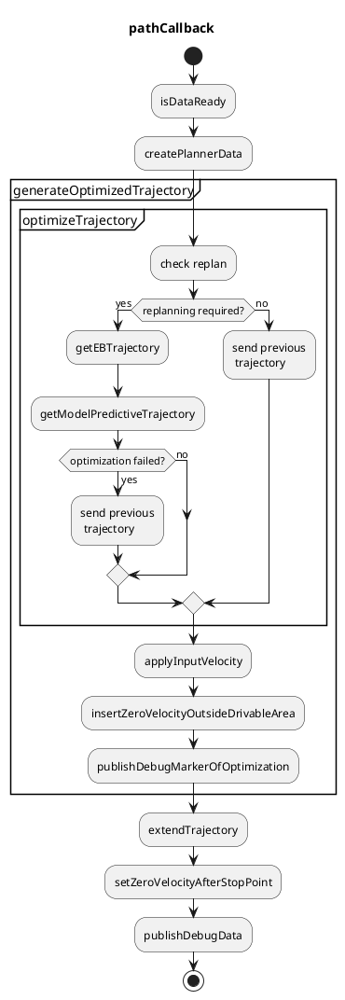

# パスオプティマイザ

## 目的

このパッケージは、入力パスと走行可能エリアに基づいて、運転可能な運動学的可能性のある経路と衝突のない経路を生成します。
このモジュールでは、経路の位置と姿勢のみが更新され、速度は入力パス内の速度を引き継ぎます。

## 特徴

このパッケージは、以下のことができます。

- 経路を可能な限り走行可能エリア内に収める
  - 注: 回避すべき静止障害物は走行可能エリアから削除できます。
- 計画されたフットプリントが走行可能エリア外になる前に停止点を挿入する

速度は入力パスから引き継がれることに注意してください。

## 入出力

### 入力

| 名前              | タイプ                            | 説明                                                  |
| ----------------- | ------------------------------- | ------------------------------------------------------ |
| `~/input/path`     | autoware_planning_msgs/msg/Path | 参照パスと対応する走行可能領域                      |
| `~/input/odometry` | nav_msgs/msg/Odometry           | 自車の現在の速度                                       |

### 出力

**自動運転ソフトウェア**

## 計画（Planning）コンポーネント

**動作**

計画コンポーネントは、センサーからのデータに基づき、自律車両の走行経路を決定します。以下の要素を考慮します。

- 環境マップ
- 自車位置
- 障害物
- 交通規則

計画コンポーネントは、次のような判断を行います。

- 走行する経路
- 目的地への速度と加速度の調整
- 障害物の回避
- 交通規制への遵守

## 経路検索アルゴリズム

計画コンポーネントは、次の経路検索アルゴリズムを使用します。

- *Dijkstra法*
- *A*法

## 経路最適化

計画コンポーネントは、以下の基準に基づいて経路を最適化します。

- 走行距離
- 所要時間
- 燃料消費
- 安全性

## 障害物回避

計画コンポーネントは、以下の方法で障害物を回避します。

- 障害物検知
- 最小の『速度逸脱量』と『加速度逸脱量』が発生する動作の算出
- 安全な経路への再計画

## 交通規制への遵守

計画コンポーネントは、交通規制を遵守するように動作します。

- 速度制限の遵守
- 停止線の遵守
- 信号機の遵守

**Autowareでの実装**

Autowareの計画コンポーネントは、ROSベースのアーキテクチャで実装されています。主要なノードは次のとおりです。

- Trajectory Planner
- Local Planner
- Behavior Planner

**追加資料**

- [Autoware 計画コンポーネントドキュメント](https://autoware.gitbooks.io/autoware.ai/content/wiki/planning.html)

| 名称                  | 種類                             | 説明                                                                   |
| --------------------- | ---------------------------------  | ---------------------------------------------------------------------- |
| `~/output/trajectory` | autoware_planning_msgs/msg/Trajectory | 走行可能で衝突のない最適化された経路                                  |

## フローチャート

機能のフローチャートについては、以下で説明します。




### createPlannerData

以下のデータがプランニング用に作成されます。


```cpp
struct PlannerData
{
  // input
  Header header;
  std::vector<TrajectoryPoint> traj_points; // converted from the input path
  std::vector<geometry_msgs::msg::Point> left_bound;
  std::vector<geometry_msgs::msg::Point> right_bound;

  // ego
  geometry_msgs::msg::Pose ego_pose;
  double ego_vel;
};
```

### replanの確認

以下の条件のいずれかが満たされた場合、軌道の最適化が実行されます。それ以外は、最新の入力パスの速度を使用して、以前に最適化された軌道を適用します。

max_path_shape_around_ego_lat_dist

- エゴが1サイクルで`replan.max_ego_moving_dist`を超えて移動する場合（デフォルト：3.0 [m]）
  - これは、シミュレーションでエゴの姿勢が再び設定された場合に使用されます。
- 目標姿勢と見なされる軌道の終点が1サイクルで`replan.max_goal_moving_dist`を超えて移動する場合（デフォルト：15.0 [ms]）
  - 目標姿勢が再び設定された場合、Planningはリセットする必要があります。
- 時間の経過（デフォルト：1.0 [s]）
  - 最適化は少しの間スキップされます。なぜなら、最適化は時々重いからです。
- 入力パスが1サイクルで横方向に`replan.max_path_shape_around_ego_lat_dist`を超えて変更する場合（デフォルト：2.0）

### getModelPredictiveTrajectoryの取得

このモジュールは、軌道を運動学的に実現可能かつ衝突のないものにします。
フレネ座標系で車両の姿勢を定義し、最適化によって追従誤差を最小化します。
この最適化では、車両の運動特性と道路境界や障害物との衝突チェックが考慮されます。
計算コストを削減するために、最適化は全体の軌道より短い軌道（デフォルト：50 [m]）に適用され、最後に残りの軌道と最適化された軌道を連結します。

車両の真前の軌道はあまり変更しないようにする必要があります。そうすることでステアリングホイールが安定します。
したがって、車両の前面に以前生成された軌道を適用します。

車両上に設置され、軌道の真上に位置しようとする最適化の中心は、車両の縦軸に沿って調整できます。
このパラメータ`mpt.kinematics.optimization center offset`は、後輪の中心から最適化の中心までの正負の距離として定義されます。
次の図にいくつかの例を示します。参照軌道（緑色）が同じ場合でも、最適化の中心によって車両形状の軌跡が異なることがわかります。


詳細については[こちら](docs/mpt.md)を参照してください。

### applyInputVelocity

速度は、最適化された軌跡に、行動パスの速度から割り当てます。
最適化された軌跡とパスの形状は異なるため、パスに対する最も近い各軌跡点が検索され、速度はゼロ次ホールドで補間されます。

### insertZeroVelocityOutsideDrivableArea

最適化された軌道は速度計画には短すぎるため、走行可能性を考慮して最適化された軌道と行動パスを連結することで軌道を延長します。
生成された軌道は走行可能領域内にあるかどうかがチェックされ、走行可能領域外にある場合は、走行可能領域内の軌道を出力するか、行動パスまたは以前に生成された軌道を適用します。

上記のように、行動パスは2つのパスに分割されます。1つは最適化用、もう1つは残りの部分です。最初のパスが最適化された軌道になり、2番目のパスは単に変換されます。走行可能領域内の軌道は次のように計算されます。

- 最適化された軌道が**走行可能領域内**で、残りの軌道が走行可能領域内/外にある場合
  - 出力軌道はその2つの軌道の連結になります。
  - この場合、残りの軌道が走行可能領域内にあるか外にあるかは考慮しません。一般的に走行可能領域外にあるため（特に狭い道で）ですが、後続のモジュールにできるだけ長い軌道を渡したいと考えています。
- 最適化された軌道が**走行可能領域外**で、残りの軌道が走行可能領域内/外にある場合
  - 以前生成された軌跡が**記憶されている**場合は、
    - 出力軌道は、以前に生成された軌道になり、走行可能領域外に出た最初にゼロ速度が挿入されます。
  - 以前生成された軌跡が**記憶されていない**場合は、
    - 出力軌道は、行動パスから変換された軌道のうち、走行可能領域外に出た最初にゼロ速度が挿入された部分になります。

最適化の失敗は、最適化された軌道が走行可能領域外である場合と同じように処理されます。出力軌道は、次のサイクルの以前生成された軌跡として記憶されます。

_理由_

最適化したトラジェクトリが、最適化後に運転可能領域内に収まっているかどうかを確認する必要があります。

## 制限事項

- 計算コストが高くなる場合があります。
- 線形化などの近似により、一部の狭い道路はプランナーによって走行できません。
- `behavior_path_planner` と `path_optimizer` のプランニングの役割が明確に定義されていません。どちらも障害物を回避できます。

## 他の手法との比較

運動学的実現可能性と衝突回避を満たすトラジェクトリ計画の問題には、解決が困難な 2 つの主な特性があります。1 つは非凸性、もう 1 つは高次元です。
これらの特性に基づいて、一般的なプランニング手法の利点と欠点を調査します。最適化ベース、サンプリングベース、学習ベースの手法です。

### 最適化ベースの手法

- 長所: 勾配降下を活用することで、高次元に対して比較的高速です。
- 短所: 非凸問題では、多くの場合局所最小値に収束します。

### サンプリングベースの手法

- 長所: グローバル最適化を実現します。
- 短所: 特に複雑なケースでは計算コストが高くなります。

### 学習ベースの手法

- まだ研究中

これらの利点と欠点に基づいて、まず最適化ベースのプランナーを選択しました。
局所最小値に収束する欠点がありますが、問題をほぼ元の非凸問題と同じ凸問題に近似するための前処理によって、適切な解を得ることができます。

## パラメーターの調整方法

### 狭い道路での運転可能性

- `mpt.clearance.soft_clearance_from_road` を変更する
  - このパラメーターは、トラジェクトリと道路の境界との間隔をどの程度確保する必要があるかを指定します。
  - 最適化のためのモデル誤差により、衝突回避などの制約は完全に満たされません。
    - このパラメーターを大きくすることで、狭い道路走行の問題が解決される場合があります。 12180
- `mpt.kinematics.optimization_center_offset` を変更する

  - このパラメーターによってベースリンクから前方へオフセットされた車両の位置が、基準経路を追従しようとします。

- フットプリントを一連の円を使用して近似する方法を変更または調整する。
  - [こちら](https://autowarefoundation.github.io/autoware.universe/main/planning/path_optimizer/docs/mpt/#collision-free) を参照してください。
  - 調整とは、円の半径の比率を変更することを意味します。

### 計算時間

- 検討中

### ロバスト性

- MPT の前後のトラジェクトリがロバストでないかどうかを確認する
  - MPT の前のトラジェクトリがロバストでない場合
  - MPT の後のトラジェクトリがロバストでない場合
    - `mpt.weight.steer_input_weight` または `mpt.weight.steer_rate_weight` を大きくする。これらは、トラジェクトリに沿ったステアリングホイールの安定性を表します。

### その他のオプション

- `option.enable_calculation_time_info` は、各関数の計算時間と合計計算時間をターミナルで表示できるようにします。
- `option.enable_outside_drivable_area_stop` は、生成された経路点が走行可能エリアの外に出る直前に停止できるようにします。

## デバッグ方法

デバッグ方法は [こちら](docs/debug.md) に記載されています。

