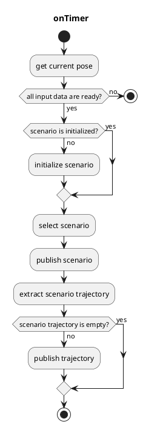
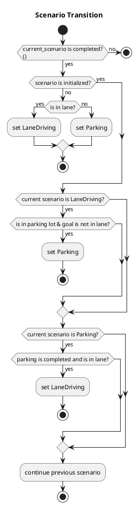

# autoware_scenario_selector

## scenario_selector_node

`scenario_selector_node`は、各シナリオの経路を切り替えるノードです。

### 入力トピック

| 名称 | タイプ | 説明 |
|---|---|---|
| `~input/lane_driving/trajectory` | `autoware_planning_msgs::Trajectory` | LaneDriving シナリオの軌道 |
| `~input/parking/trajectory` | `autoware_planning_msgs::Trajectory` | Parking シナリオの軌道 |
| `~input/lanelet_map` | `autoware_map_msgs::msg::LaneletMapBin` | |
| `~input/route` | `autoware_planning_msgs::LaneletRoute` | ルートと目標位置 |
| `~input/odometry` | `nav_msgs::Odometry` | 車両が停止しているかどうかを確認するため |
| `is_parking_completed` | ブール型（ROS のパラメータとして実装） | Parking の分割された軌跡がすべて公開されているかどうか |

### 出力トピック

| 名前                 | タイプ                                | 説明                                    |
| -------------------- | ---------------------------------- | ---------------------------------------------- |
| `~output/scenario`   | tier4_planning_msgs::Scenario      | 自車位置とアクティブ化されるシナリオ              |
| `~output/trajectory` | autoware_planning_msgs::Trajectory | 通過する軌跡                                  |

### 出力TFs

なし

### 起動方法

1. `scenario_selector.launch`でリマッピング情報を書き込むか、`roslaunch`を実行するときに引数を追加してください。
2. `roslaunch autoware_scenario_selector scenario_selector.launch`
   - 1つのシナリオのみを使用する場合は、`roslaunch autoware_scenario_selector dummy_scenario_selector_{シナリオ名}.launch`

### パラメータ

{{ json_to_markdown("planning/autoware_scenario_selector/schema/scenario_selector.schema.json") }}

### フローチャート

