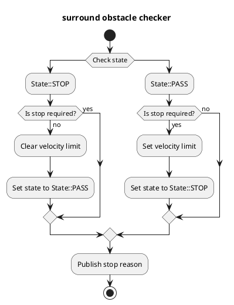

## 周辺障害物チェッカー

## 目的

このモジュールは必要なデータ（自車位置、障害物など）をサブスクライブし、停止条件のいずれかが満たされた場合は停止するためにゼロ速度制限を発行します。

## 内部処理/アルゴリズム

### フローチャート




```markdown
<div align="center">
  
</div>

### アルゴリズム

### データチェック

`surround_obstacle_checker` がラウンドポイントクラウド、ダイナミックオブジェクト、および現在の速度データを一切受信していないことを確認します。

### 最近方の物体の距離を取得する

自車と最近方の物体間の距離を計算します。
この関数では、自車のポリゴンとポイントクラウド内のすべての点とダイナミックオブジェクトのポリゴンとの間の最小距離を計算します。

### 停止要求

以下の条件がすべて満たされた場合、停止を計画します。

- 自車が停止していること
- 以下のいずれかの条件を満たしていること
  1. 最近方の障害物までの距離が以下の条件を満たしていること
     - 状態が `State::PASS` の場合、距離が `surround_check_distance` 未満であること
     - 状態が `State::STOP` の場合、距離が `surround_check_recover_distance` 未満であること
  2. 1 の条件を満たさない場合、1 の条件を満たしてから経過した時間が `state_clear_time` 未満であること

### 状態

チャタリングを防ぐため、`surround_obstacle_checker` は 2 つの状態を管理します。
停止条件のセクションで述べたように、状態に応じて周辺障害物を見つけるためのしきい値を変更することでチャタリングを防ぎます。

- `State::PASS` : 停止計画を解除する
- `State::STOP` ：停止計画中

## 入出力

### 入力
```

| 名前                                         | 種類                                              | 説明                                                          |
| ------------------------------------------ | ------------------------------------------------- | --------------------------------------------------------------- |
| `/perception/obstacle_segmentation/pointcloud` | `sensor_msgs::msg::PointCloud2`                   | 自車が停止または回避すべき障害物の点群                         |
| `/perception/object_recognition/objects`      | `autoware_perception_msgs::msg::PredictedObjects` | 動的オブジェクト                                              |
| `/localization/kinematic_state`              | `nav_msgs::msg::Odometry`                         | 現在のひねり                                                   |
| `/tf`                                         | `tf2_msgs::msg::TFMessage`                        | TF                                                              |
| `/tf_static`                                  | `tf2_msgs::msg::TFMessage`                        | 静的TF                                                          |

### 出力

### 自動運転ソフトウェア

このドキュメントでは、自動運転ソフトウェアのアーキテクチャとコンポーネントについて説明します。

### アーキテクチャ

自動運転ソフトウェアのアーキテクチャは、3つの主要モジュールで構成されています。

- **Perceptionモジュール：**センサーデータを処理し、周囲環境の認識を行います。
- **Planningモジュール：**認識結果に基づき、走行経路を計画します。
- **Controlモジュール：**計画された経路に従って、車両を制御します。

### Planningモジュール

Planningモジュールは、以下の機能を担当します。

- **経路計画：**目的地までの安全で効率的な経路の作成
- **速度計画：**経路上の適切な速度の設定
- **逸脱量制御：**速度逸脱量と加速度逸脱量の監視と調整

### Perceptionモジュール

Perceptionモジュールは、以下の機能を担当します。

- **物体検出：**LiDAR、カメラ、レーダーセンサーからのデータを処理して、物体（車両、歩行者、障害物など）を検出
- **分類：**検出された物体のタイプ（車、トラック、歩行者など）を分類
- **自車位置の推定：**車両の現在の位置と姿勢の推定
- **周囲地図の構築：**周囲環境の静的および動的な地図の作成

### Controlモジュール

Controlモジュールは、以下の機能を担当します。

- **ステアリング制御：**計画された経路に従ってステアリング角を制御
- **アクセル/ブレーキ制御：**速度計画に基づき、アクセルとブレーキを制御
- `post resampling`：リアルタイムセンサーデータによるフィードバックに基づいて、制御を動的に調整

### アーキテクチャの詳細

各モジュール間の相互作用は、以下のようになります。

1. Perceptionモジュールは、物体検出結果と自車位置をPlanningモジュールに提供します。
2. Planningモジュールは、Perceptionモジュールの入力に基づいて、経路と速度計画を作成します。
3. Planningモジュールは、経路と速度計画をControlモジュールに送信します。
4. Controlモジュールは、Planningモジュールの計画に従って車両を制御します。
5. Controlモジュールは、Perceptionモジュールが提供するリアルタイムセンサーデータに基づいて、フィードバックをPlanningモジュールに提供します。
6. Perceptionモジュールは、リアルタイムセンサーデータに基づいて、自身の認識結果を更新します。

### Autoware Stac

Autoware Stacは、オープンソース自動運転ソフトウェアスタックであり、ここで説明したアーキテクチャに基づいています。Autoware Stacは、Perception、Planning、Controlモジュールを提供し、自動運転車の開発を簡素化します。

| 名前                                    | 型                                                  | 説明                                                                           |
| --------------------------------------- | ----------------------------------------------------- | ------------------------------------------------------------------------------------- |
| `~/output/velocity_limit_clear_command` | `tier4_planning_msgs::msg::VelocityLimitClearCommand` | 速度制限クリアコマンド                                                          |
| `~/output/max_velocity`                 | `tier4_planning_msgs::msg::VelocityLimit`             | 速度制限コマンド                                                                |
| `~/output/no_start_reason`              | `diagnostic_msgs::msg::DiagnosticStatus`              | スタート不可理由                                                                       |
| `~/output/stop_reasons`                 | `tier4_planning_msgs::msg::StopReasonArray`           | 停止理由                                                                          |
| `~/debug/marker`                        | `visualization_msgs::msg::MarkerArray`                | 可視化用マーカー                                                                  |
| `~/debug/footprint`                     | `geometry_msgs::msg::PolygonStamped`                  | 自車ベースフットプリント（可視化用）                                            |
| `~/debug/footprint_offset`              | `geometry_msgs::msg::PolygonStamped`                  | `surround_check_distance`オフセット付き自車フットプリント（可視化用）           |
| `~/debug/footprint_recover_offset`      | `geometry_msgs::msg::PolygonStamped`                  | `surround_check_recover_distance`オフセット付き自車フットプリント（可視化用） |

## パラメータ

{{ json_to_markdown("planning/autoware_surround_obstacle_checker/schema/surround_obstacle_checker.schema.json") }}

| 名前                                  | タイプ     | 説明                                                                                                                                                  | デフォルト値                                 |
| :----------------------------------- | :------- | :------------------------------------------------------------------------------------------------------------------------------------------------------ | :------------------------------------------- |
| `enable_check`                       | `bool`   | 対象オブジェクトを障害物チェックのターゲットに含めてよいかどうかを示します。                                                                                  | オブジェクト: `true`、点群: `false`       |
| `surround_check_front_distance`      | `bool`   | この前方距離内にオブジェクトまたは点群がある場合は、"exist-surrounding-obstacle"ステータスに遷移します。[m]                                               | 0.5                                          |
| `surround_check_side_distance`       | `double` | この側面距離内にオブジェクトまたは点群がある場合は、"exist-surrounding-obstacle"ステータスに遷移します。[m]                                            | 0.5                                          |
| `surround_check_back_distance`       | `double` | この後方距離内にオブジェクトまたは点群がある場合は、"exist-surrounding-obstacle"ステータスに遷移します。[m]                                            | 0.5                                          |
| `surround_check_hysteresis_distance` | `double` | `surround_check_xxx_distance`プラスこの追加距離内にオブジェクトが存在しない場合、"non-surrounding-obstacle"ステータスに遷移します。[m]           | 0.3                                          |
| `state_clear_time`                   | `double` | 停止状態を解除するためのしきい値[s]                                                                                                                   | 2.0                                          |
| `stop_state_ego_speed`               | `double` | 自己車両が停止したかどうかをチェックするためのしきい値[m/s]                                                                                                 | 0.1                                          |
| `stop_state_entry_duration_time`     | `double` | 自己車両が停止したかどうかをチェックするためのしきい値[s]                                                                                                 | 0.1                                          |
| `publish_debug_footprints`           | `bool`   | オフセットあり/なしで車両のフットプリントを公開します。                                                                                                 | `true`                                       |

## 想定事項/既知の制限事項

停止計画を実行するには、障害物の点群データを取得する必要があります。
したがって、障害物が死角にある場合は停止計画を実行しません。

