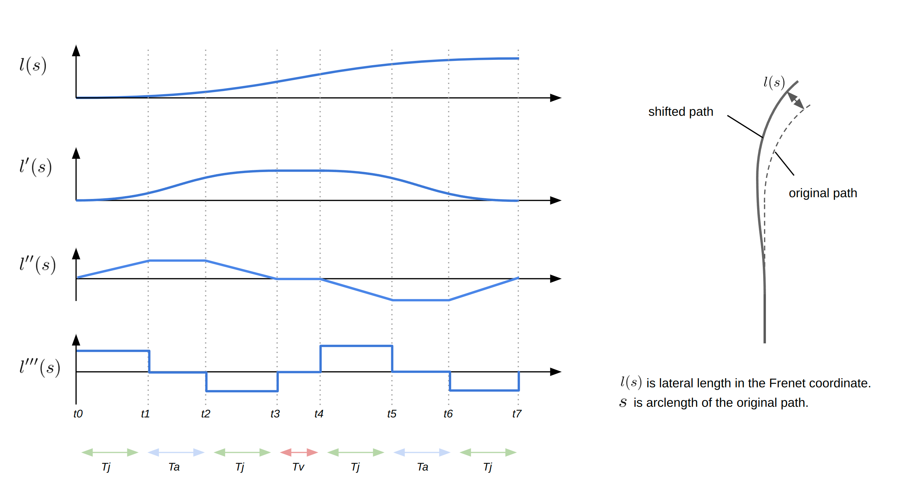

# Behavior Path Planner

## Purpose / Use cases

The `behavior_path_planner` module is responsible to generate

1. **path** based on the traffic situation,
2. **drivable area** that the vehicle can move (defined in the path msg),
3. **turn signal** command to be sent to the vehicle interface.

Depending on the situation, a suitable module is selected and executed on the behavior tree system.

The following modules are currently supported:

- **Lane Following**: Generate lane centerline from map.
- **Lane Change**: Performs a lane change. This module is performed when it is necessary and a collision check with other vehicles is cleared.
- **Obstacle Avoidance**: Perform an obstacle avoidance. This module is for avoidance of a vehicle parked on the edge of the lane or overtaking a low-speed obstacle.
- **Side Shift**: (For remote control) Shift the path to left or right according to an external instruction.

[WIP]

- **Pull Over/Out**: xxx.
- **Free Space**: xxx.

## Design

<!-- ## Assumptions / Known limits -->

## Inputs / Outputs / API

### output

- path [`autoware_planning_msgs/PathWithLaneId`] : The path generated by modules.
- path_candidate [`autoware_planning_msgs/Path`] : The path the module is about to take. To be executed as soon as external approval is obtained.
- turn_signal_cmd [`autoware_vehicle_msgs/TurnSignal`] : Turn signal command.
- force_available [`autoware_planning_msgs/PathChangeModuleArray`] : (For remote control) modules that are force-executable.
- ready_module [`autoware_planning_msgs/PathChangeModule`] : (For remote control) modules that are ready to be executed.
- running_modules [`autoware_planning_msgs/PathChangeModuleArray`] : (For remote control) Current running module.

### input

- /planning/mission_planning/route [`autoware_planning_msgs/Route`] : Current route from start to goal.
- /map/vector_map [autoware_lanelet2_msgs/MapBin] : Map information.
- /perception/object_recognition/objects [`autoware_perception_msgs/DynamicObjectArray`] : dynamic objects from perception module.
- /tf [`tf2_msgs/TFMessage`] : For ego-pose.
- /localization/twist [`geometry_msgs/TwistStamped] : For ego-velocity.
- path_change_approval [`std_msgs::Bool`] : (For remote control)
- path_change_force [`autoware_planning_msgs::PathChangeModule`] : (For remote control)

## Inner-workings / Algorithms

### Behavior Tree

In the behavior path planner, the behavior tree mechanism is used to manage which modules are activated in which situations. In general, this "behavior manager" like function is expected to become bigger as more and more modules are added in the future. To improve maintainability, we adopted the behavior tree. The behavior tree has the following advantages: easy visualization, easy configuration management (behaviors can be changed by replacing configuration files), and high scalability compared to the state machine.

The current behavior tree structure is shown below. Each modules (LaneChange, Avoidance, etc) have _Request_, _Ready_, and _Plan_ nodes as a common function.

- **Request**: Check if there is a request from the module (e.g. LaneChange has a request when there are multi-lanes and the vehicle is not on the preferred lane),
- **Ready**: Check if it is safe to execute the plan (e.g. LaneChange is ready when the lane_change path does not have any conflicts with other dynamic objects on S-T space).
- **Plan**: Calculates path and set it to the output of the BehaviorTree. Until the internal status returns SUCCESS, it will be in running state and will not transit to another module.
- **ForceApproval**: A lane change-specific node that overrides the result of _Ready_ when a forced lane change command is given externally.

### Lane Following

Generate path from center line of the route.

#### **special case**

In the case of a route that requires a lane change, the path is generated with a specific distance margin (default: `12.0 m`) from the end of the lane to ensure the minimum distance for lane change. (This function works not only for lane following but also for all modules.)

### Lane Change

The Lane Change module is activated when lane change is needed and can be safely executed.

#### **start lane change condition** (need to meet all of the conditions below)

- lane change request condition
  - The ego-vehicle isn’t on a `preferred_lane`.
  - There is neither intersection nor crosswalk on the path of the lane change
- lane change ready condition
  - Path of the lane change doesn’t collide with other objects (see the figure below)
  - Lane change is allowed by an operator

#### **finish lane change condition** (need to meet any of the conditions below)

- Certain distance (default: `3.0 m`) have passed after the vehicle move to the target lane.
- Before the base_link exceeds white dotted line, a collision with the object was predicted (only if `enable_abort_lane_change` is true.)
  - However, when current velocity is lower than `10km/h` and the ego-vehicle is near the lane end, the lane change isn’t aborted and the ego-vehicle plans to stop. Then, after no collision is predicted, the ego-vehicle resume the lane change.

#### **Collision prediction with obstacles**

1. Predict each position of the ego-vehicle and other vehicle on the target lane of the lane change at t1, t2,...tn
2. If a distance between the ego-vehicle and other one is lower than the threshold (`ego_velocity * stop_time (2s)`) at each time, that is judged as a collision

#### **Path Generation**

Path to complete the lane change in `n + m` seconds under an assumption that a velocity of the ego-vehicle is constant.
Once the lane change is executed, the path won’t be updated until the "finish-lane-change-condition" is satisfied.

<!-- 
  
 -->

### Avoidance

The Avoidance module is activated when dynamic objects to be avoided exist and can be safely avoided.

#### Target objects

Dynamic objects that satisfy the following conditions are considered to be avoidance targets.

- Semantics type is `CAR`, `TRUCK`, or `BUS`
- low speed (default: < `1.0 m/s`)
- Not being around center line (default: deviation from center > `0.5 m`)
- Any footprint of the object in on the detection area (driving lane + `1 m` margin for lateral direction).

<!-- The target objects are `CAR`, `TRUCK`, or `BUS` type with low speed (default: < `1.0 m/s`). If the object is around the center of lane, it is not considered as a target (default: deviation from center > `0.5 m`). -->

#### How to generate avoidance path

To prevent sudden changes in the vicinity of the ego-position, an avoidance path is generated after a certain distance of straight lane driving. The process of generating the avoidance path is as follows:

1. detect the target object and calculate the lateral shift distance (default: `2.0 m` from closest footprint point)
2. calculate the avoidance distance within the constraint of lateral jerk. (default: `0.3 ~ 2.0 m/s3`)
   1. If the maximum jerk constraint is exceeded to keep the straight margin, the avoidance path generation is aborted.
3. generates the smooth path with given avoiding distance and lateral shift length.
4. generate "return to center" path if there is no next target within a certain distance (default: `50 m`) after the current target.

#### **single objects case**

<!-- 
  
 -->

#### **multiple objects case**

If there are multiple avoidance targets and the lateral distances of these are close (default: < `0.5m`), those objects are considered as a single avoidance target and avoidance is performed simultaneously with a single steering operation. If the lateral distances of the avoidance targets differ greatly than threshold, multiple steering operations are used to avoid them.

<!-- 
  
 -->

#### Smooth path generation

The path generation is computed in Frenet coordinates. The shift length profile for avoidance is generated by four segmental constant jerk polynomials, and added to the original path. Since the lateral jerk can be approximately seen as a steering maneuver, this calculation yields a result similar to a Clothoid curve.

<!-- 
  
 -->

#### Unimplemented parts / limitations for avoidance

- collision check is not implemented
- shift distance should be variable depending on the situation (left/right is free or occupied). Now it is a fixed value.
- collaboration with "avoidance-by-lane-change".
- specific rules for traffic condition (need to back to the center line before entering an intersection).

### Pull Over/Out

[WIP]

### Side Shift

[WIP]

## References / External links

This module depends on the external [BehaviorTreeCpp](https://github.com/BehaviorTree/BehaviorTree.CPP) library.

## Future extensions / Unimplemented parts

-

## Related issues

-
