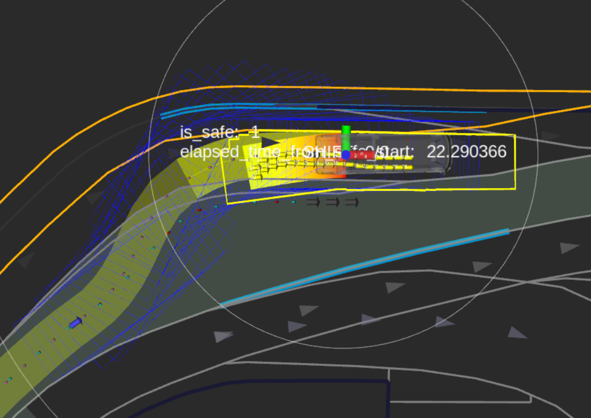
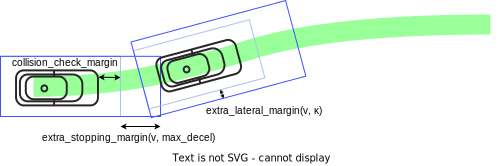

# Goal Planner design

## Purpose / Role

goal_planner generates a smooth path toward the goal and additionally searches for safe path and goal to execute dynamic pull_over on the road shoulders lanes following the traffic rules.

## Design

If goal modification is not allowed, just park at the designated fixed goal using `fixed_goal_planner`.

If allowed, `rough_goal_planner` works to park around the vacant spots in the shoulder lanes around the goal by executing pull_over toward left or right side of the road lanes.


## trigger condition

### fixed_goal_planner

`fixed_goal_planner` just plans a smooth path to the designated goal.
_NOTE: this planner does not perform the several features described below, such as "goal search", "collision check", "safety check", etc._

`fixed_goal_planner` is used when both conditions are met.

- Route is set with `allow_goal_modification=false`. This is the default.
- The goal is set on `road` lanes.

If the path given to goal_planner covers the goal, `fixed_goal_planner` smoothly connects the goal and the path points around the goal within the radius of `refine_goal_search_radius_range` using spline interpolation.


### rough_goal_planner

#### pull over on road lane

`rough_goal_planner` is triggered following the [behavior_path_planner scene module interface](https://autowarefoundation.github.io/autoware_universe/main/planning/behavior_path_planner/autoware_behavior_path_planner/docs/behavior_path_planner_manager_design/) namely through `isExecutionRequested` function and it returns true when following two conditions are met.

- The distance between the goal and ego get shorter than $\max$(`pull_over_minimum_request_length`, stop distance with decel and jerk constraints).
- Route is set with `allow_goal_modification=true` or is on a `road_shoulder` type lane.
  - We can set this option with [SetRoute](https://github.com/autowarefoundation/autoware_adapi_msgs/blob/main/autoware_adapi_v1_msgs/routing/srv/SetRoute.srv#L2) api service.
  - We support `2D Rough Goal Pose` with the key bind `r` in RViz, but in the future there will be a panel of tools to manipulate various Route API from RViz.


## finish condition

- The distance to the goal from ego is lower than threshold (default: < `1m`).
- Ego is stopped.
  - The speed is lower than threshold (default: < `0.01m/s`).

## General parameters for goal_planner

| Name                      | Unit  | Type   | Description                                        | Default value |
| :------------------------ | :---- | :----- | :------------------------------------------------- | :------------ |
| th_arrived_distance       | [m]   | double | distance threshold for arrival of path termination | 1.0           |
| th_stopped_velocity       | [m/s] | double | velocity threshold for arrival of path termination | 0.01          |
| th_stopped_time           | [s]   | double | time threshold for arrival of path termination     | 2.0           |
| center_line_path_interval | [m]   | double | reference center line path point interval          | 1.0           |

## **Goal Search**

To execute safe pull over in the presence of parked vehicles and other obstacles, collision free areas are searched within a certain range around the original goal. The selected best goal pose will be published as `/planning/scenario_planning/modified_goal`.

[goal search video](https://user-images.githubusercontent.com/39142679/188359594-c6724e3e-1cb7-4051-9a18-8d2c67d4dee9.mp4)

First, the original(designated) goal is provided, and a refined goal pose is obtained so that it is at least `margin_from_boundary` offset from the edge of the lane.


Second, goal candidates are searched in the interval of [`-forward_goal_search_length`, `backward_goal_search_length`] in the longitudinal direction and in the interval of [`longitudinal_margin`,`longitudinal_margin+max_lateral_offset`] in the lateral direction centered around the refined goal.


Each goal candidate is prioritized and pull over paths are generated by each planner for each goal candidate. The priority of a goal candidate is determined by a sort policy using several distance metrics from the refined goal.

The `minimum_longitudinal_distance` policy sorts the goal candidates to assign higher priority to goal with smaller longitudinal distance and then auxiliary to goal with smaller lateral distance, to prioritize goal candidates that are close to the original goal.

The `minimum_weighted_distance` policy sorts the goal candidates by the weighted sum of lateral distance and longitudinal distance `longitudinal_distance + lateral_cost*lateral_distance`.


The following figure is an example of minimum_weighted_distance.​ The white number indicates the goal candidate priority, and the smaller the number, the higher the priority. the 0 goal indicates the original refined goal.


To achieve a goal pose which is easy to start the maneuvering after arrival, the goal candidate pose is aligned so that ego center becomes parallel to the shoulder lane boundary at that pose.


If the footprint in each goal candidate is within `object_recognition_collision_check_margin` from one of the parked object, or the longitudinal distance to one of the parked objects from that goal candidate is less than `longitudinal_margin`, it is determined to be unsafe. These goals are not selected. If `use_occupancy_grid_for_goal_search` is enabled, collision detection on the grid is also performed with `occupancy_grid_collision_check_margin`.

Red goal candidates in the below figure indicate unsafe ones.


Also, if `prioritize_goals_before_objects` is enabled, the number of objects that need to be avoided before reaching the goal is counted, and the goal candidate with the number are prioritized.

The images represent a count of objects to be avoided at each range, with priority given to those with the lowest number, regardless of the aforementioned distances.


The gray numbers represent objects to avoid, and you can see that the goal in front has a higher priority in this case.


### BusStopArea

If the flag `use_bus_stop_area` is true, the goal search is limited inside the `BusStopArea` regulatory element polygon. The goal candidates are searched more densely compared to road shoulder parking method, and the goal candidate that keeps the ego footprint inside the `BusStopArea` is accepted. Refer to [BusStopArea spec](https://github.com/autowarefoundation/autoware_lanelet2_extension/blob/main/autoware_lanelet2_extension/docs/extra_regulatory_elements.md#bus-stop-area) for more detail.

### Parameters for goal search

| Name                            | Unit | Type   | Description                                                                                                                                                                                                                                                                                                                                                                                                                                                                      | Default value               |
| :------------------------------ | :--- | :----- | :------------------------------------------------------------------------------------------------------------------------------------------------------------------------------------------------------------------------------------------------------------------------------------------------------------------------------------------------------------------------------------------------------------------------------------------------------------------------------- | :-------------------------- |
| goal_priority                   | [-]  | string | In case `minimum_longitudinal_distance`, sort with smaller longitudinal distances taking precedence over smaller lateral distances. In case `minimum_weighted_distance`, sort with the sum of weighted lateral distance and longitudinal distance                                                                                                                                                                                                                                | `minimum_weighted_distance` |
| lateral_weight                  | [-]  | double | Weight for lateral distance used when `minimum_weighted_distance`                                                                                                                                                                                                                                                                                                                                                                                                                | 40.0                        |
| prioritize_goals_before_objects | [-]  | bool   | If there are objects that may need to be avoided, prioritize the goal in front of them                                                                                                                                                                                                                                                                                                                                                                                           | true                        |
| forward_goal_search_length      | [m]  | double | length of forward range to be explored from the original goal                                                                                                                                                                                                                                                                                                                                                                                                                    | 20.0                        |
| backward_goal_search_length     | [m]  | double | length of backward range to be explored from the original goal                                                                                                                                                                                                                                                                                                                                                                                                                   | 20.0                        |
| goal_search_interval            | [m]  | double | distance interval for goal search                                                                                                                                                                                                                                                                                                                                                                                                                                                | 2.0                         |
| longitudinal_margin             | [m]  | double | margin between ego-vehicle at the goal position and obstacles                                                                                                                                                                                                                                                                                                                                                                                                                    | 3.0                         |
| max_lateral_offset              | [m]  | double | maximum offset of goal search in the lateral direction                                                                                                                                                                                                                                                                                                                                                                                                                           | 0.5                         |
| lateral_offset_interval         | [m]  | double | distance interval of goal search in the lateral direction                                                                                                                                                                                                                                                                                                                                                                                                                        | 0.25                        |
| ignore_distance_from_lane_start | [m]  | double | This parameter ensures that the distance between the start of the shoulder lane and the goal is not less than the specified value. It's used to prevent setting goals too close to the beginning of the shoulder lane, which might lead to unsafe or impractical pull-over maneuvers. Increasing this value will force the system to ignore potential goal positions near the start of the shoulder lane, potentially leading to safer and more comfortable pull-over locations. | 0.0                         |
| margin_from_boundary            | [m]  | double | distance margin from edge of the shoulder lane                                                                                                                                                                                                                                                                                                                                                                                                                                   | 0.5                         |

## **Pull Over**

Since the path candidates generation is time consuming, goal_planner employs two separate threads to generate path candidates in the background and get latest candidates asynchronously. One is `LaneParkingThread` which plans path candidates on road shoulder lanes and the other is `FreespaceParkingThread` which plans on freespace area. The normal process of goal_planner is executed on the main thread.

Although the two threads are running periodically, the primary background process is performed only when following conditions are met in order not to consume computational resource.

- ego has approached the goal within the threshold of `pull_over_prepare_length`
- upstream module path shape has changed from the one which was sent by the main thread in previous process
- upstream module path shape has changed from the one which was used for path candidates generation in the previous process

`LaneParkingThread` executes either

- _shift_ based path planning
- _arc forward_, _arc backward_ path planning
- _bezier_ based path planning

depending on the situation and configuration. If `use_bus_stop_area` is true and the goal is on a BusStopArea regulatory element and the estimated pull over angle(the difference of pose between the shift start and shift end) is larger than `bezier_parking.pull_over_angle_threshold`, [_bezier_ based path planner](https://autowarefoundation.github.io/autoware_universe/main/planning/sampling_based_planner/autoware_bezier_sampler/) works to generate path candidates. Otherwise [_shift_ based path planner](https://autowarefoundation.github.io/autoware_universe/main/planning/behavior_path_planner/autoware_behavior_path_planner_common/docs/behavior_path_planner_path_generation_design/) works. _bezier_ based path planner tends to generate more natural paths on a curved lane than _shift_ based path planner, so it is used if the shift requires a certain amount of pose rotation.

The overall flow is as follows.


The main thread and the each thread communicate by sending _request_ and _response_ respectively. The main thread sends latest main thread data as `LaneParkingRequest/FreespaceParkingRequest` and each thread sets `LaneParkingResponse/FreespaceParkingResponse` as the output when it's finished. The bluish blocks on the flow diagram are the _critical section_.

While

- there are no path candidates, or
- the threads fail to generate candidates, or
- the main thread cannot nail down that the selected candidate is SAFE against dynamic objects(which means the DecisionState is not still `DECIDED`)

the main thread inserts a stop pose either at `closest_start_pose` which is the closest shift start pose among the path candidates, or at the position which is certain distance before the closest goal candidate.

Once the main thread finally selected the best pull over path, goal_planner transits to `DECIDED` state and it sets `SAFE` as the RTC status(NOTE: this `SAFE` means that "a safe pull over path has been finally selected".)

If there are no path candidates or the selected path is not SAFE and thus `the LaneParkingThread` causes ego to get stuck, the `FreespaceParkingThread` is triggered by the stuck detection and it starts generating path candidates using [freespace parking algorithms](https://autowarefoundation.github.io/autoware_universe/main/planning/autoware_freespace_planning_algorithms/). If a valid freespace path is found and ego is still stuck, the freespace path is used instead. If the selected lane parking pull over path becomes collision-free again in case the blocking parked objects moved, and the path is continuous from current freespace path, lane parking pull over path is selected again.

| Name                                  | Unit   | Type   | Description                                                                                                                                                                    | Default value                            |
| :------------------------------------ | :----- | :----- | :----------------------------------------------------------------------------------------------------------------------------------------------------------------------------- | :--------------------------------------- |
| pull_over_minimum_request_length      | [m]    | double | when the ego-vehicle approaches the goal by this distance or a safe distance to stop, pull over is activated.                                                                  | 100.0                                    |
| pull_over_velocity                    | [m/s]  | double | decelerate to this speed by the goal search area                                                                                                                               | 3.0                                      |
| pull_over_minimum_velocity            | [m/s]  | double | speed of pull_over after stopping once. this prevents excessive acceleration.                                                                                                  | 1.38                                     |
| decide_path_distance                  | [m]    | double | decide path if it approaches this distance relative to the parking position. after that, no path planning and goal search are performed                                        | 10.0                                     |
| maximum_deceleration                  | [m/s2] | double | maximum deceleration. it prevents sudden deceleration when a parking path cannot be found suddenly                                                                             | 1.0                                      |
| path_priority                         | [-]    | string | In case `efficient_path` use a goal that can generate an efficient path which is set in `efficient_path_order`. In case `close_goal` use the closest goal to the original one. | efficient_path                           |
| efficient_path_order                  | [-]    | string | efficient order of pull over planner along lanes excluding freespace pull over                                                                                                 | ["SHIFT", "ARC_FORWARD", "ARC_BACKWARD"] |
| lane_departure_check_expansion_margin | [m]    | double | margin to expand the ego vehicle footprint when doing lane departure checks                                                                                                    | 0.0                                      |

### **shift parking**

Pull over distance is calculated by the speed, lateral deviation, and the lateral jerk. The lateral jerk is searched for among the predetermined minimum and maximum values.

1. Apply uniform offset to centerline of shoulder lane for ensuring margin
2. The interval of shift start and end is shifted by the [_shift_ based path planner](https://autowarefoundation.github.io/autoware_universe/main/planning/behavior_path_planner/autoware_behavior_path_planner_common/docs/behavior_path_planner_path_generation_design/)
3. Combine this path with center line of road lane and the remaining shoulder lane centerline


[shift_parking video](https://user-images.githubusercontent.com/39142679/178034101-4dc61a33-bc49-41a0-a9a8-755cce53cbc6.mp4)

#### Parameters for shift parking

| Name                          | Unit   | Type   | Description                                                         | Default value |
| :---------------------------- | :----- | :----- | :------------------------------------------------------------------ | :------------ |
| enable_shift_parking          | [-]    | bool   | flag whether to enable shift parking                                | true          |
| shift_sampling_num            | [-]    | int    | Number of samplings in the minimum to maximum range of lateral_jerk | 4             |
| maximum_lateral_jerk          | [m/s3] | double | maximum lateral jerk                                                | 2.0           |
| minimum_lateral_jerk          | [m/s3] | double | minimum lateral jerk                                                | 0.5           |
| deceleration_interval         | [m]    | double | distance of deceleration section                                    | 15.0          |
| after_shift_straight_distance | [m]    | double | straight line distance after pull over end point                    | 1.0           |

### **geometric parallel parking**

This method generate two arc paths with discontinuous curvature. It stops twice in the middle of the path to do [dry steering](https://en.wikipedia.org/wiki/Dry_steering). There are two path generation methods: forward and backward.

See also [[1]](https://www.sciencedirect.com/science/article/pii/S1474667015347431) for details of the algorithm. There is also [a simple python implementation](https://github.com/kosuke55/geometric-parallel-parking).

#### Parameters geometric parallel parking

| Name                    | Unit  | Type   | Description                                                                                                                         | Default value |
| :---------------------- | :---- | :----- | :---------------------------------------------------------------------------------------------------------------------------------- | :------------ |
| arc_path_interval       | [m]   | double | interval between arc path points                                                                                                    | 1.0           |
| pull_over_max_steer_rad | [rad] | double | maximum steer angle for path generation. it may not be possible to control steer up to max_steer_angle in vehicle_info when stopped | 0.35          |

#### arc forward parking

Generate two forward arc paths.


[arc_forward_parking video](https://user-images.githubusercontent.com/39142679/178034128-4754c401-8aff-4745-b69a-4a69ca29ce4b.mp4)

#### Parameters arc forward parking

| Name                                    | Unit  | Type   | Description                                                                     | Default value |
| :-------------------------------------- | :---- | :----- | :------------------------------------------------------------------------------ | :------------ |
| enable_arc_forward_parking              | [-]   | bool   | flag whether to enable arc forward parking                                      | true          |
| after_forward_parking_straight_distance | [m]   | double | straight line distance after pull over end point                                | 2.0           |
| forward_parking_velocity                | [m/s] | double | velocity when forward parking                                                   | 1.38          |
| forward_parking_lane_departure_margin   | [m/s] | double | lane departure margin for front left corner of ego-vehicle when forward parking | 0.0           |

#### arc backward parking

Generate two backward arc paths.

.

[arc_backward_parking video](https://user-images.githubusercontent.com/39142679/178034280-4b6754fe-3981-4aee-b5e0-970f34563c6d.mp4)

#### Parameters arc backward parking

| Name                                     | Unit  | Type   | Description                                                               | Default value |
| :--------------------------------------- | :---- | :----- | :------------------------------------------------------------------------ | :------------ |
| enable_arc_backward_parking              | [-]   | bool   | flag whether to enable arc backward parking                               | true          |
| after_backward_parking_straight_distance | [m]   | double | straight line distance after pull over end point                          | 2.0           |
| backward_parking_velocity                | [m/s] | double | velocity when backward parking                                            | -1.38         |
| backward_parking_lane_departure_margin   | [m/s] | double | lane departure margin for front right corner of ego-vehicle when backward | 0.0           |

### freespace parking

If the vehicle gets stuck with `LaneParkingPlanning`, `FreespaceParkingPlanner` is triggered.

To run this feature, you need to set `parking_lot` to the map, `activate_by_scenario` of [costmap_generator](../costmap_generator/README.md) to `false` and `enable_freespace_parking` to `true`


Simultaneous execution with `avoidance_module` in the flowchart is under development.


#### Parameters freespace parking

| Name                     | Unit | Type | Description                                                                                                          | Default value |
| :----------------------- | :--- | :--- | :------------------------------------------------------------------------------------------------------------------- | :------------ |
| enable_freespace_parking | [-]  | bool | This flag enables freespace parking, which runs when the vehicle is stuck due to e.g. obstacles in the parking area. | true          |

See [freespace_planner](../autoware_freespace_planner/README.md) for other parameters.

### bezier parking

_shift_ based path planner tends to generate unnatural path when the shift lane is curved as illustrated below.



_bezier_ based path planner interpolates the shift path start and end pose using tbe bezier curve for a several combination of parameters, to obtain a better result through the later selection process. In the below screenshot the goal is on a BusStopArea and `use_bus_stop_area` is set to true, so _bezier_ planner is triggered instead. Internally, goal*planner first tries to use \_shift* planner, and if it turns out that the shift start and end is not parallel, it switches to _bezier_ planner from the next process.


## **collision check for path generation**

To select a safe one from the path candidates, collision is checked against parked objects for each path.

### **occupancy grid based collision check**

Generate footprints from ego-vehicle path points and determine obstacle collision from the value of occupancy_grid of the corresponding cell.

#### Parameters for occupancy grid based collision check

| Name                                            | Unit | Type   | Description                                                                                                     | Default value |
| :---------------------------------------------- | :--- | :----- | :-------------------------------------------------------------------------------------------------------------- | :------------ |
| use_occupancy_grid_for_goal_search              | [-]  | bool   | flag whether to use occupancy grid for goal search collision check                                              | true          |
| use_occupancy_grid_for_goal_longitudinal_margin | [-]  | bool   | flag whether to use occupancy grid for keeping longitudinal margin                                              | false         |
| use_occupancy_grid_for_path_collision_check     | [-]  | bool   | flag whether to use occupancy grid for collision check                                                          | false         |
| occupancy_grid_collision_check_margin           | [m]  | double | margin to calculate ego-vehicle cells from footprint.                                                           | 0.0           |
| theta_size                                      | [-]  | int    | size of theta angle to be considered. angular resolution for collision check will be 2$\pi$ / theta_size [rad]. | 360           |
| obstacle_threshold                              | [-]  | int    | threshold of cell values to be considered as obstacles                                                          | 60            |

### **object recognition based collision check**

collision is checked for each of the path candidates. There are three margins for this purpose.

- `object_recognition_collision_check_margin` is margin in all directions of ego.
- In the forward direction, a margin is added by the braking distance calculated from the current speed and maximum deceleration. The maximum distance is The maximum value of the distance is suppressed by the `object_recognition_collision_check_max_extra_stopping_margin`
- In curves, the lateral margin is larger than in straight lines.This is because curves are more prone to control errors or to fear when close to objects (The maximum value is limited by `object_recognition_collision_check_max_extra_stopping_margin`, although it has no basis.)



Then there is the concept of soft and hard margins. Although not currently parameterized, if a collision-free path can be generated by a margin several times larger than `object_recognition_collision_check_margin`, then the priority is higher.

#### Parameters for object recognition based collision check

| Name                                                         | Unit | Type           | Description                                                                                                                                                            | Default value                                 |
| :----------------------------------------------------------- | :--- | :------------- | :--------------------------------------------------------------------------------------------------------------------------------------------------------------------- | :-------------------------------------------- |
| use_object_recognition                                       | [-]  | bool           | flag whether to use object recognition for collision check                                                                                                             | true                                          |
| object_recognition_collision_check_soft_margins              | [m]  | vector[double] | soft margins for collision check when path generation. It is not strictly the distance between footprints, but the maximum distance when ego and objects are oriented. | [5.0, 4.5, 4.0, 3.5, 3.0, 2.5, 2.0, 1.5, 1.0] |
| object_recognition_collision_check_hard_margins              | [m]  | vector[double] | hard margins for collision check when path generation                                                                                                                  | [0.6]                                         |
| object_recognition_collision_check_max_extra_stopping_margin | [m]  | double         | maximum value when adding longitudinal distance margin for collision check considering stopping distance                                                               | 1.0                                           |
| collision_check_outer_margin_factor                          | [-]  | double         | factor to extend the collision check margin from the inside margin to the outside in the curved path                                                                   | 2.0                                           |
| detection_bound_offset                                       | [m]  | double         | expand pull over lane with this offset to make detection area for collision check of path generation                                                                   | 15.0                                          |

## **safety check**

Perform safety checks on moving objects. If the object is determined to be dangerous, no path decision is made and no approval is given,

- path decision is not made and approval is not granted.
- After approval, the ego vehicle stops under deceleration and jerk constraints.

This module has two methods of safety check, `RSS` and `integral_predicted_polygon`.

`RSS` method is a method commonly used by other behavior path planner modules, see [RSS based safety check utils explanation](../autoware_behavior_path_planner_common/docs/behavior_path_planner_safety_check.md).

`integral_predicted_polygon` is a more safety-oriented method. This method is implemented because speeds during pull over are lower than during driving, and fewer objects travel along the edge of the lane. (It is sometimes too reactive and may be less available.)
This method integrates the footprints of egos and objects at a given time and checks for collisions between them.


In addition, the safety check has a time hysteresis, and if the path is judged "safe" for a certain period of time(`keep_unsafe_time`), it is finally treated as "safe".

```txt
                         ==== is_safe
                         ---- current_is_safe
       is_safe
        ^
        |
        |                   time
      1 +--+    +---+       +---=========   +--+
        |  |    |   |       |           |   |  |
        |  |    |   |       |           |   |  |
        |  |    |   |       |           |   |  |
        |  |    |   |       |           |   |  |
      0 =========================-------==========--> t
```

### Parameters for safety check

| Name                                 | Unit  | Type   | Description                                                                                              | Default value                |
| :----------------------------------- | :---- | :----- | :------------------------------------------------------------------------------------------------------- | :--------------------------- |
| method                               | [-]   | string | method for safety check. `RSS` or `integral_predicted_polygon`                                           | `integral_predicted_polygon` |
| keep_unsafe_time                     | [s]   | double | safety check Hysteresis time. if the path is judged "safe" for the time it is finally treated as "safe". | 3.0                          |
| check_all_predicted_path             | -     | bool   | Flag to check all predicted paths                                                                        | true                         |
| publish_debug_marker                 | -     | bool   | Flag to publish debug markers                                                                            | false                        |
| `collision_check_yaw_diff_threshold` | [rad] | double | Maximum yaw difference between ego and object when executing rss-based collision checking                | 3.1416                       |

#### Parameters for RSS safety check

| Name                                | Unit | Type   | Description                             | Default value |
| :---------------------------------- | :--- | :----- | :-------------------------------------- | :------------ |
| rear_vehicle_reaction_time          | [s]  | double | Reaction time for rear vehicles         | 2.0           |
| rear_vehicle_safety_time_margin     | [s]  | double | Safety time margin for rear vehicles    | 1.0           |
| lateral_distance_max_threshold      | [m]  | double | Maximum lateral distance threshold      | 2.0           |
| longitudinal_distance_min_threshold | [m]  | double | Minimum longitudinal distance threshold | 3.0           |
| longitudinal_velocity_delta_time    | [s]  | double | Delta time for longitudinal velocity    | 0.8           |

#### Parameters for integral_predicted_polygon safety check

| Name            | Unit | Type   | Description                            | Default value |
| :-------------- | :--- | :----- | :------------------------------------- | :------------ |
| forward_margin  | [m]  | double | forward margin for ego footprint       | 1.0           |
| backward_margin | [m]  | double | backward margin for ego footprint      | 1.0           |
| lat_margin      | [m]  | double | lateral margin for ego footprint       | 1.0           |
| time_horizon    | [s]  | double | Time width to integrate each footprint | 10.0          |

## **path deciding**

When ego approached the start of the temporarily selected pull over path within the distance of `decide_path_distance`, if it is collision-free at that time and safe against dynamic objects, it transitions to `DECIDING`. And if those conditions hold for a certain period of time, it transitions to `DECIDED` and the selected path is fixed.


[Open]({{ drawio("/planning/behavior_path_planner/autoware_behavior_path_goal_planner_module/images/goal_planner-state-transition.drawio.svg") }})

## Unimplemented parts / limitations

- Only shift pull over can be executed concurrently with other modules
- Parking in tight spots and securing margins are traded off. A mode is needed to reduce the margin by using a slower speed depending on the situation, but there is no mechanism for dynamic switching of speeds.
- Parking space available depends on visibility of objects, and sometimes parking decisions cannot be made properly.
- Margin to unrecognized objects(Not even unknown objects) depends on the occupancy grid. May get too close to unrecognized ground objects because the objects that are allowed to approach (e.g., grass, leaves) are indistinguishable.

Unimplemented parts / limitations for freespace parking

- When a short path is generated, the ego does can not drive with it.
- Complex cases take longer to generate or fail.
- The drivable area is not guaranteed to fit in the parking_lot.
