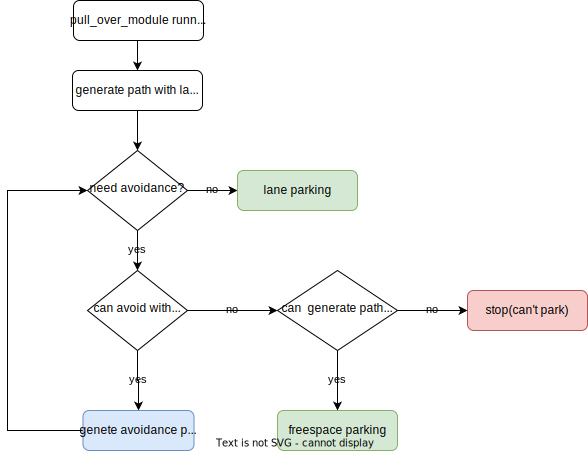
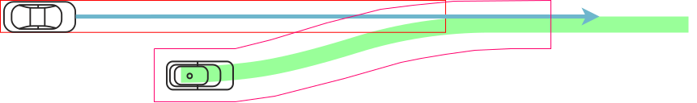

# ゴールプランナー設計

## 目的 / 役割

ゴール周辺のパスを計画する。

- 指定されたゴールに到着する。
- 障害物を回避するため、または車線の脇に停車するため、ゴールを変更する。

## 設計

ゴール変更が許可されていない場合は、指定された固定ゴールに駐車する（下の図の `fixed_goal_planner`）。
許可されている場合は、指定されたポリシー（例：車線の左右に駐車）に従って駐車する（下の図の `rough_goal_planner`）。現在、ラフゴールプランナーはプルオーバー機能のみをサポートしているが、将来的にはさまざまな駐車ポリシーに対応できることが望ましい。


## 開始条件

### fixed_goal_planner

これは、指定された目標にスムーズな経路を計画する非常にシンプルな関数です。この関数は承認を必要とせず、常に他のモジュールと一緒に実行されます。
_注意: このプランナーは、「目標探索」、「衝突チェック」、「安全チェック」など、以下で説明するいくつかの機能は実行しません。_

両方の条件が満たされると実行されます。

- ルートは `allow_goal_modification=false` で設定されています。これはデフォルトです。
- 目標は通常の車線に設定されています。つまり、`road_shoulder` ではありません。
- 自車は目標と同じ車線シーケンスに存在します。

目標経路に目標が含まれている場合、経路のポイントを変更して、経路と目標がスムーズにつながるようにします。この処理により、経路の形状が目標から `refine_goal_search_radius_range` の距離だけ変化します。このロジックは、後続のモジュールで実行される補間アルゴリズム（現時点ではスプライン補間を使用）に依存するため、将来的にはアップデートする必要があります。


### rough_goal_planner

#### 路側端に寄せる

- 目標と自車間の距離が `pull_over_minimum_request_length` よりも短い。
- ルートは `allow_goal_modification=true` で設定されています。
  - [SetRoute](https://github.com/autowarefoundation/autoware_adapi_msgs/blob/main/autoware_adapi_v1_msgs/routing/srv/SetRoute.srv#L2) API サービスでこのオプションを設定できます。
  - RVizで `r` にキーバインドされた `2D Rough Goal Pose` をサポートしていますが、将来的にはRVizからさまざまなルートAPIを操作するためのツールパネルを用意する予定です。
- 現在のパスにおける終点は、目標と同じ車線シーケンス内にあります。目標が路側肩にある場合は、隣接する車線シーケンス内にあります。


#### 路側肩に寄せる

- 目標と自車間の距離が `pull_over_minimum_request_length` よりも短い。
- ゴールは `road_shoulder` に設定されています。


## 終了条件

- 自車から目標までの距離がしきい値（デフォルト: < `1m`）より低い。
- 自車が停止している。
  - 速度がしきい値（デフォルト: < `0.01m/s`）より低い。

## goal_planner の一般的なパラメータ

| 名前                      | 単位  | タイプ   | 説明                                                                    | デフォルト値 |
| :------------------------ | :---- | :----- | :---------------------------------------------------------------------- | :------------ |
| th_arrived_distance       | [m]   | 数値   | パス終了に到着するための距離閾値                                        | 1.0           |
| th_stopped_velocity       | [m/s] | 数値   | パス終了に到着するための速度閾値                                        | 0.01          |
| th_stopped_time           | [s]   | 数値   | パス終了に到着するための時間閾値                                          | 2.0           |
| center_line_path_interval | [m]   | 数値   | 参照センターラインパスのポイント間隔                                     | 1.0           |

## **Goal Search**

障害物が当初の目標付近にある場合でもハザードランプ消灯を実現するために、当初の目標の周囲の特定範囲内で衝突しない領域を検索します。見つかった目標は `/planning/scenario_planning/modified_goal` として公開されます。

[Goal Search Video](https://user-images.githubusercontent.com/39142679/188359594-c6724e3e-1cb7-4051-9a18-8d2c67d4dee9.mp4)

1. 当初目標が設定され、レファインド目標のポーズが車線の中心線に対して垂直方向に移動し、『レーン境界から『 `margin_from_boundary` 』離れた距離を保つことで取得されます。
   

2. 『レファインド目標』をベース目標として使用して、精度を高めた目標に基づいて、縦方向に『 `-forward_goal_search_length` 』から『 `backward_goal_search_length` 』、横方向に『 `longitudinal_margin` 』から『 `longitudinal_margin` + `max_lateral_offset` 』の範囲で候補目標を検索します。
   

3. 各候補目標に優先順位が付けられ、各目標に対して各プランナーでパスが生成されます。候補目標の優先順位は、ベース目標からの距離によって決まります。車両は可能な限り最も高い目標に向けて駐車しようします。距離は選択したポリシーによって定義されます。 『 `minimum_longitudinal_distance` 』の場合は、縦方向の距離が小さい方が小さい横方向の距離よりも優先されるようにソートします。 『 `minimum_weighted_distance` 』の場合は、加重横方向距離と縦方向距離の合計でソートします。これは、距離が `longitudinal_distance + lateral_cost*lateral_distance` によって計算されることを意味します。
   
   次の図は `minimum_weighted_distance` の例です。白い数字は目標候補の優先順位を表し、数字が小さいほど優先順位が高くなります。目標 0 はベース目標を表します。
   
   

4. 各目標候補のフットプリントがオブジェクトのフットプリントから `object_recognition_collision_check_margin` 以内に収まると安全でないと判断されます。これらの目標は選択されません。 `use_occupancy_grid_for_goal_search` が有効になっている場合、グリッド上の衝突検出も `occupancy_grid_collision_check_margin` で実行されます。

画像内の赤色の目標候補は安全でないことを示しています。


目標候補では、縦方向に `longitudinal_margin` を障害物から衝突マージンとは離しておくことが可能です。これは、駐車時の自然な間隔と効率的な出発を確保することを目的としています。


また、 `prioritize_goals_before_objects` が有効になっている場合は、各目標に到着するために対象範囲内で回避する必要のあるオブジェクトの数をカウントし、数が最も少ないものに優先順位を付けます。

画像は、前述の距離に関係なく、回避する必要があるオブジェクトの数を各範囲でカウントしたものであり、数が最も少ないものに優先順位が付けられています。


グレーの数字は回避対象のオブジェクトを表しており、この場合、前の目標の優先順位が高いことがわかります。


### Goal Search のパラメータ

| 名称                            | 単位 | タイプ   | 説明                                                                                                                                                                                                                                                                                                                                                                                                                                                                      | デフォルト値               |
| :------------------------------ | :--- | :----- | :------------------------------------------------------------------------------------------------------------------------------------------------------------------------------------------------------------------------------------------------------------------------------------------------------------------------------------------------------------------------------------------------------------------------------------------------------------------------------- | :-------------------------- |
| goal_priority                   | [－]  | string | longitudinal distancesを優先し小さい距離を優先する `minimum_longitudinal_distance`、weighted lateral distanceとlongitudinal distanceの総和を優先する `minimum_weighted_distance` | `minimum_weighted_distance` |
| lateral_weight                  | [－]  | double | `minimum_weighted_distance`時に使用されるlateral distanceの重み                                                                                                                                                                                                                                                                                                                                                                                                                | 40.0                        |
| prioritize_goals_before_objects | [－]  | bool   | 回避すべきオブジェクトがある場合、それらの前面にある目標を優先                                                                                                                                                                                                                                                                                                                                                                                           | true                        |
| forward_goal_search_length      | [m]  | double | 元の目標から探索する前方範囲の長さ                                                                                                                                                                                                                                                                                                                                                                                                                    | 20.0                        |
| backward_goal_search_length     | [m]  | double | 元の目標から探索する後方範囲の長さ                                                                                                                                                                                                                                                                                                                                                                                                                   | 20.0                        |
| goal_search_interval            | [m]  | double | 目標検索の距離間隔                                                                                                                                                                                                                                                                                                                                                                                                                                                | 2.0                         |
| longitudinal_margin             | [m]  | double | 目標位置の自車と障害物間の距離マージン                                                                                                                                                                                                                                                                                                                                                                                                                    | 3.0                         |
| max_lateral_offset              | [m]  | double | lateral方向の目標検索の最大オフセット                                                                                                                                                                                                                                                                                                                                                                                                                           | 0.5                         |
| lateral_offset_interval         | [m]  | double | lateral方向の目標検索の距離間隔                                                                                                                                                                                                                                                                                                                                                                                                                        | 0.25                        |
| ignore_distance_from_lane_start | [m]  | double | このパラメータによって、車線路の開始位置と目標間の距離が指定した値以上になることが保証されます。これは、目標を車線路の開始位置にかなり近い位置に設定することを防ぐために使用され、安全でない、または実用的な路肩への車両移動につながる可能性があります。この値を増やすと、システムは車線路の開始位置近くの潜在的な目標位置を無視せざるを得なくなり、安全で快適な路肩への車両移動につながる可能性があります。 | 0.0                         |
| margin_from_boundary            | [m]  | double | 車線路の端からの距離マージン                                                                                                                                                                                                                                                                                                                                                                                                                                   | 0.5                         |

## **路肩駐車**

経路生成方法が 3 つあります。
経路は路肩の境界線から一定の余白（デフォルト: `0.75 m`）を設けて生成されます。

各候補のゴールに対して複数の Plannar を使用して経路を生成するため、プロセスには時間がかかります。したがって、このモジュールでは経路生成はメインスレッドとは異なるスレッドで実行されます。経路生成は、前のモジュールの出力経路の形状が変更されたタイミングで実行されます。新しいモジュールが起動すると、通常はゴールプランナより前の段階に移行し、その場合、ゴールプランナは経路を再生成します。ゴールプランナは複数のモジュールの最後で実行されることを想定しており、これはプランナマネージャの `keep_last` によって実現されます。

ゴールプランナの threads は次のとおりです。


メインスレッドは、プランナマネージャフローから呼び出されるスレッドになります。

- ゴール候補の生成と経路候補の生成は、別のスレッド（車線経路生成スレッド）で行われます。
- そこで生成された経路候補はメインスレッドで参照され、現在のプランナーのデータ（例: 自車と障害物の情報）に対して有効と判断された候補がその中から選択されます。有効とは、急減速なし、障害物との衝突なしなどを意味します。選択された経路がこのモジュールの出力になります。
- 選択された経路がない場合、または選択された経路が衝突で自車が停止した場合、別のスレッド（フリースペース経路生成スレッド）がフリースペース Plannar アルゴリズムを使用して経路を生成します。有効なフリースペース経路が見つかった場合、それはモジュールの出力になります。障害物が移動して車線に沿って生成された路肩駐車の経路が衝突フリーの場合、経路は再び出力として使用されます。フリースペース経路の生成フローの詳細については、フリースペース駐車に関するセクションも参照してください。

| 名称                                        | 単位   | 種類   | 説明                                                                                                                                                                | デフォルト値                           |
| ------------------------------------------ | ------ | ------ | -------------------------------------------------------------------------------------------------------------------------------------------------------------------------- | --------------------------------------- |
| pull_over_minimum_request_length           | [m]    | double | 自動車が目標地点にこの距離まで接近するか、停止する安全距離に達すると、プルオーバーが有効になる。                                                             | 100.0                                   |
| pull_over_velocity                        | [m/s]  | double | 目標検索エリアまでにこの速度に減速する                                                                                                                              | 3.0                                     |
| pull_over_minimum_velocity                | [m/s]  | double | 一度停止した後のプルオーバーの速度。過度の加速度を防止する。                                                                                                                 | 1.38                                    |
| decide_path_distance                      | [m]    | double | 駐車位置にこの距離まで接近した場合に経路を決定する。その後、経路計画と目標検索は実行されません                                                                     | 10.0                                    |
| maximum_deceleration                      | [m/s2] | double | 最大減速度。駐車経路が急に検出できない場合に急減速を防ぐ。                                                                                                       | 1.0                                     |
| path_priority                             | [-]    | string | `efficient_path`を使用する場合、`efficient_path_order`に設定された効率的な経路を生成できる目標を使用します。`close_goal`を使用する場合、元の目標に最も近い目標を使用します。 | efficient_path                         |
| efficient_path_order                      | [-]    | string | フリースペースでのプルオーバーを除くレーンに沿ったプルオーバープランナーの効率的な順序                                                                                          | ["SHIFT", "ARC_FORWARD", "ARC_BACKWARD"] |
| lane_departure_check_expansion_margin     | [m]    | double | 車線逸脱チェックを実行するときの自動車両のフットプリントを拡大するためのマージン                                                                                     | 0.0                                     |

### **路肩駐車**

寄せる距離は、速度、横方向偏差、横方向ジャークから計算されます。
横方向ジャークは、事前に設定された最小値と最大値の間で検索され、上記の条件を満たすものが出力されます。

1. 余白を確保するために、路肩車線の路側線セグメントに一様なオフセットを適用する
2. 合流開始と終了の間のセクションでは、回避経路の生成に使用される方法（4セグメント定数ジャーク多項式）で経路をシフトする
3. この経路と車線の中心線を組み合わせる


[shift_parking video](https://user-images.githubusercontent.com/39142679/178034101-4dc61a33-bc49-41a0-a9a8-755cce53cbc6.mp4)

#### 路肩駐車のパラメータ

| 名称                          | 単位   | 型         | 説明                                                                 | デフォルト値   |
| :----------------------------- | :----- | :--------- | :-------------------------------------------------------------------- | :------------- |
| enable_shift_parking          | [-]    | ブール型    | シフトパーキングを有効にするフラグ                                  | true          |
| shift_sampling_num            | [-]    | 整数型     | lateral_jerkの最小および最大範囲内のサンプリング数                   | 4             |
| maximum_lateral_jerk          | [m/s3] | 倍精度浮動小数点数型 | 最大横方向ジャーク                                                   | 2.0           |
| minimum_lateral_jerk          | [m/s3] | 倍精度浮動小数点数型 | 最小横方向ジャーク                                                   | 0.5           |
| deceleration_interval         | [m]    | 倍精度浮動小数点数型 | 減速区間の距離                                                    | 15.0          |
| after_shift_straight_distance | [m]    | 倍精度浮動小数点数型 | 引き寄せ終了後の直線距離                                          | 1.0           |

### **geometric parallel parking**

2つの不連続曲率円弧パスを生成します。パスの途中で2回停止し、この時点でステアリングを制御します。2つのパス生成方法：前進と後進があります。
アルゴリズムの詳細については、[[1]](https://www.sciencedirect.com/science/article/pii/S1474667015347431) を参照してください。また、[シンプルなPython実装](https://github.com/kosuke55/geometric-parallel-parking) もあります。

#### geometric parallel parkingのパラメータ

| 名称                    | 単位  | 型   | 説明                                                                                                              | デフォルト値 |
| :---------------------- | :---- | :----- | :------------------------------------------------------------------------------------------------------------------- | :------------ |
| arc_path_interval       | [m]   | double | アークパスポイント間の距離                                                                                 | 1.0           |
| pull_over_max_steer_rad | [rad] | double | Path生成時の最大ステアリング角度。停止中はvehicle_infoでmax_steer_angleまでステアリングを制御できない場合がある | 0.35          |

#### アークフォワードパーキング

2つの前方アークパスを生成します。


[arc_forward_parking video](https://user-images.githubusercontent.com/39142679/178034128-4754c401-8aff-4745-b69a-4a69ca29ce4b.mp4)

#### アークフォワードパーキングのパラメータ

| 名前                                    | 単位  | 型   | 説明                                                                                                | デフォルト値 |
| :-------------------------------------- | :---- | :----- | :-------------------------------------------------------------------------------------------------- | :------------ |
| `enable_arc_forward_parking`              | [-]   | ブール | 円弧前進駐車を有効にするかどうか                                                                       | true          |
| `after_forward_parking_straight_distance` | [m]   | double | 引き上げ終了地点から直線距離                                                                          | 2.0           |
| `forward_parking_velocity`                | [m/s] | double | 前進駐車時の速度                                                                                       | 1.38          |
| `forward_parking_lane_departure_margin`   | [m/s] | double | 前進駐車時の車両左前角の車線逸脱マージン                                                              | 0.0           |

#### アーク後退駐車

後退アークパスを2つ生成します。


[後退アーク駐車ビデオ](https://user-images.githubusercontent.com/39142679/178034280-4b6754fe-3981-4aee-b5e0-970f34563c6d.mp4)

#### 後退アーク駐車のパラメータ

| 名称                                   | 単位 | タイプ | 説明                                                                  | デフォルト値 |
| :--------------------------------------- | :---- | :----- | :----------------------------------------------------------------------- | :----------- |
| enable_arc_backward_parking              | [-]   | bool   | アーク後退駐車を有効にするフラグ                                    | true         |
| after_backward_parking_straight_distance | [m]   | double | 駐車終了地点後の直線距離                                             | 2.0          |
| backward_parking_velocity                | [m/s] | double | 後退駐車時の速度                                                      | -1.38        |
| backward_parking_lane_departure_margin   | [m/s] | double | 自車の前右隅が後退駐車時に車線から逸脱するマージン                    | 0.0          |

### 無人駐車（Freespace Parking）

車両が「車線駐車」でスタックした場合は、「無人駐車」を実行します。
この機能を実行するには、マップに「駐車場」を設定し、[costmap_generator](../costmap_generator/README.md) の `activate_by_scenarion` を `false` に、`enable_freespace_parking` を `true` に設定する必要があります。



フローチャート内の `avoidance_module` との同時実行は現在開発中です。


#### 無人駐車パラメーター

| 名称                     | 単位 | 型 | 説明                                                                                                         | デフォルト値 |
| :----------------------- | :--- | :--- | :---------------------------------------------------------------------------------------------------------------- | :------------ |
| enable_freespace_parking | [-]  | ブール値 | 障害物などにより駐車スペースで車両がスタックした場合にfreespace駐車が有効になるフラグです。                        | true          |

[freespace_planner](../autoware_freespace_planner/README.md)の他のパラメータについては、参照してください。

## **経路生成のための衝突チェック**

経路候補の中から安全なものを選択するために、障害物との衝突チェックが行われます。

### **オキュパンシーグリッドベースの衝突チェック**

自車位置経路点からフットプリントを生成し、対応するセルのオキュパンシーグリッドの値から障害物の衝突を判定します。

#### オキュパンシーグリッドベースの衝突チェックに関するパラメータ

| 名前                                                    | 単位 | タイプ | 説明                                                                                                     | デフォルト値 |
| :------------------------------------------------------ | :--- | :----- | :-------------------------------------------------------------------------------------------------------------- | :------------ |
| use_occupancy_grid_for_goal_search              | -     | bool   | 目標探索衝突確認のためオキューパンシーグリッドを使用するかどうか            | true          |
| use_occupancy_grid_for_goal_longitudinal_margin | -     | bool   | 縦方向マージンを保持するためオキューパンシーグリッドを使用するかどうか | false         |
| use_occupancy_grid_for_path_collision_check     | -     | bool   | 衝突確認のためオキューパンシーグリッドを使用するかどうか | false         |
| occupancy_grid_collision_check_margin           | m     | double | フットプリントから自車セルを計算するためのマージン | 0.0           |
| theta_size                                      | -     | int    | 考慮するシータ角のサイズ。衝突確認の角度分解能は 2$\pi$ / theta_size [rad] となります。 | 360           |
| obstacle_threshold                              | -     | int    | 障害物と見なされるセルの値のしきい値 | 60            |

### **オブジェクト認識ベースの衝突確認**

各経路候補に対して衝突判定が行われ、衝突のない経路が選択されます。
現時点では、3 つの主なマージンがあります。

- `object_recognition_collision_check_margin` は、自車の全方向のマージンです。
- 前進方向では、現在の速度と最大減速度から計算された制動距離によってマージンが追加されます。距離の最大値は、`object_recognition_collision_check_max_extra_stopping_margin` によって抑えられます。
- 曲線では、横方向のマージンは直線よりも大きくなります。これは、曲線では制御エラーが発生しやすかったり、物体に近くても不安定になったりするためです（理論的根拠はありませんが、最大値は `object_recognition_collision_check_max_extra_stopping_margin` によって制限されています）。


また、ソフトマージンとハードマージンのコンセプトがあります。現時点ではパラメータ化されていませんが、`object_recognition_collision_check_margin` よりも数倍大きいマージンで衝突のない経路を生成できる場合、優先順位が高くなります。

#### オブジェクト認識ベースの衝突確認のパラメータ

| 名称                                                         | 単位 | 入力種別            | 説明                                                                                                                                                                                                                                                                                                                                                                                                                                                   | デフォルト値                                   |
| :----------------------------------------------------------- | :--- | :-------------------- | :-------------------------------------------------------------------------------------------------------------------------------------------------------------------------------------------------------------------------------------------------------------------------------------------------------------------------------------------------------------------------------------------------------------------------------------------------------------------------------- | :------------------------------------------------ |
| use_object_recognition                                       | [-]  | bool                 | 障害物チェックに物体認識を使用するかどうか                                                                                                                                                                                | true                                              |
| object_recognition_collision_check_soft_margins              | [m]  | vector[double]       | パス生成時の衝突チェックのソフトマージン。厳密にはフットプリント間の距離ではなく、自己位置と物体が向き合っているときの最大距離。 | [5.0, 4.5, 4.0, 3.5, 3.0, 2.5, 2.0, 1.5, 1.0] |
| object_recognition_collision_check_hard_margins              | [m]  | vector[double]       | パス生成時の衝突チェックのハードマージン                                                                                                                                                                                                                                                       | [0.6]                                             |
| object_recognition_collision_check_max_extra_stopping_margin | [m]  | double               | 停止距離を考慮した衝突チェックのための縦方向距離マージンの追加時の最大値                                                                                                                                                                                                    | 1.0                                               |
| detection_bound_offset                                       | [m]  | double               | パス生成の衝突チェック検出エリアを作るため、待避レーンをこのオフセットで拡張                                                                                                                                                                                                                        | 15.0                                              |

## **safety check**

走行オブジェクトに対して安全チェックを実施します。オブジェクトが危険と判断された場合、経路意思決定が行われず、承認も与えられません。

- 経路意思決定が行われず、承認は許可されません。
- 承認後、自動運転車は減速制約とジャーク制約に従って停止します。

本モジュールでは、`RSS`と`integral_predicted_polygon`の2つの安全チェック手法を使用します。

`RSS`手法は、他の動作経路プランナーモジュールで一般的に使用される手法です。[RSSベースの安全チェックユーティリティに関する説明](../autoware_behavior_path_planner_common/docs/behavior_path_planner_safety_check.md)を参照してください。

`integral_predicted_polygon`は、より安全指向の手法です。この手法は、走行中の速度が運転中の場合よりも低く、車線の縁を走行するオブジェクトが少ない場合に実装されます。（反応が良すぎて利用頻度が少ない場合があります。）
この手法は、特定の時点における自車位置とオブジェクトのフットプリントを統合し、それらの衝突をチェックします。



また、安全チェックには時間のヒステリシスがあり、一定期間（`keep_unsafe_time`）経路が「安全」と判断されると、最終的に「安全」として扱われます。


```txt
                         ==== is_safe
                         ---- current_is_safe
       is_safe
        ^
        |
        |                   time
      1 +--+    +---+       +---=========   +--+
        |  |    |   |       |           |   |  |
        |  |    |   |       |           |   |  |
        |  |    |   |       |           |   |  |
        |  |    |   |       |           |   |  |
      0 =========================-------==========--> t
```

### 安全チェックのパラメータ

| 名前                               | 単位 | タイプ | 説明                                                                                                                                                          | デフォルト値                                  |
| :----------------------------------- | :---- | :----- | :------------------------------------------------------------------------------------------------------------------------------------------------------------------- | :------------------------------------------- |
| enable_safety_check                  | [-]   | bool   | セーフティチェックを使用するかどうか                                                                                                                            | true                                         |
| method                               | [-]   | 文字列 | セーフティチェックの方法. RSSまたはintegral_predicted_polygon                                                                                           | integral_predicted_polygon                    |
| keep_unsafe_time                     | [s]   | double | セーフティチェックヒステリシス時間. その時間だけ経路が"安全"と判定されれば、最終的に"安全"とみなされる | 3.0                                          |
| check_all_predicted_path             | -     | bool   | 予測経路のすべてを確認するためのフラグ                                                                                                                     | true                                         |
| publish_debug_marker                 | -     | bool   | デバッグマーカーを公開するためのフラグ                                                                                                                   | false                                        |
| collision_check_yaw_diff_threshold | [rad] | double | RSSベースの衝突チェックを実行するときの、自己位置と物体との最大ヨーの違い                                                                                      | 3.1416                                       |

#### RSS 安全性検査パラメータ

| 名前                                        | 単位 | 型   | 説明                                              | デフォルト値 |
| :------------------------------------------- | :--- | :----- | :------------------------------------------------- | :------------ |
| `rear_vehicle_reaction_time`                  | [s]  | double | 後方車両の反応時間                               | 2.0           |
| `rear_vehicle_safety_time_margin`             | [s]  | double | 後方車両の安全時間マージン                           | 1.0           |
| `lateral_distance_max_threshold`              | [m]  | double | 最大横方向距離閾値                                 | 2.0           |
| `longitudinal_distance_min_threshold`         | [m]  | double | 最小縦方向距離閾値                                 | 3.0           |
| `longitudinal_velocity_delta_time`            | [s]  | double | 縦方向速度のデルタ時間                               | 0.8           |

#### インテグラル予測ポリゴン安全性チェック用パラメーター

| 名称            | 単位 | タイプ | 説明 | デフォルト値 |
| :-------------- | :--- | :----- | :------------------------------------- | :------------ |
| forward_margin  | [m]  | double | 自己位置の前面の余裕 | 1.0           |
| backward_margin | [m]  | double | 自己位置の後面の余裕 | 1.0           |
| lat_margin      | [m]  | double | 自己位置の側面の余裕 | 1.0           |
| time_horizon    | [s]  | double | 各フットプリントを統合する時間幅 | 10.0          |

## **パス決定**

`decide_path_distance` が停車開始位置に近づくと、その時点で衝突がなく、オブジェクトの予測パスに対して安全な場合、DECIDING に遷移します。一定期間安全であれば、DECIDED に移行します。


## 未実装部分 / 制限事項

- Shift pull over のみ他のモジュールと同時に実行可能
- 駐車スペースの確保とマージンの確保のトレードオフ。状況に応じた低速走行によるマージン削減モードが必要だが、速度の動的切替メカニズムはない。
- 駐車可能なスペースはオブジェクトの可視性に依存するため、適切な駐車決定ができない場合があります。
- 未認識オブジェクト（未知のオブジェクトですらないもの）に対するマージンはオキュパンシグリッドに依存します。接近が許可されているオブジェクト（例：芝生、葉）は区別できないため、未認識の地上オブジェクトに近づきすぎる場合があります。

縦列駐車の未実装部分 / 制限事項

- 短いパスが生成された場合、エゴカーは走行できません。
- 複雑なケースでは、生成に時間がかかったり、失敗したりします。
- 走行可能なエリアは `parking_lot` に収まることが保証されていません。

