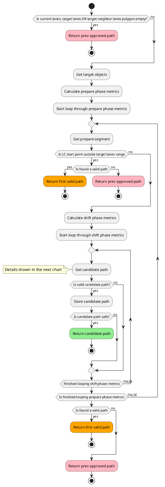
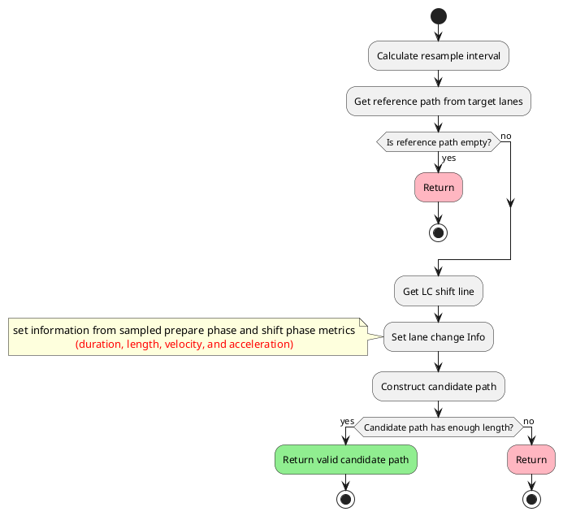
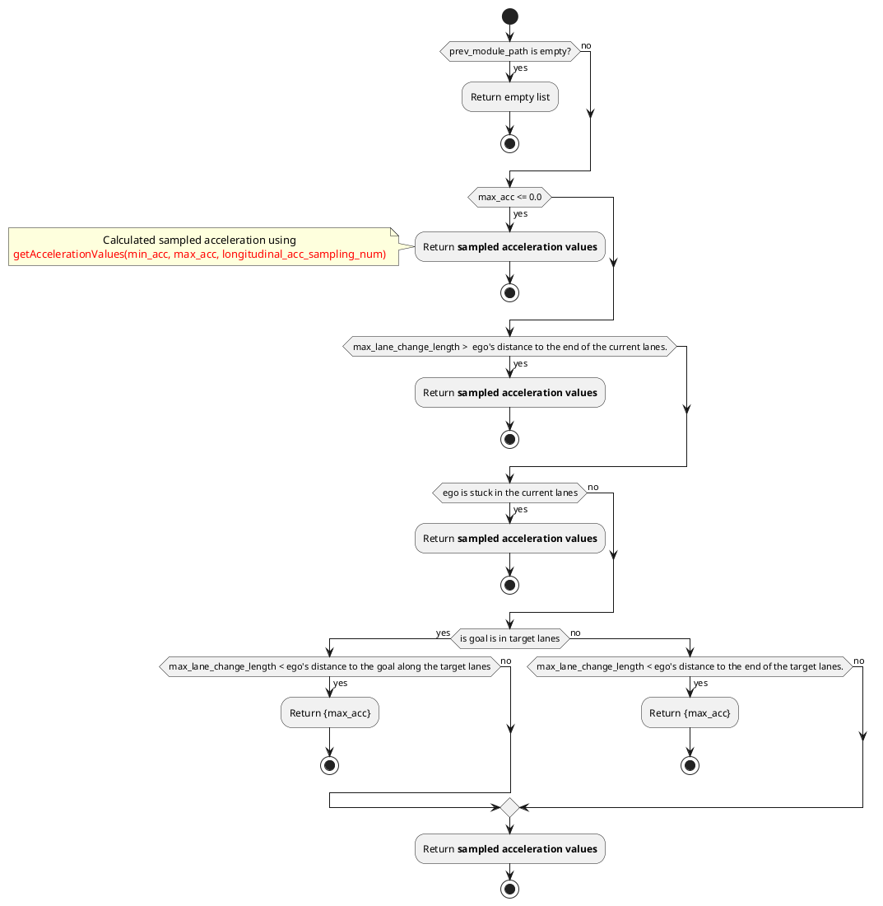
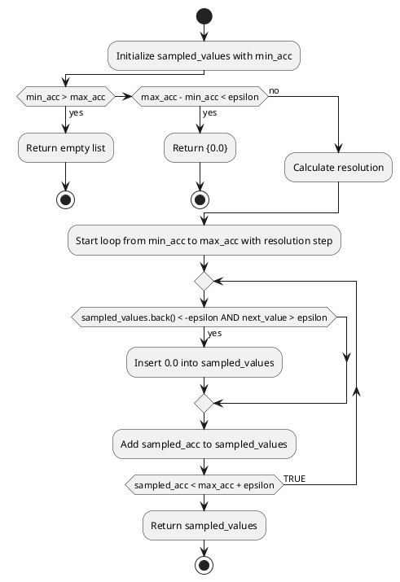
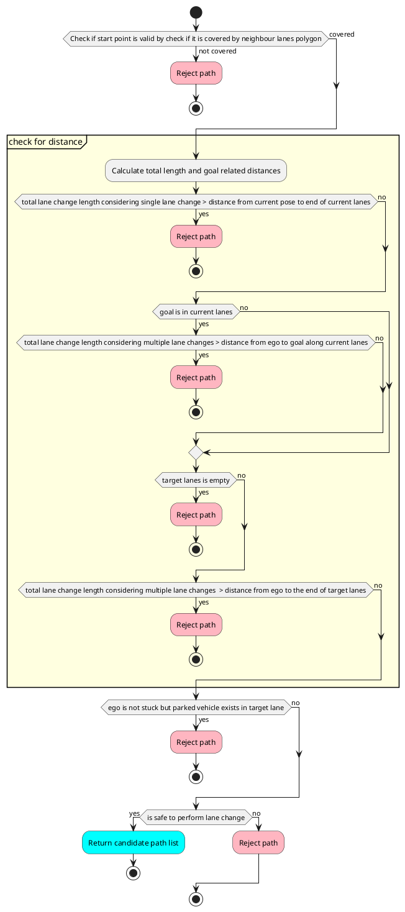
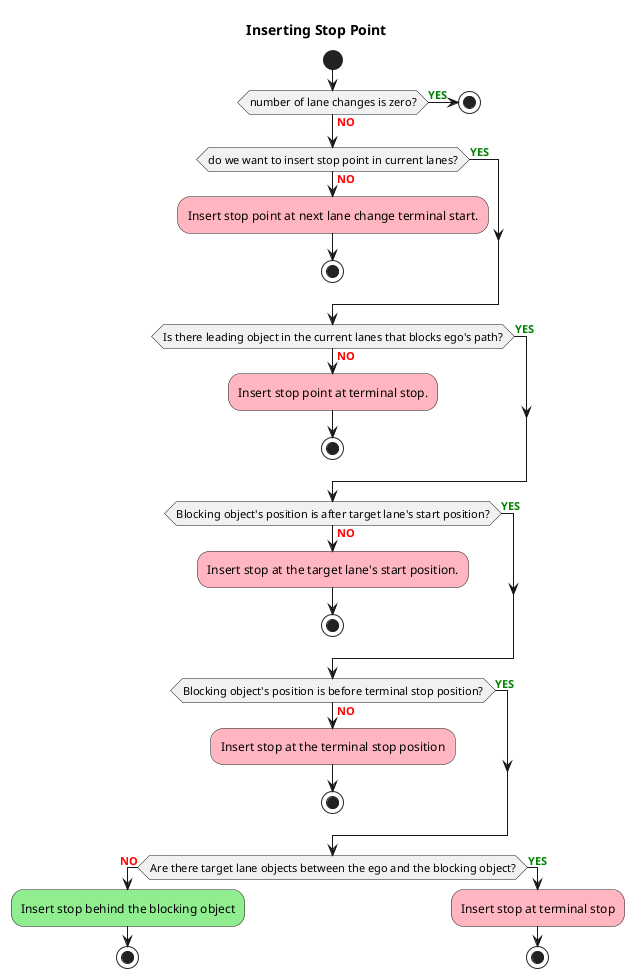
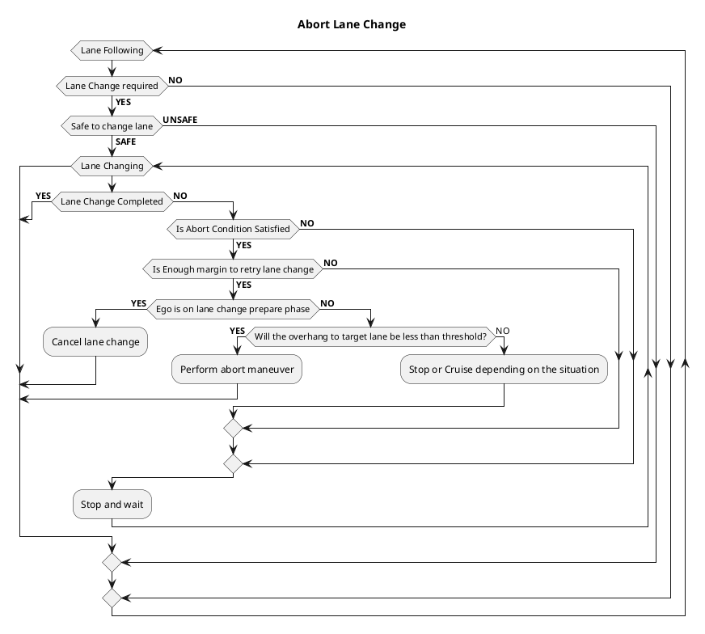
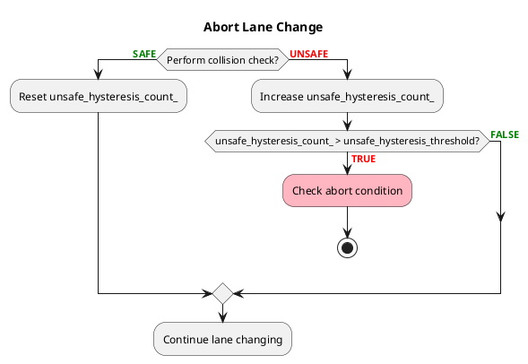
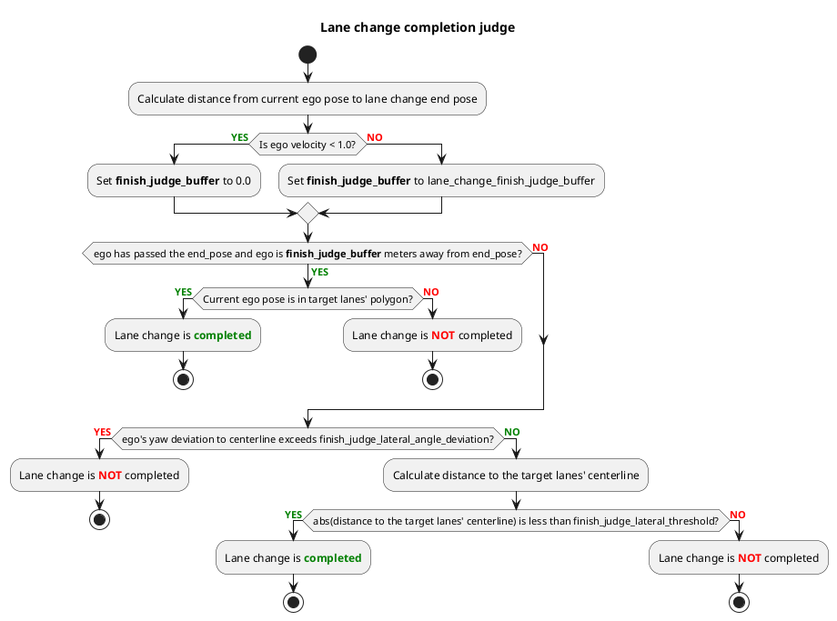

# 車線変更設計

車線変更モジュールは、車線変更が必要かつ安全に実行可能な場合にアクティベートされます。

## 車線変更要件

- 前提条件として、HDマップ内の車線境界のタイプが次のいずれかにする必要があります。
  - 破線路面表示: 車線変更が両方向で許可されています。
  - 左側が破線で右側は実線: 車線変更は左から右に許可されています。
  - 右側が破線で左側が実線: 車線変更は右から左に許可されています。
  - `allow_lane_change` タグが `true` に設定されています
- 車線変更リクエスト条件の期間
  - 自車が `preferred_lane` 上にありません。
  - 自車が信号機に近づいていません (条件はパラメータ化されています)。
  - 自車が横断歩道に近づいていません (条件はパラメータ化されています)。
  - 自車が交差点に近づいていません (条件はパラメータ化されています)。
- 車線変更準備条件
  - 車線変更の経路が他の可動物体と衝突しない (以下の図を参照)
  - 車線変更候補経路はオペレーターによって承認されている。

## 車線変更候補経路の生成

車線変更候補経路は、準備と車線変更の2つのフェーズに分けられます。以下の図は車線変更候補経路の各フェーズを示しています。


以下のグラフは、車線変更の候補経路をサンプリングするプロセスを示しています。




以下の図では、有効な候補経路の生成プロセスを示しています。




### 準備フェーズ

準備軌道とは候補パスの中で最初で、自車位置に沿って生成される直線部分です。準備軌道の長さは、以下のように計算します。


```C++
lane_change_prepare_distance = current_speed * lane_change_prepare_duration + 0.5 * deceleration * lane_change_prepare_duration^2
```

準備段階では、残り距離が`lane_change_search_distance`以下になるとウインカーが作動します。

### レーン変更の段階

レーン変更の段階は、自車の現在の車線から目標の車線に移動するシフトパスで構成されています。レーン変更の段階の総距離を以下に示します。レーン変更の段階では、自車は一定速度で走行します。


```C++
lane_change_prepare_velocity = std::max(current_speed + deceleration * lane_change_prepare_duration, minimum_lane_changing_velocity)
lane_changing_distance = lane_change_prepare_velocity * lane_changing_duration
```

`backward_length_buffer_for_end_of_lane` は、ブレーキ時の遅れなどの制御または機械的な遅れなどの可能性のある遅延のため、ある程度のバッファーを追加するために追加されました。

#### 候補パスサンプルの複数（縦方向加速度）

レーン変更速度は、自我車両の現在の速度の影響を受けます。高速は、より長い準備時間とレーン変更距離を必要とします。ただし、自我車両が減速する場合に備えて、レーン変更の軌道も計画する必要があります。自我車両が減速すると仮定する候補パスを計算するには、事前決定された減速値を `prepare_length`、`prepare_velocity`、および `lane_changing_length` の計算式に代入します。

事前決定された縦方向加速度値は、`longitudinal_acceleration = maximum_longitudinal_acceleration` から開始されるセットと、`longitudinal_acceleration = -maximum_longitudinal_deceleration` に達するまで `longitudinal_acceleration_resolution` ずつ減少するセットです。`maximum_longitudinal_acceleration` と `maximum_longitudinal_deceleration` の両方が、`common.param` ファイルで `normal.min_acc` として定義されているように計算されます。


```C++
maximum_longitudinal_acceleration = min(common_param.max_acc, lane_change_param.max_acc)
maximum_longitudinal_deceleration = max(common_param.min_acc, lane_change_param.min_acc)
```

ここで、`common_param` は車両の一般的な最大縦加速度および最大減速度を定義する車両の一般的なパラメータです。一方、`lane_change_param` には車線変更モジュールの最大縦加速度および最大減速度があります。たとえば、ユーザーが `common_param.max_acc=1.0` および `lane_change_param.max_acc=0.0` を設定すると、`maximum_longitudinal_acceleration` は `0.0` となり、車線変更フェーズで車線変更は加速しません。

`longitudinal_acceleration_resolution` は次によって決定されます。


```C++
longitudinal_acceleration_resolution = (maximum_longitudinal_acceleration - minimum_longitudinal_acceleration) / longitudinal_acceleration_sampling_num
```

`現在の速度` が `最低車線変更速度` より小さい場合、車両は速度を `最低車線変更速度` まで加速する必要があることに注意してください。したがって、縦加速度は正の値（減速しない）になります。

グラフは縦加速度の値がサンプリングされる条件を示しています。




このドキュメントでは、縦断加速度をサンプリングするプロセスについて説明します。




次の図は `longitudinal_acceleration_sampling_num = 4` の場合を示しています。`maximum_deceleration = 1.0` とすると、`a0 == 0.0 == 減速なし`、`a1 == 0.25`、`a2 == 0.5`、`a3 == 0.75`、`a4 == 1.0 == maximum_deceleration` となります。`a0` は自車が減速しない場合の想定される車線変更軌跡であり、`a1` の経路は自車が `0.25 m/s^2` で減速する場合の想定される車線変更軌跡です。


どの経路が選択されるかは、妥当性と衝突判定によって異なります。

#### 候補経路サンプル複数（横断加速度）

縦断加速度のサンプルに加え、横断加速度の値を調整することで車線変更経路のサンプリングも行います。横断加速度は車線変更の持続時間に影響するため、横断加速度の値が低いと車線変更経路が長くなり、横断加速度の値が高いと車線変更経路が短くなります。これにより、車線変更の余裕が少ない場合に横断加速度を増加させることで、車線変更モジュールはより短い車線変更経路を生成できます。

最大横断加速度と最小横断加速度は、車線変更パラメータファイルでマップとして定義されています。横断加速度の範囲は、マップ内の値を線形補間することで各速度について決定されます。次のようなマップがあるとします。

## 自動運転ソフトウェア設計仕様

### Overview

このドキュメントは、Autowareの自動運転ソフトウェアの設計仕様を定義します。ここでは、Planningコンポーネントの動作を定義します。

### Planningコンポーネント

Planningコンポーネントは、周囲環境を認識し、現在の位置を考慮して、車両の安全で効率的な経路を計画します。Planningコンポーネントの主な機能を次に示します。

- **経路生成:** 目的地を考慮した、安全で最適な経路の生成。
- **障害物回避:** 障害物を検出し、安全に回避するための経路の調整。
- **速度制御:** 目標速度の維持と速度制限の遵守のための速度制御。

### 設計仕様

#### 経路生成

**経路生成の制約条件:**

- 車両の物理的制約（速度、加速度、旋回限界など）を遵守する。
- 交通規則と法規に従う。
- 障害物を安全に回避する。

**経路生成パラメータ:**

次のパラメータは、経路生成アルゴリズムに影響を与えます。

- `post resampling`後の距離
- `post resampling`後のHeading
- `post resampling`後の旋回角度

**経路生成アルゴリズム:**

経路生成アルゴリズムは、さまざまな技術を使用できます（例：最適化、グラフ探索）。アルゴリズムは、上記の制約条件とパラメータを満たす経路を生成する必要があります。

#### 障害物回避

**障害物検出:**

Planningコンポーネントは、センサーデータを使用して障害物を検出します（例：LiDAR、カメラ）。検出された障害物は、タイプ、サイズ、位置で分類されます。

**障害物回避アルゴリズム:**

障害物回避アルゴリズムは、検出された障害物を考慮して、経路を安全に調整します。アルゴリズムは、障害物との衝突を回避しながら、元の経路からの逸脱を最小限に抑える必要があります。

#### 速度制御

**速度制御の制約条件:**

- 車両のマキシマム速度と加速/減速能力を遵守する。
- 速度制限に従う。
- 安全で快適な運転体験を提供する。

**速度制御パラメータ:**

次のパラメータは、速度制御アルゴリズムに影響を与えます。

- 自車位置
- 目標速度
- 速度逸脱量
- 加速度逸脱量

**速度制御アルゴリズム:**

速度制御アルゴリズムは、車両の速度を制御するために使用されます。アルゴリズムは、上記の制約条件とパラメータを満たす必要があります。

#### その他の仕様

**安全対策:**

Planningコンポーネントは、次の安全対策を実装する必要があります。

- **障害物検出の冗長性:** 衝突を回避するために、複数のセンサーを使用します。
- **経路の検証:** 経路が安全で妥当であることを検証します。
- **異常検出:** 予期しない動作を検出し、車両を安全な状態に停止させます。

**効率性:**

Planningコンポーネントは、効率的に動作し、リアルタイムの要件を満たす必要があります。

**拡張性:**

Planningコンポーネントは、将来の機能拡張や改善のために設計されています。

このケースでは、自車位置の現在の速度が 3.0 であるとき、最小と最大の横加速度はそれぞれ 0.25 と 0.4 になります。この値は、最小と最大の横加速度値を提供するマップの 2 行目と 3 行目を線形補間することで得られます。

この範囲内で、自車位置の横加速度をサンプリングします。縦加速度のサンプリングに使用された方法と同様、横加速度の分解能 (lateral_acceleration_resolution) は以下の方法で決定されます。


```C++
lateral_acceleration_resolution = (maximum_lateral_acceleration - minimum_lateral_acceleration) / lateral_acceleration_sampling_num
```

#### 候補パス有効性チェック

候補パスは、以下の条件を満たす場合、有効とみなされます。

1. 自車位置から現在の車線の終わりまでの距離は、車線変更一回分を完了するには十分である。
2. 自車位置から現在の車線に沿った目標までの距離は、複数の車線変更を完了するには十分である。
3. 自車位置から目標車線の終わりまでの距離は、複数の車線変更を完了するには十分である。
4. 自車位置から次の規制要素までの距離は、車線変更一回分を完了するには十分である。
5. 駐車車両を通過してから車線変更を完了可能である。
6. 車線変更を実行するのが安全とみなされる。

以下のフローチャートは、有効性チェックを示しています。




#### Candidate Path's Safety check

[安全チェックユーティリティの説明](../autoware_behavior_path_planner_common/docs/behavior_path_planner_safety_check.md)を参照

#### オブジェクトの選択と分類

まず、ターゲットオブジェクトをターゲットレーンの障害物、現在のレーンの障害物、および他のレーンの障害物に分割します。ターゲットレーンは、レーン変更後に自車が到達するレーンを示しており、現在のレーンとはレーン変更前の自車が走行中の現在のレーンを意味します。他のレーンは、ターゲットレーンと現在のレーンに属さないレーンです。次の図は、各レーンのオブジェクトを示しています。`check_objects_on_current_lanes`フラグと`check_objects_on_other_lanes`フラグを変更することにより、安全チェックから現在のレーンと他のレーンのオブジェクトを除外できることに注意してください。


さらに、信号で待機している車両の後ろでレーン変更を行うために、信号付近の停止している車両に対する安全チェックをスキップします。駐車車両の検出に関する説明は、[回避モジュールのドキュメント](../autoware_behavior_path_static_obstacle_avoidance_module/README.md)に記載されています。

ターゲットレーンの検出範囲は、ターゲットレーンの境界を越えるオブジェクトを検出できるように元の境界を超えて拡張できます。

<div align="center">
  <table>
    <tr>
      <td>
        <div style="text-align: center;">
          <div style="color: black; font-size: 20px; margin-bottom: 10px;">レーン拡張なし</div>
          
        </div>
      </td>
      <td>
        <div style="text-align: center;">
          <div style="color: black; font-size: 20px; margin-bottom: 10px;">レーン拡張あり</div>
          
        </div>
      </td>
    </tr>
  </table>
</div>

##### オブジェクトフィルタリング

```plantuml
@startuml
skinparam defaultTextAlignment center
skinparam backgroundColor #WHITE

title NormalLaneChange::filterObjects Method Execution Flow

start

group "Filter Objects by Class" {
while (has not finished iterating through predicted object list) is (TRUE)
  if (current object type != param.object_types_to_check?) then (TRUE)
  #LightPink:Remove current object;
else (FALSE)
  :Keep current object;
endif
end while
end group

if (predicted object list is empty?) then (TRUE)
  :Return empty result;
  stop
else (FALSE)
endif

group "Filter Oncoming Objects" #PowderBlue {
while (has not finished iterating through predicted object list?) is (TRUE)
if (object's yaw with reference to ego's yaw difference < 90 degree?) then (TRUE)
  :Keep current object;
else (FALSE)
if (object is stopping?) then (TRUE)
  :Keep current object;
else (FALSE)
  #LightPink:Remove current object;
endif
endif
endwhile
end group

if (predicted object list is empty?) then (TRUE)
  :Return empty result;
  stop
else (FALSE)
endif

group "Filter Objects By Lanelets" #LightGreen {

while (has not finished iterating through predicted object list) is (TRUE)
  :Calculate lateral distance diff;
  if (Object in target lane polygon?) then (TRUE)
    if (lateral distance diff > half of ego's width?) then (TRUE)
      if (Object's physical position is before terminal point?) then (TRUE)
        :Add to target_lane_objects;
      else (FALSE)
      endif
    else (FALSE)
    endif
  else (FALSE)
  endif

  if (Object overlaps with backward target lanes?) then (TRUE)
    :Add to target_lane_objects;
  else (FALSE)
    if (Object in current lane polygon?) then (TRUE)
      :Add to current_lane_objects;
    else (FALSE)
      :Add to other_lane_objects;
    endif
  endif
end while

:Return target lanes object,  current lanes object and other lanes object;
end group

:Generate path from current lanes;

if (path empty?) then (TRUE)
  :Return empty result;
  stop
else (FALSE)
endif

group "Filter Target Lanes' objects" #LightCyan {

while (has not finished iterating through target lanes' object list) is (TRUE)
  if(velocity is within threshold?) then (TRUE)
  :Keep current object;
  else (FALSE)
    if(object is ahead of ego?) then (TRUE)
      :keep current object;
    else (FALSE)
      #LightPink:remove current object;
    endif
   endif
endwhile
end group

group "Filter Current Lanes' objects"  #LightYellow {

while (has not finished iterating through current lanes' object list) is (TRUE)
  if(velocity is within threshold?) then (TRUE)
    if(object is ahead of ego?) then (TRUE)
      :keep current object;
    else (FALSE)
      #LightPink:remove current object;
    endif
    else (FALSE)
      #LightPink:remove current object;
   endif
endwhile
end group

group "Filter Other Lanes' objects"  #Lavender {

while (has not finished iterating through other lanes' object list) is (TRUE)
  if(velocity is within threshold?) then (TRUE)
    if(object is ahead of ego?) then (TRUE)
      :keep current object;
    else (FALSE)
      #LightPink:remove current object;
    endif
    else (FALSE)
      #LightPink:remove current object;
   endif
endwhile
end group

:Transform the objects into extended predicted object and return them as lane_change_target_objects;
stop

@enduml
```




##### prepareフェーズでの衝突確認

自車位置をターゲット車両の直前まで十分に確保してから、車線変更しようとすることがあります。この動作を実現するには、フラグ`enable_collision_check_at_prepare_phase`を有効にすることができます。次の画像は、`false`と`true`の場合の違いを示しています。


パラメータ`prepare_phase_ignore_target_speed_thresh`は、停止または非常に低速で走行するオブジェクトなど、速度が特定の閾値未満のターゲットに対してprepareフェーズの衝突チェックを無視するように設定できます。

#### 車線がブロックされている場合と複数の車線変更

他の車両と一緒に公道を走行する場合は、車線変更が実行できないシナリオがあります。例えば、近隣の車線に進入車両があるため、候補パスが安全でない場合が考えられます。その場合、自車位置は車線変更することができず、ゴールに到達することはできません。そのため、自車位置は特定の距離で早めに停止し、近隣の車線が安全と評価されるまで待つ必要があります。最小停止距離は、シフトの長さと車線変更の最小速度から計算できます。


```C++
lane_changing_time = f(shift_length, lat_acceleration, lat_jerk)
minimum_lane_change_distance = minimum_prepare_length + minimum_lane_changing_velocity * lane_changing_time + lane_change_finish_judge_buffer
```

以下の図は、複数車線変更時に車線が塞がれている場合を示しています。


### 停車動作

自車の停車動作は、必要な車線変更回数、障害物の有無、および車線変更計画に関する障害物の位置など、さまざまな要素に基づいて決定されます。目的は、さまざまな交通状況に適応しながら、安全かつ効果的な車線変更を可能にする適切な停止地点を選択することです。

次のフローチャートとサブセクションでは、障害物が前方にある場合に停止地点を挿入する場所の決定条件について説明します。




#### 自車の前方に障害物がある場合の停止位置

自車が前方に障害物に遭遇した場合は、車線変更の可能性に備えて安全な距離を保ちながら停止します。正確な停止位置は、ターゲット車線が空いているかどうかや、車線変更が遅れる必要があるかに左右されます。以下に、さまざまな停止シナリオの処理方法を示します。

##### 車線変更終了間近の場合

ターゲット車線に障害物があるかどうかに関係なく、自車は前方の障害物から安全な距離を保ちながら停止し、車線変更に十分なスペースが確保されます。


##### 自車が車線変更終了間近でない場合

自車は前方の障害物から安全な距離を保ちながら停止し、車線変更に十分なスペースが確保されます。


#### 車線変更セクションに障害物がある場合の自車停止位置

ターゲット車線の車線変更セクションに障害物がある場合、自車は通常の車線変更距離を維持せず、前方の障害物に近い場所で停止します。

##### 車線変更終了間近の場合

ターゲット車線に障害物があるかどうかに関係なく、自車は前方の障害物から安全な距離を保ちながら停止し、車線変更を可能にします。


##### 車線変更終了間近でない場合

ターゲット車線の車線変更セクションに障害物がない場合、自車は前方の障害物から安全距離を確保しながら停止し、車線変更に対応します。


ターゲット車線の車線変更セクション内に障害物がある場合、自車は通常の車線変更に必要な距離を維持せず、前方の障害物に近い場所で停止します。


#### ターゲット車線が遠い場合

車線変更用のターゲット車線が遠く、現在の車線に隣接していない場合、自車は車線変更用の通常の距離を維持する必要がないため、前方の障害物に近づいて停止します。


### スタック時の車線変更

自車が停止していて、次のいずれかの条件を満たす場合、スタックしていると見なされます。

- 現在の車線の前方に障害物がある
- 自車が現在の車線の末端に位置している

この場合、通常の時間と比較して車線変更の安全確認は緩和されます。
詳細は、「車線変更時の衝突確認」の「stuck」セクションを参照してください。
この機能を実現するために、前述のセクションで前進する障害物に対してある程度のマージンを保って停止する機能が実行されます。

### 車線変更に関する制御

交差点や信号で車線変更を制御する場合、車線変更モジュールはそれらの付近で無効になります。
交差点や信号で車線変更を制御するには、`regulation.crosswalk`, `regulation.intersection`または`regulation.traffic_light`を`true`に設定します。
自車がスタックした場合、スタックを避けるため車線変更が交差点/交差点で有効になります。
自車が`stuck_detection.stop_time`秒以上停止すると、スタックと見なされます。
自車の速度が`stuck_detection.velocity`未満の場合、停止していると見なされます。

### 車線変更の中断

中断プロセスは、取り消し、中断、停止/巡航の3つの異なる結果をもたらす可能性があります。

以下は、車線変更の中断チェックの流れを示しています。




車線変更中は、自車減速を考慮した安全確認が実施され、`cancel.deceleration_sampling_num` 個の減速パターンの安全確認を実施し、すべての減速パターンで中止条件が満たされた場合は、車線変更がキャンセルされます。

安全と危険な状態の交互によって発生する車線変更経路の振動に対する予防策として、中止またはキャンセル操作を実行する前に、ヒステリシスカウントチェックが追加で実装されています。安全でない場合は、`unsafe_hysteresis_count_` がインクリメントされ、`unsafe_hysteresis_threshold` と比較されます。これを超えると中止条件のチェックが促され、最近の安全評価を考慮に入れて決定が下されるようにします（上のフローチャートで示されています）。このメカニズムは意思決定を安定させ、一時的な安全でない状態による急激な変化を防ぎます。




## キャンセル

車線変更軌道が安全ではないと評価された場合、自車位置が現在の車線をまだ離れていない場合、軌道がリセットされ、自車位置は車線フォロー操作を再開します。

`enable_on_prepare_phase` を `true` に設定することでこの関数を有効化できます。

次の図はキャンセル処理を示しています。


## 中断

自車位置が既に現在の車線を離れているとします。その場合、パスをキャンセルすることは危険であり、自車位置が急激に進行方向を変えることになります。この場合、進行方向の変更を最小限に抑えながら、自車位置が現在のパスに戻ることを可能にする軌道を計画する必要があります。この場合、車線変更モジュールは中断パスを生成します。次の図は中断パスの例を示しています。この関数は周囲にある物体の有無やその反応を確認しないため、安全な中断処理が保障されません。`enable_on_prepare_phase` と `enable_on_lane_changing_phase` の両方を `true` に設定することで、この関数を手動で有効化できます。この機能を動作させるには、`max_lateral_jerk` パラメータを大きな値に設定する必要があります。


## 停止/巡航

この最後の動作は、自車位置が現在の車線を離れた場合にも発生します。中断関数が無効化されているか、中断がもはや不可能な場合、自車位置は停止するか障害物巡航モードに移行しようとします。これらの重要なシナリオ中に発生する予期しない動作により、このモジュールは安全な操作を保障しません。次の図は状況を示しています。


## 車線変更完了チェック

自車位置が車線変更に成功したかどうかを判断するには、縦方向基準または横方向基準のいずれかが満たされている必要があります。

縦方向基準では、自車位置は車線変更の終端ポーズを通過し、その距離が `finish_judge_buffer` 内にある必要があります。モジュールはその後、自車位置が目標車線にあるかどうかを確認します。true の場合、モジュールは success を返します。このチェックにより、プランナーマネージャーが自車位置の現在のポーズに基づいてルートレーンレットを正しく更新します。このチェックがない場合、自車位置が障害物を回避しながら車線変更を行っていて現在のポーズが元の車線にある場合、プランナーマネージャーはルートレーンレットを元の車線として設定します。これにより、自車位置はもう一度車線変更を実行することになります。目標車線チェックがあれば、自車位置が目標車線にあることが確認され、プランナーマネージャーはルートレーンレットを正しく更新できます。

縦方向基準が満たされない場合、モジュールは横方向基準を評価します。横方向基準では、自車位置は目標車線のセンターラインから `finish_judge_lateral_threshold` 距離以内にある必要があり、角度偏差が `finish_judge_lateral_angle_deviation` 度以内である必要があります。角度偏差チェックにより、急激な操舵がないことが保証されます。角度偏差が大きすぎると、自車位置の向きがセンターラインから大きく逸脱し、軌道追従器が積極的に操舵を修正してセンターラインに戻ろうとします。角度偏差の値を可能な限り小さくすることで、この問題を回避できます。

車線変更完了の判定プロセスは、次の図に示します。




## パラメータ

### 必須車線変更パラメータ

以下のパラメータは [lane_change.param.yaml](https://github.com/autowarefoundation/autoware_launch/blob/main/autoware_launch/config/planning/scenario_planning/lane_driving/behavior_planning/behavior_path_planner/lane_change/lane_change.param.yaml) で構成できます。

| 名前 | 単位 | 型 | 説明 | デフォルト値 |
|---|---|---|---|---|
| `backward_lane_length` | [m] | double | 車線変更のターゲット車線を後方からチェックする長さ | 200.0 |
| `prepare_duration` | [m] | double | 自動運転車が車線変更の準備をするための時間 | 4.0 |
| `backward_length_buffer_for_end_of_lane` | [m] | double | 車線変更を開始するために自動運転車が十分な距離を確保するための、車線末端のバッファ | 3.0 |
| `backward_length_buffer_for_blocking_object` | [m] | double | 車両の正面に障害物がある場合に車線変更を開始するために自動運転車が十分な距離を確保するための、車線末端のバッファ | 3.0 |
| `backward_length_from_intersection` | [m] | double | 最後の交差点からの距離のしきい値。この距離以内では車線変更経路が無効またはキャンセルされる | 5.0 |
| `lane_change_finish_judge_buffer` | [m] | double | 車線変更プロセスの完了を確認するために使用される追加のバッファ | 2.0 |
| `lane_changing_lateral_jerk` | [m/s3] | double | 車線変更経路を生成するための横方向加速度値 | 0.5 |
| `minimum_lane_changing_velocity` | [m/s] | double | 車線変更プロセス中の最小速度 | 2.78 |
| `prediction_time_resolution` | [s] | double | 障害物の経路補間と衝突チェックのための時間分解能 | 0.5 |
| `longitudinal_acceleration_sampling_num` | [-] | int | 縦方向加速度の影響を受ける車線変更可能な経路の数 | 3 |
| `lateral_acceleration_sampling_num` | [-] | int | 横方向加速度の影響を受ける車線変更可能な経路の数 | 3 |
| `object_check_min_road_shoulder_width` | [m] | double | 車線に路側帯がない場合、路側帯と見なされる幅 | 0.5 |
| `object_shiftable_ratio_threshold` | [-] | double | 中心線からこの距離比内にある車両は、駐車車両から除外される | 0.6 |
| `min_length_for_turn_signal_activation` | [m] | double | 自動運転車が車線変更の最小距離にこの長さまで近づいたら、ターンシグナルが有効になる | 10.0 |
| `length_ratio_for_turn_signal_deactivation` | [-] | double | 自動運転車が車線変更の終了点にこの距離比まで近づいたら、ターンシグナルが無効になる | 0.8 |
| `max_longitudinal_acc` | [-] | double | 車線変更の最大縦方向加速度 | 1.0 |
| `min_longitudinal_acc` | [-] | double | 車線変更の最大縦方向減速度 | -1.0 |
| `lateral_acceleration.velocity` | [m/s] | double | 横方向加速度計算のための基準速度（参照テーブル） | [0.0, 4.0, 10.0] |
| `lateral_acceleration.min_values` | [m/ss] | double | 速度に対応する最小横方向加速度値（参照テーブル） | [0.4, 0.4, 0.4] |
| `lateral_acceleration.max_values` | [m/ss] | double | 速度に対応する最大横方向加速度値（参照テーブル） | [0.65, 0.65, 0.65] |

### 車線変更完了判定パラメータ

車線変更完了を判定するために、以下のパラメータを使用します。

| 名称                                   | 単位  | タイプ   | 説明                                                                                                            | デフォルト値 |
| :------------------------------------- | ----- | ------ | ---------------------------------------------------------------------------------------------------------------------- | ------------- |
| `lane_change_finish_judge_buffer`      | [m]   | double | レーン変更終了姿勢からの縦方向距離                                                                                 | 2.0           |
| `finish_judge_lateral_threshold`       | [m]   | double | ターゲットレーンの中心線からの横方向距離。`finish_judge_lateral_angle_deviation`と併用する                       | 0.1           |
| `finish_judge_lateral_angle_deviation` | [度] | double | ターゲットレーンの中心線に対する自車角度偏差。`finish_judge_lateral_threshold`と併用する                       | 2.0           |

### 車線変更規制

| 名称                      | 単位 | タイプ    | 説明                                                                               | デフォルト値 |
| :------------------------- | ---- | ------- | ----------------------------------------------------------------------------------- | ------------- |
| `regulation.crosswalk`     | [-]  | ブール値 | 横断歩道間での車線変更を許可する                                                  | true          |
| `regulation.intersection`  | [-]  | ブール値 | 交差点間での車線変更を許可する                                                     | true          |
| `regulation.traffic_light` | [-]  | ブール値 | 信号間での車線変更の実行を許可する                                                  | true          |

### 自車位置検出

---

障害物が自車を完全に包囲して動作不可能にした状態を検出します。

| 名称                        | 単位  | 型   | 説明                                         | 初期値 |
| :-------------------------- | ----- | ------ | --------------------------------------------------- | ------------- |
| `stuck_detection.velocity`  | [m/s] | double | 自車位置の静止検出における速度しきい値  | 0.1           |
| `stuck_detection.stop_time` | [秒]   | double | 自車位置の静止検出における停止時間しきい値 | 3.0           |

### 衝突チェック

#### 目標オブジェクト

| 名前                       | 単位 | 型      | 説明                                               | デフォルト値 |
| :------------------------- | ---- | ------- | -------------------------------------------------- | ------------- |
| `target_object.car`        | [-]  | boolean | 安全チェックに自動車オブジェクトを含める           | true          |
| `target_object.truck`      | [-]  | boolean | 安全チェックにトラックオブジェクトを含める         | true          |
| `target_object.bus`        | [-]  | boolean | 安全チェックにバスオブジェクトを含める           | true          |
| `target_object.trailer`    | [-]  | boolean | 安全チェックにトレーラーオブジェクトを含める       | true          |
| `target_object.unknown`    | [-]  | boolean | 安全チェックに不明オブジェクトを含める             | true          |
| `target_object.bicycle`    | [-]  | boolean | 安全チェックに自転車オブジェクトを含める           | true          |
| `target_object.motorcycle` | [-]  | boolean | 安全チェックにオートバイオブジェクトを含める       | true          |
| `target_object.pedestrian` | [-]  | boolean | 安全チェックに歩行者オブジェクトを含める           | true          |

#### common

| 名称                                        | 単位 | タイプ   | 説明                                                                                                                                 | デフォルト値 |
| :---------------------------------------- | ---- | ------ | ------------------------------------------------------------------------------------------------------------------------------------------- | ------------- |
| `safety_check.lane_expansion.left_offset`  | [m]  | 倍精度浮動小数点 | 検出領域の左側の境界を拡大し、以前は左側にあったオブジェクトの検出とターゲットへの登録を可能にする。   | 0.0           |
| `safety_check.lane_expansion.right_offset` | [m]  | 倍精度浮動小数点 | 検出領域の右側の境界を拡大し、以前は右側にあったオブジェクトの検出とターゲットへの登録を可能にする。 | 0.0           |

#### 追加パラメータ

| Name                                                    | Unit  | Type    | Description                                                                                                                                                                                             | Default value |
| :------------------------------------------------------- | ----- | ------- | -------------------------------------------------------------------------------------------------------------------------------------------------------------------------------------------------------- | ------------- |
| `enable_collision_check_for_prepare_phase.general_lanes` | [-]   | boolean | Planningコンポーネントの準備フェーズから衝突チェックを実行します（交差点など、他の設定で明示的にカバーされていない状況の場合）。`false`の場合、衝突チェックは車線変更フェーズのみで評価されます。 | false         |
| `enable_collision_check_for_prepare_phase.intersection`  | [-]   | boolean | 自車が交差点にいる場合、準備フェーズから衝突チェックを実行します。`false`の場合、衝突チェックは車線変更フェーズのみで評価されます。                                                | true          |
| `enable_collision_check_for_prepare_phase.turns`         | [-]   | boolean | 自車が旋回方向タグのあるLaneletにいる場合、準備フェーズから衝突チェックを実行します。`false`の場合、衝突チェックは車線変更フェーズのみで評価されます。                               | true          |
| `prepare_phase_ignore_target_speed_thresh`               | [m/s] | double  | 設定された値より小さいオブジェクトの速度について、準備フェーズでの衝突チェックを無視します。`enable_collision_check_at_prepare_phase`が`true`である必要があります。         | 0.1           |
| `check_objects_on_current_lanes`                         | [-]   | boolean | trueの場合、車線変更モジュールは衝突評価を実行する際、現在の車線上のオブジェクトをチェックします。                                                                                               | false         |
| `check_objects_on_other_lanes`                           | [-]   | boolean | trueの場合、車線変更モジュールは衝突評価を実行する際、他の車線上のオブジェクトを含めます。                                                                                               | false         |
| `use_all_predicted_path`                                 | [-]   | boolean | falseの場合、信頼度が最も高い予測パスのみを使用します。                                                                                                                                   | true          |
| `safety_check.collision_check_yaw_diff_threshold`        | [rad] | double  | RSSベースの衝突チェックを実行する際の自車とオブジェクト間の最大ヨー角差                                                                                                             | 3.1416        |

#### 車線変更経路が計算中の安全性制約

```
```

| 名称                                                       | 単位    | 型   | 説明                                                                                                                                                      | デフォルト値 |
| :--------------------------------------------------------- | ------- | ------ | -------------------------------------------------------------------------------------------------------------------------------------------------------------- | ------------- |
| `safety_check.execution.expected_front_deceleration`         | [m/s²] | double | 前方の車両が急ブレーキを行った場合の前方対象物の最大減速度。(\*1)                                                                                      | -1.0          |
| `safety_check.execution.expected_rear_deceleration`          | [m/s²] | double | 後方の車両が急ブレーキを行った場合の後方対象物の最大減速度。(\*1)                                                                                        | -1.0          |
| `safety_check.execution.rear_vehicle_reaction_time`          | [s]     | double | 前方車両の急ブレーキに気付いた時点からブレーキを踏むまでの後方車両の運転者の反応時間。                                                                  | 2.0           |
| `safety_check.execution.rear_vehicle_safety_time_margin`     | [s]     | double | 後方車両の運転者が急ブレーキを行ったときに完全停止状態になるまでの時間バッファ。                                                                         | 1.0           |
| `safety_check.execution.lateral_distance_max_threshold`      | [m]     | double | 2 つの対象物間の横方向距離が十分で、車線変更が安全かどうかを判断するために使用される横方向距離のしきい値。                                              | 2.0           |
| `safety_check.execution.longitudinal_distance_min_threshold` | [m]     | double | 2 つの対象物間の縦方向距離が十分で、車線変更が安全かどうかを判断するために使用される縦方向距離のしきい値。                                            | 3.0           |
| `safety_check.cancel.longitudinal_velocity_delta_time`       | [m]     | double | 予測された各時点での車両間の実際のギャップを計算するために使用される時間乗数（RSS 距離ではない）。                                                | 0.8           |

#### 停止または駐車車両に対する安全制約

| 名前                                                      | 単位    | 型     | 説明                                                                                                                                                    | デフォルト値 |
| :-------------------------------------------------------- | ------- | ------ | -------------------------------------------------------------------------------------------------------------------------------------------------------------- | ------------- |
| `safety_check.parked.expected_front_deceleration`         | [m/s^2] | double | 前走車が急ブレーキをかけたときの前方の物体の最大の減速度。(\*1)                                                                   | -1.0          |
| `safety_check.parked.expected_rear_deceleration`          | [m/s^2] | double | 後続車が急ブレーキをかけたときの後方の物体の最大の減速度。(\*1)                                                                     | -2.0          |
| `safety_check.parked.rear_vehicle_reaction_time`          | [s]     | double | 後続車のドライバーが、前走車の急ブレーキに気づいてからブレーキを踏むまでの反応時間。                                                            | 1.0           |
| `safety_check.parked.rear_vehicle_safety_time_margin`     | [s]     | double | 後続車のドライバーが急ブレーキをかけたときに完全に停止するための時間バッファ。                                                        | 0.8           |
| `safety_check.parked.lateral_distance_max_threshold`      | [m]     | double | 2つの物体間の横方向距離が十分かどうか、また車線変更が安全かどうかを判断するために使用される横方向距離のしきい値。                | 1.0           |
| `safety_check.parked.longitudinal_distance_min_threshold` | [m]     | double | 2つの物体間の縦方向距離が十分かどうか、また車線変更が安全かどうかを判断するために使用される縦方向距離のしきい値。                      | 3.0           |
| `safety_check.parked.longitudinal_velocity_delta_time`    | [m]     | double | 予測された各ポイントにおける車両間の実際のギャップを計算するために使用される時間乗数（RSS距離ではなく）。                                         | 0.8           |

##### 車線変更パスのキャンセルに対するセーフティ制約

| 名前 | ユニット | タイプ | 説明 | デフォルト値 |
|---|---|---|---|---|
| `safety_check.cancel.expected_front_deceleration` | [m/s^2] | double | 前方車両が急ブレーキをかけたときの前方車両の最大減速度。(＊1) | -1.0 |
| `safety_check.cancel.expected_rear_deceleration` | [m/s^2] | double | 後方車両が急ブレーキをかけたときの後方車両の最大減速度。(＊1) | -2.0 |
| `safety_check.cancel.rear_vehicle_reaction_time` | [s] | double | 前方車両の急ブレーキに気づいてブレーキを踏むまでの後方車両のドライバーの反応時間 | 1.5 |
| `safety_check.cancel.rear_vehicle_safety_time_margin` | [s] | double | 後方車両のドライバーが急ブレーキをかけたときに完全に停止するまでの時間バッファ | 0.8 |
| `safety_check.cancel.lateral_distance_max_threshold` | [m] | double | 2つの車両間の横距離が十分であり、車線変更が安全かどうかを判断するために使用される横距離のしきい値 | 1.0 |
| `safety_check.cancel.longitudinal_distance_min_threshold` | [m] | double | 2つの車両間の縦距離が十分であり、車線変更が安全かどうかを判断するために使用される縦距離のしきい値 | 2.5 |
| `safety_check.cancel.longitudinal_velocity_delta_time` | [m] | double | 各予測点での車両間の実際のギャップを計算するために使用される時間倍率（RSS距離ではない） | 0.6 |

##### 車両が動けなくなった場合にレーンチェンジパスの計算に使用​​される安全制約

| 名前                                                  | 単位 | タイプ | 説明                                                                                                                                                                | デフォルト値 |
| :---------------------------------------------------- | ----- | ------ | ----------------------------------------------------------------------------------------------------------------------------------------------------------------- | ------------ |
| `safety_check.stuck.expected_front_deceleration`      | [m/s^2] | double | 前方車両が急ブレーキを実行した場合の前方オブジェクトの最大減速度。(\*1)                                                                                | -1.0          |
| `safety_check.stuck.expected_rear_deceleration`       | [m/s^2] | double | 後方車両が急ブレーキを実行した場合の後方オブジェクトの最大減速度。(\*1)                                                                                | -1.0          |
| `safety_check.stuck.rear_vehicle_reaction_time`       | [s] | double | 後方車両の運転手が前方の車両の急ブレーキに気付く瞬間からブレーキを踏む瞬間までの反応時間。                                                               | 2.0           |
| `safety_check.stuck.rear_vehicle_safety_time_margin`  | [s] | double | 後方車両の運転手が急ブレーキを実行したときに完全に停止するためのタイムバッファ。                                                                                 | 1.0           |
| `safety_check.stuck.lateral_distance_max_threshold`   | [m] | double | 2つのオブジェクト間の横方向の距離が十分かどうか、および車線変更が安全かどうかを判断するために使用される横方向距離の閾値。                           | 2.0           |
| `safety_check.stuck.longitudinal_distance_min_threshold` | [m] | double | 2つのオブジェクト間の縦方向の距離が十分かどうか、および車線変更が安全かどうかを判断するために使用される縦方向距離の閾値。                              | 3.0           |
| `safety_check.stuck.longitudinal_velocity_delta_time` | [m] | double | 各予測ポイントでの車両間の実際のギャップを計算するために使用される時間乗数（RSS距離ではない）。                                                         | 0.8           |

(\*1) この値は負の値でなければなりません。

### 車線変更の中止

次のパラメータは `lane_change.param.yaml` で構成できます。

| 名称                                   | 単位    | タイプ    | 説明                                                                                                                | デフォルト値 |
| :------------------------------------- | ------- | ------- | ------------------------------------------------------------------------------------------------------------------- | ------------- |
| `cancel.enable_on_prepare_phase`       | [-]     | boolean | レーン変更のキャンセルを許可                                                                                         | true          |
| `cancel.enable_on_lane_changing_phase` | [-]     | boolean | レーン変更の中断を許可                                                                                         | false         |
| `cancel.delta_time`                    | [s]     | double  | センタラインに戻るステアリングを開始するのにかかる時間                                                           | 3.0           |
| `cancel.duration`                      | [s]     | double  | センタラインに戻るために要する時間                                                                               | 3.0           |
| `cancel.max_lateral_jerk`              | [m/sss] | double  | 中断パスの最大横方向ジャーク                                                                                   | 1000.0        |
| `cancel.overhang_tolerance`            | [m]     | double  | 車両ヘッドがこの許容距離を超えて車線境界を超えた場合、レーン変更のキャンセルは禁止される                   | 0.0           |
| `cancel.unsafe_hysteresis_threshold`   | [-]     | int     | 安全と不安全の決定の間の頻繁な切り替えを防ぐのに役立つしきい値                                              | 10            |
| `cancel.deceleration_sampling_num`     | [-]     | int     | レーン変更のキャンセルを安全にするためにチェックする 減速度パターンの数                                        | 5             |

### デバッグ

以下のパラメータは `lane_change.param.yaml` で設定できます。

| 名称 | 単位 | タイプ | 説明 | デフォルト値 |
| --- | --- | --- | --- | --- |
| `publish_debug_marker` | [-] | ブール型 | デバッグマーカーの公開を設定 | `false` |

## デバッグマーカーと可視化

デバッグマーカーを有効にするには、（再起動は不要です）を実行します。


```shell
ros2 param set /planning/scenario_planning/lane_driving/behavior_planning/behavior_path_planner lane_change.publish_debug_marker true

```

LaneChangeモジュール内の`publish_debug_marker`を`lane_change.param.yaml`で`true`に設定すれば、永続的に効果をもたらします（再起動が必要）。

次に、マーカーを追加します。


```shell
/planning/scenario_planning/lane_driving/behavior_planning/behavior_path_planner/debug/lane_change_left
```

## 自動運転ソフトウェアのドキュメント

### 車線変更戦略

#### 概要
この戦略では、車両の車線変更に関する予測、決定、実行のためのコンポーネントが提供されます。戦略は、環境内のオブジェクトに関する情報を考慮して、車線変更を実施するかどうかを決定します。

#### コンポーネント
- **Planning Planner**
  - 車両の軌道と車線変更の実行時間に関する情報を生成します。
- **Safety Checker**
  - 車両の周囲にある物体の安全性を評価し、車線変更が安全かどうかを判断します。
- **Supervisor**
  - PlannerとSafety Checkerからの情報を統合し、車線変更を実施するかどうかを決定します。

### 起動要件
この戦略を起動するには、次の情報を提供する必要があります。
- **自車位置**
- **周囲の物体の情報**
- **目標車線**

### 利用可能な情報
**rviz2**で利用できる情報。


**提供される情報:**
1. 自車と物体の関係、および安全チェック情報
2. 最新の安全チェック位置までの自車位置（補間）
3. オブジェクトの安全性（ポリゴンの色で表示：緑 = 安全、赤 = 安全でない）
4. 有効な候補パス
5. 車線変更の開始および終了位置

