# Lane Change design

The Lane Change module is activated when lane change is needed (Ego is not on preferred lane), and activation requirements are satisfied.

## Lane Change Requirements

### Prerequisites

The type of lane boundary in the HD map has to be one of the following:

- Dashed lane marking: Lane changes are permitted in both directions.
- Dashed marking on the left and solid on the right: Lane changes are allowed from left to right.
- Dashed marking on the right and solid on the left: Lane changes are allowed from right to left.
- `allow_lane_change` tags is set as `true`

### Activation Conditions

The lane change module will activate under the following conditions :

- The ego-vehicle is NOT on a `preferred_lane`.
- Distance to start of `target_lane` is less than `maximum_prepare_length`
- The ego-vehicle is NOT close to a regulatory element:
  - Distance to next regulatory element is greater than `maximum_prepare_length`.
  - Considers distance to traffic light. (If param `regulation.traffic_light` is enabled)
  - Considers distance to crosswalk. (If param `regulation.crosswalk` is enabled)
  - Considers distance to intersection. (If param `regulation.intersection` is enabled)

!!! warning

    If ego vehicle is stuck, lane change will be enabled near crosswalk/intersection. Ego is considered stuck if it stops more than `stuck_detection.stop_time`. Ego is considered to be stopping if its velocity is smaller than `stuck_detection.velocity`.

The following figure illustrates the logic for checking if lane change is required:

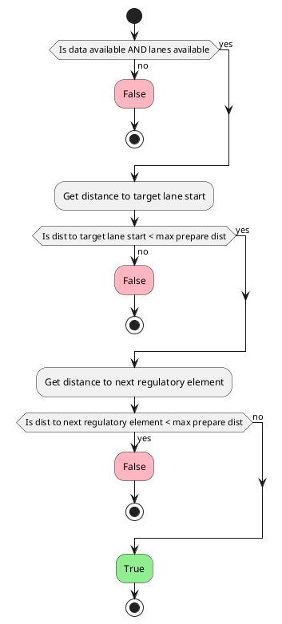

### Ready Conditions

- Valid lane change path is found.
- Lane change path is safe; does not collide with other dynamic objects.
- Lane change candidate path is approved by an operator.

## Implementation

Lane change module uses a sampling based approach for generating a valid and safe lane changing trajectory. The process for generating the trajectory includes object filtering, metrics sampling, candidate paths generation, and lastly candidate paths evaluation.
Additionally the lane change module is responsible for turn signal activation when appropriate, and inserting a stop point when necessary.

### Global Flowchart

The following diagram, illustrates the overall flow of the lane change module implementation.

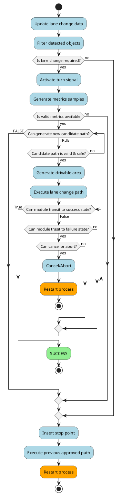

The lane change module first updates the necessary data for lane change such as lanes information and transient data. Then filters the detected objects to be used for safety evaluation (see [Object Filtering](#object-filtering)).

If the lane change requirements are met, the turn signal is activated and the lane change module will proceed to generating a candidate path. Lane change candidate paths are generated by sampling different metrics and evaluating the validity of the corresponding generated trajectory. More details can be found in [Generating Lane Change Candidate Path](#generating-lane-change-candidate-path);

When a valid candidate path is generated, a safety evaluation is conducted to check for any risk of collision or hindrance. The details of the safety evaluation can be found in [Safety Checks](#safety-checks).

Once a valid and safe candidate path is found, the drivable area is generated and the path is executed. While executing the lane change maneuver, the safety of the approved path is continuously monitored to ensure there is no chance of collision or other hindrance. If the approved path remains safe and completion checks are met (see [Lane Change Completion Checks](#lane-change-completion-checks)) the module will transit to **SUCCESS** state.
In case the approved path is deemed to be no longer safe, the lane change module will attempt to abort the lane change maneuver (see [Aborting Lane Change](#aborting-lane-change)). When the lane change maneuver is aborted successfully the module will transit to **FAILURE** state, and the process is restarted.

If the lane change module fails to find a valid and safe candidate path, the module will continue executing the previously approved path and insert a stop point along the path where appropriate, for more details refer to [Stopping Behavior](#stopping-behavior).

### Generating Lane Change Candidate Path

The lane change candidate path is divided into two phases: preparation and lane-changing. The following figure illustrates each phase of the lane change candidate path.


The following chart illustrates the process of sampling candidate paths for lane change.

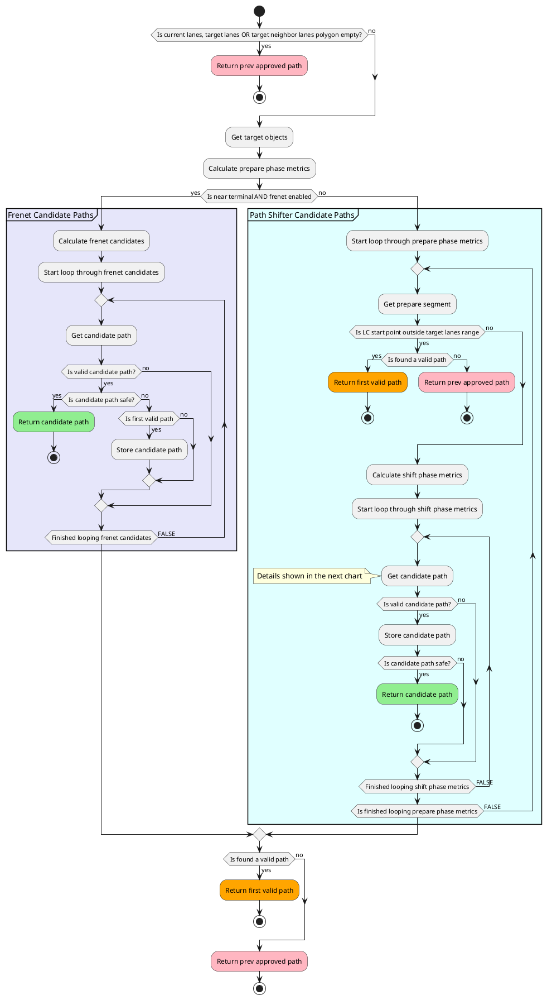

The following chart demonstrates the process of generating a valid candidate path with path shifter method.

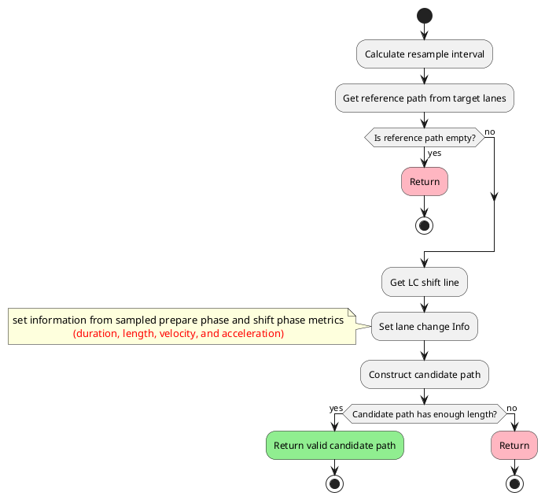

#### Prepare Phase

The prepare phase is the first section of the lane change candidate path and the corresponding prepare segment consists of a subsection of the current reference path along the current lane. The length of the prepare phase trajectory is computed as follows.

```C++
prepare_distance = current_speed * prepare_duration + 0.5 * lon_acceleration * prepare_duration^2
```

The prepare phase trajectory is valid if:

- The length of the prepare phase trajectory is greater than the distance to start of target lane
- The length of the prepare phase trajectory is less than the distance to terminal start point

#### Lane-changing Phase

The lane-changing phase consists of the shifted path that moves ego from current lane to the target lane. Total duration of lane-changing phase is computed from the `shift_length`, `lateral_jerk` and `lateral_acceleration`.

In principle, positive longitudinal acceleration is considered during lane-changing phase, and is computed as follows.

```C++
lane_changing_acceleration = std::clamp((max_path_velocity - initial_lane_changing_velocity) / lane_changing_time,
  0.0, prepare_longitudinal_acc);
```

Where `max_path_velocity` is the current path speed limit.

!!! warning

    If the longitudinal acceleration of prepare phase is negative (slowing down), AND ego is near terminal, then the lane-changing longitudinal acceleration will also be negative and its value is decided by the parameter `lane_changing_decel_factor`.

The lane changing distance is then computed as follows.

```C++
lane_changing_distance = initial_lane_changing_velocity * lane_changing_duration + 0.5 * lon_acceleration * lane_changing_duration^2
```

The `backward_length_buffer_for_end_of_lane` is added to allow some window for any possible delay, such as control or mechanical delay during brake lag.

#### Sampling Multiple Candidate Paths

In order to find a valid and safe lane change path it might be necessary to generate multiple candidate path samples. The lane change module does this by sampling one or more of: `prepare_duration`, `longitudinal_acceleration`, and `lateral_acceleration`.

##### Prepare Duration Sampling

In principle, a fixed prepare duration is assumed when generating lane change candidate path. The default prepare duration value is determined from the min and max values set in the lane change parameters, as well as the duration of turn signal activation.
For example, when the lane change module first activates and turn signal is activated then prepare duration will be `max_prepare_duration`, as time passes and a path is still not approved, the prepare duration will decrease gradually down to `min_prepare_duration`. The formula is as follows.

```C++
prepare_duration = std::max(max_prepare_duration - turn_signal_duration, min_prepare_duration);
```

!!! note

    When the current ego velocity is lower than the `min_lane_change_velocity`, the `min_prepare_duration` is adjusted to ensure sufficient time for reaching `min_lane_change_velocity` assuming `max_longitudinal_acceleration`.

!!! warning

    The value of the prepare duration impacts lane change cancelling behavior. A shorter prepare duration results in a smaller window in which lane change maneuver can be cancelled. See [Evaluating Ego Vehicle's Position to Prevent Abrupt Maneuvers](#evaluating-ego-vehicles-position-to-prevent-abrupt-maneuvers) for more details.

When ego vehicles is close to the terminal start, we need to sample multiple prepare duration values to find a valid and safe path. In this case prepare duration values are sampled starting from `max_prepare_duration` down to `0.0` at a fixed time interval of `0.5 s`.

##### Longitudinal Acceleration Sampling

In principle, maximum longitudinal acceleration is assumed for generating lane change candidate path.
However in certain situations, we need to sample multiple longitudinal acceleration values to find a valid and safe candidate path.
The lower and upper bounds of the longitudinal acceleration sampled are determined from the values specified in the lane change parameters and common planner parameters, as follows

```C++
maximum_longitudinal_acceleration = min(common_param.max_acc, lane_change_param.max_acc)
minimum_longitudinal_acceleration = max(common_param.min_acc, lane_change_param.min_acc)
```

where `common_param` is vehicle common parameter, which defines vehicle common maximum longitudinal acceleration and deceleration. Whereas, `lane_change_param` has maximum longitudinal acceleration and deceleration for the lane change module. For example, if a user set and `common_param.max_acc=1.0` and `lane_change_param.max_acc=0.0`, `maximum_longitudinal_acceleration` becomes `0.0`, and the lane change does not accelerate in the lane change phase.

The `longitudinal_acceleration_resolution` is determine by the following

```C++
longitudinal_acceleration_resolution = (maximum_longitudinal_acceleration - minimum_longitudinal_acceleration) / longitudinal_acceleration_sampling_num
```

The chart below illustrates the conditions under which longitudinal acceleration values are sampled.

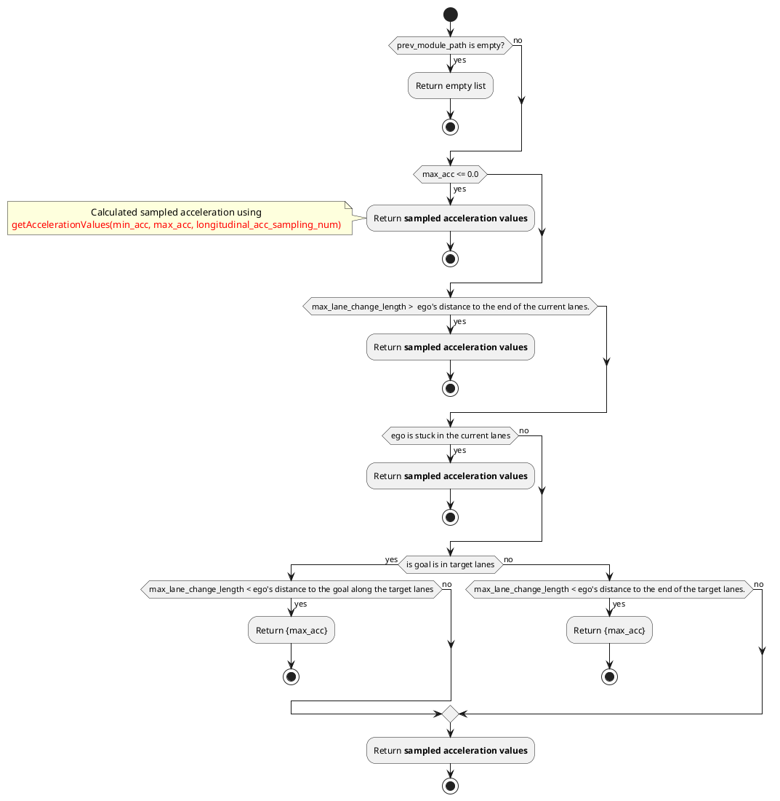

while the following describes the process by which longitudinal accelerations are sampled.

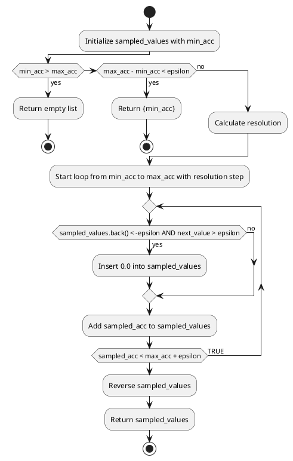

The following figure illustrates when `longitudinal_acceleration_sampling_num = 4`. Assuming that `maximum_acceleration = 1.0` and `minimum_acceleration = 1.0` then `a0 == 1.0`, `a1 == 0.5`, `a2 == 0.0`, `a3 == -0.5` and `a4 == -1.0`. `a0` is the expected lane change trajectory when sampling is not required.

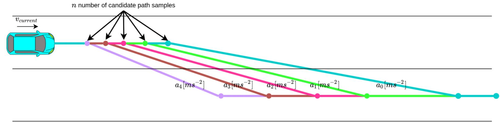

Which path will be chosen depends on validity and safety checks.

##### Lateral Acceleration Sampling

In addition to sampling longitudinal acceleration, we also sample lane change paths by varying the lateral acceleration.
Lateral acceleration affects the lane changing duration, a lower value results in a longer trajectory, while a higher value results in a shorter trajectory. This allows the lane change module to explore shorter trajectories through higher lateral acceleration when there is limited space for the lane change.

The maximum and minimum lateral accelerations are defined in the lane change parameter file as a map. The range of lateral acceleration is determined for each velocity by linearly interpolating the values in the map. Let's assume we have the following map

| Ego Velocity | Minimum lateral acceleration | Maximum lateral acceleration |
| :----------- | ---------------------------- | ---------------------------- |
| 0.0          | 0.2                          | 0.3                          |
| 2.0          | 0.2                          | 0.4                          |
| 4.0          | 0.3                          | 0.4                          |
| 6.0          | 0.3                          | 0.5                          |

In this case, when the current velocity of the ego vehicle is 3.0, the minimum and maximum lateral accelerations are 0.25 and 0.4 respectively. These values are obtained by linearly interpolating the second and third rows of the map, which provide the minimum and maximum lateral acceleration values.

Within this range, we sample the lateral acceleration for the ego vehicle. Similar to the method used for sampling longitudinal acceleration, the resolution of lateral acceleration (lateral_acceleration_resolution) is determined by the following:

```C++
lateral_acceleration_resolution = (maximum_lateral_acceleration - minimum_lateral_acceleration) / lateral_acceleration_sampling_num
```

#### Terminal Lane Change Path

Depending on the space configuration around the Ego vehicle, it is possible that a valid LC path cannot be generated. If that happens, then Ego will get stuck at `terminal_start` and not be able to proceed. Therefore we introduced the terminal LC path feature; when ego gets near to the terminal point (dist to `terminal_start` is less than the maximum lane change length) a terminal lane changing path will be computed starting from the terminal start point on the current lane and connects to the target lane. The terminal path only needs to be computed once in each execution of LC module. If no valid candidate paths are found in the path generation process, then the terminal path will be used as a fallback candidate path, the safety of the terminal path is not ensured and therefore it can only be force approved. The following images illustrate the expected behavior without and with the terminal path feature respectively:

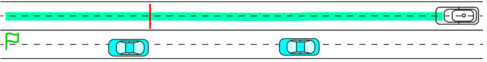

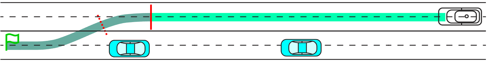

Additionally if terminal path feature is enabled and path is computed, stop point placement can be configured to be at the edge of the current lane instead of at the `terminal_start` position, as indicated by the dashed red line in the image above.

#### Generating Path Using Frenet Planner

!!! warning

    Generating path using Frenet planner applies only when ego is near terminal start

If the ego vehicle is far from the terminal, the lane change module defaults to using the [path shifter](https://autowarefoundation.github.io/autoware_universe/main/planning/behavior_path_planner/autoware_behavior_path_planner_common/docs/behavior_path_planner_path_generation_design/). This ensures that the lane change is completed while the target lane remains a neighbor of the current lane. However, this approach may result in high curvature paths near the terminal, potentially causing long vehicles to deviate from the lane.

To address this, the lane change module provides an option to choose between the path shifter and the [Frenet planner](https://autowarefoundation.github.io/autoware_universe/main/planning/sampling_based_planner/autoware_frenet_planner/). The Frenet planner allows for some flexibility in the lane change endpoint, extending the lane changing end point slightly beyond the current lane's neighbors.

The following table provides comparisons between the planners

<div align="center">
  <table>
    <tr>
      <td align="center">With Path Shifter</td>
      <td align="center">With Frenet Planner</td>
    </tr>
    <tr>
      <td></a></td>
      <td></a></td>
    </tr>
    <tr>
      <td>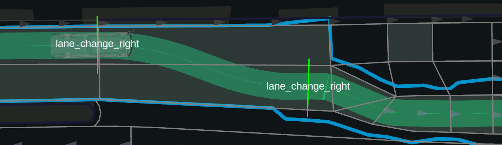</a></td>
      <td></a></td>
    </tr>
    <tr>
      <td>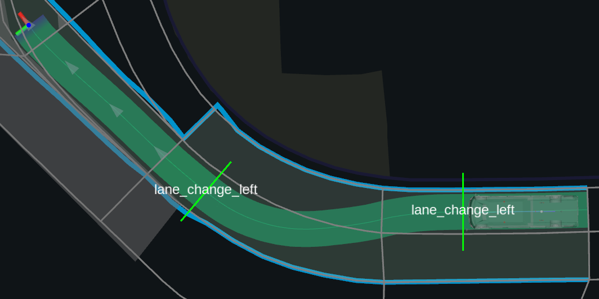</a></td>
      <td>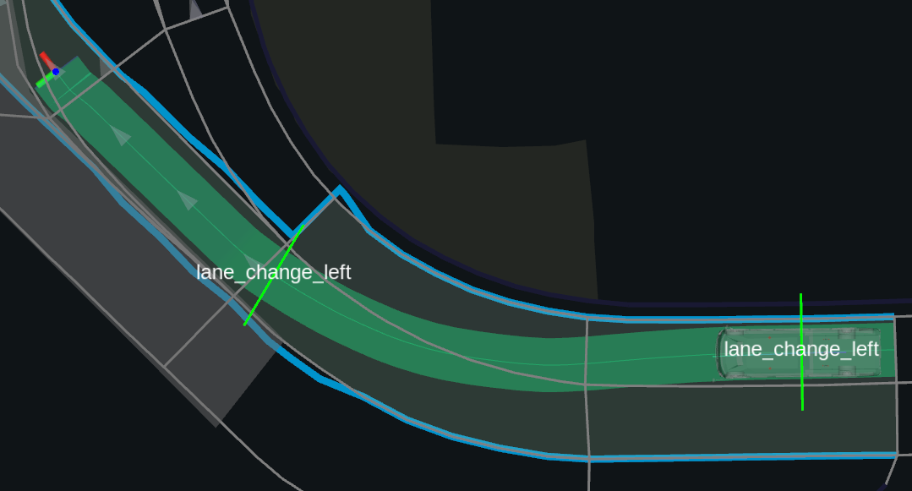</a></td>
    </tr>
  </table>
</div>

!!! note

    The planner can be enabled or disabled using the `frenet.enable` flag.

!!! note

    Since only a segment of the target lane is used as input to generate the lane change path, the end pose of the lane change segment may not smoothly connect to the target lane centerline. To address this, increase the value of `frenet.th_curvature_smoothing` to improve the smoothness.

!!! note

    The yaw difference threshold (`frenet.th_yaw_diff`) limits the maximum curvature difference between the end of the prepare segment and the lane change segment. This threshold might prevent the generation of a lane change path when the lane curvature is high. In such cases, you can increase the frenet.th_yaw_diff value. However, note that if the prepare path was initially shifted by other modules, the resultant steering may not be continuous.

#### Candidate Path Validity

It is a prerequisite, that both prepare length and lane-changing length are valid, such that:

1. The prepare segment length is greater than the distance from ego to target lane start.
2. The prepare segment length is smaller than the distance from ego to terminal start.
3. The lane-changing distance is smaller than the remaining distance after prepare segment to terminal end.
4. The lane-changing distance is smaller than the remaining distance after prepare segment to the next regulatory element.

If so, a candidate path is considered valid if:

1. The lane changing start point (end of prepare segment) is valid; it is within the target lane neighbor's polygon.
2. The distance from ego to the end of the current lanes is sufficient to perform a single lane change.
3. The distance from ego to the goal along the current lanes is adequate to complete multiple lane changes.
4. The distance from ego to the end of the target lanes is adequate for completing multiple lane changes.

The following flow chart illustrates the validity check.

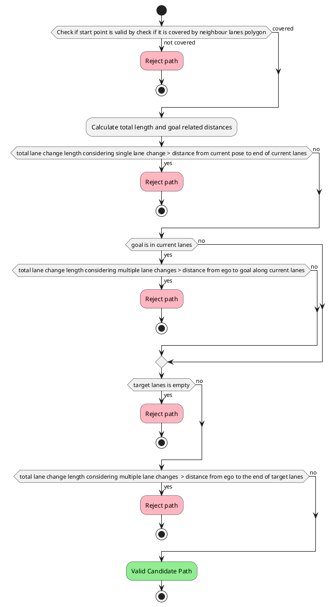

!!! warning

    A valid path does NOT mean that the path is safe, however it will be available as a candidate path and can be force approved by operator. A path needs to be both valid AND safe to be automatically approved.

### Lane Change Completion Checks

To determine if the ego vehicle has successfully changed lanes, one of two criteria must be met: either the longitudinal or the lateral criteria.

For the longitudinal criteria, the ego vehicle must pass the lane-changing end pose and be within the `finish_judge_buffer` distance from it. The module then checks if the ego vehicle is in the target lane. If true, the module returns success. This check ensures that the planner manager updates the root lanelet correctly based on the ego vehicle's current pose. Without this check, if the ego vehicle is changing lanes while avoiding an obstacle and its current pose is in the original lane, the planner manager might set the root lanelet as the original lane. This would force the ego vehicle to perform the lane change again. With the target lane check, the ego vehicle is confirmed to be in the target lane, and the planner manager can correctly update the root lanelets.

If the longitudinal criteria are not met, the module evaluates the lateral criteria. For the lateral criteria, the ego vehicle must be within `finish_judge_lateral_threshold` distance from the target lane's centerline, and the angle deviation must be within `finish_judge_lateral_angle_deviation` degrees. The angle deviation check ensures there is no sudden steering. If the angle deviation is set too high, the ego vehicle's orientation could deviate significantly from the centerline, causing the trajectory follower to aggressively correct the steering to return to the centerline. Keeping the angle deviation value as small as possible avoids this issue.

The process of determining lane change completion is shown in the following diagram.

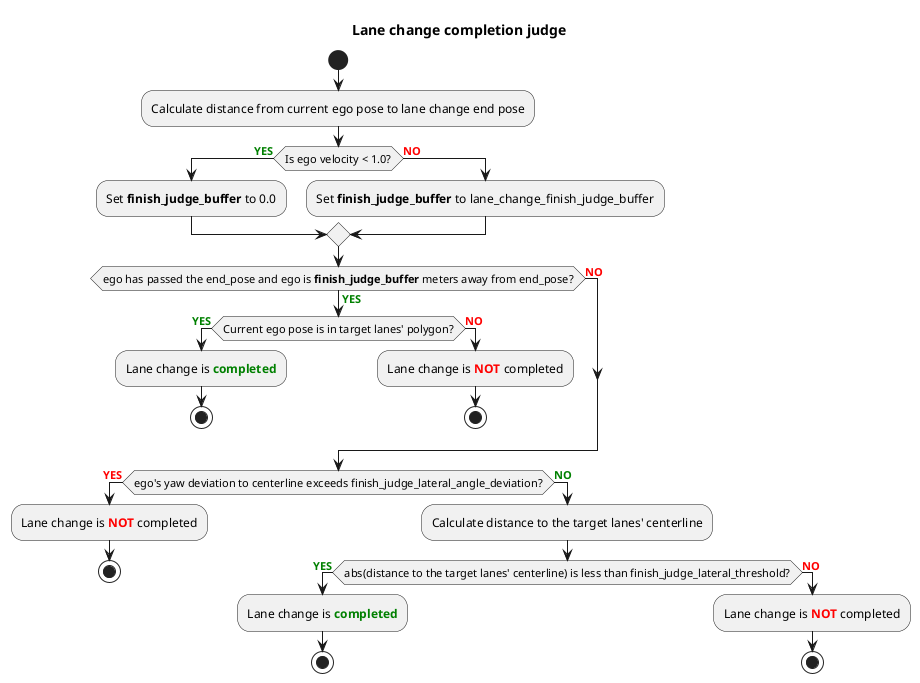

### Safety Checks

A candidate path needs to be both valid and safe for it to be executed. After generating a candidate path and validating it, the path will be checked against surrounding objects to ensure its safety. However the impacts of an object depends on its categorization, therefore it is necessary to filter the predicted objects before performing the safety checks.

#### Object filtering

In order to perform safety checks on the sampled candidate paths, it is needed to categorize the predicted objects based on their current pose and behavior at the time. These categories help determine how each object impacts the lane change process and guide the safety evaluation.

The predicted objects are divided into four main categories:

- **Target Lane Leading**: Objects that overlap with the target lane and are in front of the ego vehicle. This category is further divided into three subcategories:
  - Moving: Objects with a velocity above a certain threshold.
  - Stopped: Stationary objects within the target lane.
  - Stopped at Bound: Objects outside the target lane but close to its boundaries.
- **Target Lane Trailing**: Objects that overlap with the target lane or any lanes preceding the target lane. Only moving vehicles are included in this category.
- **Current Lane**: Objects in front of the ego vehicle in the ego vehicle's current lane.
- **Others**: Any objects not classified into the above categories.


Furthermore, for **Target Lane Leading** and **Current Lane** objects, only those positioned within the lane boundary or before the goal position are considered. Objects exceeding the end of the lane or the goal position are classified as **Others**.

Once objects are filtered into their respective categories, they are sorted by distance closest to the ego vehicle to farthest.

The following diagram illustrates the filtering process,

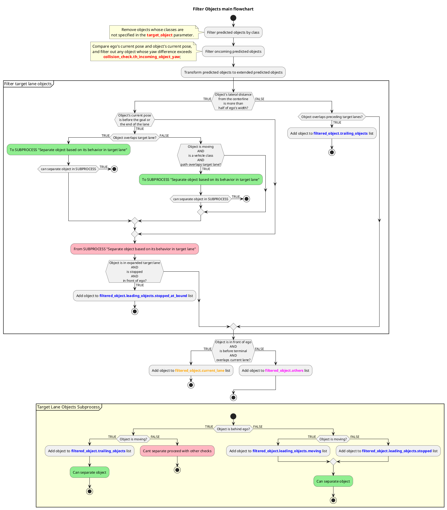

!!! note

    As shown in the flowchart, oncoming objects are also filtered out. The filtering process considers the difference between the current orientation of the ego vehicle and that of the object. However, depending on the map's geometry, a certain threshold may need to be allowed. This threshold can be configured using the parameter collision_check.th_incoming_object_yaw.

!!! note

    The **Target Lane Leading's Stopped at Boundary** objects are detected using the expanded area of the target lane beyond its original boundaries. The parameters `lane_expansion.left_offset` and `lane_expansion.right_offset` can be configured to adjust the expanded width.

    <div align="center">
      <table>
        <tr>
          <td>
            <div style="text-align: center;">
              <div style="color: black; font-size: 20px; margin-bottom: 10px;">Without Lane Expansion</div>
            
            </div>
          </td>
          <td>
            <div style="text-align: center;">
            <div style="color: black; font-size: 20px; margin-bottom: 10px;">With Lane Expansion</div>
            
            </div>
          </td>
        </tr>
      </table>
    </div>

#### Candidate Path Safety

A candidate path is considered safe if:

1. There are no overtaking objects when the ego vehicle exits the turn-direction lane. (see [Overtaking Object Check](#overtaking-object-check))
2. There is no parked vehicle along the target lane ahead of ego (see [Delay Lane Change Check](#delay-lane-change-check))
3. The path does NOT cause ego footprint to exceed the target lane opposite boundary
4. The path passes the collision check (See [Collision Check](#collision-check))

#### Overtaking Object Check

When ego is exiting an intersection on a turning lane, there is a possibility that a rear vehicle will attempt to overtake the ego vehicle. Which can be dangerous if ego is also trying to perform a lane change. Therefore lane change module will adopt a more conservative behavior in such situation.

If the ego vehicle is currently within an intersection on a turning lane, as shown in the figure below, the generated candidate paths will be marked as unsafe.


Additionally, if the ego vehicle has just exited the turn lane of an intersection and its distance from the intersection is within the `backward_length_from_intersection`, as shown in the figure below, the generated candidate paths will also be marked as unsafe.


#### Delay Lane Change Check

In certain situations, when there are stopped vehicles along the target lane ahead of Ego vehicle, to avoid getting stuck, it is desired to perform the lane change maneuver after the stopped vehicle.
To do so, all static objects ahead of ego along the target lane are checked in order from closest to furthest, if any object satisfies the following conditions, lane change will be delayed and candidate path will be rejected.

1. The distance from object to terminal end is sufficient to perform lane change
2. The distance to object is less than the lane changing length
3. The distance from object to next object is sufficient to perform lane change

If the parameter `check_only_parked_vehicle` is set to `true`, the check will only consider objects which are determined as parked.
More details on parked vehicle detection can be found in [documentation for avoidance module](../autoware_behavior_path_static_obstacle_avoidance_module/README.md).

The following flow chart illustrates the delay lane change check.

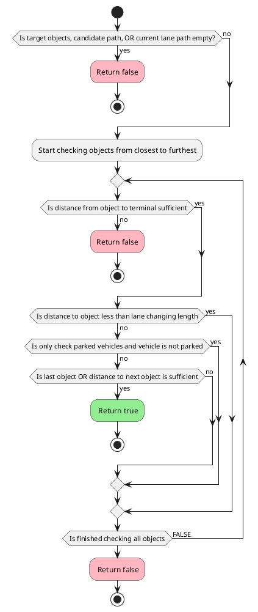

The following figures demonstrate different situations under which delay action will or won't be triggered. In each figure the target lane vehicles are assumed to be stopped. The target lane vehicle responsible for triggering the delay action is marked with blue color.

- Delay lane change will be triggered as there is sufficient distance ahead.


- Delay lane change will NOT be triggered as there is no sufficient distance ahead.


- Delay lane change will be triggered by fist NPC as there is sufficient distance ahead.


- Delay lane change will be triggered by second NPC as there is sufficient distance ahead.


- Delay lane change will NOT be triggered as there is no sufficient distance ahead.


#### Collision Check

To ensure the safety of the lane change candidate path an RSS check is performed against the surrounding predicted objects.
More details on the collision check implementation can be found in [safety check utils explanation](../autoware_behavior_path_planner_common/docs/behavior_path_planner_safety_check.md)

##### Collision Check In Prepare Phase

The collision check can be applied to the lane changing section only or to the entire candidate path by enabling the flag `enable_collision_check_at_prepare_phase`. Enabling this flag ensures that the ego vehicle secures enough inter-vehicle distance ahead of target lane rear vehicle before attempting a lane change. The following image illustrates the differences between the `false` and `true` cases.


!!! note

    When ego vehicles is stuck, i.e it is stopped, and there is an obstacle in front or is at end of current lane. Then the safety check for lane change is relaxed compared to normal times.

### Stopping Behavior

The stopping behavior of the ego vehicle is determined based on various factors, such as the number of lane changes required, the presence of obstacles, and the position of blocking objects in relation to the lane change plan. The objective is to choose a suitable stopping point that allows for a safe and effective lane change while adapting to different traffic scenarios.

The following flowchart and subsections explain the conditions for deciding where to insert a stop point when an obstacle is ahead.

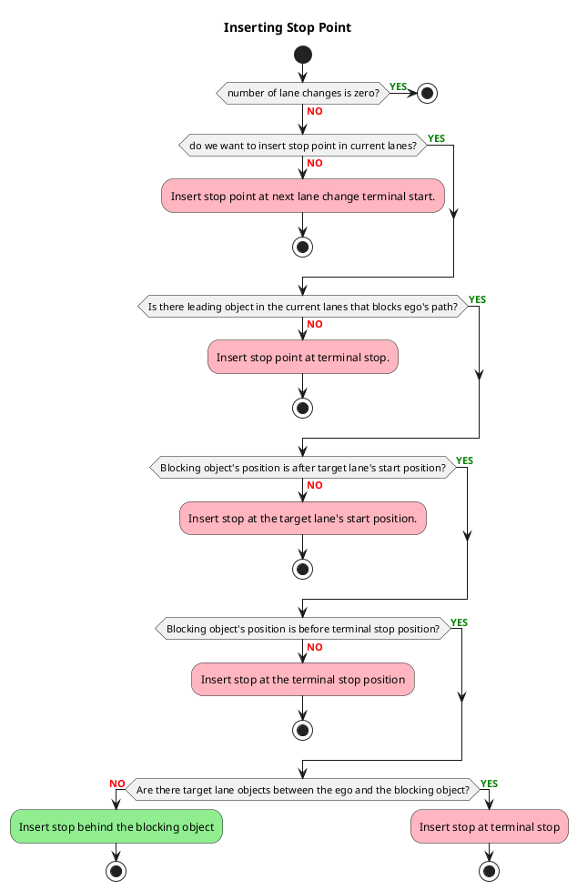

#### Ego vehicle's stopping position when an object exists ahead

When the ego vehicle encounters an obstacle ahead, it stops while maintaining a safe distance to prepare for a possible lane change. The exact stopping position depends on factors like whether the target lane is clear or if the lane change needs to be delayed. The following explains how different stopping scenarios are handled:

##### When the near the end of the lane change

Whether the target lane has obstacles or is clear, the ego vehicle stops while keeping a safe distance from the obstacle ahead, ensuring there is enough room for the lane change.


##### When the ego vehicle is not near the end of the lane change

The ego vehicle stops while maintaining a safe distance from the obstacle ahead, ensuring there is enough space for a lane change.


#### Ego vehicle's stopping position when an object exists in the lane changing section

If there are objects within the lane change section of the target lane, the ego vehicle stops closer to the obstacle ahead, without maintaining the usual distance for a lane change.

##### When near the end of the lane change

Regardless of whether there are obstacles in the target lane, the ego vehicle stops while keeping a safe distance from the obstacle ahead, allowing for the lane change.


##### When not near the end of the lane change

If there are no obstacles in the lane change section of the target lane, the ego vehicle stops while keeping a safe distance from the obstacle ahead to accommodate the lane change.


If there are obstacles within the lane change section of the target lane, the ego vehicle stops closer to the obstacle ahead, without keeping the usual distance needed for a lane change.


#### When the target lane is far away

If the target lane for the lane change is far away and not next to the current lane, the ego vehicle stops closer to the obstacle ahead, as maintaining the usual distance for a lane change is not necessary.


#### When target lane is blocked and multiple lane changes

When ego vehicle needs to perform multiple lane changes to reach the `preferred_lane`, and the `target_lane` is blocked, for example, due to incoming vehicles, the ego vehicle must stop at a sufficient distance from the lane end and wait for the `target_lane` to clear. The minimum stopping distance can be computed from shift length and minimum lane changing velocity.

```C++
lane_changing_time = f(shift_length, lat_acceleration, lat_jerk)
minimum_lane_change_distance = minimum_prepare_length + minimum_lane_changing_velocity * lane_changing_time + lane_change_finish_judge_buffer
```

The following figure illustrates when the lane is blocked in multiple lane changes cases.


### Aborting Lane Change

Once the lane change path is approved, there are several situations where we may need to abort the maneuver. The abort process is triggered when any of the following conditions is met

1. The ego vehicle is near a traffic light, crosswalk, or intersection, and it is possible to complete the lane change after the ego vehicle passes these areas.
2. The target object list is updated, requiring us to [delay lane change](#delay-lane-change-check)
3. The lane change is forcefully canceled via [RTC](https://autowarefoundation.github.io/autoware-documentation/main/design/autoware-interfaces/ad-api/features/cooperation/).
4. The path has become unsafe. (see [Checking Approved Path Safety](#checking-approved-path-safety))

Furthermore, if the path has become unsafe, there are three possible outcomes for the maneuver:

1. **CANCEL**: The approved path has become unsafe while ego is still in prepare phase. Lane change path is canceled, and the ego vehicle resumes its previous maneuver.
2. **ABORT**: The approved path has become unsafe while ego is in lane changing phase. Lane change module generates a return path to bring the ego vehicle back to its current lane.
3. **CRUISE** or **STOP**: If aborting is not feasible, the ego vehicle continues with the lane change. [Another module](https://autowarefoundation.github.io/autoware_universe/main/planning/autoware_obstacle_cruise_planner/) should decide whether the ego vehicle should cruise or stop in this scenario.

**CANCEL** can be enabled by setting the `cancel.enable_on_prepare_phase` flag to `true`, and **ABORT** can be enabled by setting the `cancel.enable_on_lane_changing_phase` flag to true.

!!! warning

    Enabling **CANCEL** is a prerequisite for enabling **ABORT**.

!!! warning

    When **CANCEL** is disabled, all maneuvers will default to either **CRUISE** or **STOP**.

The chart shows the high level flow of the lane change abort process.

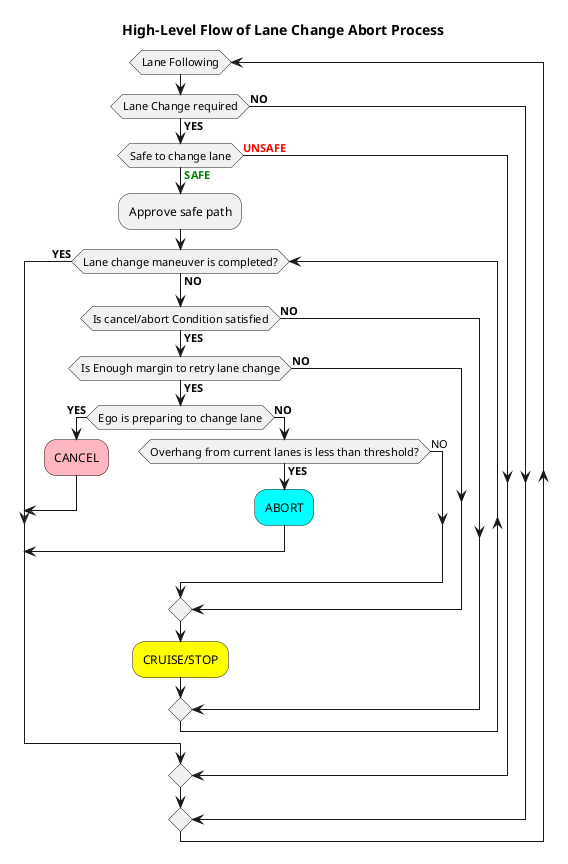

#### Preventing Oscillating Paths When Unsafe

Lane change paths can oscillate when conditions switch between safe and unsafe. To address this, a hysteresis count check is added before executing an abort maneuver. When the path is unsafe, the `unsafe_hysteresis_count_` increases. If it exceeds the `unsafe_hysteresis_threshold`, an abort condition check is triggered. This logic stabilizes the path approval process and prevents abrupt changes caused by temporary unsafe conditions.

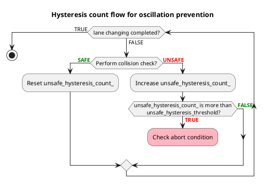

#### Evaluating Ego Vehicle's Position to Prevent Abrupt Maneuvers

To avoid abrupt maneuvers during **CANCEL** or **ABORT**, the lane change module ensures the ego vehicle can safely return to the original lane. This is done through geometric checks that verify whether the ego vehicle remains within the lane boundaries.

The edges of the ego vehicle’s footprint are compared against the boundary of the current lane to determine if they exceed the overhang tolerance, `cancel.overhang_tolerance`. If the distance from any edge of the footprint to the boundary exceeds this threshold, the vehicle is considered to be diverging.

The footprints checked against the lane boundary include:

1. Current Footprint: Based on the ego vehicle's current position.
2. Future Footprint: Based on the ego vehicle's estimated position after traveling a distance, calculated as $𝑑_{est}=𝑣_{ego} \cdot \Delta_{𝑡}$, where

   - $v_{ego}$ is ego vehicle's current velocity
   - $\Delta_{t}$ is parameterized time constant value, `cancel.delta_time`.

   as depicted in the following diagram

   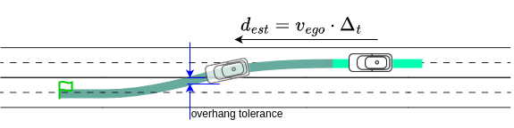

!!! note

    The ego vehicle is considered capable of safely returning to the current lane only if **BOTH** the current and future footprint checks are `true`.

#### Checking Approved Path Safety

The lane change module samples accelerations along the path and recalculates velocity to perform safety checks. The motivation for this feature is explained in the [Limitation](#limitation) section.

The computation of sampled accelerations is as follows:

Let

$$
\text{resolution} = \frac{a_{\text{min}} - a_{\text{LC}}}{N}
$$

The sequence of sampled accelerations is then given as

$$
\text{acc} = a_{\text{LC}} + k \cdot \text{resolution}, \quad k = [0, N]
$$

where

- $a_{\text{min}}$, is the minimum of the parameterized [global acceleration constant](https://github.com/autowarefoundation/autoware_launch/blob/main/autoware_launch/config/planning/scenario_planning/common/common.param.yaml) `normal.min_acc` or the [parameterized constant](#essential-lane-change-parameters) `trajectory.min_longitudinal_acceleration`.
- $a_{\text{LC}}$ is the acceleration used to generate the approved path.
- $N$ is the parameterized constant `cancel.deceleration_sampling`

If none of the sampled accelerations pass the safety check, the lane change path will be canceled, subject to the [hysteresis check](#preventing-oscillating-paths-when-unsafe).

#### Cancel

Cancelling lane change is possible as long as the ego vehicle is in the prepare phase and has not started deviating from the current lane center line.
When lane change is canceled, the approved path is reset. After the reset, the ego vehicle will return to following the original reference path (the last approved path before the lane change started), as illustrated in the following image:


The following parameters can be configured to tune the behavior of the cancel process:

1. [Safety constraints](#safety-constraints-to-cancel-lane-change-path) for cancel.
2. [Safety constraints](#safety-constraints-specifically-for-stopped-or-parked-vehicles) for parked vehicle.

!!! note

    To ensure feasible behavior, all safety constraint values must be equal to or less than their corresponding parameters in the [execution](#safety-constraints-during-lane-change-path-is-computed) settings.

    - The closer the values, the more conservative the lane change behavior will be. This means it will be easier to cancel the lane change but harder for the ego vehicle to complete a lane change.
    - The larger the difference, the more aggressive the lane change behavior will be. This makes it harder to cancel the lane change but easier for the ego vehicle to change lanes.

#### Abort

During the prepare phase, the ego vehicle follows the previously approved path. However, once the ego vehicle begins the lane change, its heading starts to diverge from this path. Resetting to the previously approved path in this situation would cause abrupt steering, as the controller would attempt to rapidly realign the vehicle with the reference trajectory.

Instead, the lane change module generates an abort path. This return path is specifically designed to guide the ego vehicle back to the current lane, avoiding any sudden maneuvers. The following image provides an illustration of the abort process.


The abort path is generated by shifting the approved lane change path using the path shifter. This ensures the continuity in lateral velocity, and prevents abrupt changes in the vehicle’s movement. The abort start shift and abort end shift are computed as follows:

1. Start Shift: $d_{start}^{abort} = v_{ego} \cdot \Delta_{t}$
2. End Shift: $d_{end}^{abort} = v_{ego} \cdot ( \Delta_{t} + t_{end} )$

- $v_{ego}$ is ego vehicle's current velocity
- $\Delta_{t}$ is parameterized time constant value, `cancel.delta_time`.
- $t_{end}$ is the parameterized time constant value, `cancel.duration`.

as depicted in the following diagram

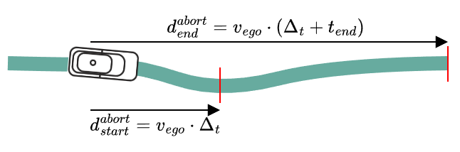

!!! note

    When executing the abort process, comfort is not a primary concern. However, due to safety considerations, limited real-world testing has been conducted to tune or validate this parameter. Currently, the maximum lateral jerk is set to an arbitrary value. To avoid generating a path with excessive lateral jerk, this value can be configured using `cancel.max_lateral_jerk`.

!!! note

    Lane change module returns `ModuleStatus::FAILURE` once abort is completed.

#### Stop/Cruise

Once canceling or aborting the lane change is no longer an option, the ego vehicle will proceed with the lane change. This can happen in the following situations:

- The ego vehicle is performing a lane change near a terminal or dead-end, making it impossible to return to the original lane. In such cases, completing the lane change is necessary.
- If safety parameters are tuned too aggressively, it becomes harder to cancel or abort the lane change. This reduces tolerance for unexpected behaviors from surrounding vehicles, such as a trailing vehicle in the target lane suddenly accelerating or a leading vehicle suddenly decelerating. Aggressive settings leave less room for error during the maneuver.


## Parameters

### Essential lane change parameters

The following parameters are configurable in [lane_change.param.yaml](https://github.com/autowarefoundation/autoware_launch/blob/main/autoware_launch/config/planning/scenario_planning/lane_driving/behavior_planning/behavior_path_planner/lane_change/lane_change.param.yaml)

| Name                                         | Unit   | Type   | Description                                                                                                            | Default value      |
| :------------------------------------------- | ------ | ------ | ---------------------------------------------------------------------------------------------------------------------- | ------------------ |
| `time_limit`                                 | [ms]   | double | Time limit for lane change candidate path generation                                                                   | 50.0               |
| `backward_lane_length`                       | [m]    | double | The backward length to check incoming objects in lane change target lane.                                              | 200.0              |
| `backward_length_buffer_for_end_of_lane`     | [m]    | double | The end of lane buffer to ensure ego vehicle has enough distance to start lane change                                  | 3.0                |
| `backward_length_buffer_for_blocking_object` | [m]    | double | The end of lane buffer to ensure ego vehicle has enough distance to start lane change when there is an object in front | 3.0                |
| `backward_length_from_intersection`          | [m]    | double | Distance threshold from the last intersection to invalidate or cancel the lane change path                             | 5.0                |
| `enable_stopped_vehicle_buffer`              | [-]    | bool   | If true, will keep enough distance from current lane front stopped object to perform lane change when possible         | true               |
| `trajectory.max_prepare_duration`            | [s]    | double | The maximum preparation time for the ego vehicle to be ready to perform lane change.                                   | 4.0                |
| `trajectory.min_prepare_duration`            | [s]    | double | The minimum preparation time for the ego vehicle to be ready to perform lane change.                                   | 2.0                |
| `trajectory.lateral_jerk`                    | [m/s3] | double | Lateral jerk value for lane change path generation                                                                     | 0.5                |
| `trajectory.minimum_lane_changing_velocity`  | [m/s]  | double | Minimum speed during lane changing process.                                                                            | 2.78               |
| `trajectory.lon_acc_sampling_num`            | [-]    | int    | Number of possible lane-changing trajectories that are being influenced by longitudinal acceleration                   | 3                  |
| `trajectory.lat_acc_sampling_num`            | [-]    | int    | Number of possible lane-changing trajectories that are being influenced by lateral acceleration                        | 3                  |
| `trajectory.max_longitudinal_acc`            | [m/s2] | double | maximum longitudinal acceleration for lane change                                                                      | 1.0                |
| `trajectory.min_longitudinal_acc`            | [m/s2] | double | maximum longitudinal deceleration for lane change                                                                      | -1.0               |
| `trajectory.lane_changing_decel_factor`      | [-]    | double | longitudinal deceleration factor during lane changing phase                                                            | 0.5                |
| `trajectory.th_prepare_curvature`            | [-]    | double | If the maximum curvature of the prepare segment exceeds the threshold, the prepare segment is invalid.                 | 0.03               |
| `min_length_for_turn_signal_activation`      | [m]    | double | Turn signal will be activated if the ego vehicle approaches to this length from minimum lane change length             | 10.0               |
| `lateral_acceleration.velocity`              | [m/s]  | double | Reference velocity for lateral acceleration calculation (look up table)                                                | [0.0, 4.0, 10.0]   |
| `lateral_acceleration.min_values`            | [m/s2] | double | Min lateral acceleration values corresponding to velocity (look up table)                                              | [0.4, 0.4, 0.4]    |
| `lateral_acceleration.max_values`            | [m/s2] | double | Max lateral acceleration values corresponding to velocity (look up table)                                              | [0.65, 0.65, 0.65] |

### Parameter to judge if lane change is completed

The following parameters are used to judge lane change completion.

| Name                                   | Unit  | Type   | Description                                                                                                            | Default value |
| :------------------------------------- | ----- | ------ | ---------------------------------------------------------------------------------------------------------------------- | ------------- |
| `lane_change_finish_judge_buffer`      | [m]   | double | The longitudinal distance starting from the lane change end pose.                                                      | 2.0           |
| `finish_judge_lateral_threshold`       | [m]   | double | The lateral distance from targets lanes' centerline. Used in addition with `finish_judge_lateral_angle_deviation`      | 0.1           |
| `finish_judge_lateral_angle_deviation` | [deg] | double | Ego angle deviation with reference to target lanes' centerline. Used in addition with `finish_judge_lateral_threshold` | 2.0           |

### Lane change regulations

| Name                       | Unit | Type    | Description                                                | Default value |
| :------------------------- | ---- | ------- | ---------------------------------------------------------- | ------------- |
| `regulation.crosswalk`     | [-]  | boolean | Allow lane change in between crosswalks                    | true          |
| `regulation.intersection`  | [-]  | boolean | Allow lane change in between intersections                 | true          |
| `regulation.traffic_light` | [-]  | boolean | Allow lane change to be performed in between traffic light | true          |

### Ego vehicle stuck detection

| Name                        | Unit  | Type   | Description                                         | Default value |
| :-------------------------- | ----- | ------ | --------------------------------------------------- | ------------- |
| `stuck_detection.velocity`  | [m/s] | double | Velocity threshold for ego vehicle stuck detection  | 0.1           |
| `stuck_detection.stop_time` | [s]   | double | Stop time threshold for ego vehicle stuck detection | 3.0           |

### Delay Lane Change

| Name                                              | Unit | Type   | Description                                                                                           | Default value |
| :------------------------------------------------ | ---- | ------ | ----------------------------------------------------------------------------------------------------- | ------------- |
| `delay_lane_change.enable`                        | [-]  | bool   | Flag to enable/disable lane change delay feature                                                      | true          |
| `delay_lane_change.check_only_parked_vehicle`     | [-]  | bool   | Flag to limit delay feature for only parked vehicles                                                  | false         |
| `delay_lane_change.min_road_shoulder_width`       | [m]  | double | Width considered as road shoulder if lane doesn't have road shoulder when checking for parked vehicle | 0.5           |
| `delay_lane_change.th_parked_vehicle_shift_ratio` | [-]  | double | Stopped vehicles beyond this distance ratio from center line will be considered as parked             | 0.6           |

### Terminal Lane Change Path

The following parameters are used to configure terminal lane change path feature.

| Name                              | Unit | Type | Description                                                               | Default value |
| :-------------------------------- | ---- | ---- | ------------------------------------------------------------------------- | ------------- |
| `terminal_path.enable`            | [-]  | bool | Flag to enable/disable terminal path feature                              | true          |
| `terminal_path.disable_near_goal` | [-]  | bool | Flag to disable terminal path feature if ego is near goal                 | true          |
| `terminal_path.stop_at_boundary`  | [-]  | bool | If true, ego will stop at current lane boundary instead of middle of lane | false         |

### Generating Lane Changing Path using Frenet Planner

!!! warning

    Only applicable when ego is near terminal start

| Name                            | Unit  | Type   | Description                                                                                                                                         | Default value |
| :------------------------------ | ----- | ------ | --------------------------------------------------------------------------------------------------------------------------------------------------- | ------------- |
| `frenet.enable`                 | [-]   | bool   | Flag to enable/disable frenet planner when ego is near terminal start.                                                                              | true          |
| `frenet.th_yaw_diff`            | [deg] | double | If the yaw diff between of the prepare segment's end and lane changing segment's start exceed the threshold , the lane changing segment is invalid. | 10.0          |
| `frenet.th_curvature_smoothing` | [-]   | double | Filters and appends target path points with curvature below the threshold to candidate path.                                                        | 0.1           |

### Collision checks

#### Target Objects

| Name                       | Unit | Type    | Description                                 | Default value |
| :------------------------- | ---- | ------- | ------------------------------------------- | ------------- |
| `target_object.car`        | [-]  | boolean | Include car objects for safety check        | true          |
| `target_object.truck`      | [-]  | boolean | Include truck objects for safety check      | true          |
| `target_object.bus`        | [-]  | boolean | Include bus objects for safety check        | true          |
| `target_object.trailer`    | [-]  | boolean | Include trailer objects for safety check    | true          |
| `target_object.unknown`    | [-]  | boolean | Include unknown objects for safety check    | true          |
| `target_object.bicycle`    | [-]  | boolean | Include bicycle objects for safety check    | true          |
| `target_object.motorcycle` | [-]  | boolean | Include motorcycle objects for safety check | true          |
| `target_object.pedestrian` | [-]  | boolean | Include pedestrian objects for safety check | true          |

#### common

| Name                                       | Unit | Type   | Description                                                                                                                                 | Default value |
| :----------------------------------------- | ---- | ------ | ------------------------------------------------------------------------------------------------------------------------------------------- | ------------- |
| `safety_check.lane_expansion.left_offset`  | [m]  | double | Expand the left boundary of the detection area, allowing objects previously outside on the left to be detected and registered as targets.   | 0.0           |
| `safety_check.lane_expansion.right_offset` | [m]  | double | Expand the right boundary of the detection area, allowing objects previously outside on the right to be detected and registered as targets. | 0.0           |

#### Additional parameters

| Name                                                     | Unit  | Type    | Description                                                                                                                                                                                                | Default value |
| :------------------------------------------------------- | ----- | ------- | ---------------------------------------------------------------------------------------------------------------------------------------------------------------------------------------------------------- | ------------- |
| `collision_check.enable_for_prepare_phase.general_lanes` | [-]   | boolean | Perform collision check starting from the prepare phase for situations not explicitly covered by other settings (e.g., intersections). If `false`, collision check only evaluated for lane changing phase. | false         |
| `collision_check.enable_for_prepare_phase.intersection`  | [-]   | boolean | Perform collision check starting from prepare phase when ego is in intersection. If `false`, collision check only evaluated for lane changing phase.                                                       | true          |
| `collision_check.enable_for_prepare_phase.turns`         | [-]   | boolean | Perform collision check starting from prepare phase when ego is in lanelet with turn direction tags. If `false`, collision check only evaluated for lane changing phase.                                   | true          |
| `collision_check.check_current_lanes`                    | [-]   | boolean | If true, the lane change module always checks objects in the current lanes for collision assessment. If false, it only checks objects in the current lanes when the ego vehicle is stuck.                  | false         |
| `collision_check.check_other_lanes`                      | [-]   | boolean | If true, the lane change module includes objects in other lanes when performing collision assessment.                                                                                                      | false         |
| `collision_check.use_all_predicted_paths`                | [-]   | boolean | If false, use only the predicted path that has the maximum confidence.                                                                                                                                     | true          |
| `collision_check.prediction_time_resolution`             | [s]   | double  | Time resolution for object's path interpolation and collision check.                                                                                                                                       | 0.5           |
| `collision_check.yaw_diff_threshold`                     | [rad] | double  | Maximum yaw difference between predicted ego pose and predicted object pose when executing rss-based collision checking                                                                                    | 3.1416        |
| `collision_check.th_incoming_object_yaw`                 | [rad] | double  | Maximum yaw difference between current ego pose and current object pose. Objects with a yaw difference exceeding this value are excluded from the safety check.                                            | 2.3562        |

#### safety constraints during lane change path is computed

| Name                                                         | Unit    | Type   | Description                                                                                                                                                    | Default value |
| :----------------------------------------------------------- | ------- | ------ | -------------------------------------------------------------------------------------------------------------------------------------------------------------- | ------------- |
| `safety_check.execution.expected_front_deceleration`         | [m/s^2] | double | The front object's maximum deceleration when the front vehicle perform sudden braking. (\*1)                                                                   | -1.0          |
| `safety_check.execution.expected_rear_deceleration`          | [m/s^2] | double | The rear object's maximum deceleration when the rear vehicle perform sudden braking. (\*1)                                                                     | -1.0          |
| `safety_check.execution.rear_vehicle_reaction_time`          | [s]     | double | The reaction time of the rear vehicle driver which starts from the driver noticing the sudden braking of the front vehicle until the driver step on the brake. | 2.0           |
| `safety_check.execution.rear_vehicle_safety_time_margin`     | [s]     | double | The time buffer for the rear vehicle to come into complete stop when its driver perform sudden braking.                                                        | 1.0           |
| `safety_check.execution.lateral_distance_max_threshold`      | [m]     | double | The lateral distance threshold that is used to determine whether lateral distance between two object is enough and whether lane change is safe.                | 2.0           |
| `safety_check.execution.longitudinal_distance_min_threshold` | [m]     | double | The longitudinal distance threshold that is used to determine whether longitudinal distance between two object is enough and whether lane change is safe.      | 3.0           |
| `safety_check.execution.longitudinal_velocity_delta_time`    | [m]     | double | The time multiplier that is used to compute the actual gap between vehicle at each predicted points (not RSS distance)                                         | 0.8           |
| `safety_check.execution.extended_polygon_policy`             | [-]     | string | Policy used to determine the polygon shape for the safety check. Available options are: `rectangle` or `along-path`.                                           | `rectangle`   |

#### safety constraints specifically for stopped or parked vehicles

| Name                                                      | Unit    | Type   | Description                                                                                                                                                    | Default value |
| :-------------------------------------------------------- | ------- | ------ | -------------------------------------------------------------------------------------------------------------------------------------------------------------- | ------------- |
| `safety_check.parked.expected_front_deceleration`         | [m/s^2] | double | The front object's maximum deceleration when the front vehicle perform sudden braking. (\*1)                                                                   | -1.0          |
| `safety_check.parked.expected_rear_deceleration`          | [m/s^2] | double | The rear object's maximum deceleration when the rear vehicle perform sudden braking. (\*1)                                                                     | -2.0          |
| `safety_check.parked.rear_vehicle_reaction_time`          | [s]     | double | The reaction time of the rear vehicle driver which starts from the driver noticing the sudden braking of the front vehicle until the driver step on the brake. | 1.0           |
| `safety_check.parked.rear_vehicle_safety_time_margin`     | [s]     | double | The time buffer for the rear vehicle to come into complete stop when its driver perform sudden braking.                                                        | 0.8           |
| `safety_check.parked.lateral_distance_max_threshold`      | [m]     | double | The lateral distance threshold that is used to determine whether lateral distance between two object is enough and whether lane change is safe.                | 1.0           |
| `safety_check.parked.longitudinal_distance_min_threshold` | [m]     | double | The longitudinal distance threshold that is used to determine whether longitudinal distance between two object is enough and whether lane change is safe.      | 3.0           |
| `safety_check.parked.longitudinal_velocity_delta_time`    | [m]     | double | The time multiplier that is used to compute the actual gap between vehicle at each predicted points (not RSS distance)                                         | 0.8           |
| `safety_check.parked.extended_polygon_policy`             | [-]     | string | Policy used to determine the polygon shape for the safety check. Available options are: `rectangle` or `along-path`.                                           | `rectangle`   |

##### safety constraints to cancel lane change path

| Name                                                      | Unit    | Type   | Description                                                                                                                                                    | Default value |
| :-------------------------------------------------------- | ------- | ------ | -------------------------------------------------------------------------------------------------------------------------------------------------------------- | ------------- |
| `safety_check.cancel.expected_front_deceleration`         | [m/s^2] | double | The front object's maximum deceleration when the front vehicle perform sudden braking. (\*1)                                                                   | -1.0          |
| `safety_check.cancel.expected_rear_deceleration`          | [m/s^2] | double | The rear object's maximum deceleration when the rear vehicle perform sudden braking. (\*1)                                                                     | -2.0          |
| `safety_check.cancel.rear_vehicle_reaction_time`          | [s]     | double | The reaction time of the rear vehicle driver which starts from the driver noticing the sudden braking of the front vehicle until the driver step on the brake. | 1.5           |
| `safety_check.cancel.rear_vehicle_safety_time_margin`     | [s]     | double | The time buffer for the rear vehicle to come into complete stop when its driver perform sudden braking.                                                        | 0.8           |
| `safety_check.cancel.lateral_distance_max_threshold`      | [m]     | double | The lateral distance threshold that is used to determine whether lateral distance between two object is enough and whether lane change is safe.                | 1.0           |
| `safety_check.cancel.longitudinal_distance_min_threshold` | [m]     | double | The longitudinal distance threshold that is used to determine whether longitudinal distance between two object is enough and whether lane change is safe.      | 2.5           |
| `safety_check.cancel.longitudinal_velocity_delta_time`    | [m]     | double | The time multiplier that is used to compute the actual gap between vehicle at each predicted points (not RSS distance)                                         | 0.6           |
| `safety_check.cancel.extended_polygon_policy`             | [-]     | string | Policy used to determine the polygon shape for the safety check. Available options are: `rectangle` or `along-path`.                                           | `rectangle`   |

##### safety constraints used during lane change path is computed when ego is stuck

| Name                                                     | Unit    | Type   | Description                                                                                                                                                    | Default value |
| :------------------------------------------------------- | ------- | ------ | -------------------------------------------------------------------------------------------------------------------------------------------------------------- | ------------- |
| `safety_check.stuck.expected_front_deceleration`         | [m/s^2] | double | The front object's maximum deceleration when the front vehicle perform sudden braking. (\*1)                                                                   | -1.0          |
| `safety_check.stuck.expected_rear_deceleration`          | [m/s^2] | double | The rear object's maximum deceleration when the rear vehicle perform sudden braking. (\*1)                                                                     | -1.0          |
| `safety_check.stuck.rear_vehicle_reaction_time`          | [s]     | double | The reaction time of the rear vehicle driver which starts from the driver noticing the sudden braking of the front vehicle until the driver step on the brake. | 2.0           |
| `safety_check.stuck.rear_vehicle_safety_time_margin`     | [s]     | double | The time buffer for the rear vehicle to come into complete stop when its driver perform sudden braking.                                                        | 1.0           |
| `safety_check.stuck.lateral_distance_max_threshold`      | [m]     | double | The lateral distance threshold that is used to determine whether lateral distance between two object is enough and whether lane change is safe.                | 2.0           |
| `safety_check.stuck.longitudinal_distance_min_threshold` | [m]     | double | The longitudinal distance threshold that is used to determine whether longitudinal distance between two object is enough and whether lane change is safe.      | 3.0           |
| `safety_check.stuck.longitudinal_velocity_delta_time`    | [m]     | double | The time multiplier that is used to compute the actual gap between vehicle at each predicted points (not RSS distance)                                         | 0.8           |
| `safety_check.stuck.extended_polygon_policy`             | [-]     | string | Policy used to determine the polygon shape for the safety check. Available options are: `rectangle` or `along-path`.                                           | `rectangle`   |

(\*1) the value must be negative.

### Abort lane change

The following parameters are configurable in `lane_change.param.yaml`.

| Name                                   | Unit    | Type    | Description                                                                                                      | Default value |
| :------------------------------------- | ------- | ------- | ---------------------------------------------------------------------------------------------------------------- | ------------- |
| `cancel.enable_on_prepare_phase`       | [-]     | boolean | Enable cancel lane change                                                                                        | true          |
| `cancel.enable_on_lane_changing_phase` | [-]     | boolean | Enable abort lane change.                                                                                        | false         |
| `cancel.delta_time`                    | [s]     | double  | The time taken to start steering to return to the center line.                                                   | 3.0           |
| `cancel.duration`                      | [s]     | double  | The time taken to complete returning to the center line.                                                         | 3.0           |
| `cancel.max_lateral_jerk`              | [m/sss] | double  | The maximum lateral jerk for abort path                                                                          | 1000.0        |
| `cancel.overhang_tolerance`            | [m]     | double  | Lane change cancel is prohibited if the vehicle head exceeds the lane boundary more than this tolerance distance | 0.0           |
| `cancel.unsafe_hysteresis_threshold`   | [-]     | int     | threshold that helps prevent frequent switching between safe and unsafe decisions                                | 10            |
| `cancel.deceleration_sampling_num`     | [-]     | int     | Number of deceleration patterns to check safety to cancel lane change                                            | 5             |

### Debug

The following parameters are configurable in `lane_change.param.yaml`.

| Name                   | Unit | Type    | Description                  | Default value |
| :--------------------- | ---- | ------- | ---------------------------- | ------------- |
| `publish_debug_marker` | [-]  | boolean | Flag to publish debug marker | false         |

## Debug Marker & Visualization

To enable the debug marker, execute (no restart is needed)

```shell
ros2 param set /planning/scenario_planning/lane_driving/behavior_planning/behavior_path_planner lane_change.publish_debug_marker true

```

or simply set the `publish_debug_marker` to `true` in the `lane_change.param.yaml` for permanent effect (restart is needed).

Then add the marker

```shell
/planning/scenario_planning/lane_driving/behavior_planning/behavior_path_planner/debug/lane_change_left
```

in `rviz2`.


Available information

1. Ego to object relation, plus safety check information
2. Ego vehicle interpolated pose up to the latest safety check position.
3. Object is safe or not, shown by the color of the polygon (Green = Safe, Red = unsafe)
4. Valid candidate paths.
5. Position when lane changing start and end.

## Limitation

1. When a lane change is canceled, the lane change module returns `ModuleStatus::FAILURE`. As the module is removed from the approved module stack (see [Failure modules](https://autowarefoundation.github.io/autoware_universe/main/planning/behavior_path_planner/autoware_behavior_path_planner/docs/behavior_path_planner_manager_design/#failure-modules)), a new instance of the lane change module is initiated. Due to this, any information stored prior to the reset is lost. For example, the `lane_change_prepare_duration` in the `TransientData` is reset to its maximum value.
2. The lane change module has no knowledge of any velocity modifications introduced to the path after it is approved. This is because other modules may add deceleration points after subscribing to the behavior path planner output, and the final velocity is managed by the [velocity smoother](https://autowarefoundation.github.io/autoware_universe/main/planning/autoware_velocity_smoother/). Since this limitation affects **CANCEL**, the lane change module mitigates it by [sampling accelerations along the approved lane change path](#checking-approved-path-safety). These sampled accelerations are used during safety checks to estimate the velocity that might occur if the ego vehicle decelerates.
3. Ideally, the abort path should account for whether its execution would affect trailing vehicles in the current lane. However, the lane change module does not evaluate such interactions or assess whether the abort path is safe. As a result, **the abort path is not guaranteed to be safe**. To minimize the risk of unsafe situations, the abort maneuver is only permitted if the ego vehicle has not yet diverged from the current lane.
4. Due to limited resources, the abort path logic is not fully optimized. The generated path may overshoot, causing the return trajectory to slightly shift toward the opposite lane. This can be dangerous, especially if the opposite lane has traffic moving in the opposite direction. Furthermore, the logic does not account for different vehicle types, which can lead to varying effects. For instance, the behavior might differ significantly between a bus and a small passenger car.
