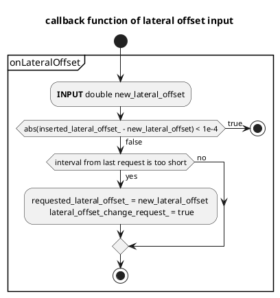
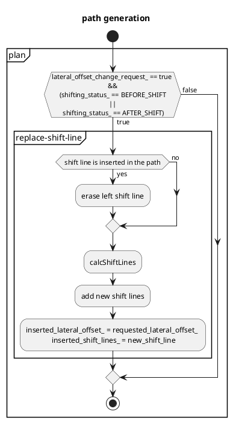
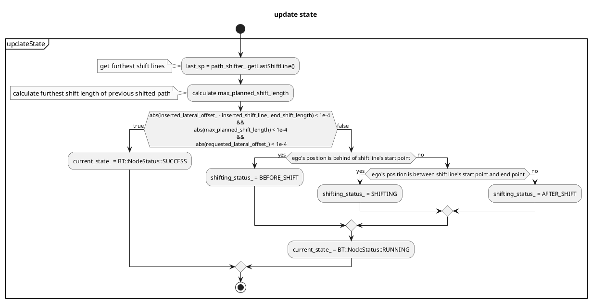

# 側方シフト設計

（リモート制御用）外部の指示に従って経路を左右にシフトします。

## 側方シフトモジュール処理の概要

1. 必要な横方向オフセット入力を受信します。
2. 次の条件下で`requested_lateral_offset_`を更新します。
  a. 最後の更新時刻が経過したか確認します。
  b. 必要な横方向オフセット値が前の値と異なることを確認します。
3. 側方シフトモジュールのステータスがSHIFTINGステータスの場合は、シフトポイントをパスに挿入します。

`requested_lateral_offset_`は最新の値で常に更新され、キューに入れられないことに注意してください。

## 側方シフトのステータス

側方シフトには3つの異なるステータスがあります。SHIFTINGステータスの間はパスを更新できないことに注意してください。

1. BEFORE_SHIFT：シフトの準備。
2. SHIFTING：現在シフト処理中。
3. AFTER_SHIFT：シフト完了。

<figure markdown>
  {width=1000}
  <figcaption>側方シフトのステータス</figcaption>
</figure>

## フローチャート

