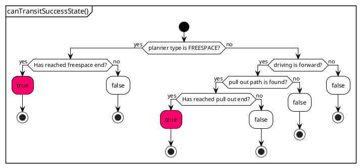
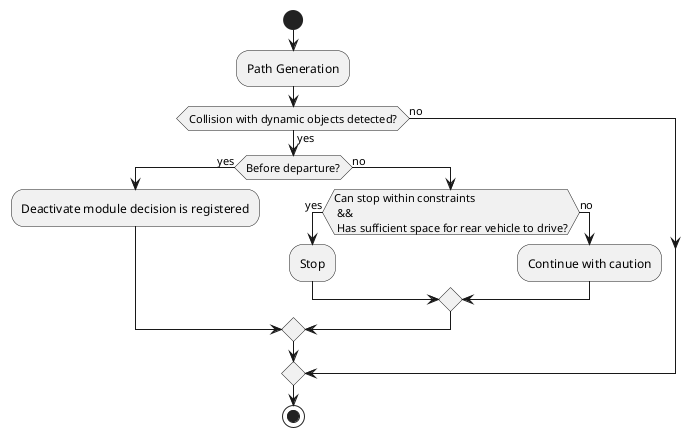
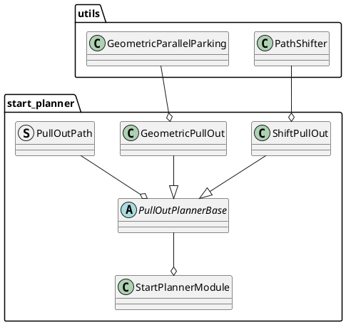

# スタートプランナ設計

## 目的 / 役割

このモジュールは、路肩車線または道路脇車線から道路車線の中央に安全に合流するための経路を生成して計画します。

具体的には、以下の機能を含みます。

- 路肩車線または道路脇車線から道路車線の中心まで自動的に開始するための経路を計画します。
- 路肩車線に駐車車両が存在する場合、モジュールは、指定されたマージンの隙間から開始できる経路を生成します。
- 生成された経路を走行中に他の交通参加者との衝突が検出された場合、可能な限り停止します。

<figure markdown>
  {width=1100}
</figure>

## ユースケース

経路生成がどのように実行されるかを示す、典型的な例を示します。経路生成は路肩車線から開始する例を示していますが、道路脇車線から開始する例も生成できます。

<figure markdown>
  {width=1100}
</figure>

### **ユースケース1: シフト・プルアウト**

路肩車線に前方に駐車車両がなく、路肩車線が十分な長さの場合、前進シフトプルアウト経路（連続したジャークを持つクロソイド曲線）が生成されます。

<figure markdown>
  {width=1100}
</figure>

### **ユースケース2: ジオメトリカル・プルアウト**

路肩車線に前方に障害物があり、後方に十分な長さがない場合、ジオメトリカルプルアウト経路が生成されます。

<figure markdown>
  {width=1100}
</figure>

### **ユースケース3: バックワード・アンド・シフト・プルアウト**

路肩車線に前方に駐車車両があり、後方に十分な長さがある場合、後退して前進シフトプルアウト経路を生成する経路が作成されます。

<figure markdown>
  {width=1100}
</figure>

### **ユースケース4: バックワード・アンド・ジオメトリカル・プルアウト**

路肩車線に前方に障害物があり、後退するのに十分なスペースがない場合、後退してジオメトリカルプルアウト経路を生成する経路が生成されます。

<figure markdown>
  {width=1100}
</figure>

### **ユースケース5: フリースペース・プルアウト**

シフトプルアウト経路とジオメトリカルプルアウト経路の両方が作成できない状況で、フリースペース経路を生成できる情報がマップに記載されている場合、フリースペースアルゴリズムに基づいた経路が生成されます。

**注:** これらの経路を生成するパターンは既定のパラメーターに基づいています。ただし、次のセクションで説明するように、経路生成ポリシーを変更したり、静的オブジェクトの周囲のマージンを調整したりすることで、後退を含む経路や、幾何学的経路が生成される可能性が高くなります。

## 制限

以下にいくつかの注目すべき制限を示します。

- 路肩の前後、または両側に駐車車両があり、規定された距離を維持できない場合、停止経路が生成され、潜在的なデッドロックにつながります。
- behavior_path_planner の既定設定では、回避モジュールが後段階で動作し、オブジェクトを回避しようとします。ただし、start_planner モジュールが障害物を回避できる経路を出力するとは限りません。つまり、回避不能な経路が生成されると、デッドロックが発生する可能性があります。
- 安全性のチェックのパフォーマンスは、map_based_prediction ノードで生成される予測経路の精度に依存します。現在、加速度を考慮した予測経路は生成されず、低速で移動するオブジェクトの経路は正確に生成されない可能性があることに注意してください。
- ルールベースアルゴリズムの現在の仕様によると、経路の安全性と人間の自然さとの間にはトレードオフがあります。このトレードオフを管理するためにパラメーターを調整することは可能ですが、これらの側面をより良く調和させるために改善が必要です。

## 開始/終了条件

### **開始条件**

`StartPlannerModule` は、`isExecutionRequested` 関数で評価された特定の基準に基づいて実行を開始するように設計されています。モジュールは、次の条件下では **開始しません**。

1. **道路中央での開始位置**: 車両の開始位置が道路の中央にあると判断された場合、モジュールは開始しません。これにより、プランナーは路肩の位置から開始されます。

2. **車両が開始位置から遠い**: 車両が開始位置から離れている場合、モジュールは実行されません。これにより、新しい目標が与えられた場合に冗長な実行が防止されます。

3. **車両が目標位置に到達**: 車両がすでに目標位置に到達している場合、モジュールは開始せず、目的地に到着したときに不要な実行を回避します。

4. **車両が走行中**: 車両がまだ走行中の場合、モジュールは開始を延期します。これにより、安全のために安定した静止状態からプランニングが実行されます。

5. **同じ経路セグメント内で目標位置が後方**: 目標位置が現在の経路上で自車位置の後方にある場合、モジュールは開始しません。この条件は、現在サポートされていない、車両が現在の経路で後退する必要がある経路のプランニングに伴う複雑さを回避するためにチェックされます。

### **終了条件**

`StartPlannerModule` は、使用されているプランナーの種類に応じて、特定の条件が満たされると終了します。`canTransitSuccessState` 関数は、以下の基準に基づいてモジュールを成功状態に移行する必要があるかどうかを判断します。

#### フリーパスプランナーがアクティブな場合

- フリーパス経路の終点に到達した場合、モジュールは成功状態に移行します。

#### その他の種類のプランナーがアクティブな場合

成功状態への移行は、次の条件によって決定されます。

- リバースパスが生成されている場合、またはプルアウトパスの検索に失敗した場合:
  - モジュールは成功状態に移行しません。
- プルアウトパスのシフトセクションの終点に到達した場合:
  - モジュールは成功状態に移行します。

以下のフローチャートは、`canTransitSuccessState` 関数における意思決定プロセスを示しています。

## セーフティアシュアランスのコンセプト

衝突防止アプローチは、静的情報を考慮した経路生成と、生成された経路の安全性を確保するためのダイナミック障害物との衝突検出という2つの主要コンポーネントに分かれています。

### 1. 静的情報を使用した経路生成

- **経路逸脱チェック**: 経路が指定されたレーンレット内に留まることを保証します。この機能はデフォルトで有効ですが、必要に応じて非アクティブ化できます。

- **経路からの静的障害物クリアランス**: これは、静的障害物の周辺に十分なマージンが維持されていることを確認することを含みます。このプロセスには、現在の位置からプルアウトのエンドポイントまでの車両サイズのフットプリントを作成することが含まれます。これはパラメータで調整できます。その後、静的障害物ポリゴンまでの距離が計算されます。この距離が指定された閾値より小さい場合、経路は安全でないと見なされます。閾値レベル（例：'[2.0, 1.0, 0.5, 0.1]'）は設定可能で、システムは、後続のセクションで説明する設定された検索優先順位に基づいて可能な限り最高の閾値を満たす経路を検索し、ポリシーに基づいて安全な経路の選択を確保します。最小閾値を満たす経路がなければ、安全な経路がないと判断されます。

- **静止物からのクリアランス**: 車両の前後に配置された静止物から十分な距離を維持することは、安全上不可欠です。経路と静止物に一定のマージンがあっても、シフト開始位置から前方の静止物までの距離が「`collision_check_margin_from_front_object`」メートル未満の場合、または後方の静止物までの距離が「`back_objects_collision_check_margin`」メートル未満の場合、経路は安全でないと見なされます。

  - なぜ前面のオブジェクトからのマージンが必要なのですか？
    クリアランスから静的障害物への経路が最小限で、前方に停止した車両がある「ジオメトリックプルアウトパス」のシナリオを検討します。この場合、経路は安全基準を満たしている可能性があり、したがって生成される可能性がありますが、同時に動作する回避モジュールは障害物を回避することが不可能であると見なす可能性があり、車両のデッドロックにつながる可能性があります。回避操作のための十分な距離を確保するために、前面障害物までの距離が評価されます。このパラメータを増やすことで、回避モジュール内での無効化を防ぐことができますが、後方経路またはジオメトリックプルアウトパスの生成頻度が高くなる可能性があり、人間には不自然に見える経路が生じる可能性があります。

  - なぜ後方のオブジェクトからのマージンが必要なのですか？
    前のオブジェクトの場合、経路から静的障害物へのクリアランスが最小限であっても、回避計画を通じて経路自体に上書きできる別のビヘイビアモジュールが存在するため、静的障害物から安全な距離を維持できます。ただし、車両の後ろにあるオブジェクトの場合、start_planner 以外の他のビヘイビアモジュールが経路を変更してマージンを確保することは不可能であり、「obstacle_cruise_planner」などのアクションモジュールによるデッドロックや、その後の無効化につながる可能性があります。したがって、後方の静止物に対するマージンが設定されています。

静的障害物からのクリアランスが「'[2.0, 1.0, 0.5, 0.1]'」に設定されている場合の開始ポーズ検索手順の表現を以下に示します。プロセスは次のとおりです。

1. **開始ポーズ候補の生成**

   - 車両の現在の位置を基準点として設定します。
   - 車両の後ろの最大「`max_back_distance`」までの考慮範囲を決定します。
   - 「backward_search_resolution」で定義された間隔で、後方方向に開始ポーズ候補を生成します。
   - 現在の位置を開始ポーズ候補の 1 つとして含めます。

   {width=1100}

2. **最大マージンで検索開始**

   - 最大しきい値（例：2.0 メートル）で検索を開始します。
   - 各開始ポーズ候補が 2.0 メートル以上のマージンを維持しているかどうかを評価します。
   - 同時に、その開始ポーズから生成された経路が他の必要な基準（例：経路逸脱チェック）を満たしていることを確認します。
   - 後述の検索優先順位に従って順番に評価し、条件を満たせば開始ポーズを採用します。

3. **しきい値レベルに応じた検索の繰り返し**

   - 条件を満たす開始ポーズが見つからない場合は、しきい値を次のレベル（例：1.0 メートル）まで下げて検索を繰り返します。

4. **検索の継続**

   - 条件を満たす開始ポーズが見つかるまで、またはしきい値レベルが最小値（例：0.1 メートル）に達するまで検索を続けます。
   - このプロセスの目的は、可能な限り大きなマージンを確保し、かつ経路に必要な条件を満たす開始ポーズを見つけることです。

5. **停止パスの生成**
   - どのしきい値レベルでも条件を満たす開始ポーズがない場合は、安全性を確保するために停止パスを生成します。

#### **検索優先順位**

静的障害物に対する十分なクリアランスを確保した安全な経路を前に生成できない場合、車両の現在の位置から後方検索を実行して、プルアウトパスの生成に適した開始点を特定します。

この後方検索中に、`search_priority`パラメータに基づいて異なるポリシーを適用できます。

`efficient_path` を選択すると、車両がどれほど後方に移動する必要があっても、シフトプルアウトパスを作成することに重点が置かれます。
`short_back_distance` を選択すると、できるだけ後方移動が少なくなる場所を探すことを目的としています。

** 優先順位 **

`PriorityOrder` は、各要素が開始姿勢候補のインデックスを表す `size_t` インデックスとプランナータイプで構成されるペアのベクトルとして定義されます。 PriorityOrder ベクトルは先頭から順次処理され、ベクトルの先頭にリストされたペアがプルアウトパスの生成で優先されます。

##### ** `efficient_path` **

`search_priority` が `efficient_path` に設定され、`shift_pull_out` を優先する場合、`PriorityOrder` 配列は `shift_pull_out` がすべての開始姿勢候補にグループ化された後、次のプランナータイプに移行するように設定されます。この優先順位は配列の順序に反映され、`shift_pull_out` が `geometric_pull_out` の前にリストされています。

| インデックス | Plan手法 |
|---|---|
| 0 | shift_pull_out |
| 1 | shift_pull_out |
| ... | ... |
| N | shift_pull_out |
| 0 | geometric_pull_out |
| 1 | geometric_pull_out |
| ... | ... |
| N | geometric_pull_out |

この手法では、`geometric_pull_out` に進む前に、`shift_pull_out` が適切である可能性が高い状況で効率的である可能性のある `shift_pull_out` ですべて候補を試すことを優先します。

##### `short_back_distance`

`search_priority` が `short_back_distance` に設定されている場合、アレイは各スタートポーズ候補のプランナタイプを交互に使用して、前の候補が成功した場合に車両が後方移動する距離を最小化できます。

| Index | Planningコンポーネント |
| ----- | -------------------- |
| 0     | shift_pull_out      |
| 0     | geometric_pull_out   |
| 1     | shift_pull_out      |
| 1     | geometric_pull_out   |
| ...   | ...                  |
| N     | shift_pull_out      |
| N     | geometric_pull_out   |

この順番付けは、後退距離を最小化することが優先される場合に有益であり、各プランナーに最も近い可能な開始位置で成功する平等な機会を与えます。

### 2. 動的障害物との衝突検出

- **動的衝突検出における RSS の適用**: 衝突検出は、安全距離が維持されているかどうかを評価するために RSS (責任感応型安全) モデルに基づいています。[安全確認機能の説明](../autoware_behavior_path_planner_common/docs/behavior_path_planner_safety_check.md) を参照してください。

- **衝突確認実行範囲**: 動的物体との衝突に対する安全確認は、各機動の開始点と終了点間の定義された境界内で行われ、自車位置が自分の後方から来る動的物体の進行を妨げたり、妨害したりしないことを保証します。

- **衝突対応ポリシー**: 生成されたパス上の動的物体との衝突が検出されると、出発前に衝突検出が発生した場合、モジュール非アクティブ決定が登録されます。車両がすでに動き始めた場合、制動制約内で実行可能であり、後続車両が自車と車線境界の隙間を通過できる場合に限り、停止を試みます。

#### **シフトプルアウトに対する安全機能検査の範囲の例**

シフトプルアウトに対する安全機能検証の範囲の例を提示する。安全機能検査はシフトの開始から終了まで実施される。自車輪郭が後方車両の走行に十分なスペースがない場合、動的物体に関連する安全機能検査は無効化される。

<figure markdown>
  {width=1100}
</figure>

**なお、後退動作時は安全機能検査は実施されない。安全機能検証は後退動作が停止した時点から開始される。**

## RTC（Remote Teleoperation Capability）インターフェース

本システムは、手動モードと自動モードで動作が大きく異なり、特に走行開始前、動的障害物とのやり取りにおいて違いがある。以下に、各モードの動作を記載する。

### 承認が必要な場合

#### 前進走行

- **走行開始承認必須**：経路が生成されていても、走行開始には承認が必要である。後方から接近する車両などの動的障害物が危険な場合、候補経路は表示されるが、走行開始には承認が必要である。

#### 後退走行 + 前進走行

- **複数回の承認が必要**：計画経路に後退走行が含まれる場合は、後退開始前と前進走行再開前に承認が必要である。前進走行開始前は、動的障害物に対する安全機能検査が実施される。障害物が検出された場合、走行開始承認が必要である。

この区別により、手動モード（`enable_rtc`が真の場合）において重要な場面で人間の介入が必要となり、自動モードおよび手動モードの両方で動的障害物が存在する場合に安全でない動作を防止するための自動安全機能検査を実施することで、安全な車両動作が確保される。

## 設計

## Planningコンポーネントの一般パラメータ

| パラメータ名                                                | 単位 | 型   | 説明                                                                                                                                                                                             | デフォルト値 |
| :------------------------------------------------------- | :---- | :----- | :------------------------------------------------------------------------------------------------------------------------------------------------------------------------------------------------------- | :------------------- |
| th_arrived_distance                                       | [m]   | double | 到達後経路終了距離のしきい値                                                                                                                                                             | 1.0                  |
| th_stopped_velocity                                       | [m/s] | double | 到達後経路終了速度のしきい値                                                                                                                                                             | 0.01                 |
| th_stopped_time                                           | [s]   | double | 到達後経路終了時間のしきい値                                                                                                                                                              | 1.0                  |
| th_distance_to_middle_of_the_road                       | [m]   | double | 車両が道路の中間点にいるかどうかを判断するための距離のしきい値                                                                                                                                   | 0.1                  |
| collision_check_margins                                 | [m]   | double | 障害物衝突チェックマージンのリスト                                                                                                                                                             | [2.0, 1.0, 0.5, 0.1] |
| shift_collision_check_distance_from_end                   | [m]   | double | 衝突チェック距離の終端からのシフト終端姿勢                                                                                                                                                           | -10.0                |
| geometric_collision_check_distance_from_end              | [m]   | double | 衝突チェック距離の終端幾何学的終端姿勢                                                                                                                                                              | 0.0                  |
| collision_check_margin_from_front_object                  | [m]   | double | 前方の対象からの衝突チェックマージン                                                                                                                                                              | 5.0                  |
| skip_rear_vehicle_check                                   | -     | bool   | 後続車両チェックをスキップするフラグ（後続車両チェックは、自動運転車が後続車両の進行を妨げているときに安全チェックをスキップして出発を続行するために実行される）                   | false                |
| extra_width_margin_for_rear_obstacle                    | [m]   | double | 自動運転車が路肩車線から車線に合流する間に、後方の障害物が自動運転車を追い抜くことができるかどうかを判断するときに、認知される後方の障害物の幅に追加される追加幅                   | 0.5                  |
| object_types_to_check_for_path_generation.check_car     | -     | bool   | getPathGen用車検フラグ                                                                                                                                                                    | true                 |
| object_types_to_check_for_path_generation.check_truck    | -     | bool   | getPathGen用トラック検査フラグ                                                                                                                                                                 | true                 |
| object_types_to_check_for_path_generation.check_bus      | -     | bool   | getPathGen用バス検査フラグ                                                                                                                                                                    | true                 |
| object_types_to_check_for_path_generation.check_bicycle | -     | bool   | getPathGen用自転車検査フラグ                                                                                                                                                                | true                 |
| object_types_to_check_for_path_generation.check_motorcycle | -     | bool   | getPathGen用オートバイ検査フラグ                                                                                                                                                              | true                 |
| object_types_to_check_for_path_generation.check_pedestrian | -     | bool   | getPathGen用歩行者検査フラグ                                                                                                                                                              | true                 |
| object_types_to_check_for_path_generation.check_unknown   | -     | bool   | getPathGen用障害物検査フラグ                                                                                                                                                                  | true                 |
| center_line_path_interval                                | [m]   | double | 参照中心線経路ポイント間隔                                                                                                                                                                   | 1.0                  |

### **自車速度計画**

未完成

### **障害物なし領域の安全確認**

未完成

## 安全確認のパラメータ

### 停止基準パラメータ

`stop_condition` のパラメータは停止条件の基準を定義します。

| 名称                             | 単位  | 型     | 説明                                 | デフォルト値 |
| :------------------------------- | :----- | :------ | :--------------------------------------- | :---------- |
| `maximum_deceleration_for_stop` | [m/s^2] | double | 停止時の最大減速度                       | 1.0          |
| `maximum_jerk_for_stop`          | [m/s^3] | double | 停止時の最大ジャーク                       | 1.0          |

### 自車予測経路パラメータ

`path_safety_check.ego_predicted_path` のパラメータは、自車予測経路特性を指定します。

| 名称                          | 単位    | 型    | 説明                                              | デフォルト値 |
| :---------------------------- | :------ | :----- | :------------------------------------------------- | :------------ |
| min_velocity                  | [m/s]   | double | 自車位置の予測経路の最小速度                 | 0.0           |
| acceleration                  | [m/s^2] | double | 自車位置の予測経路の加速度                   | 1.0           |
| max_velocity                  | [m/s]   | double | 自車位置の予測経路の最大速度                 | 1.0           |
| time_horizon_for_front_object | [s]     | double | 先方物体の予測時間幅                          | 10.0          |
| time_horizon_for_rear_object  | [s]     | double | 後方物体の予測時間幅                          | 10.0          |
| time_resolution               | [s]     | double | 自車位置の予測経路の時間分解能               | 0.5           |
| delay_until_departure         | [s]     | double | 自車が発進するまでの遅延時間                 | 1.0           |

### ターゲットオブジェクトフィルタリングのパラメーター

`target_filtering` のパラメーターは、セーフティチェックのためのターゲットオブジェクトのフィルタリングに関連しています。

| Name                                            | 単位 | タイプ   | 説明                                                                      | デフォルト値 |
| :---------------------------------------------- | :---- | :----- | :-------------------------------------------------------------------------- | :------------ |
| safety_check_time_horizon                       | [秒]  | 倍精度 | 自車と動的オブジェクトの予測パスの時間範囲                                | 5.0           |
| safety_check_time_resolution                    | [秒]  | 倍精度 | 自車と動的オブジェクトの予測パスの時間解像度                              | 1.0           |
| object_check_forward_distance                   | [m]   | 倍精度 | 物体検出の前方距離                                                         | 10.0          |
| object_check_backward_distance                  | [m]   | 倍精度 | 物体検出の後方距離                                                        | 100.0         |
| ignore_object_velocity_threshold                | [m/秒] | 倍精度 | 物体が無視される速度しきい値                                              | 1.0           |
| object_types_to_check.check_car                 | -     | ブール | 車を検査するためのフラグ                                                  | true          |
| object_types_to_check.check_truck               | -     | ブール | トラックを検査するためのフラグ                                              | true          |
| object_types_to_check.check_bus                 | -     | ブール | バスを検査するためのフラグ                                                | true          |
| object_types_to_check.check_trailer             | -     | ブール | トレーラーを検査するためのフラグ                                           | true          |
| object_types_to_check.check_bicycle             | -     | ブール | 自転車を検査するためのフラグ                                             | true          |
| object_types_to_check.check_motorcycle          | -     | ブール | オートバイを検査するためのフラグ                                          | true          |
| object_types_to_check.check_pedestrian          | -     | ブール | 歩行者を検査するためのフラグ                                            | true          |
| object_types_to_check.check_unknown             | -     | ブール | 不明なタイプのオブジェクトを検査するためのフラグ                            | false         |
| object_lane_configuration.check_current_lane    | -     | ブール | 現在の車線を検査するためのフラグ                                        | true          |
| object_lane_configuration.check_right_side_lane | -     | ブール | 右側の車線を検査するためのフラグ                                         | true          |
| object_lane_configuration.check_left_side_lane  | -     | ブール | 左側の車線を検査するためのフラグ                                        | true          |
| object_lane_configuration.check_shoulder_lane   | -     | ブール | 路肩を検査するためのフラグ                                              | true          |
| object_lane_configuration.check_other_lane      | -     | ブール | 他の車線を検査するためのフラグ                                          | false         |
| include_opposite_lane                           | -     | ブール | 反対車線を検査に含めるフラグ                                            | false         |
| invert_opposite_lane                            | -     | ブール | 反対車線の検査を反転するフラグ                                          | false         |
| check_all_predicted_path                        | -     | ブール | すべての予測パスを検査するためのフラグ                                  | true          |
| use_all_predicted_path                          | -     | ブール | すべての予測パスを使用するためのフラグ                                  | true          |
| use_predicted_path_outside_lanelet              | -     | ブール | 車線外側の予測パスを使用するためのフラグ                               | false         |

### 安全確認パラメータ

`safety_check_params` のパラメータは、安全確認の設定を定義しています。

| 名称                                         | 単位 | タイプ | 説明                                                                                                | デフォルト値 |
| :------------------------------------------- | :--- | :----- | :----------------------------------------------------------------------------------------------- | :------------ |
| enable_safety_check                          | -    | bool   | セーフティチェックを有効にするフラグ                                                           | true          |
| check_all_predicted_path                   | -    | bool   | 予測パスをすべてチェックするフラグ                                                           | true          |
| publish_debug_marker                         | -    | bool   | デバッグマーカーを発行するフラグ                                                            | false         |
| rss_params.rear_vehicle_reaction_time        | [s]  | double | 後続車の反応時間                                                                              | 2.0           |
| rss_params.rear_vehicle_safety_time_margin   | [s]  | double | 後続車のセーフティタイムマージン                                                          | 1.0           |
| rss_params.lateral_distance_max_threshold    | [m]  | double | 最大横方向距離のしきい値                                                                    | 2.0           |
| rss_params.longitudinal_distance_min_threshold | [m]  | double | 最小縦方向距離のしきい値                                                                    | 3.0           |
| rss_params.longitudinal_velocity_delta_time  | [s]  | double | 縦速度のデルタ時間                                                                        | 0.8           |
| hysteresis_factor_expand_rate                | -    | double | ヒステリシスの拡張/縮小率                                                                  | 1.0           |
| collision_check_yaw_diff_threshold           | -    | double | RSSベースのコリジョンチェックの実行時にEgoとオブジェクト間の最大ヨー差                   | 1.578         |

## **経路生成**

経路生成方法は2つあります。

### **Shift Pull Out**

最も基本的な経路計画開始の手法で、特に障害物がない道路の車線や路側帯で使用されます。

プルアウト距離は、速度、側方偏差、および側方ジャークによって計算されます。側方ジャークは、あらかじめ決められた最小値と最大値の中から検索され、安全な経路を生成するものが選択されます。

- 道路車線のセンターラインを生成し、現在の位置にシフトします。
- 合流開始点と終了点の間のセクションでは、回避経路の生成に使用される手法（4つのセグメント定常ジャーク多項式）で経路をシフトします。
- この経路を道路車線のセンターラインと組み合わせます。

[Shift Pull Out動画](https://user-images.githubusercontent.com/39142679/187872468-6d5057ee-e039-499b-afc7-fe0dc8052a6b.mp4)

#### Shift Pull Outのパラメーター

| 名称                                             | 単位   | タイプ   | 説明                                                                                                                                                                                                                                                                                                                                                                                                                                                           | デフォルト値 |
| :----------------------------------------------- | :----- | :----- | :----------------------------------------------------------------------------------------------------------------------------------------------------------------------------------------------------------------------------------------------------------------------------------------------------------------------------------------------------------------------------------------------------------------------------------------------------------------------------------------------------- | :------------ |
| enable_shift_pull_out                            | [-]    | bool   | Shift pull out を有効にするかどうか                                                                                                                                                                                                                                                                                                                                                                                                                                      | true          |
| check_shift_path_lane_departure                | [-]    | bool   | Shift path の車両逸脱量をチェックするかどうか                                                                                                                                                                                                                                                                                                                                                                                                                                  | true          |
| allow_check_shift_path_lane_departure_override | [-]    | bool   | エゴビークルの現在の位置がすでに車両逸脱中である場合に、車両逸脱のチェックを上書き/キャンセルするフラグ                                                                                                                                                                                                                                                                                                                                                                                                   | false         |
| shift_pull_out_velocity                        | [m/s]  | double | Shift pull out の速度                                                                                                                                                                                                                                                                                                                                                                                                                                                                        | 2.0           |
| pull_out_sampling_num                          | [-]    | int    | 横方向加速度の最小値から最大値の範囲内でサンプリングする回数                                                                                                                                                                                                                                                                                                                                                                                                                                      | 4             |
| maximum_lateral_jerk                           | [m/s3] | double | 最大横方向加速度                                                                                                                                                                                                                                                                                                                                                                                                                                                                                     | 2.0           |
| minimum_lateral_jerk                           | [m/s3] | double | 最小横方向加速度                                                                                                                                                                                                                                                                                                                                                                                                                                                                                     | 0.1           |
| minimum_shift_pull_out_distance                | [m]    | double | 最小 Shift pull out 距離。計算された pull out 距離がこれよりも短かった場合、Path 生成にこれを用いる。                                                                                                                                                                                                                                                                                                                                      | 0.0           |
| maximum_curvature                              | [1/m]  | double | 最大曲率。Shift pull out 距離を、参照パスが直線で、2 つの近似弧でシフトされたものと仮定して、この最大曲率から計算する。シフトパスまたは曲線内の曲率は考慮されない。                                                                                                                                                                                                                                                                    | 0.07          |
| end_pose_curvature_threshold                   | [1/m]  | double | Shift pull out 距離を計算するために使用される曲率の閾値。シフトのエンドポーズは、シフトのエンドポーズの曲率がこの値未満になるように前方にシフトされる。これは、エンドポーズが曲線上にある場合に生成されたパスに大きな曲率が発生するのを防ぐためである。閾値以下の曲率を持つシフトのエンドポーズが見つからない場合、Shift pull out 距離は特定の距離を越えた地点のうち、最も曲率が低い地点までの距離として使用される。 | 0.01          |

### **geometric pull out**

不連続的な曲率の 2 つの円弧パスを生成します。自動運転車はパスの途中で一度停止し、その場でステアリングを制御します。
アルゴリズムの詳細については [[1]](https://www.sciencedirect.com/science/article/pii/S1474667015347431) を参照してください。

[geometric pull out video](https://user-images.githubusercontent.com/39142679/181024707-3e7ca5ee-62de-4334-b9e9-ded313de1ea1.mp4)

#### geometric pull out のパラメータ

| 名称                                   | 単位 | タイプ | 説明                                                                                                                                                         | デフォルト値 |
| :-------------------------------------- | :---- | :----- | :---------------------------------------------------------------------------------------------------------------------------------------------------------------- | :------------ |
| enable_geometric_pull_out              | [-]   | bool   | ジオメトリプルアウトを有効にするフラグ                                                                                                                       | true          |
| divide_pull_out_path                   | [-]   | bool   | 円弧パスを分割するフラグ。曲率が連続ではないため、パスは分割されていると想定されます。ただし、出発中に停止が必要です。 | false         |
| geometric_pull_out_velocity            | [m/s] | double | ジオメトリプルアウトの速度                                                                                                                                  | 1.0           |
| lane_departure_margin                  | [m]   | double | 右側車線を逸脱する際の許容範囲                                                                                                                          | 0.2           |
| lane_departure_check_expansion_margin | [m]   | double | 車線逸脱チェック時の自車Footprintの拡大マージン                                                                                                               | 0.0           |
| pull_out_max_steer_angle               | [rad] | double | パス生成における最大操舵角                                                                                                                                 | 0.26          |

## **後退引き出し始点の検索**

現在の位置から安全な経路が生成できない場合、一定の間隔（デフォルト: `2.0`）で後退して引き出し開始点を探します。

[後退後の引き出しに関する動画](https://user-images.githubusercontent.com/39142679/181025149-8fb9fb51-9b8f-45c4-af75-27572f4fba78.mp4)

### **後退引き出し開始点検索のパラメータ**

| 名前                        | 単位 | タイプ   | 説明                                                                                                                                                                        | デフォルト値 |
| :-------------------------- | :--- | :----- | :----------------------------------------------------------------------------------------------------------------------------------------------------------------------- | :----------- |
| enable_back                 | [-]  | bool   | 開始点として後方検索するかどうか                                                                                                                                    | true         |
| search_priority             | [-]  | string | `efficient_path`の場合、後方距離が長くても効率的な経路を使用する。 `short_back_distance`の場合、後方距離が短い経路を使用 | efficient_path |
| max_back_distance           | [m]  | double | 後方距離の最大値                                                                                                                                                    | 30.0         |
| backward_search_resolution    | [m]  | double | 後方引き出し開始点の検索間隔                                                                                                                                          | 2.0          |
| backward_path_update_duration | [s]  | double | 後方引き出し開始点の検索時間間隔。これにより、後方走行と引き出しのチャッタリングを防ぐことができる                                                    | 3.0          |
| ignore_distance_from_lane_end | [m]  | double | シフト開始位置から側道レーンの終了までの距離がこの値より小さい場合、この開始位置の候補は無視される                                                          | 15.0         |

### **フリースペースでの引き出し**

車両が車線沿いの引き出しで立ち往生した場合、フリースペースでの引き出しを実行します。
この機能を実行するには、地図に `parking_lot` を設定し、 costmap_generator の `activate_by_scenario` を `false` にして、`enable_freespace_planner` を `true` にする必要があります。

#### フリースペースでの引き出しの未実装部分と制限事項

- 短い経路が生成された場合、自車はその経路で走行できません。
- 複雑なケースでは、生成時間が長くなるか失敗します。
- 走行可能エリアが parking_lot に収まることは保証されていません。

#### フリースペース駐車のパラメータ

| 名前                           | 単位 | 型       | 説明 | デフォルト値 |
| :----------------------------- | :--- | :------- | :------------------------------------------------------------------------------------------------------------------------------------- | :------------ |
| enable_freespace_planner       | [-]  | ブール   | 車両が走行する車線に障害物があり、車両が立ち往生した際に実行するフリースペースプルのフラグを有効にします | true          |
| end_pose_search_start_distance | [m]  | 倍精度 | 自車からfreespace_pull_outのドライビングレーンで終端点の検索を開始する地点までの距離 | 20.0          |
| end_pose_search_end_distance   | [m]  | 倍精度 | 自車からfreespace_pull_outのドライビングレーンで終端点の検索を終了する地点までの距離 | 30.0          |
| end_pose_search_interval       | [m]  | 倍精度 | freespace_pull_outのドライビングレーンで終端点を検索する間隔 | 2.0           |

その他の詳細は [freespace_planner](../autoware_freespace_planner/README.md) を参照してください。

