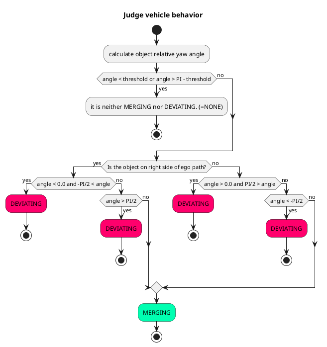
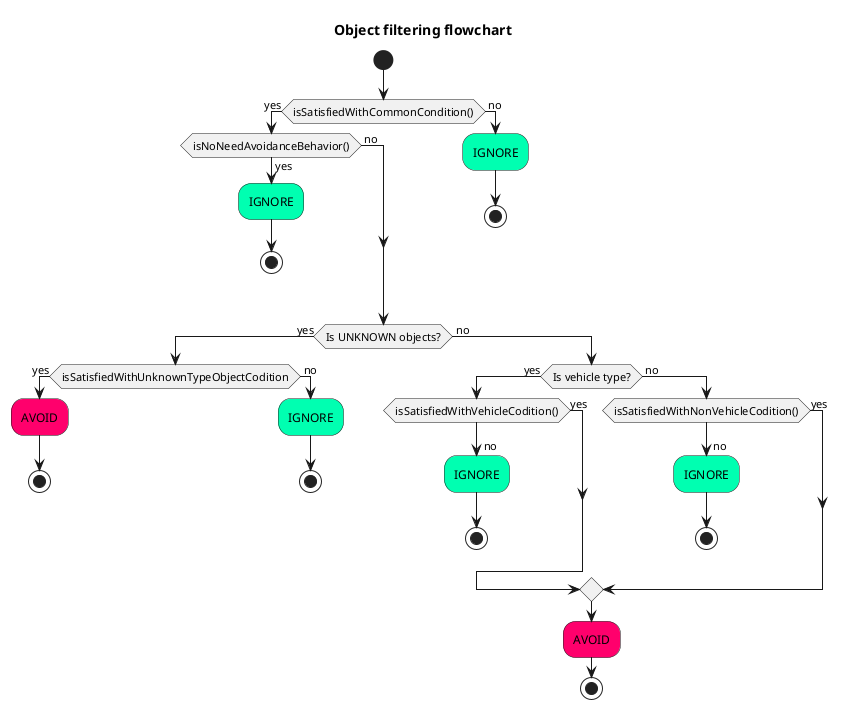
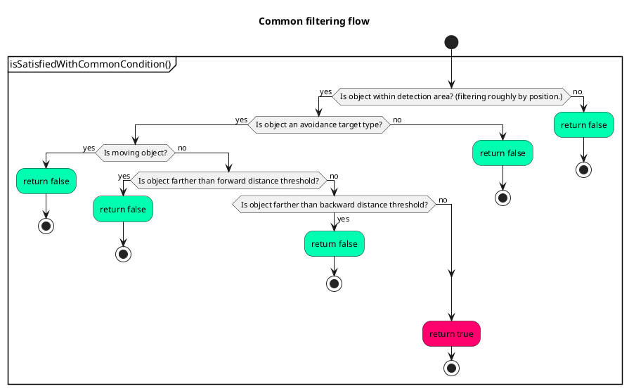
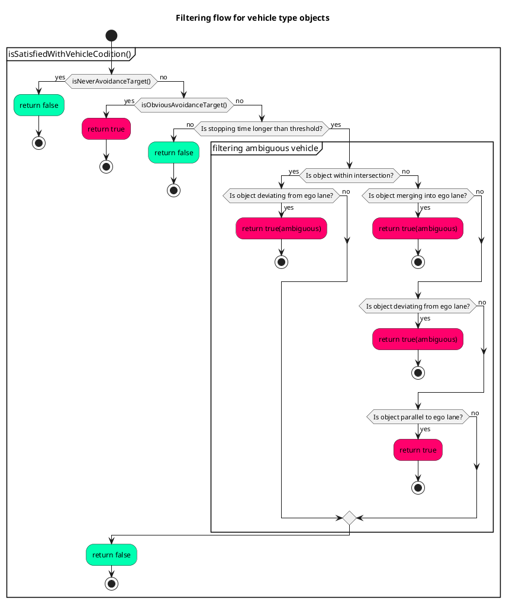
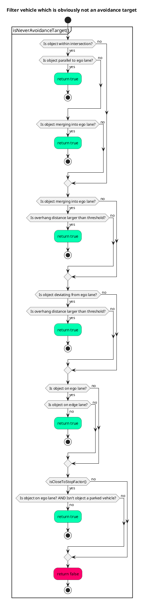
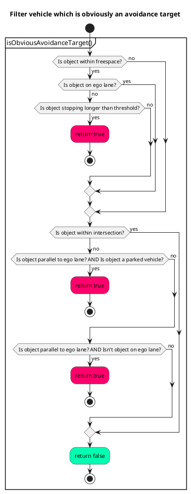
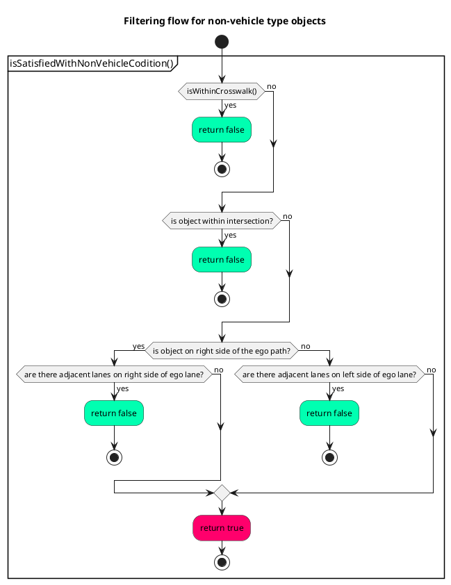
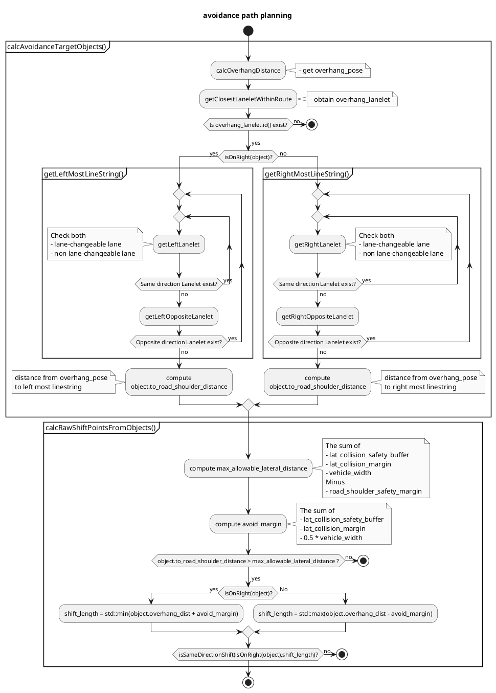

## 静止物回避モジュール


## 目的/役割

これはルールベースの回避モジュールで、知覚出力データ、HDマップ、現在のパスとルートに基づいて実行されます。このモジュールは、単純な状況における静止 (=停止) 物体に対する回避パスを作成するように設計されています。現在、このモジュールは動的 (=移動) 物体をサポートしていません。


このモジュールは[RTC インターフェイス](../../autoware_rtc_interface/README.md)を持ち、ユーザーは車両のセンサーの性能に応じてMANUAL/AUTOから運転モードを選択できます。ユーザーがMANUALモードを選択した場合、このモジュールは回避パスの候補を出力し、オペレーターの承認を待ちます。センサー/知覚の性能が不十分で誤検知が発生する場合は、不要な回避操作を防ぐためにMANUALモードをお勧めします。

ユーザーがAUTOモードを選択した場合、このモジュールはオペレーターの承認なしで現在の追従パスを変更します。センサー/知覚の性能が十分な場合は、AUTOモードを使用します。

### 制限事項

このモジュールにより、開発者は特定のルールを使用した回避計画における車両の動作を設計できます。ルールベースの計画の特性上、このアルゴリズムは複雑な場合における障害物との衝突を補正できません。これは、「直感的で設計が容易」と「調整が難しいが多くのケースに対応できる」とのトレードオフです。このモジュールは前者のポリシーを採用しているため、この出力を後工程でより厳密に確認する必要があります。`.iv` リファレンス実装では、モーション計画モジュールに、複雑なケースにおける回避処理を行うための最適化を使用する別の回避モジュールがあります。(モーションプランナーは、単純なケースで動作結果があまり変わらないように調整する必要があり、これは階層的挙動・モーションアーキテクチャにおける典型的な課題です。)

### 回避が挙動モジュールにある理由

このモジュールは車線をまたぐ回避を実行し、決定には交通ルールに対応する車線構造情報が必要です(例: 車両が車線を横断するときにウィンカー信号を送信する必要があります)。計画スタックにおけるモーションモジュールと挙動モジュールの違いは、プランナーが交通ルールを考慮するかどうかであり、この回避モジュールが挙動モジュールに存在する理由です。

<br>

詳細ではなく概要を知りたい場合は、次のセクションをスキップして[FAQ](#よくある質問)を参照してください。

## 内部動作/アルゴリズム

このモジュールには、主にターゲットフィルタリングとパスジェネレーションの2つの部分があります。最初に、すべてのオブジェクトがいくつかの条件でフィルタリングされます。このステップで、モジュールは回避の実現可能性と必要性をチェックします。その後、このモジュールは、フィルタリングされたオブジェクトを基に、**シフトライン**と呼ばれる回避パスの輪郭を生成します。シフトラインは[パスシフター](../autoware_behavior_path_planner_common/docs/behavior_path_planner_path_generation_design.md)に設定されます。パスシフターは、スムーズなシフトパスの生成に使用されるパスジェネレーション用のライブラリです。さらに、このモジュールには、エゴがターゲットオブジェクトを安全に回避できるように、ターゲット以外のオブジェクトをチェックする機能があります。この機能は、生成された回避パスと周囲のオブジェクトを受け取り、現在の状況を判断します。最後に、このモジュールは現在のエゴ挙動を更新します。

```plantuml
@startuml
skinparam monochrome true

title Overall flowchart
start

partition updateData() {
partition fillFundamentalData() {
:update fundamental data;
note right
 - reference pose
 - reference path:
      generated by spline interpolation of centerline path
      with dense interval
 - current lanelets
 - drivable bounds
 - avoidance start point
      calculate the point where the ego should start avoidance maneuver
      depending on traffic signal.
 - avoidance return point
      calculate the point where the ego should return original lane
      depending on traffic signal and goal position.
end note

:fillAvoidanceTargetObjects();
note right
  This module checks the following conditions:
  - target object type
  - being stopped
  - being around the ego-driving lane
  - being on the edge of the lane
  - ...
end note

:updateRegisteredObject();

:compensateDetectionLost();
}

partition fillShiftLine() {
:generate shift line;

:create candidate path;

:check candidate path;
note right
  This module checks following conditions:
  - is there enough distance between surrounding moving vehicles and ego path to avoid target safely?
  - is the path jerky?
  - is the path within drivable area?
end note
}

partition fillEgoStatus() {
:getCurrentModuleState();
note right
  This module has following status:
  - RUNNING: target object is still remaining. Or, the ego hasn't returned to original lane.
  - CANCEL: target object has gone. And, the ego hasn't initiated avoidance maneuver.
  - SUCCEEDED: the ego finishes avoiding all objects and returns to original lane.
end note

if (canYieldManeuver()) then (yes)
if (Is the avoidance path safe?) then (yes)
else (no)
:transit yield maneuver;
note right
  Check current situation.
  This module can transit yield maneuver only when the ego hasn't initiated avoidance maneuver.
end note
endif

else (no)

endif
}
}
stop

start
partition isExecutionRequested() {
if (Is there an object that should/can be avoided immediately?) then (yes)
:return true;
stop
else (no)
endif

if (Does it generate new shift lines successfully?) then (yes)
else (no)
:return false;
stop
endif

if (Is there object that is potentially avoidable?) then (yes)
:return true;
note right
  Sometimes, there are situations where there is enough space to avoid
  but ego speed is too high to avoid target object under lateral jerk constraints.
  This module keeps running in this case in order to decelerate ego speed.
end note
stop
else (no)
:return false;
endif
}
stop

start
partition plan() {
partition updatePathShifter() {
if (Is approved?) then (yes)
:add new shift lines to path shifter;
else (\n yes)
endif
}

if (Is current status SUCCEEDED?) then (yes)
:removeRegisteredShiftLines();
:output previous module output;
stop
else (no)
endif

if (Is current status CANCEL?) then (yes)
:removeRegisteredShiftLines();
:output previous module output;
stop
else (no)
endif

if (Is in YIELD maneuver?) then (yes)
:removeRegisteredShiftLines();
else (no)
endif

:generate avoidance path;

:calculate turn signal;

partition updateEgoBehavior() {
:insertPrepareVelocity();
note right
  This module inserts slow down section so that the ego can avoid target object under lateral jerk constraints.
end note
:insertAvoidanceVelocity();
note right
  This module controls ego acceleration until the ego passes the side of the target object.
end note

if (Is in YIELD maneuver?) then (yes)
:insertWaitPoint();
note right
  This module inserts stop point.
  The ego keeps stopping until this module judges the ego can avoid target object safely.
end note
else (no)
endif

if (Is waiting operator approval?) then (yes)
:insertWaitPoint();
note right
  This module inserts stop point.
  The ego keeps stopping until operator approves avoidance maneuver.
end note
else (no)
endif

:insertReturnDeadLine();
}

:generate drivable area;
}
stop

@enduml
```




## ターゲットオブジェクトフィルタリング

### 概要

このモジュールは、回避するターゲットオブジェクトをフィルタリングするために、以下の条件を使用します。

| 条件の確認                                                                                                                              | ターゲットクラス                   | 詳細                                                                                                                                                                                                                 | 条件が満たされない場合                   |
| --------------------------------------------------------------------------------------------------------------------------------------------- | --------------------------------- | ------------------------------------------------------------------------------------------------------------------------------------------------------------------------------------------------------------------------------- | ------------------------------------------ |
| 回避対象クラスオブジェクトですか？                                                                                                           | 全て                               | 設定ファイルから回避対象クラスを選択できます。                                                                                                                                                                       | 回避しません。                               |
| 停止中のオブジェクトですか？                                                                                                          | 全て                               | `th_moving_speed`よりも速い速度を`th_moving_time`よりも長い時間維持するオブジェクトは移動中と判断されます。                                                                                                   | 回避しません。                               |
| 検知エリア内ですか？                                                                                                                  | 全て                               | モジュールは設定ファイルの横方向マージンに基づいて対象オブジェクトを大まかにフィルターするために検知エリアを作成します。（[こちら](#width-of-detection-area)を参照）                                                   | 回避しません。                               |
| オブジェクトとパスの間に十分な横方向距離がないですか？                                                                              | 全て                               | -                                                                                                                                                                                                                      | 回避しません。                               |
| 自車線のセンターラインの近くですか？                                                                                                       | 全て                               | -                                                                                                                                                                                                                      | その他の条件によって異なります。           |
| オブジェクトの近くに横断歩道がありますか？                                                                                                    | 歩行者、自転車                    | モジュールは横断歩道の近くに歩行者と自転車を回避しません。横断歩道で道路を渡っている場合、自車は停止する必要があるからです。（[こちら](#for-crosswalk-users)を参照）                                       | 回避しません。                               |
| パス上のオブジェクトと信号との距離がしきい値よりも長くなっていますか？                                                                  | 乗用車、トラック、バス、トレーラー | この条件は、車両が駐車されているかどうかが不明な場合に使用されます。                                                                                                                                                       | その他の条件によって異なります。           |
| パス上のオブジェクトと横断歩道信号との距離がしきい値よりも長くなっていますか？                                                    | 乗用車、トラック、バス、トレーラー | 上記と同じ。                                                                                                                                                                                                   | その他の条件によって異なります。           |
| 停止時間がしきい値よりも長くなっていますか？                                                                                              | 乗用車、トラック、バス、トレーラー | 上記と同じ。                                                                                                                                                                                                   | その他の条件によって異なります。           |
| 交差点内ですか？                                                                                                                        | 乗用車、トラック、バス、トレーラー | モジュールは交差点内に駐車車両がないことを前提としています。                                                                                                                                                              | その他の条件によって異なります。           |
| 自車線上にありますか？                                                                                                                      | 乗用車、トラック、バス、トレーラー | -                                                                                                                                                                                                                      | その他の条件によって異なります。           |
| 駐車車両ですか？                                                                                                                          | 乗用車、トラック、バス、トレーラー | モジュールは横方向オフセットに基づいて車両が駐車車両かどうかを判断します。（[こちら](#judge-if-its-a-parked-vehicle)を参照）                                                                                    | その他の条件によって異なります。           |
| 他車線から自車線に合流していますか？                                                                                                       | 乗用車、トラック、バス、トレーラー | モジュールはヨー角とオフセットの方向に基づいて車両の挙動を判断します。（[こちら](#judge-vehicle-behavior)を参照）                                                                                                 | その他の条件によって異なります。           |
| 自車線から他車線に合流していますか？                                                                                                       | 乗用車、トラック、バス、トレーラー | 上記と同じ。                                                                                                                                                                                                   | その他の条件によって異なります。           |

### 一般的な条件

#### 検出エリア

モジュールは、以下のパラメータに基づいて、ターゲットのフィルタリング用の検出エリアを生成します。


```yaml
      # avoidance is performed for the object type with true
      target_object:
      ...
          lateral_margin:
            soft_margin: 0.3                            # [m]
            hard_margin: 0.2                            # [m]
            hard_margin_for_parked_vehicle: 0.7         # [m]
      ...
      # For target object filtering
      target_filtering:
      ...
        # detection area generation parameters
        detection_area:
          static: false                                 # [-]
          min_forward_distance: 50.0                    # [m]
          max_forward_distance: 150.0                   # [m]
          backward_distance: 10.0                       # [m]
```

##### 検出領域の幅

1. 全てのクラス（車両、トラックなど）の最大の側方マージンを取得します。マージンは`soft_margin`と`hard_margin_for_parked_vehicle`の合計です。
2. 検出領域の幅は自車幅と最大の側方マージンの合計です。

##### 検出領域の縦方向距離

パラメータ`detection_area.static`が`true`に設定されている場合、モジュールは縦方向距離が`max_forward_distance`の検出領域を作成します。

パラメータ`detection_area.static`が`false`に設定されている場合、モジュールは自車が最小の側方ジャーク値でオブジェクトを回避できるように検出領域を作成します。したがって、縦方向距離は最大側方シフト長、側方ジャーク制約、および現在の自車速度によって異なります。さらに、準備段階で使用される距離も考慮する必要があります。


```c++
...
    const auto max_shift_length = std::max(
      std::abs(parameters_->max_right_shift_length), std::abs(parameters_->max_left_shift_length));
    const auto dynamic_distance =
      PathShifter::calcLongitudinalDistFromJerk(max_shift_length, getLateralMinJerkLimit(), speed);

    return std::clamp(
      1.5 * dynamic_distance + getNominalPrepareDistance(),
      parameters_->object_check_min_forward_distance,
      parameters_->object_check_max_forward_distance);
```

### 車両以外のオブジェクトの条件

#### 歩行者用横断歩道利用者の場合

歩行者と自転車が横断歩道に2.0m（現在はハードコーディング）未満近接した場合、このモジュールはこの歩行者らが交差点を横断していると判断し、回避しません。


### 車両タイプのオブジェクトの条件

#### 車両の挙動の判定

このモジュールは、ヨー角とオフセット方向に基づいて車両を以下の3つの挙動に分類します。


```yaml
# params for filtering objects that are in intersection
intersection:
  yaw_deviation: 0.349 # [rad] (default 20.0deg)
```

| 動作  | 詳細                                                                                                          | 図形                                       |
| ------ | ----------------------------------------------------------------------------------------------------------------- | -------------------------------------------- |
| NONE  | オブジェクトの車線に対する相対的な偏角が閾値 `yaw_deviation` 未満の場合、`NONE` に分類されます。 |       |
| MERGING   | 以下のフローチャートを参照してください。                                                                       |    |
| DEVIATING | 以下のフローチャートを参照してください。                                                                       |  |




#### 駐車車両の判定

センターラインからの距離だけでなく、路肩からの距離も計算して、フィルタリング処理に使用します。このロジックでは、次のとおり**実際のシフト長**と**シフト可能なシフト長**の比率を計算します。結果がしきい値 `th_shiftable_ratio` よりも大きい場合、このモジュールは車両が駐車車両であると判断します。

$$
L_{d} = \frac{W_{lane} - W_{obj}}{2}, \\
ratio =  \frac{L_{a}}{L_{d}}
$$

- $L_{d}$ : シフト可能な長さ。
- $L_{a}$ : 実際のシフト長。
- $W_{lane}$ : レーン幅。
- $W_{obj}$ : オブジェクトの幅。


### ターゲットオブジェクトのフィルタリング

| 状況                                                                                                                   | 詳細                                                   | 自車動作                                                                                               |
| ---------------------------------------------------------------------------------------------------------------------------- | ----------------------------------------------------------- | ---------------------------------------------------------------------------------------------------------- |
| 自車がHDMapで定義された交差点エリア内にある場合。このモジュールは、車線を走行中または自車線に合流中の車両を無視する |  | 回避しない。                                                                                            |
| 自車が自車線上にいる場合、両側に隣接した車線がある |  | 回避しない。                                                                                            |
| 自車線から他の車線に合流中の車両。その車両のフットプリントの大部分が自車線にある |  | 回避しない。                                                                                            |
| 他の車線から自車線に合流中の車両。その車両のフットプリントの大部分が自車線にある |  | 回避しない。                                                                                            |
| 駐車しているようには見えないが、横断歩道または信号の前に停止している車両 |  | 回避しない。                                                                                            |
| 道路脇に停車しようとして自車線上で停止した車両 |  | すぐに回避する。                                                                                        |
| 隣接した車線で停止した車両 |  | すぐに回避する。                                                                                        |
| 道路脇に停車せずに自車線上で停止した車両 |  | パラメータ`avoidance_for_ambiguous_vehicle.enable`を`true`に設定すると、モジュールは不明瞭な車両を回避する。 |
| 他の車線から自車線に合流中の車両 |  | パラメータ`avoidance_for_ambiguous_vehicle.enable`を`true`に設定すると、モジュールは不明瞭な車両を回避する。 |
| 自車線から他の車線に合流中の車両 |  | パラメータ`avoidance_for_ambiguous_vehicle.enable`を`true`に設定すると、モジュールは不明瞭な車両を回避する。 |

### フローチャート

`isSatisfiedWithCommonCondition()`, `isSatisfiedWithVehicleCondition()`, `isSatisfiedWithNonVehicleCondition()`の3つのメインフィルタリング関数があります。フィルタリングプロセスは次のフローチャートに従って実行されます。さらに、このモジュールはコンフィグファイル内のオブジェクトの姿勢、エゴパス、横マージンに基づいて`isNoNeedAvoidanceBehavior()`で回避の必要性を確認します。




#### 共通条件

まず、`isSatisfiedWithCommonCondition()` 関数には、すべてのオブジェクトクラスに使用される条件が含まれます。




#### 車両の条件

対象クラス:

- 乗用車
- トラック
- バス
- トレーラー

次のステップとして、オブジェクトはそのクラスに特化した条件でフィルタリングされます。










#### 非車両オブジェクトの条件

- 歩行者
- 自転車




## ターゲット オブジェクトが消えたとき

ターゲット オブジェクトが消えた際のエゴの動作は、ユーザーが選択できます。


```yaml
cancel:
  enable: true # [-]
```

上記のパラメータが「真」の場合、以下の条件を満たしたときにこのモジュールは回避経路を戻します。

- すべてのターゲットオブジェクトが消えた
- 主体は回避操作を開始していない


パラメータが「偽」の場合、このモジュールはターゲットオブジェクトが消えた後も実行し続けます。

## パス生成

### 知覚ノイズによるシフトラインのチャタリングを防ぐ方法

オブジェクト認識結果は位置、向き、多角形の形状に関連するノイズを含んでいるため、モジュールがパス生成で生のオブジェクト認識結果を使用すると、出力パスはノイズによって直接影響を受けます。そのため、このモジュールはノイズの影響を低減するために、各ターゲットオブジェクトの多角形を生成し、それをもとに出力パスを生成します。


エンベロープ多角形は長方形のボックスで、サイズはオブジェクトの多角形とバッファパラメータ「envelope_buffer_margin」によって異なります。さらに、常に基準パスと平行です。モジュールがターゲットオブジェクトを初めて検出したとき、多角形を初期化します。


```yaml
        car:
          ...
          envelope_buffer_margin: 0.5                   # [m] FOR DEVELOPER
```

### 封筒ポリゴンの生成

このモジュールは、各計画サイクルで最新のオブジェクトの姿勢と生ポリゴンを使用してワンショット封筒ポリゴンを作成します。一方で、このモジュールは前回の計画サイクルで作成された封筒ポリゴン情報を使用して、姿勢共分散を考慮して封筒ポリゴンを更新します。

姿勢共分散がしきい値より小さい場合、封筒ポリゴンは次のロジックに従って更新されます。ワンショット封筒ポリゴンが以前の封筒ポリゴン内にある場合、モジュールは新しい封筒ポリゴンを作成します。それ以外の場合、以前の封筒ポリゴンが維持されます。


姿勢共分散がしきい値より大きい場合、各オブジェクトの最大姿勢共分散と比較されます。値が小さい場合、ワンショット封筒ポリゴンが封筒ポリゴンとして直接使用されます。それ以外の場合、以前の封筒ポリゴンが維持されます。

この処理により、知覚出力がオブジェクトの姿勢または形状にノイズを含んでいても、封筒ポリゴンのサイズと姿勢は収束します。

### 封筒ポリゴンと回避パスの関係

回避パスには 2 つのシフトセクションがあり、その開始点または終了点の位置は封筒ポリゴンによって決まります。回避シフトセクションの終了点と帰還シフトセクションの開始点は、封筒ポリゴンと反対側のエッジに基づいて固定され、他の側面は自車速度、シフトの長さ、横方向ジャークの制約などに基づいて動的に変化します。

2 つの点の横方向の位置は、自車本体と封筒ポリゴン境界点の最もオーバーハングした点の間に十分なスペース (= 横方向余裕) ができるようになっています。ユーザーは、次のパラメーターを使用して横方向余裕を調整できます。


```yaml
        car:
          ...
          lateral_margin:
            soft_margin: 0.3                            # [m]
            hard_margin: 0.2                            # [m]
            hard_margin_for_parked_vehicle: 0.7         # [m]
```

縦方向の位置は、エンベロープ多角形、自車仕様、次のパラメーターに依存します。回避シフトセクションの終点とエンベロープ多角形 (つまり前面縦方向バッファ) との縦方向距離は、`consider_front_overhang` パラメーターが `true` の場合、`vehicle_info.param.yaml` で定義された `front_overhang` と `longitudinal_margin` の合計です。`consider_front_overhang` が `false` の場合、`longitudinal_margin` のみが考慮されます。同様に、復帰シフトセクションの始点とエンベロープ多角形 (つまり後方縦方向バッファ) との距離は、`rear_overhang` と `longitudinal_margin` の合計です。


```yaml

      target_object:
        car:
          ...
          longitudinal_margin: 0.0                      # [m]

      ...
      avoidance:
        ...
        longitudinal:
          ...
          consider_front_overhang: true                 # [-]
          consider_rear_overhang: true                  # [-]
```

### 横断マージン

上記のとおり、横断マージンは次の2種類のタイプのパラメータを変更することで調整できます。`soft_margin`は横断マージンのソフト制約パラメータです。`hard_margin`と`hard_margin_for_parked_vehicle`はハード制約パラメータです。


```yaml
        car:
          ...
          lateral_margin:
            soft_margin: 0.3                            # [m]
            hard_margin: 0.2                            # [m]
            hard_margin_for_parked_vehicle: 0.7         # [m]
```

## 回避経路生成モジュール

このモジュールは基本的に、回避対象オブジェクトからの横方向距離（`soft_margin` と `hard_margin`/`hard_margin_for_parked_vehicle` の合計）を保つための回避経路を生成しようとします。


ただし、`soft_margin` 距離を維持する十分なスペースがない場合、このモジュールは制約なし横方向マージンを短くします。パラメーター `soft_margin` は制約なしの最大値で、実際の制約なしマージンは 0.0 から `soft_margin` の間の値になります。一方、このモジュールは状況に応じて `hard_margin` または `hard_margin_for_parked_vehicle` を必ず維持します。したがって、横方向全マージンの最小値は `hard_margin`/`hard_margin_for_parked_vehicle`、最大値は `hard_margin`/`hard_margin_for_parked_vehicle` と `soft_margin` の合計になります。

次の図は、ユーザーがパラメーター `use_lane_type` を `same_direction_lane` に設定した場合、このモジュールが反対車線で走行しないために横方向制約なしマージンを短くする状況を示しています。


このモジュールは一時的に何らかの理由で停止している駐車されていない車両（例：信号が赤から青に変わるのを待っている）だけではなく、駐車車両も回避します。さらに、このモジュールには 2 つタイプのハードマージンパラメーター `hard_margin` と `hard_margin_for_parked_vehicle` があり、車両のドアが突然開いたり、駐車車両から人が降りたりするリスクを考慮して各車両が駐車車両であるかどうかを判断します。

ユーザーは、ドアや車両から突然降りてくる人との衝突を防ぐために、`hard_margin_for_parked_vehicle` を `hard_margin` より大きく設定する必要があります。

このモジュールには、制約なし横方向マージンに関するパラメーター `soft_margin` が 1 つだけあります。


ハードマージンパラメーターはユーザーが確実に維持したい距離を定義するため、回避操作を実行せずにエゴが対象オブジェクトの側面を通過できるかどうかをチェックするロジックでも使用されます。

回避操作なしでエゴが現在のレーンに従うと仮定した場合、横方向距離が `hard_margin`/`hard_margin_for_parked_vehicle` より小さい場合、このモジュールはエゴがオブジェクトの側面を安全に通過できないと判断し、回避する必要があります。この場合、このモジュールは回避操作の実行が許可されるまで停止点を入力し、エゴが承認後にオブジェクトを回避できるようにします。（たとえば、モジュールが MANUAL モードの場合、エゴはオペレータが回避操作を承認するまでそのようなオブジェクトの前で停止し続けます。）


一方、横方向距離が `hard_margin`/`hard_margin_for_parked_vehicle` より大きい場合、このモジュールは承認を待っている場合でも停止点を挿入しません。それは、オブジェクトの側面を安全に通過できる可能性があると考えるためです。


### スペースが不足している場合

このモジュールは、エゴがオブジェクトを回避できる可能性がある場合にのみ停止点を挿入します。したがって、横方向距離を `hard_margin`/`hard_margin_for_parked_vehicle` より大きく維持できない場合、このモジュールは何も行いません。次の図は、ユーザーがパラメーター `use_lane_type` を `same_direction_lane` に設定した場合、このモジュールが十分な横方向距離を維持できない状況を示しています。


!!! info

    この状況では、[obstacle_cruise_planner](../../autoware_obstacle_cruise_planner/README.md) の障害物停止機能がエゴ車両の安全を担保します。


### シフト長の計算

横方向シフト長は、`overhang_distance`、横方向マージン（config ファイルで設定した値）、`vehicle_info.param.yaml` で定義されたエゴ車両幅の半分から構成されます。一方、このモジュールは、回避操作に使用できるスペースとパラメーター `soft_drivable_bound_margin` と `hard_drivable_bound_margin` に応じてシフト長を制限します。基本的に、シフト長はエゴが `soft_drivable_bound_margin` より近い位置に走行可能な境界線に近づかないように制限されます。ただし、モジュールは道路幅が狭い場合、しきい値を `soft_drivable_bound_margin` から `hard_drivable_bound_margin` に緩和することを許可します。


回避モジュールの使用可能なレーンは、config ファイルを使用して選択できます。


```yaml
      ...
      # drivable lane setting. This module is able to use not only current lane but also right/left lane
      # if the current lane(=lanelet::Lanelet) and the right/left lane share the boundary(=lanelet::Linestring) in HDMap.
      # "current_lane"           : use only current lane. This module doesn't use adjacent lane to avoid object.
      # "same_direction_lane"    : this module uses same direction lane to avoid object if needed.
      # "opposite_direction_lane": this module uses both same direction and opposite direction lanes.
      use_lane_type: "opposite_direction_lane"
```

### 使用レーンのタイプの設定
ユーザーがパラメータ `use_lane_type` を `opposite_direction_lane` に設定した場合、逆走車線を走行できます。


ユーザーがパラメータ `use_lane_type` を `same_direction_lane` に設定した場合、モジュールは逆走車線を重複するパスは生成しません。


### シフトライン生成

前述のとおり、エンベロープポリゴンから回避シフトパスのエンドポイントと、リターンシフトパスのスタートポイントがFIXEDポイントとして計算されます。このモジュールでは、次に、シフト距離、現在の自車速度、コンフィグファイルで定義された横方向ジャーク制限パラメータに応じて、他のサイドポイントを調整します。

2つのポイントは常に自車線の中心線上に存在するため、モジュールは次の関数に基づいてシフトのスタートポイントとエンドポイント間の縦方向距離のみを計算します。この関数はパスシフタライブラリで定義されています。[こちら](../autoware_behavior_path_planner_common/docs/behavior_path_planner_path_generation_design.md)のページも参照してください。


```c++
double PathShifter::calcLongitudinalDistFromJerk(
  const double lateral, const double jerk, const double velocity)
{
  const double j = std::abs(jerk);
  const double l = std::abs(lateral);
  const double v = std::abs(velocity);
  if (j < 1.0e-8) {
    return 1.0e10;
  }
  return 4.0 * std::pow(0.5 * l / j, 1.0 / 3.0) * v;
}
```

回避開始地点と終了地点を結ぶ線を `shift_line` と呼び、回避経路はスプライン補完によって生成されます。

回避開始地点には、もう 1 つの縦方向拘束があります。回避操作を開始する前にウインカーを数秒間点灯し続けるために、回避開始地点は自分の位置から自己速度に応じた値（距離を `prepare_length` と呼びます）よりも遠くなければなりません。


```yaml
longitudinal:
  min_prepare_time: 1.0 # [s]
  max_prepare_time: 2.0 # [s]
  min_prepare_distance: 1.0 # [m]
```

`prepare_length`は自己速度と`max_prepare_time`の積として計算されます。(自己速度がゼロの場合、`min_prepare_distance`が使用されます。)


## 赤信号でのPlanning

このモジュールは信号情報を考慮に入れて、自己車が適切に動作できるようにします。自己車が車線境界線を超えている場合でも、そのような状況で赤信号の前に停止しないようにする必要があります。これは、自己車が隣接車線を塞いでしまい、他の車両に迷惑がかかるためです。


そのため、このモジュールはシフト長とシフトの開始/終了点を制御して、上記のような状況を防ぎます。

### シフト長の制御

まず、自己車が回避操作を開始していない場合、このモジュールは最大シフト長を制限し、赤信号の間は**現在の車線のみ**を使用します。これにより、このモジュールが回避操作を実行し、自己車が赤信号に捕らえられたとしても、自己車が他の車両を塞ぐのを防ぎます。


### 回避シフト開始点の制御

さらに、目標物体が信号の停止線より遠方の場合は、このモジュールは回避シフト開始点を停止線に設定して、回避操作中に自己車が赤信号で停止するのを防ぎます。


### 復帰シフト終了点の制御

自己車がすでに回避操作を開始している場合、このモジュールは復帰シフト終了点を停止線に設定しようとします。


## セーフティチェック

この機能は次のパラメータを`true`に設定することで有効にできます。


```yaml
      safety_check:
        ...
        enable: true                                    # [-]
```

このモジュールは回避対象物だけでなく、回避経路の近くに存在する非対象物にも注意を払い、周囲の物体が原因で回避経路が安全でない場合は、回避操舵を解除し、車線を譲ります。


### 譲渡操舵

さらに、このモジュールは譲渡操舵の際、通常、回避対象物の前に停止点を挿入し、安全に回避できるようになるまで十分な距離を保ちます。移動先の車線が渋滞している場合、自車は停止して待ちます。

この機能は、次のパラメーターを `true` に設定することで有効にできます。


```yaml
yield:
  enable: true # [-]
```


ただし、横方向の余白が「`hard_margin`」を超えている場合（または「`hard_margin_for_parked_vehicle`」を超えている場合）は、このモジュールは停止点は挿入しません。エゴは回避操作なしで対象物の側面を安全に通過できるためです。


### 安全チェック対象車線

ユーザーは、以下のパラメーターを使用して安全チェックエリアを選択できます。基本的に、シフト側の車線のみを確認するための以下の設定を推奨します。安全を厳格に確認したい場合は、`check_current_lane` および/または `check_other_side_lane` を `true` に設定してください。


```yaml
      safety_check:
      ...
        check_current_lane: false                       # [-]
        check_shift_side_lane: true                     # [-]
        check_other_side_lane: false                    # [-]
```

回避モジュールでは、`path_safety_checker::isCentroidWithinLanelet` 関数はレーンのオブジェクトをフィルタリングするために使用されます。


```c++
bool isCentroidWithinLanelet(const PredictedObject & object, const lanelet::ConstLanelet & lanelet)
{
  const auto & object_pos = object.kinematics.initial_pose_with_covariance.pose.position;
  lanelet::BasicPoint2d object_centroid(object_pos.x, object_pos.y);
  return boost::geometry::within(object_centroid, lanelet.polygon2d().basicPolygon());
}
```

!!! info

    `check_current_lane` や `check_other_side_lane` を `true` に設定すると、誤検知や不必要に譲歩する可能性が高くなります。

### 安全確認アルゴリズム

このモジュールは、`path_safety_checker` ライブラリに実装されている一般的な安全確認ロジックを使用しています。[こちら](../autoware_behavior_path_planner_common/docs/behavior_path_planner_safety_check.md) のページを参照してください。

### 制限事項

#### 制限事項-1

モジュールがこの条件を不安全と判断したときの現在の動作はとても慎重で、これは現在の Planning アーキテクチャでは、積極的な操作（例：後続車両との距離をもっと広げるために速度を上げる）を達成することが難しいからです。

#### 制限事項-2

譲歩操作は、車両がまだ回避操作を開始していない場合にのみ実行されます。（このモジュールは反対車線のオブジェクトを確認しますが、回避操作前に不安全であると判断するには、非常に遠くのオブジェクトを見つける必要があります。） Avoidance 操作中に ego に接近する車両を検出した場合、このモジュールはパスを元に戻したり停止点を挿入したりしません。今のところ、この状況に対処する機能はこのモジュールにはありません。そのため、移動物体との衝突を回避するためにパスを調整する新しいモジュールが必要か、オペレーターがオーバーライドする必要があります。

!!! info

    このモジュールにはシフトの長さのためのしきい値パラメータ `th_avoid_execution` があり、車両の現在のシフトがこの値を超えると車両が回避を開始していると判断します。

## その他の特徴

### 検出ロストに対する補償

認識結果のチャタリングを防ぐため、障害物がターゲットになると、消えてもしばらく保持されます。これは、認識が不安定な場合に効果的です。ただし、過検出（偽陽性の増加）につながるため、認識精度に合わせてパラメータを調整する必要があります（`object_last_seen_threshold = 0.0` の場合、認識結果は 100% 信頼されます）。

### 走行可能領域の拡張

このモジュールは、HDMap で定義された次のポリゴンの後続に対する走行可能領域の拡張をサポートしています。

- 交差点エリア
- ハッチングされた道路標示
- 自由空間エリア

これらのエリアを回避操作で使用できるようにする場合は、これらのフラグを `true` に設定してください。


```yaml
# drivable lane setting. This module is able to use not only current lane but also right/left lane
# if the current lane(=lanelet::Lanelet) and the right/left lane share the boundary(=lanelet::Linestring) in HDMap.
# "current_lane"           : use only current lane. This module doesn't use adjacent lane to avoid object.
# "same_direction_lane"    : this module uses the same direction lane to avoid object if needed.
# "opposite_direction_lane": this module uses both same direction and opposite direction lanes.
use_lane_type: "opposite_direction_lane"
# drivable area setting
use_intersection_areas: true
use_hatched_road_markings: true
use_freespace_areas: true
```

|                                        |                                                            |                                                                                                                                                                                                                                                                                                                                                                                                                                                                                                                                                                                                                                                                                                                                      |
| -------------------------------------- | ---------------------------------------------------------- | -------------------------------------------------------------------------------------------------------------------------------------------------------------------------------------------------------------------------------------------------------------------------------------------------------------------------------------------------------------------------------------------------------------------------------------------------------------------------------------------------------------------------------------------------------------------------------------------------------------------------------------------------------------------------------------------------------------------------------------------------------------------------------------------------------------- |
| `use_lane_type: same_direction_lane` |      |                                                                                                                                                                                                                                                                                                                                                                                                                                                                                                                                                                                                                                                                                                                                                                                                                                                                                                                                                                                                                                                                                                                                                                                                                                                                                                                                                                                                                                                                                                                                                                                                                                                                                                                                                                                                                                                                                                                                                                                                                                                                                                                                                                                                                                                                                                                                                                                                                                                                                                                                                                                                                                                                                                                                                                                                                                                                                                                                                                                                                                                                                                                                                                                                                                                                                                                                                                                                                                                                                                                                                                                                                                                                                                                                                                                                                                                                                                                                                                                                                                                                                                                                                                                                                                                                                                                                                                                                                                                                                                                                                                                                                                                                                                                                                                                                                                                                                                                                                                                                                                                                                                                                                                                                                                                                                                                                                                                                                                                                                                                                                                                                                                                                                                                                                                                                                                                                                                                                                                                                                                                                                                                                                                                                                                                                                                                                                                                                                                                                                                                                                                                                                                                                                                                                                                                                                                                                                                                                                                                                                                                                                                                                                                                                                                                                                                                                                                                                                                                                                                                                                                                                                                                                                                                                                                                                                                                                                                                                                                                                                                                                                                                                                                                                                                                                                                                                                                                                                                                                                                                                                                                                                                                                                                                                                                                                                                                                                                                                                                                                                                                                                                                                                                                                                                                                                                                                                                                                                                                                                                                                                                                                                                                                                                                                                                                                                                                                                                                                                                                                                                                                                                                                                                                                                                                                                                                                                                                                                                                                                                                                                                                                                                                                                                                                                                                                                                                                                                                                                                                                                                                                                                                                                                                                                                                                                                                                                                                                                                                                                                                                                                                                                                                                                                                                                                                                                                                                                                                                                                                                                                                                                                                                                                                                                                                                                                                                                                                                                                                                                                                                                                                                                                                                                                                                                                                                                                                                                                                                                                                                                                                                                                                                                                                                                                                                                                                                                                                                                                                                                                                                                                                                                                                                                                                                                                                                                                                                                                                                                                                                                                                                                                                                                                                         |
| `use_lane_type: opposite_direction_lane` |  |                                                                                                                                                                                                                                                                                                                                                                                                                                                                                                                                                                                                                                                                                                                                                                                                                                                                                                                                                                                                                                                                                                                                                                                                                                                                                                                                                                                                                                                                                                                                                                                                                                                                                                                                                                                                                                                                                                                                                                                                                                                                                                                                                                                                                                                                                                                                                                                                                                                                                                                                                                                                                                                                                                                                                                                                                                                                                                                                                                                                                                                                                                                                                                                                                                                                                                                                                                                                                                                                                                                                                                                                                                                                                                                                                                                                                                                                                                                                                                                                                                                                                                                                                                                                                                                                                                                                                                                                                                                                                                                                                                                                                                                                                                                                                                                                                                                                                                                                                                                                                                                                                                                                                                                                                                                                                                                                                                                                                                                                                                                                                                                                                                                                                                                                                                                                                                                                                                                                                                                                                                                                                                                                                                                                                                                                                                                                                                                                                                                                                                                                                                                                                                                                                                                                                                                                                                                                                                                                                                                                                                                                                                                                                                                                                                                                                                                                                                                                                                                                                                                                                                                                                                                                                                                                                                                                                                                                                                                                                                                                                                                                                                                                                                                                                                                                                                                                                                                                                                                                                                                                                                                                                                                                                                                                                                                                                                                                                                                                                                                                                                                                                                                                                                                                                                                                                                                                                                                                                                                                                                                                                                                                                                                                                                                                                                                                                                                                                                                                                                                                                                                                                                                                                                                                                                                                                                                                                                                                                                                                                                                                                                                                                                                                                                                                                                                                                                                                                                                                                                                                                                                                                                                                                                                                                                                                                                                                                                                                                                                                                                                                                                                                                                                                                                                                                                                                                                                                                                                                                                                                                                                                                                                                                                                                                                                                                                                                                                                                                                                                                                                                                                                                                                                                                                                                                                                                                                                                                                                                                                                                                                                                                                                                                                                                                                                                                                                                                                                                                                                                                                                                                                                                                                                                                                                                                                                                                                                                                                                                                                                                                                                                                                                                                                                                                                                                                                                                                                                                                                                                                                                                                                                                                                                                                                                                                                                                                                                                                                                                                                                                                                                                                                                                                                                                                                                                                                                                                                                                                                                                                                                                                                                                                                                                                                                                                                                                                                                                                                                                                                                                                                                                                                                                                                                                                                                                                                                                                                                                                                                                                                                                                                                                                                                                                                                                                                                                                                                                                                                                                                                                                                                                                                                                                                                                                                                                                                                                                                                                                                                                                                                                                                                                                                                                                                                                                                                                                                                                                                                                                                                                                                                                                                                                                                                                                                                                                                                                                                                                                                                                                                                                                                                                                                                                                                                                                                                                                                                                                                                                                                                                                                                                                                                                                                                                                                                                                                                                                                                                                                                                                                                                                                                                                                                                                                                                                                                                                                                                                                                                                                                                                                                                                                                                                                                                                                                                                                                                                                                                                                                                                                                                                                                                                                                                                                                                                                                                                                                                                                                                                                                                                                                                                                                                                                                                                                                                                                                                                                                                                                                                                                                                                                                                                                                                                                                                                                                                                                                                                                                                                                                                                                                                                                                                                                                                                                                                                                                                                                                                                                                                                                                                                                                                                                                                                                                                                                                                                                                                                                                                                                                                                                                                                                                                                                                                                                                                                                                                                                                                                                                                                                                                                                                                                                                                                                                                                                                                                                                                                                                                                                                                                                                                                                                                                                                                                                                                                                                                                                                                                                                                                                                                                                                                                                                                                                                                                                                                                                                                                                                                                                                                                                                                                                                                                                                                                                                                                                                                                                                                                                                                                                                                                                                                                                                                                                                                                                                                                                                                                                                                                                                                                                                                                                                                                                                                                                                                                                                                                                                                                                                                                                                                                                                                                                                                                                                                                                                                                                                                                                                                                                                                                                                                                                                                                                                                                                                                                                                                                                                                                                                                                                                                                                                                                                                                                                                                                                                                                                                                                                                                                                                                                                                                                                                                                                                                                                                                                                                                                                                                                                                                                                                                                                                                                                                                                                                                                                                                                                                                                                                                                                                                                                                                                                                                                                                                                                                                                                                                                                                                                                                                                                                                                                                                                                                                                                                                                                                                                                                                                                                                                                                                                                                                                                                                                                                                                                                                                                                                                                                                                                                                                                                                                                                                                                                                                                                                                                                                                                                                                                                                                                                                                                                                                                                                                                                                                                                                                                                                                                                                                                                                                                                                                                                                                                                                                                                                                                                                                                                                                                                                                                                                                                                                                                                                                                                                                                                                                                                                                                                                                                                                                                                                                                                                                                                                                                                                                                                                                                                                                                                                                                                                                                                                                                                                                                                                                                                                                                                                                                                                                                                                                                                                                                                                                                                                                                                                                                                                                                                                                                                                                                                                                                                                                                                                                                                                                                                                                                                                                                                                                                                                                                                                                                                                                                                                                                                                                                                                                                                                                                                                                                                                                                                                                                                                                                                                                                                                                                                                                                                                                                                                                                                                                                                                                                                                                                                                                                                                                                                                                                                                                                                                                                                                                                                                                                                                                                                                                                                                                                                                                                                                                                                                                                                                                                                                                                                                                                                                                                                                                                                                                                                                                                                                                                                                                                                                                                                                                                                                                                                                                                                                                                                                                                                                                                                                                                                                                                                                                                                                                                                                                                                                                                                                                                                                                                                                                                                                                                                                                                                                                                                                                                                                                                                                                                                                                                                                                                                                                                                                                                                                                                                                                                                                                                                                                                                                                                                                                                                                                                                                                                                                                                                                                                                                                                                                                                                                                                                                                                                                                                                                                                                                                                                                                                                                                                                                                                                                                                                                                                                                                                                                                                                                                                                                                                                                                                                                                                                                                                                                                                                                                                                                                                                                                                                                                                                                                                                                                                                                                                                                                                                                                                                                                                                                                                                                                                                                                                                                                                                                                                                                                                                                                                                                                                                                                                                                                |
| 交差点エリア                           |        | 交差点エリアはLanelet mapで定義されます。 [こちら](https://github.com/autowarefoundation/autoware_lanelet2_extension/blob/main/autoware_lanelet2_extension/docs/lanelet2_format_extension.md) を参照してください                                                                                                               |
| ハッチング道路標示                     |               | ハッチング道路標示はLanelet mapで定義されています

## 未実装/将来の拡張

- **回避対象の速度の考慮**

  - 現在の実装では、停止車両のみが回避対象としてターゲット化されています。自転車などの低速車両の追い越し機能をサポートする必要があります。(実際には、パラメータを変更することで低速オブジェクトを追い越すことは可能ですが、ロジックがサポートされていないため、安全性は保証できません。)
  - 追い越し(例:時速20kmの先行車両を時速40kmで追い越す)は、回避モジュール外で処理する必要がある場合があります。どのモジュールで処理するかを検討する必要があります。

- **ターゲットが消失した際の回避キャンセル**

  - 現在の仕様では、回避ターゲットが消えた場合でも、回避経路は残ったままです。回避の必要がなくなった場合はキャンセルする必要があります。

- **回避ターゲット選択のパフォーマンス向上**

  - 本質的に、回避ターゲットは静止物かどうかを基準に判断されます。例えば、信号で待機している車両は、将来的に動き出すことが分かっているので、回避されるべきではありません。しかし、現在のAutowareでは、知覚機能が不足しているため、この判断は行えません。そのため、現在の回避モジュールは回避目標を路肩に駐車している車両に限定し、車線の中心から離れた場所で停止している車両に対してのみ回避を実行します。しかし、このロジックでは、故障して車線の中央で停止している車両を避けることはできず、これは知覚モジュールによって静止物として認識されるべきものです。この判断のパフォーマンスには改善の余地があります。

- **経路の再サンプリング**

  - 現在、荒い解像度の再サンプリングは、後続のモジュールの計算コストを削減するために、出力パスに処理されています。この解像度は一様に大きな値(例:'5m')に設定されていますが、複雑な経路には小さな解像度を適用する必要があります。

## デバッグ

### コンソールに`RCLCPP_DEBUG`を表示

すべてのデバッグメッセージは、次の名前空間に記録されます。

- `planning.scenario_planning.lane_driving.behavior_planning.behavior_path_planner.static_obstacle_avoidance` または,
- `planning.scenario_planning.lane_driving.behavior_planning.behavior_path_planner.static_obstacle_avoidance.utils`

ユーザーは、次のコマンドでデバッグ情報を参照できます。


```bash
ros2 service call /planning/scenario_planning/lane_driving/behavior_planning/behavior_path_planner/config_logger logging_demo/srv/ConfigLogger "{logger_name: 'planning.scenario_planning.lane_driving.behavior_planning.behavior_path_planner.static_obstacle_avoidance', level: DEBUG}"
```

### デバッグマーカーの可視化

ユーザーは、次のパラメーターを使用して、デバッグマーカーの公開を有効にできます。


```yaml
debug:
  enable_other_objects_marker: false
  enable_other_objects_info: false
  enable_detection_area_marker: false
  enable_drivable_bound_marker: false
  enable_safety_check_marker: false
  enable_shift_line_marker: false
  enable_lane_marker: false
  enable_misc_marker: false
```


### デバッグメッセージのエコーにより、オブジェクトが無視された理由を特定する

何らかの理由で、オブジェクトに対してシフトポイントが生成されない場合、`ros2 topic echo` を利用して障害が発生した理由を確認できます。


デバッグメッセージを出力するには、次のコマンドを実行するだけです。


```bash
ros2 topic echo /planning/scenario_planning/lane_driving/behavior_planning/behavior_path_planner/debug/avoidance_debug_message_array
```

## よくある質問

### ターゲットオブジェクト

#### 静止オブジェクトと動的オブジェクトの両方を回避できますか？

このモジュールは静止オブジェクト（停止しているオブジェクト）を回避しますが、動的オブジェクト（動いているオブジェクト）の回避はサポートしていません。動的オブジェクトは、[動的障害物回避モジュール](../autoware_behavior_path_dynamic_obstacle_avoidance_module/README.md)内で処理されます。

#### 回避するオブジェクトのタイプ（クラス）を教えてください。

デフォルトでは、車、トラック、バス、トレーラー、自転車、オートバイ、歩行者、未知のオブジェクトを回避します。詳細は、[ターゲットオブジェクトのフィルタリングセクション](#target-object-filtering)を参照してください。
これらのオブジェクトは、車両タイプオブジェクトと車両タイプ以外のオブジェクトに分類され、ターゲットオブジェクトのフィルタリングは車両タイプと車両タイプ以外で異なります。

- 車両タイプオブジェクト: 車、トラック、バス、トレーラー、オートバイ
- 車両タイプ以外のオブジェクト: 歩行者、自転車

#### ターゲットオブジェクトかどうかをどのように判断しますか？

車両タイプオブジェクトと車両タイプ以外のオブジェクトの条件は異なります。ただし、基本的な考え方は、計画された経路内の路肩にある静止オブジェクトを回避することです。
以下は、車両タイプオブジェクトに対して回避経路が生成される場合の例です。

- 道路脇に車を停車して立ち寄る
- 隣接する車線を走行する
- 隣接車線を停車する

詳細は、[車両タイプオブジェクト](#conditions-for-vehicle-type-objects)と[車両タイプ以外のオブジェクト](#conditions-for-non-vehicle-type-objects)を参照してください。

#### 曖昧なターゲットとは何ですか？

曖昧なターゲットとは、Autowareの現在の制限（例：車線の真ん中に駐車された車両）により、回避ターゲットとして明確に特定できないオブジェクトを指します。
このモジュールは、明確に定義された静止オブジェクトを自動的に回避しますが、曖昧なターゲットには一部オペレーターの介入が必要になります。

#### ターゲットオブジェクトをどのように視覚化できますか？

ターゲットオブジェクトはRVizを使用して視覚化できます。RVizでは、検出された障害物や計画された回避経路などのモジュールの出力が表示されます。詳細については、[デバッグマーカーセクション](#visualize-debug-markers)を参照してください。

#### 障害物との横方向距離を確認するにはどうすればよいですか？

現時点では、自車とターゲットオブジェクトの相対位置を出力するトピックはありません。
現時点では、RVizでの視覚的な確認が唯一の解決策です。

#### 複数のオブジェクトを同時に回避しますか？

はい、このモジュールは複数の静止オブジェクトを同時に回避できます。
複数のシフトラインを生成し、各オブジェクトを回避する回避経路を計算します。
詳細は、[経路形状の決定方法セクション](#multiple-obstacle-case-one-direction)で説明しています。

### 回避時の使用エリア

#### どの車線がオブジェクトの回避に使用されますか？

このモジュールは、現在の車線だけでなく、隣接車線と対向車線も使用できます。使用可能な車線は、[シフト長計算セクション](#shift-length-calculation)で説明されているように、設定ファイルで選択できます。左右に車線がある状況では、中央車線に駐車車両がないと想定されています。

#### 交差点内のオブジェクトを回避しますか？

基本的に、このモジュールは交差点内に駐車車両がないことを想定しています。車線に従う車両や自車線に合流する車両はターゲット外オブジェクトです。
交差点内で右折/左折を待つ車両は、[走行可能エリアの拡張セクション](#drivable-area-expansion)で説明されているように、設定ファイルで走行可能エリアを拡張することで回避できます。

走行可能なエリアは、[走行可能なエリア拡幅のセクション](#走行可能なエリア拡幅)で説明されているように、設定ファイルで拡張できます。

### パス生成

#### 回避パスはどのように生成されていますか？

回避パスは、検出された静止オブジェクトの周囲をナビゲートするように現在の参照パスを変更することで生成されます。
これは、車両が安全な境界内に留まり、障害物を避けながら道路に従うことを保証する、ルールベースのシフトラインアプローチを使用して行われます。
詳細は[付録](#付録-シフトライン生成パイプライン)で説明されています。

#### 回避パスはどちらの方向（右または左）に生成されていますか？

回避の動作は、目標車両の重心に依存します。
ターゲットオブジェクトがエゴレーン（自車走行レーン）の左側にいる場合、回避は右側に生成されます。
現在、左側から左にシフトした障害物を避けることはサポートされていません（右にシフトしたオブジェクトも同じです）。

#### ターゲットオブジェクトにエンベロープポリゴンを使用するのはなぜですか？

各ターゲットオブジェクトの知覚/追跡ノイズの影響を軽減するために使用されます。
エンベロープポリゴンは長方形であり、そのサイズはオブジェクトのポリゴンとバッファーパラメータに依存し、常に参照パスに平行です。
エンベロープポリゴンは、最新のワンショットエンベロープポリゴンと前のエンベロープポリゴンを使用して作成されます。
詳細は[知覚ノイズによって引き起こされるシフトラインチャタリングを防ぐ方法のセクション](#知覚ノイズによって引き起こされるシフトラインチャタリングを防ぐ方法)で説明されています。

#### モジュールが安全な回避パスを見つけられない場合どうなりますか？

モジュールが安全な回避パスを見つけられない場合、車両は回避操作を実行せずに停止するか、現在のパスに沿って続行する場合があります。
ターゲットオブジェクトがあり、回避するのに十分なスペースがある場合、エゴビークルは回避パスを生成できる位置で停止します。これを[譲歩操作](#譲歩操作)と呼びます。
一方で、十分なスペースがない場合、このモジュールは何もせず、[障害物クルーズプランナー](../../autoware_obstacle_cruise_planner/README.md)オブジェクトを担当します。

#### 回避パスがあるように見えますが、車両が停止します。何が起こっているのでしょうか？

この状況は、モジュールがAUTOモードで動作しているときにターゲットオブジェクトがあいまいな場合、またはMANUALモードで動作しているときに発生します。
生成された回避パスは候補として提示され、実行前にオペレーターの承認が必要です。オペレーターがパスを承認しない場合、エゴビークルは回避パスを生成できる場所で停止します。

### 操作

#### MANUALモードをAUTOモードよりも使用する利点は何ですか？

MANUALモードを使用すると、オペレーターは回避パスの承認を直接制御できます。これは、センサーデータが信頼できない場合やあいまいである場合に特に役立ちます。
このモードは、実行前に人による検証が必要なため、不要または不適切な回避操作を防ぐのに役立ちます。偽陽性が発生する可能性がある環境や、センサー/知覚システムの性能が低い場合に推奨されます。

#### このモジュールは特定の車両タイプまたは環境に合わせてカスタマイズできますか？

モジュールは、障害物の特定と回避方法を定義するルールとパラメータを調整することでカスタマイズできます。
回避操作は、特定の車両タイプによって変更されることはありません。

## 付録: シフトライン生成パイプライン

### プロセスのフローチャート

<!-- spell-checker:disable -->




### パス形状の決定方法

指定された横方向加速度で障害物に対するシフトポイントを生成します。これらのポイントは統合されて回避経路が生成されます。障害物の配置に対応する各ケースの詳細な処理フローを以下に示します。実際のインプリメンテーションは各ケースに分かれていませんが、常に「複数の障害物ケース（両方向）」に対応する関数が実行されています。

#### 障害物が1つのケース

障害物に対する横方向シフト距離が計算され、下図に示すように、自己車両の速度と指定された横方向加速度からシフトポイントが生成されます。シフトポイントに基づいて、次に円滑な回避経路が計算されます。

さらに、特殊な場合は以下のプロセスが実行されます。

#### 横方向加速度緩和条件

- 自己車両が回避ターゲットに近い場合、横方向加速度は最大加速度まで緩和されます。
- 回避後に中心線に戻るときに、ゴール（パスの終端）まで十分な距離が残っていない場合、上記の条件と同様に加速度条件は緩和されます。

#### 最小速度緩和条件

回避中に実際の速度を事前に認識できないという問題があります。これは、特に自己車両の速度が0のときに重要です。
それを解決するために、このモジュールは最小回避速度用のパラメータを提供します。これは、車両速度が低いときに加速度を計算するために使用されます。

- 自己車両速度が「公称」最小速度より低い場合、加速度の計算に最小速度を使用します。
- 自己車両速度が「鋭い」最小速度よりも低く、公称の横方向加速度が回避に十分でない場合（自己車両が障害物近くで停止している場合）、加速度の計算に「鋭い」最小速度を使用します（「公称」速度より低くする必要があります）。


#### 障害物が複数あるケース（一方向）

障害物が複数の場合は、シフトポイントを生成します。それらすべてはマージされ、リファレンスパスに沿って新しいシフトポイントが生成されます。新しいポイントはフィルタリングされ（たとえば、影響の小さいシフトポイントは削除され）、フィルタリングされたシフトポイントに対して回避経路が計算されます。

**生シフトポイントのマージプロセス**: 各パスポイントのシフト長を確認します。シフトポイントが重なっている場合、同じ方向に対して最大シフト値が選択されます。

シフトポイントフィルタリングの詳細については、[#シフトポイントのフィルタリング](#filtering-for-shift-points)を参照してください。


#### 障害物が複数あるケース（両方向）

障害物が複数の場合は、シフトポイントを生成します。それらすべてはマージされて新しいシフトポイントが生成されます。異なる方向で目的のシフトが競合する領域がある場合、これらの領域の最大シフト量の合計が最終的なシフト量として使用されます。プロセスの残りの部分は、単一方向の場合と同じです。


#### シフトポイントのフィルタリング

シフトポイントは、期待される回避経路的形状を取得するためにフィルタリングプロセスによって修正されます。次のフィルタが含まれます。

- 量子化: 小さなシフトを無視するために、回避幅を量子化します。
- 小さなシフトの削除: 前のシフトポイントに対する小さな変化を伴うシフトは、前のシフト幅に統合されます。
- 類似勾配の削除: シフトポイントを2つ直線で接続し、直線の近傍にシフト量がある場合は、間のシフトポイントを削除します。
- 一時的な戻りの削除: 回避幅を（中心線に戻るために）削減するシフトポイントの場合、縦方向に十分な距離がある場合はそれらを削除します。

## 付録: すべてのパラメータ

回避固有のパラメータ設定ファイルの場所: `src/autoware/launcher/planning_launch/config/scenario_planning/lane_driving/behavior_planning/behavior_path_planner/autoware_behavior_path_static_obstacle_avoidance_module/static_obstacle_avoidance.param.yaml`。

{{ json_to_markdown("planning/behavior_path_planner/autoware_behavior_path_static_obstacle_avoidance_module/schema/static_obstacle_avoidance.schema.json") }}

