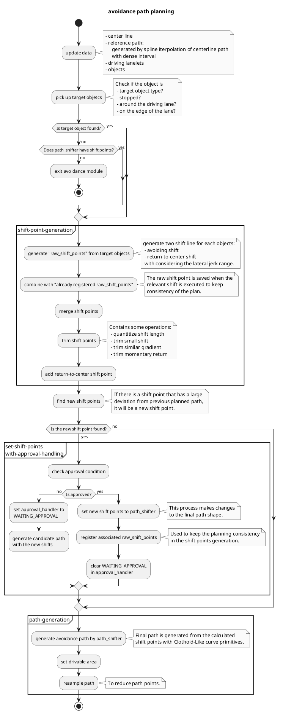

# Avoidance Module

## Terminology

- path_shifter
- shift_point
- raw_shift_point
- approval

## Flowchart

## Parameters

### avoidance path generation

| Name                                       | Unit   | Type   | Description                                                                                                 | Default value |
| :----------------------------------------- | :----- | :----- | :---------------------------------------------------------------------------------------------------------- | :------------ |
| resample_interval_for_planning             | [m]    | double | Path resample interval for avoidance planning path.                                                         | 0.3           |
| resample_interval_for_output               | [m]    | double | Path resample interval for output path. Too short interval increases computational cost for latter modules. | 3.0           |
| threshold_distance_object_is_on_center     | [m]    | double | Vehicles around the center line within this distance will be excluded from avoidance target.                | 1.0           |
| threshold_speed_object_is_stopped          | [m/s]  | double | Vehicles with speed greater than this will be excluded from avoidance target.                               | 1.0           |
| object_check_forward_distance              | [m]    | double | Forward distance to search the avoidance target.                                                            | 150.0         |
| object_check_backward_distance             | [m]    | double | Backward distance to search the avoidance target.                                                           | 2.0           |
| lateral_collision_margin                   | [m]    | double | The lateral distance between ego and avoidance targets.                                                     | 2.0           |
| longitudinal_collision_margin_min_distance | [m]    | double | when complete avoidance motion, there is a distance margin with the object for longitudinal direction.      | 0.0           |
| longitudinal_collision_margin_time         | [s]    | double | when complete avoidance motion, there is a time margin with the object for longitudinal direction.          | 0.0           |
| prepare_time                               | [s]    | double | Avoidance shift starts from point ahead of this time x ego_speed to avoid sudden path change.               | 1.0           |
| min_prepare_distance                       | [m]    | double | Minumum distance for "prepare_time" x "ego_speed".                                                          | 1.0           |
| nominal_lateral_jerk                       | [m/s3] | double | Avoidance path is generated with this jerk when there is enough distance from ego.                          | 0.3           |
| max_lateral_jerk                           | [m/s3] | double | Avoidance path gets sharp upto this jerk limit when there is not enough distance from ego.                  | 2.0           |
| min_avoidance_distance                     | [m]    | double | Minimum distance of avoidance path (i.e. this distance is needed even if its lateral jerk is very low)      | 10.0          |
| min_nominal_avoidance_speed                | [m/s]  | double | Minimum speed for jerk calculation in a nominal situation (\*1).                                            | 5.0           |
| min_sharp_avoidance_speed                  | [m/s]  | double | Minimum speed for jerk calculation in a sharp situation (\*1).                                              | 1.0           |
| max_right_shift_length                     | [m]    | double | Maximum shift length for right direction                                                                    | 5.0           |
| max_left_shift_length                      | [m]    | double | Maximum shift length for left direction                                                                     | 5.0           |

### object selection

| Name                             | Unit | Type   | Description                                                                                                                                                                                                                                    | Default value |
| :------------------------------- | :--- | :----- | :--------------------------------------------------------------------------------------------------------------------------------------------------------------------------------------------------------------------------------------------- | :------------ |
| detection_area_right_expand_dist | [m]  | double | Lanelet expand length for right side to find avoidance target vehicles.                                                                                                                                                                        | 0.0           |
| detection_area_left_expand_dist  | [m]  | double | Lanelet expand length for left side to find avoidance target vehicles.                                                                                                                                                                         | 1.0           |
| object_hold_max_count            | [-]  | int    | For the compensation of the detection lost. The object is registered once it is observed as an avoidance target. When the detection losts, it counts up the lost_count and the object will be un-registered when the count exceeds this limit. | 20            |

### system

| Name                 | Unit | Type   | Description                                                                           | Default value |
| :------------------- | :--- | :----- | :------------------------------------------------------------------------------------ | :------------ |
| publish_debug_marker | [-]  | double | Flag to publish debug marker (set false as default since it takes considerable cost). | false         |
| print_debug_info     | [-]  | double | Flag to print debug info (set false as default since it takes considerable cost).     | false         |
