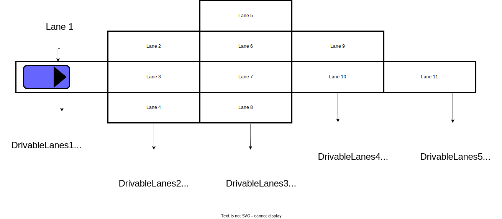

# Drivable Area

Drivable Area represents the area where ego vehicle can pass.

## Purpose / Role

In order to defined the area that ego vehicle can travel safely, we generate drivable area in behavior path planner module. Our drivable area is represented by two line strings, which are `left_bound` line and `right_bound` line respectively. Both `left_bound` and `right_bound` are created from left and right boundaries of lanelets. Note that `left_bound` and `right bound` are generated by `generateDrivableArea` function.

## Assumption

Our drivable area has several assumptions.

- Drivable Area should have all of the necessary area but should not represent unnecessary area for current behaviors. For example, when ego vehicle is in `follow lane` mode, drivable area should not contain adjacent lanes.

- When generating a drivable area, lanes need to be arranged in the order in which cars pass by(More details can be found in following sections).

- Both left and right bounds should cover the front of the path and the end of the path.

## Limitations

Currently, when clipping left bound or right bound, it can clip the bound more than necessary and the generated path might be conservative.

## Parameters for drivable area generation

| Name                          | Unit | Type   | Description                                                                | Default value |
| :---------------------------- | :--- | :----- | :------------------------------------------------------------------------- | :------------ |
| drivable_lane_forward_length  | [m]  | double | length of the forward lane from the ego covered by the drivable area       | 50.0          |
| drivable_lane_backward_length | [m]  | double | length of the backward lane from the ego covered by the drivable area      | 5.0           |
| drivable_lane_margin          | [m]  | double | forward and backward lane margin from the ego covered by the drivable area | 3.0           |
| drivable_area_margin          | [m]  | double | margin of width and height of the drivable area                            | 6.0           |

## Inner-workings / Algorithms

This section gives details of the generation of the drivable area(`left_bound` and `right_bound`).

### Drivable Lanes Generation

Before generating drivable areas, drivable lanes need to be sorted. Drivable Lanes are selected in each module(`Lane Follow`, `Avoidance`, `Lane Change`, `Pull Over`, `Pull Out` and etc), so more details about selection of drivable lanes can be found in each module's document. We use the following structure to define the drivable lanes.

```plantuml
struct DrivalbleLanes
{
    lanelet::ConstLanelet right_lanelet; // right most lane
    lanelet::ConstLanelet left_lanelet; // left most lane
    lanelet::ConstLanelets middle_lanelets; // middle lanes
};
```

The image of the sorted drivable lanes is depicted in the following picture.



Note that, the order of drivable lanes become

```plantuml
drivable_lanes = {DrivableLane1, DrivableLanes2, DrivableLanes3, DrivableLanes4, DrivableLanes5}
```

### Drivable Area Generation

In this section, a drivable area is created using drivable lanes arranged in the order in which vehicles pass by. We created `left_bound` from left boundary of the leftmost lanelet and `right_bound` from right boundary
