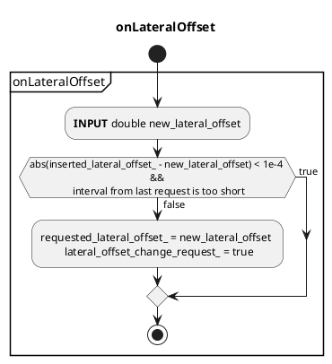
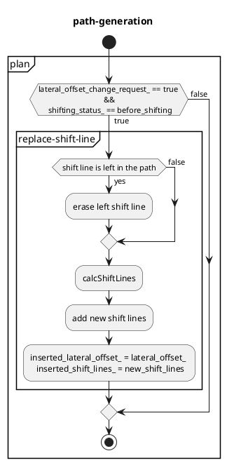
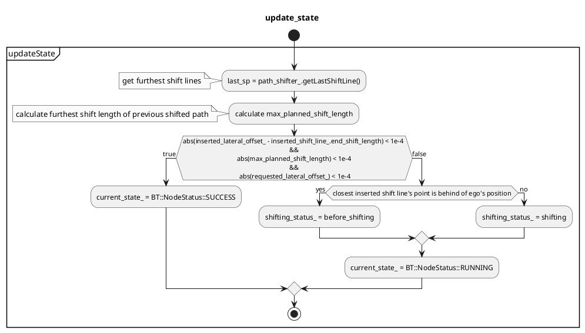

# Side shift Module

(For remote control) Shift the path to left or right according to an external instruction.

## Flowchart

```plantuml
@startuml
skinparam monochrome true
skinparam defaultTextAlignment center
skinparam noteTextAlignment left

title onLateralOffset
start

partition onLateralOffset {
:**INPUT** double new_lateral_offset;

if (abs(inserted_lateral_offset_ - new_lateral_offset) < 1e-4 \n && \n interval from last request is too short) then ( true)
else ( false)
  :requested_lateral_offset_ = new_lateral_offset \n lateral_offset_change_request_ = true;
endif
stop
@enduml
```

```plantuml -->
@startuml
skinparam monochrome true
skinparam defaultTextAlignment center
skinparam noteTextAlignment left

title path-generation

start
partition plan {
if (lateral_offset_change_request_ == true \n && \n shifting_status_ == before_shifting) then ( true)
  partition replace-shift-line {
    if ( shift line is left in the path ) then ( yes)
      :erase left shift line;
    else ( false)
    endif
    :calcShiftLines;
    :add new shift lines;
    :inserted_lateral_offset_ = lateral_offset_ \n inserted_shift_lines_ = new_shift_lines;
  }
else( false)
endif
stop
@enduml
```

```plantuml
@startuml
skinparam monochrome true
skinparam defaultTextAlignment center
skinparam noteTextAlignment left

title update_state

start
partition updateState {
  :last_sp = path_shifter_.getLastShiftLine();
  note left
  get furthest shift lines
  end note
  :calculate max_planned_shift_length;
  note left
  calculate furthest shift length of previous shifted path
  end note
  if (abs(inserted_lateral_offset_ - inserted_shift_line_.end_shift_length) < 1e-4 \n && \n abs(max_planned_shift_length) < 1e-4 \n && \n abs(requested_lateral_offset_) < 1e-4) then ( true)
    :current_state_ = BT::NodeStatus::SUCCESS;
  else (false)
    if (closest inserted shift line's point is behind of ego's position) then( yes)
      :shifting_status_ = before_shifting;
    else ( no)
      :shifting_status_ = shifting;
    endif
    :current_state_ = BT::NodeStatus::RUNNING;
  endif
  stop
}

@enduml
```
