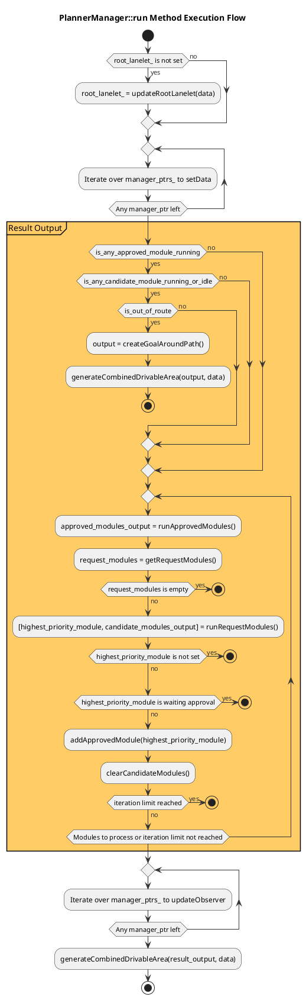
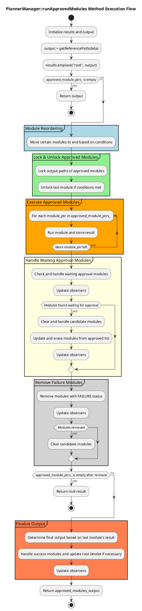
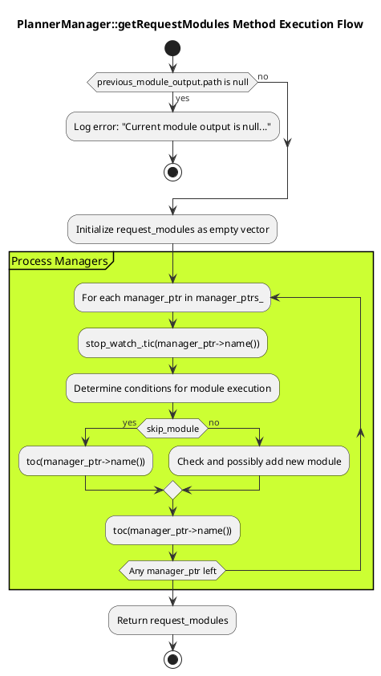
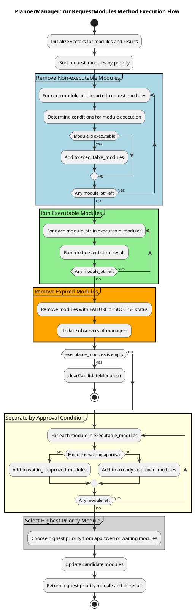
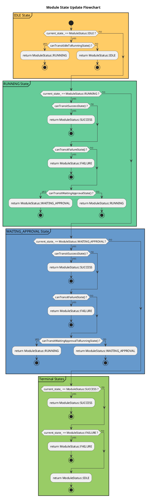

# Interface design

## State transition

### Running Approved Modules

### Getting Requested Modules

### Running Requested Modules

### Update Module State

!!! warning

    Under Construction
