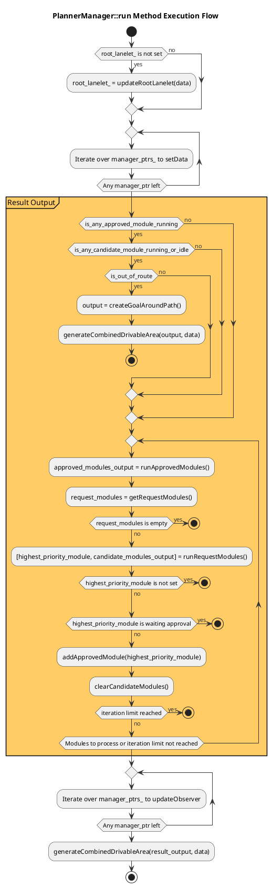
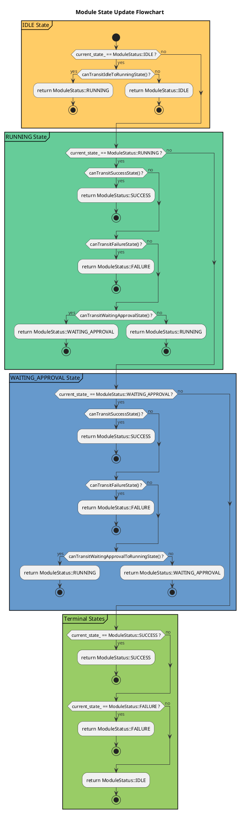

# Interface design

## State transition

```plantuml
@startuml
title PlannerManager::run Method Execution Flow

skinparam defaultTextAlignment center
skinparam noteTextAlignment left
skinparam backgroundColor #FFFFFF
skinparam ArrowColor #333333
skinparam ArrowFontColor #333333
skinparam partitionBackgroundColor #FFCC66

start
if (root_lanelet_ is not set) then (yes)
  :root_lanelet_ = updateRootLanelet(data);
else (no)
endif

repeat
  :Iterate over manager_ptrs_ to setData;
repeat while (Any manager_ptr left)

partition "Result Output" {
  if (is_any_approved_module_running) then (yes)
    if (is_any_candidate_module_running_or_idle) then (yes)
      if (is_out_of_route) then (yes)
        :output = createGoalAroundPath();
        :generateCombinedDrivableArea(output, data);
        stop
      else (no)
      endif
    else (no)
    endif
  else (no)
  endif

  repeat
    :approved_modules_output = runApprovedModules();
    :request_modules = getRequestModules();
    if (request_modules is empty) then (yes)
      stop
    else (no)
    endif

    :[highest_priority_module, candidate_modules_output] = runRequestModules();
    if (highest_priority_module is not set) then (yes)
      stop
    else (no)
    endif

    if (highest_priority_module is waiting approval) then (yes)
      stop
    else (no)
    endif

    :addApprovedModule(highest_priority_module);
    :clearCandidateModules();

    if (iteration limit reached) then (yes)
      stop
    else (no)
    endif
  repeat while (Modules to process or iteration limit not reached)
}

repeat
  :Iterate over manager_ptrs_ to updateObserver;
repeat while (Any manager_ptr left)

:generateCombinedDrivableArea(result_output, data);

stop
@enduml
```

```plantuml
@startuml
skinparam defaultTextAlignment center
skinparam noteTextAlignment left
skinparam backgroundColor #FFFFFF
skinparam ArrowColor #333333
skinparam ArrowFontColor #333333

title Module State Update Flowchart

' IDLE State logic
partition #FFCC66 "IDLE State" {
  start
  if(current_state_ == ModuleStatus::IDLE ?) then (yes)
    if(canTransitIdleToRunningState() ?) then (yes)
      :return ModuleStatus::RUNNING;
      stop
    else (no)
      :return ModuleStatus::IDLE;
      stop
    endif
  else (no)
  endif
}

' RUNNING State logic
partition #66CC99 "RUNNING State" {
  if(current_state_ == ModuleStatus::RUNNING ?) then (yes)
    if(canTransitSuccessState() ?) then (yes)
      :return ModuleStatus::SUCCESS;
      stop
    else (no)
    endif

    if(canTransitFailureState() ?) then (yes)
      :return ModuleStatus::FAILURE;
      stop
    else (no)
    endif

    if(canTransitWaitingApprovalState() ?) then (yes)
      :return ModuleStatus::WAITING_APPROVAL;
      stop
    else (no)
      :return ModuleStatus::RUNNING;
      stop
    endif
  else (no)
  endif
}

' WAITING_APPROVAL State logic
partition #6699CC "WAITING_APPROVAL State" {
  if(current_state_ == ModuleStatus::WAITING_APPROVAL ?) then (yes)
    if(canTransitSuccessState() ?) then (yes)
      :return ModuleStatus::SUCCESS;
      stop
    else (no)
    endif

    if(canTransitFailureState() ?) then (yes)
      :return ModuleStatus::FAILURE;
      stop
    else (no)
    endif

    if(canTransitWaitingApprovalToRunningState() ?) then (yes)
      :return ModuleStatus::RUNNING;
      stop
    else (no)
      :return ModuleStatus::WAITING_APPROVAL;
      stop
    endif
  else (no)
  endif
}

' Terminal States logic
partition #99CC66 "Terminal States" {
  if(current_state_ == ModuleStatus::SUCCESS ?) then (yes)
    :return ModuleStatus::SUCCESS;
    stop
  else (no)
  endif

  if(current_state_ == ModuleStatus::FAILURE ?) then (yes)
    :return ModuleStatus::FAILURE;
    stop
  else (no)
  endif

  :return ModuleStatus::IDLE;
  stop
}
@enduml
```

!!! warning

    Under Construction
