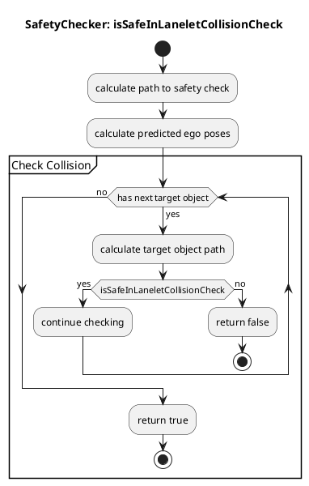

# SafetyChecker

SafetyChecker is a safety check class that verifies if a given path collides with dynamic obstacles.

## Purpose / Role

In a behavior path planner, specific modules, such as lane change, need to perform collision checks with dynamic obstacles to ensure the safe navigation of the ego vehicle. The purpose of this utility class is to provide a versatile definition of a class that can be used for safety checks with other road users.

### Assumptions

The SafetyChecker module is based on the following assumptions:

- The user needs to provide the position, velocity, and shape of the ego vehicle and dynamic obstacles to the utility functions.
- The yaw angle of each point on the predicted path of the ego vehicle and dynamic obstacles should point to the next point on the path.
- The SafetyChecker module determines the safety of potential collisions with other objects using RSS distance.

### Limitations

Currently, the yaw angle of each point on the predicted path of dynamic obstacles does not point to the next point. Therefore, the SafetyChecker function may return inaccurate results in some edge cases.

### Inner working / Algorithm

The algorithm flow of SafetyChecker is described as follows:

- `isPathSafe`: This method determines if a path is safe. It takes the path and ego vehicle odometry as arguments and returns `true` if the path is safe, `false` otherwise.

- `createPredictedPath`: This method generates a predicted path. It creates a predicted path based on the current velocity, target velocity, acceleration, ego vehicle's pose, time resolution, and stop time.

- `getBackwardLanelets`: This method retrieves the backward lanelets. It takes the route handler, target lane, and ego vehicle's pose as arguments and returns the backward lanelets. It is used to obtain the area of interest for safety checks.

- `filterObjectIndices`: This method filters the object indices. It takes a list of road objects and a filter function as arguments, and returns a list of indices.

- `getEgoExpectedPoseAndConvertToPolygon`: This method generates the expected pose of the ego vehicle and converts it to a polygon. This polygon is used in subsequent methods for collision checks.

- `isSafeInLaneletCollisionCheck`: This method checks for collisions between lanelets. It returns `true` if there is no collision, `false` otherwise.

- `isObjectIndexIncluded`: This method checks if the specified index is included in the list of dynamic object indices.

- `isTargetObjectFront`: This method determines if the specified object is in front of the ego vehicle. It returns `true` if it is in front, `false` otherwise.

By using these methods, it is possible to determine if the predicted path of the ego vehicle has the potential to collide with other road users.

### How to use

When creating an instance of SafetyChecker, you need to define the structures SafetyCheckParams and SafetyCheckData and provide them as arguments.

#### SafetyCheckParams

This structure holds the parameters for safety checks. Specific parameters include the shape and size of dynamic obstacles to be checked, the velocity and position of the ego vehicle, and settings for generating predicted paths.

#### SafetyCheckData

This structure holds the data required for safety checks. Specific data includes the current state of dynamic obstacles, the current state of the ego vehicle, route handler, and other related data.

### Future Work

There is a possibility of exploring ways to simplify the implementation of safety check features implemented in other modules to enhance the versatility of this class.
