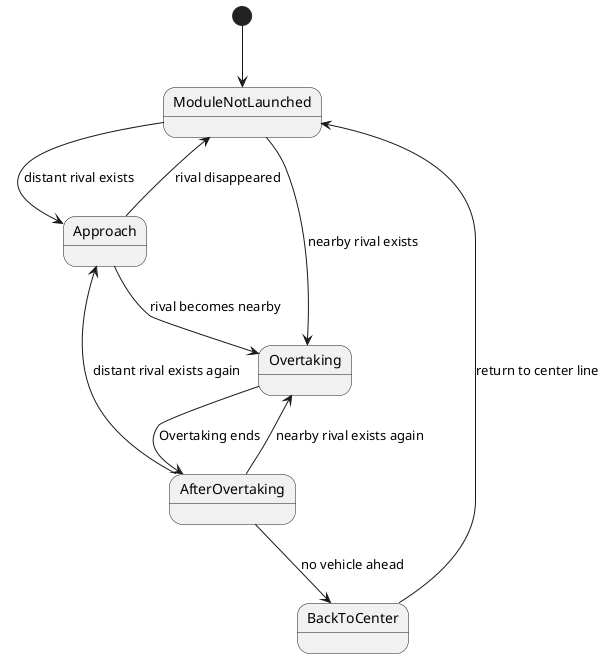

# Racing Overtake design

## Purpose / Role

The RacingOvertakeModule is a simple module designed for overtaking vehicles ahead on a racing course. This module essentially follows three basic steps to overtake the vehicle in front:

1. Decide whether to overtake the vehicle ahead.
2. Execute the overtaking maneuver.
3. Return to the center line.

### Limitations

This module is solely designed for executing vehicle overtaking maneuvers in race settings and does not take into account traffic rules applicable to general public roads.

Furthermore, as this module is designed based on simple rule-based algorithms, it is not capable of handling complex situations. It operates under the assumption that rival vehicles will not make sudden changes in their course or speed to obstruct the overtaking maneuver.

## Overtaking Procedure

This module operates across three states, planning the route differently in each state:

1. **ModuleNotLaunched**: The module is not launched.
2. **Approach**: Approach the vehicle ahead that is the target for overtaking.
3. **Overtaking**: Overtake the target vehicle.
4. **AfterOvertaking**: Drive straight on the changed course.
5. **BackToCenter**: Return to the center line after overtaking.

### Abstract of Each State

#### ModuleNotLaunched

##### Conditions for Transitioning to This State

This module enters the ModuleNotLaunched state when the ego drives on a centerline course without any rivals to overtake. Here, a rival vehicle refers to the closest vehicle ahead on the same course as the ego.

##### Transition to Other States

- Transition to the Approach State

  If there is a rival vehicle ahead on the same course as the ego (`start_overtake_distance < longitudinal distance < prepare_overtake_distance`), this module transitions to the Approach state.

- Transition to the Overtaking State

  If there is a rival vehicle ahead on the same course as the ego (`longitudinal distance < start_overtake_distance`), this module transitions to the Overtaking state.

##### Path Planning in This State

No path planning is executed in this state.

#### Approach

##### Conditions for Transitioning to This State

This module enters the Approach state if `longitudinal distance` becomes less than `prepare_overtake_distance`.

##### Transition to Other States

- Transition to the Overtaking State

When the `longitudinal distance` becomes less than `start_overtake_distance`, the state transitions to the Overtaking State to begin the overtaking maneuver.

- Turn off the RacingOvertakingModule

If there are no rivals left to overtake, this module is turned off.

##### Path Planning in This State

Plan a path that changes course in the direction (left or right) with the shorter path for the course change.
The path is updated every step.

#### Overtaking

##### Conditions for Transitioning to This State

This module enters the Approach state if `longitudinal distance` becomes less than `start_overtake_distance`.

##### Transition to Other States

When the ego reaches the set overtaking finish position, this module transitions to the AfterOvertaking state.

##### Path Planning in This State

The method for generating the path to execute overtaking is the same as in the Approach state.

Path Planning is executed only at the first time step after transitioning to the Overtaking state and references that path until transitioning to the AfterOvertaking state.

#### AfterOvertaking

##### Conditions for Transitioning to This State

The module transitions to the AfterOvertaking state after the Overtaking state.

##### Transition to Other States

- Transition to the Approach or Overtaking State

If there is a rival vehicle to overtake on the course of the ego, this module transitions to either the Approach or Overtaking state, depending on the distance of the rival vehicle.

- Transition to the BackToCenter State

If there are no vehicles in front of the ego, this module transitions to the BackToCenter state.

##### Path Planning in This State

This module plans a path that drives straight on the changed course.

#### BackToCenter

##### Conditions for Transitioning to This State

The module transitions to the BackToCenter state after the AfterOvertaking state.

##### Transition to Other States

When the ego returns to the center line, this module transitions to the ModuleNotLaunched state.

##### Path Planning in This State

This module plans a path that returns to the center line.

### State Transition Diagram

## Paramenters

| Name                           | Unit | Description                                    | Default |
| ------------------------------ | ---- | ---------------------------------------------- | ------- |
| too_close_to_overtake_distance | m    | Distance to avoid overtaking                   | 5.0     |
| start_overtake_distance        | m    | Distance to start overtaking                   | 30.0    |
| prepare_overtake_distance      | m    | Distance to prepare for overtaking             | 60.0    |
| back_to_center_start_distance  | m    | Distance to start returning to the center line | 20.0    |
| back_to_center_end_distance    | m    | Distance to end returning to the center line   | 60      |
| ego_course_width               | m    | Width of the ego vehicle                       | 2.8     |
