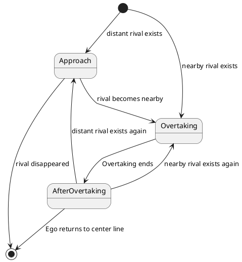

# Racing Overtake design

## Purpose / Role

The RacingOvertakeModule is a simple module designed for overtaking vehicles ahead on a racing course. This module essentially follows three basic steps to overtake the vehicle in front:

1. Decide whether to overtake the vehicle ahead.
2. Execute the overtaking maneuver.
3. Return to the center line.

### Limitations

This module is solely designed for executing vehicle overtaking maneuvers in race settings and does not take into account traffic rules applicable to general public roads.

Furthermore, as this module is designed based on simple rule-based algorithms, it is not capable of handling complex situations. It operates under the assumption that rival vehicles will not make sudden changes in their course or speed to obstruct the overtaking maneuver.

## Overtaking Procedure

This module operates across three states, planning the route differently in each state:

1. **Approach**: Approach the vehicle ahead that is the target for overtaking.
2. **Overtaking**: Overtake the target vehicle.
3. **AfterOvertaking**: Return to the original path from the altered path due to the overtaking maneuver.

### State Details

#### Approach

##### Conditions for Transitioning to This State

This module enters the Approach state if there is a rival vehicle that can be overtaken within the `overtaking_start_time` ~ `approach_start_time` seconds. Here, a rival vehicle refers to the closest vehicle ahead on the same course as the ego. Additionally, the possibility of overtaking within the `overtaking_start_time` ~ `approach_start_time` seconds is determined based on the following conditions:

1. `overtaking_start_time < longitudinal distance / (ego_speed - rival_speed) < approach_start_time`
2. There is sufficient width to the right or left of the rival vehicle for overtaking.

##### Transition to Other States

- Transition to the Overtaking State

When the `longitudinal distance / (ego_speed - rival_speed)` becomes less than `overtaking_start_time`, the state transitions to the Overtaking State to begin the overtaking maneuver.

- Turn off the RacingOvertakingModule

If there are no rivals left to overtake, this module is turned off.

##### Path Planning in This State

Path planning is executed to pass through the wider space available either to the right or left of the rival. During this process, the ego car moves through the center of the space.

The path is updated every time step.
(Details are currently under consideration.)

#### Overtaking

##### Conditions for Transitioning to This State

This module enters the Overtaking state if there is a rival vehicle that can be overtaken within the `min_overtaking_start_time` ~ `overtaking_start_time` seconds.
Whether overtaking is possible in this state is determined by the same conditions as in the Approach State:

1. `min_overtaking_start_time < longitudinal distance / (ego_speed - rival_speed) < overtaking_start_time`
2. There is sufficient width to the right or left of the rival vehicle for overtaking.

##### Transition to Other States

When the ego reaches the set overtaking finish position, this module transitions to the AfterOvertaking state.

##### Path Planning in This State

The method for generating the path to execute overtaking is the same as in the Approach state.

Path Planning is executed only at the first time step after transitioning to the Overtaking state and references that path until transitioning to the AfterOvertaking state.

#### AfterOvertaking

##### Conditions for Transitioning to This State

The module transitions to the AfterOvertaking state after the Overtaking state.

##### Transition to Other States

- Transition to the Approach or Overtaking State

If there is a rival vehicle to overtake on the course of the ego, this module transitions to either the Approach or Overtaking state, depending on the distance and speed of the rival vehicle.

- Turn off the RacingOvertakingModule

If the ego has returned to the center line, this module is turned off.

##### Path Planning in This State

- If there is another vehicle in front of the ego,

  

  Continue on the current course.

- If there are no other vehicle in front of the ego,

  

  Return the ego to the centerline.

### State Transition Diagram

## Paramenters

**WIP**
