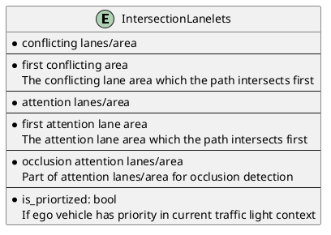
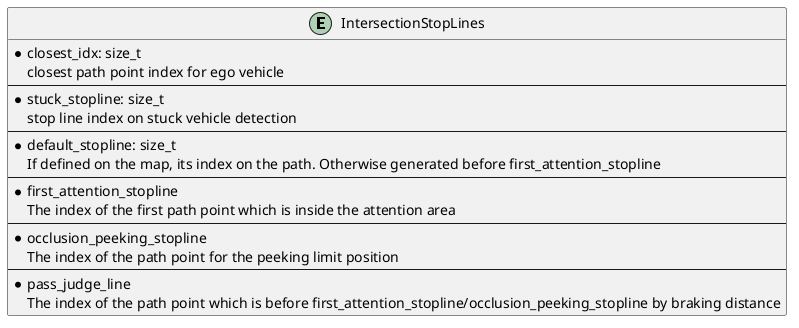
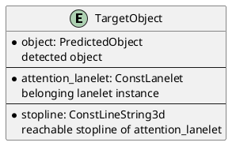
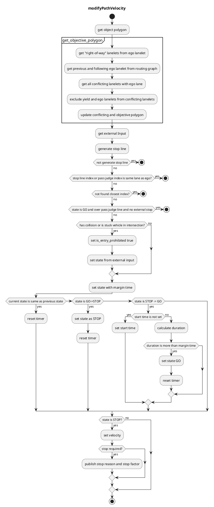

## Intersection

### Role

The intersection module is responsible for safely passing urban intersections by:

1. checking collisions with upcoming vehicles
2. recognizing the occluded area in the intersection
3. reacting to each color/shape of associated traffic lights

This module is designed to be agnostic to left-hand/right-hand traffic rules and work for crossroads, T-shape junctions, etc.


### Activation condition

This module is activated when the path contains the lanes with turn_direction tag. More precisely, if the lane_ids of the path contains the ids of those lanes, corresponding instances of intersection module are activated on each lane respectively.

### Requirements/Limitations

- The HDMap needs to have the information of turn_direction tag (which should be one of straight, left, right) for all the lanes in intersections and right_of_way tag for specific lanes (refer to [RightOfWay](#right-of-way) section for more details). See [lanelet2_extension document](https://github.com/autowarefoundation/autoware_common/blob/main/tmp/lanelet2_extension/docs/lanelet2_format_extension.md) for more detail.
- WIP(perception requirements/limitations)
- WIP(sensor visibility requirements/limitations)

### Attention area

The attention area in the intersection are defined as the set of lanes that are conflicting with ego vehicle's path and their preceding lanes up to `common.attention_area_length` meters. RightOfWay tag is used to rule out the lanes that each lane has priority given the traffic light relation and turn_direction priority(yield lane).

intersection_area, which is supposed to be defined on the HDMap, is an area converting the entire intersection.


#### Right Of Way

Following table shows an example of how to assign right_of_way tag and set yield_lanes to each lane in intersections.

| turn direction / traffic light | w/ traffic light                                                | w/o traffic light                                |
| ------------------------------ | --------------------------------------------------------------- | ------------------------------------------------ |
| straight                       | Highest priority of all                                         | Priority over left/right lanes of the same group |
| left(Left hand traffic)        | Priority over the other group and right lanes of the same group | Priority over right lanes of the same group      |
| right(Left hand traffic)       | Priority only over the other group                              | priority only over the other group               |
| left(Right hand traffic)       | Priority only over the other group                              | Priority only over the other group               |
| right(Right hand traffic)      | Priority over the other group and left lanes of the same group  | priority over left lanes of the same group       |

This setting gives the following `attention_area` configurations.


### Possible stop lines

Following figure illustrates important positions used in the intersection module. Note that each solid line represents ego front line position and the corresponding dot represents the actual inserted stop point position for the vehicle frame, namely the center of the rear wheel.


To precisely calculate stop positions, the path is interpolated at the certain interval of `common.path_interpolation_ds`.

closest_idx denotes the path point index which is closest to ego vehicle position. first_attention_stopline denotes the first path point where ego vehicle footprint intersects with the attention_area. If a stopline is associated with the intersection lane on the map, that line is used as the default_stopline for collision detection. Otherwise the point which is `common.default_stopline_margin` meters behind first_attention_stopline is defined as the default_stopline instead. occlusion_peeking_stopline is a bit ahead of first_attention_stopline as described later. occlusion_wo_tl_pass_judge_line is the first position where ego vehicle footprint intersects with the centerline of the first attention_area lane.

### Target objects

For [stuck vehicle detection](#stuck-vehicle-detection) and [collision detection](#collision-detection), this module checks **car**, **bus**, **truck**, **trailer**, **motor cycle**, and **bicycle** type objects.

Objects that satisfy all of the following conditions are considered as target objects (possible collision objects):

- The center of the object is **within a certain distance** from the attention lane (threshold = `common.attention_area_margin`) .
  - (Optional condition) The center of the object is in the **intersection area**.
    - To deal with objects that is in the area not covered by the lanelets in the intersection.
- The posture of object is **the same direction as the attention lane** (threshold = `common.attention_area_angle_threshold`).
- Not being **in the adjacent lanes of ego vehicle**.

### Stuck Vehicle Detection

If there is any object on the path inside the intersection and at the exit of the intersection (up to `stuck_vehicle.stuck_vehicle_detect_dist`) lane and its velocity is less than the threshold (`stuck_vehicle.stuck_vehicle_velocity_threshold`), the object is regarded as a stuck vehicle. If stuck vehicles exist, this module inserts a stopline a certain distance (=`default_stopline_margin`) before the overlapped region with other lanes. The stuck vehicle detection area is generated based on the vehicle path, so the stuck vehicle stopline is not inserted if the upstream module generated an avoidance path.


### Collision detection

The following process is performed for the targets objects to determine whether ego vehicle can pass the intersection safely. If it is judged that ego vehicle cannot pass the intersection with enough margin, this module inserts a stopline on the path.

1. predict the time $t$ when the object intersects with ego path from the predicted path time step. Only the predicted whose confidence is greater than `collision_detection.min_predicted_path_confidence` is used.
2. detect collision between the predicted path and ego's predicted path in the following process
   1. calculate the collision interval of [$t$ - `collision_detection.collision_start_margin_time`, $t$ + `collision_detection.collision_end_margin_time`]
   2. obtain the passing area of ego vehicle during the collision interval from the array of (time, distance) obtained by smoothed velocity profile
   3. check if ego passing area and object predicted path interval collides
3. if collision is detected, the module inserts a stopline
4. if ego is over the [pass_judge_line](#pass-judge-line), collision checking is skipped to avoid sudden braking and/or unnecessary stop in the middle of the intersection

The parameters `collision_detection.collision_start_margin_time` and `collision_detection.collision_end_margin_time` can be interpreted as follows:

- If ego vehicle was to pass the intersection earlier than the target object, collision would be detected if the time difference between the two was less than `collision_detection.collision_start_margin_time`.
- If ego vehicle was to pass the intersection later than the target object, collision would be detected if the time difference between the two was less than `collision_detection.collision_end_margin_time`.

If collision is detected, the state transits to "STOP" immediately. On the other hand, the state does not transit to "GO" unless safe judgement continues for a certain period `collision_detection.collision_detection_hold_time` to prevent the chattering of decisions.

Currently, the intersection module uses `motion_velocity_smoother` feature to precisely calculate ego vehicle velocity profile along the intersection lane under longitudinal/lateral constraints. If the flag `collision_detection.velocity_profile.use_upstream` is true, the target velocity profile of the original path is used. Otherwise the target velocity is set to `collision.velocity_profile.default_velocity`. In the trajectory smoothing process the target velocity at/before ego trajectory points are set to ego current velocity. The smoothed trajectory is then converted to an array of (time, distance) which indicates the arrival time to each trajectory point on the path from current ego position. You can visualize this array by adding the lane id to `debug.ttc` and running

```bash
ros2 run behavior_velocity_intersection_module ttc.py --lane_id <lane_id>
```


### Pass Judge Line

To avoid sudden braking, if deceleration and jerk more than the threshold (`common.max_accel` and `common.max_jerk`) is required to stop at first_attention_stopline, this module does not command to stop once it passed the default_stopline position.

The position of the pass judge line depends on the occlusion detection configuration and the existence of the associated traffic light of the intersection lane.

- If `occlusion.enable` is false, the pass judge line before the `first_attention_stopline` by the braking distance $v_{ego}^{2} / 2a_{max}$.
- If `occlusion.enable` is true and:
  - if there are associated traffic lights, the pass judge line is at the `occlusion_peeking_stopline` in order to continue peeking/collision detection while occlusion is detected.
  - if there are no associated traffic lights and:
    - if occlusion is detected, pass judge line is at the `occlusion_wo_tl_pass_judge_line` to continue peeking.
    - if occlusion is not detected, pass judge line is at the same place at the case where `occlusion.enable` is false.

### Occlusion detection

If the flag `occlusion.enable` is true this module checks if there is sufficient field of view (FOV) on the attention area up to `occlusion.occlusion_attention_area_length`. If FOV is not clear enough ego vehicle first make a brief stop at the default stop line for `occlusion.temporal_stop_time_before_peeking`, and then slowly creep toward occlusion_peeking_stop_line at the speed of `occlusion.creep_during_peeking.creep_velocity` if `occlusion.creep_during_peeking.enable` is true. During the creeping if collision is detected this module inserts a stop line in front of ego vehicle immediately, and if the FOV gets sufficiently clear the intersection_occlusion wall will disappear. If occlusion is cleared and no collision is detected ego vehicle will pass the intersection.

The occlusion is detected as the common area of occlusion attention area(which is partially the same as the normal attention area) and the unknown cells of the occupancy grid map. The occupancy grid map is denoised using morphology with the window size of `occlusion.denoise_kernel`. The occlusion attention area lanes are discretized to line strings and they are used to generate a grid whose each cell represents the distance from ego path along the lane as shown below.


If the nearest occlusion cell value is below the threshold, occlusion is detected. It is expected that the occlusion gets cleared as the vehicle approaches the occlusion peeking stop line.

#### Occlusion source estimation with traffic light

At intersection with traffic light, the whereabout of occlusion is estimated by checking if there are any objects between ego and the nearest occlusion cell. While the occlusion is estimated to be caused by some object (DYNAMICALLY occluded), intersection_wall will be inserted. If no objects are found between ego and the nearest occlusion cell (STATICALLY occluded), after ego stopped for the duration of `occlusion.static_occlusion_with_traffic_light_timeout`, occlusion is ignored to avoid stuck.

#### Occlusion handling without traffic light

At intersection without traffic light, if occlusion is detected, ego vehicle will make a brief stop at the default_stopline and first_attention_stopline. After stopping at the first_attention_area_stopline this module inserts `occlusion.absence_traffic_light.creep_velocity` velocity between ego and occlusion_wo_tl_pass_judge_line while occlusion is not cleared. If collision is detected, ego will instantly stop. Once the occlusion is cleared or ego passed occlusion_wo_tl_pass_judge_line this module does not detect collision and occlusion because ego vehicle is already inside the intersection.


### Traffic signal specific behavior

#### Collision detection

TTC parameter varies depending on the traffic light color/shape as follows.

| traffic light color | ttc(start)                                                             | ttc(end)                                                               |
| ------------------- | ---------------------------------------------------------------------- | ---------------------------------------------------------------------- |
| GREEN               | `collision_detection.not_prioritized.collision_start_margin`           | `collision_detection.not_prioritized.collision_end_margin`             |
| AMBER               | `collision_detection.partially_prioritized.collision_start_end_margin` | `collision_detection.partially_prioritized.collision_start_end_margin` |
| RED / Arrow         | `collision_detection.fully_prioritized.collision_start_end_margin`     | `collision_detection.fully_prioritized.collision_start_end_margin`     |

#### yield on GREEN

If the traffic light color changed to GREEN and ego approached the entry of the intersection lane within the distance `collision_detection.yield_on_green_traffic_light.distance_to_assigned_lanelet_start` and there is any object whose distance to its stopline is less than `collision_detection.yield_on_green_traffic_light.object_dist_to_stopline`, this module commands to stop for the duration of `collision_detection.yield_on_green_traffic_light.duration` at the default_stopline.

#### skip on AMBER

If the traffic light color is AMBER but the object is expected to stop before its stopline under the deceleration of `collision_detection.ignore_on_amber_traffic_light.object_expected_deceleration`, collision checking is skipped.

#### skip on RED

If the traffic light color is RED or Arrow signal is turned on, the attention lanes which are not conflicting with ego lane are not used for detection. And even if the object stops with a certain overshoot from its stopline, but its expected stop position under the deceleration of `collision_detection.ignore_on_amber_traffic_light.object_expected_deceleration` is more than the distance `collision_detection.ignore_on_red_traffic_light.object_margin_to_path` from collision point, the object is ignored.

#### Occlusion detection

When the traffic light color/shape is RED/Arrow, occlusion detection is skipped.

### Data Structure

Each data structure is defined in `util_type.hpp`.


#### `IntersectionLanelets`



#### `IntersectionStopLines`

Each stop lines are generated from interpolated path points to obtain precise positions.



#### `TargetObject`

`TargetObject` holds the object, its belonging lane and corresponding stopline information.



### Module Parameters

#### common

| Parameter                         | Type   | Description                                                              |
| --------------------------------- | ------ | ------------------------------------------------------------------------ |
| `.attention_area_length`          | double | [m] range for object detection                                           |
| `.attention_area_margin`          | double | [m] margin for expanding attention area width                            |
| `.attention_area_angle_threshold` | double | [rad] threshold of angle difference between the detected object and lane |
| `.use_intersection_area`          | bool   | [-] flag to use intersection_area for collision detection                |
| `.default_stopline_margin`        | double | [m] margin before_stop_line                                              |
| `.stopline_overshoot_margin`      | double | [m] margin for the overshoot from stopline                               |
| `.max_accel`                      | double | [m/ss] max acceleration for stop                                         |
| `.max_jerk`                       | double | [m/sss] max jerk for stop                                                |
| `.delay_response_time`            | double | [s] action delay before stop                                             |

#### stuck_vehicle/yield_stuck

| Parameter                                        | Type   | Description                                                                  |
| ------------------------------------------------ | ------ | ---------------------------------------------------------------------------- |
| `stuck_vehicle.turn_direction`                   | -      | [-] turn_direction specifier for stuck vehicle detection                     |
| `stuck_vehicle.stuck_vehicle_detect_dist`        | double | [m] length toward from the exit of intersection for stuck vehicle detection  |
| `stuck_vehicle.stuck_vehicle_velocity_threshold` | double | [m/s] velocity threshold for stuck vehicle detection                         |
| `yield_stuck.distance_threshold`                 | double | [m/s] distance threshold of yield stuck vehicle from ego path along the lane |

#### collision_detection

| Parameter                                     | Type   | Description                                                                          |
| --------------------------------------------- | ------ | ------------------------------------------------------------------------------------ |
| `.consider_wrong_direction_vehicle`           | bool   | [-] flag to detect objects in the wrong direction                                    |
| `.collision_detection_hold_time`              | double | [s] hold time of collision detection                                                 |
| `.min_predicted_path_confidence`              | double | [-] minimum confidence value of predicted path to use for collision detection        |
| `.keep_detection_velocity_threshold`          | double | [s] ego velocity threshold for continuing collision detection before pass judge line |
| `.velocity_profile.use_upstream`              | bool   | [-] flag to use velocity profile planned by upstream modules                         |
| `.velocity_profile.minimum_upstream_velocity` | double | [m/s] minimum velocity of upstream velocity profile to avoid zero division           |
| `.velocity_profile.default_velocity`          | double | [m/s] constant velocity profile when use_upstream is false                           |
| `.velocity_profile.minimum_default_velocity`  | double | [m/s] minimum velocity of default velocity profile to avoid zero division            |
| `.yield_on_green_traffic_light`               | -      | [-] [description](#yield-on-green)                                                   |
| `.ignore_amber_traffic_light`                 | -      | [-] [description](#skip-on-amber)                                                    |
| `.ignore_on_red_traffic_light`                | -      | [-] [description](#skip-on-red)                                                      |

#### occlusion

| Parameter                                      | Type     | Description                                                                                 |
| ---------------------------------------------- | -------- | ------------------------------------------------------------------------------------------- |
| `.enable`                                      | bool     | [-] flag to calculate occlusion detection                                                   |
| `.occlusion_attention_area_length`             | double   | [m] the length of attention are for occlusion detection                                     |
| `.free_space_max`                              | int      | [-] maximum value of occupancy grid cell to treat at occluded                               |
| `.occupied_min`                                | int      | [-] minimum value of occupancy grid cell to treat at occluded                               |
| `.denoise_kernel`                              | double   | [m] morphology window size for preprocessing raw occupancy grid                             |
| `.attention_lane_crop_curvature_threshold`     | double   | [m] curvature threshold for trimming curved part of the lane                                |
| `.attention_lane_crop_curvature_ds`            | double   | [m] discretization interval of centerline for lane curvature calculation                    |
| `.creep_during_peeking.enable`                 | bool     | [-] flag to insert `creep_velocity` while peeking to intersection occlusion stopline        |
| `.creep_during_peeking.creep_velocity`         | double   | [m/s] the command velocity while peeking to intersection occlusion stopline                 |
| `.peeking_offset`                              | double   | [m] the offset of the front of the vehicle into the attention area for peeking to occlusion |
| `.occlusion_required_clearance_distance`       | double   | [m] threshold for the distance to nearest occlusion cell from ego path                      |
| `.possible_object_bbox`                        | [double] | [m] minimum bounding box size for checking if occlusion polygon is small enough             |
| `.ignore_parked_vehicle_speed_threshold`       | double   | [m/s] velocity threshold for checking parked vehicle                                        |
| `.occlusion_detection_hold_time`               | double   | [s] hold time of occlusion detection                                                        |
| `.temporal_stop_time_before_peeking`           | double   | [s] temporal stop duration at the default_stop_line before starting peeking                 |
| `.temporal_stop_before_attention_area`         | bool     | [-] flag to temporarily stop at first_attention_stopline before peeking into attention_area |
| `.creep_velocity_without_traffic_light`        | double   | [m/s] creep velocity to occlusion_wo_tl_pass_judge_line                                     |
| `.static_occlusion_with_traffic_light_timeout` | double   | [s] the timeout duration for ignoring static occlusion at intersection with traffic light   |

### How to turn parameters

WIP

### Trouble shooting

### Flowchart

WIP



## Merge From Private

### Role

When an ego vehicle enters a public road from a private road (e.g. a parking lot), it needs to face and stop before entering the public road to make sure it is safe.

This module is activated when there is an intersection at the private area from which the vehicle enters the public road. The stop line is generated both when the goal is in the intersection lane and when the path goes beyond the intersection lane. The basic behavior is the same as the intersection module, but ego vehicle must stop once at the stop line.


### Activation Timing

This module is activated when the following conditions are met:

- ego-lane has a `private` tag
- ego-lane has a conflict with other no-private lanelets

### Module Parameters

| Parameter                                   | Type   | Description                     |
| ------------------------------------------- | ------ | ------------------------------- |
| `merge_from_private_road/stop_duration_sec` | double | [m] time margin to change state |

### Known Issue

If ego vehicle go over the stop line for a certain distance, then ego vehicle will not transit from STOP.
