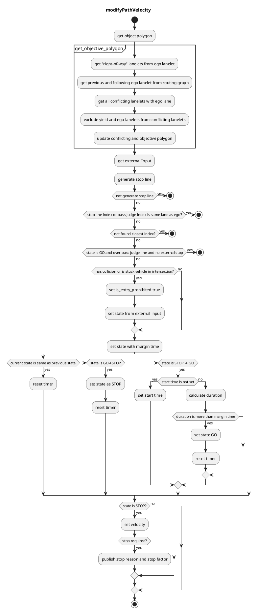

## Role

The _intersection_ module is responsible for safely going through urban intersections by:

1. checking collisions with upcoming vehicles
2. recognizing the occluded area in the intersection
3. reacting to arrow signals of associated traffic lights

The module is desinged to be agnositc to left-hand/right-hand traffic rules and works on crossroads, T-shape junctions, etc.

## Activation condition

This module is activated when the path contains the lanes with `turn_direction` tag. More precisely, if the `lane_ids` of the path contains the ids of those lanes, corresponding instances of intersection module are activated on each lanes respectively.

## Limitations

- The HDMap needs to have the information of `turn_direction` tag (which should be one of `straight`, `left`, `right`) for all the lanes in intersections and `right_of_way` tag for specific lanes (refer to [RightOfWay](intersection-design.md#right-of-way) section for more details).
- WIP(perception requirements/limitations)
- WIP(sensor visibility requirements/limitations)

## Attention area

The `Attention Area` in the intersection are defined as the set of lanes that are conflicting with ego vehicle's path and their preceding lanes up to `detection_area_length` meters. `RightOfWay` tag is used to rule out the lanes that each lane has priority given the traffic light relation and `turn_direction` priority.

`Intersection Area`, which is supposed to be defined on the HDMap, is an area convering the entire intersection.

### Right Of Way

Following table shows an example of how to assign `right_of_way` tag and set `yield_lanes` to each lane in intersections.

| turn direction \ traffic light | w/ traffic light                                                | w/o traffic light                                |
| ------------------------------ | --------------------------------------------------------------- | ------------------------------------------------ |
| straight                       | Highest priority of all                                         | Priority over left/right lanes of the same group |
| left(Left hand traffic)        | Priority over the other group and right lanes of the same group | Priority over right lanes of the same group      |
| right(Left hand traffic)       | Priority only over the other group                              | priority only over the other gruop               |
| left(Right hand traffic)       | Priority only over the other group                              | Priority only over the other group               |
| right(Right hand traffic)      | Priority over the other group and left lanes of the same group  | priority over left lanes of the same group       |

This setting gives the following `attention_area` configurations.

## Target objects

For [stuck vehicle detection](intersection-design.md#stuck-vehicle-detection) and [collision detection](intersection-design.md#collision-detection), this module checks **car**, **bus**, **truck**, **trailer**, **motor cycle**, and **bicycle** type objects.

Objects that satisfy all of the following conditions are considered as target objects (possible collision objects):

- The type of object type is **car**, **truck**, **bus** or **motorbike**. (Bicycle, pedestrian, animal, unknown are not.)
- The center of gravity of object is **located within a certain distance** from the attention lane (threshold = `detection_area_margin`) .
  - (Optional condition) The center of gravity is in the **intersection area**.
    - To deal with objects that is in the area not covered by the lanelets in the intersection.
- The posture of object is **the same direction as the attention lane** (threshold = `detection_area_angle_threshold`).
  - The orientation of the target is recalculated in this module according to the `orientation_reliable` and the sign of the velocity of the target.
- Not being **in the neighboring lanes of the ego vehicle**.
  - neighboring lanes include the ego lane of the vehicle and the adjacent lanes of it with turn_direction as the ego lane.

### Collision Check and Crossing Judgement

The following process is performed for the attention targets to determine whether the ego vehicle can cross the intersection safely. If it is judged that the ego vehicle cannot pass through the intersection with enough margin, it will insert the stopping speed on the stop line of the intersection.

1. calculate the passing time and the time that the ego vehicle is in the intersection. This time is set as $t_s$ ~ $t_e$
2. extract the predicted path of the target object whose confidence is greater than `min_predicted_path_confidence`.
3. detect collision between the extracted predicted path and ego's predicted path in the following process.
   1. obtain the passing area of the ego vehicle $A_{ego}$ in $t_s$ ~ $t_e$.
   2. calculate the passing area of the target object $A_{target}$ at $t_s$ - `collision_start_margin_time` ~ $t_e$ + `collision_end_margin_time` for each predicted path (\*1).
   3. check if $A_{ego}$ and $A_{target}$ regions are overlapped (has collision).
4. when a collision is detected, the module inserts a stop velocity in front of the intersection. Note that there is a time margin for the stop release (\*2).
5. If ego is over the `pass_judge_line`, collision checking is not processed to avoid sudden braking. However if ego velocity is lower than the threshold `keep_detection_vel_thr` then this module continues collision checking.

(\*1) The parameters `collision_start_margin_time` and `collision_end_margin_time` can be interpreted as follows:

- If the ego vehicle passes through the intersection earlier than the target object, the collision is detected if the time difference between the two is less than `collision_start_margin_time`.
- If the ego vehicle passes through the intersection later than the target object, the collision is detected if the time difference between the two is less than `collision_end_margin_time`.

(\*2) If the collision is detected, the state transits to "stop" immediately. On the other hand, the collision judgment must be clear for a certain period (default : 2.0[s]) to transit from "stop" to "go" to prevent to prevent chattering of decisions.

### Stop Line Automatic Generation

The driving lane is complemented at a certain intervals (default : 20 [cm]), and the line which is a margin distance (default : 100cm) in front of the attention lane is defined as a stop line. (Also the length of the vehicle is considered and the stop point is set at the base_link point in front of the stop lane.)

### Pass Judge Line

To avoid a rapid braking, in case that a deceleration more than a threshold (default : 0.5[G]) is needed, the ego vehicle doesn’t stop. In order to judge this condition, pass judge line is set a certain distance (default : 0.5 \* v_current^2 / a_max) in front of the stop line.
To prevent a chattering, once the ego vehicle passes this line, “stop” decision in the intersection won’t be done any more.
To prevent going over the pass judge line before the traffic light stop line, the distance between stop line and pass judge line become 0m in case that there is a stop line between the ego vehicle and an intersection stop line.

### Stuck Vehicle Detection

If there is any object in a certain distance (default : 5[m]) from the end point of the intersection lane on the driving lane and the object velocity is less than a threshold (default 3.0[km/h]), the object is regarded as a stuck vehicle. If the stuck vehicle exists, the ego vehicle cannot enter the intersection.

As a related case, if the object in front of the ego vehicle is turning the same direction, this module predicts the stopping point that the object will reach at a certain deceleration (default: -1.0[m/s^2]). If the predicted position is in stuck vehicle detection area AND the position which `vehicle length` [m] behind the predicted position is in detection area, the ego vehicle will also stop.

## Module Parameters

| Parameter                                           | Type   | Description                                                                   |
| --------------------------------------------------- | ------ | ----------------------------------------------------------------------------- |
| `common.detection_area_margin`                      | double | [m] range for expanding detection area                                        |
| `common.detection_area_length`                      | double | [m] range for lidar detection 200[m] is by default                            |
| `common.detection_area_angle_threshold`             | double | [rad] threshold of angle difference between the detection object and lane     |
| `common.stop_line_margin`                           | double | [m] margin before stop line                                                   |
| `common.intersection_velocity`                      | double | [m/s] velocity to pass intersection. 10[km/h] is by default                   |
| `common.intersection_max_accel`                     | double | [m/s^2] acceleration in intersection                                          |
| `stuck_vehicle.stuck_vehicle_detect_dist`           | double | [m] this should be the length between cars when they are stopped.             |
| `stuck_vehicle.stuck_vehicle_ignore_dist`           | double | [m] obstacle stop max distance(5.0[m]) + stuck vehicle size / 2.0[m])         |
| `stuck_vehicle.stuck_vehicle_vel_thr`               | double | [m/s] velocity below 3[km/h] is ignored by default                            |
| `collision_detection.state_transit_margin_time`     | double | [m] time margin to change state                                               |
| `collision_detection.min_predicted_path_confidence` | double | [-] minimum confidence value of predicted path to use for collision detection |

### How to turn parameters

WIP

### Flowchart

