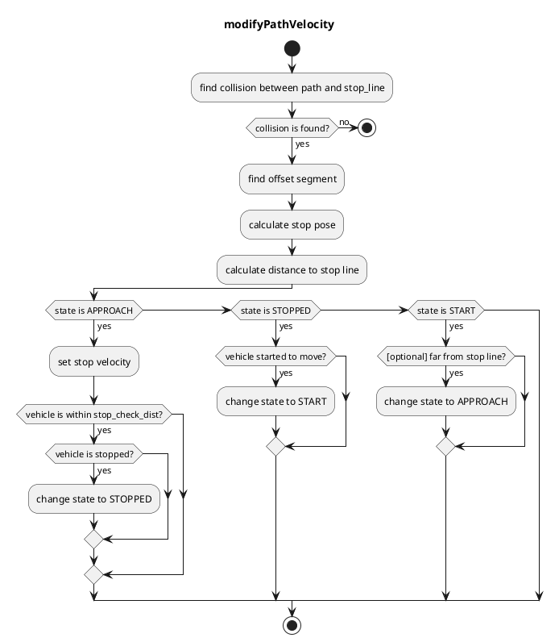

# The `behavior_velocity_planner` Package

## Overview

`behavior_velocity_planner` is a planner that adjust velocity based on the traffic rules.
It consists of several modules.

- Blind Spot
- Crosswalk
- Detection Area
- Intersection
- Stop Line
- Traffic Light

When each module plans velocity, it considers based on `base_link`(center of rear-wheel axis) pose.
So for example, in order to stop at a stop line with the vehicles' front on the stop line, it calculates `base_link` position from the distance between `base_link` to front and modifies path velocity from the `base_link` position.

## Input topics

| Name                          | Type                                             | Description          |
| ----------------------------- | ------------------------------------------------ | -------------------- |
| `~input/path_with_lane_id`    | autoware_planning_msgs::PathWithLaneId           | path with lane_id    |
| `~input/vector_map`           | autoware_lanelet2_msgs::MapBin                   | vector map           |
| `~input/vehicle_velocity`     | geometry_msgs::TwistStamped                      | vehicle velocity     |
| `~input/dynamic_objects`      | autoware_perception_msgs::DynamicObjectArray     | dynamic objects      |
| `~input/no_ground_pointcloud` | sensor_msgs::PointCloud2                         | obstacle pointcloud  |
| `~input/traffic_light_states` | autoware_perception_msgs::TrafficLightStateArray | traffic light states |

## Output topics

| Name                   | Type                                    | Description                            |
| ---------------------- | --------------------------------------- | -------------------------------------- |
| `~output/path`         | autoware_planning_msgs::Path            | path to be followed                    |
| `~output/stop_reasons` | autoware_planning_msgs::StopReasonArray | reasons that cause the vehicle to stop |

## Node parameters

| Parameter               | Type   | Description                                                                         |
| ----------------------- | ------ | ----------------------------------------------------------------------------------- |
| `launch_blind_spot`     | bool   | whether to launch blind_spot module                                                 |
| `launch_crosswalk`      | bool   | whether to launch crosswalk module                                                  |
| `launch_detection_area` | bool   | whether to launch detection_area module                                             |
| `launch_intersection`   | bool   | whether to launch intersection module                                               |
| `launch_traffic_light`  | bool   | whether to launch traffic light module                                              |
| `launch_stop_line`      | bool   | whether to launch stop_line module                                                  |
| `forward_path_length`   | double | forward path length                                                                 |
| `backward_path_length`  | double | backward path length                                                                |
| `max_accel`             | double | (to be a global parameter) max acceleration of the vehicle                          |
| `delay_response_time`   | double | (to be a global parameter) delay time of the vehicle's response to control commands |

## Modules

### Stop Line

#### Role

This module plans velocity so that the vehicle can stop right before stop lines and restart driving after stopped.

#### Module Parameters

| Parameter         | Type   | Description                                                                                    |
| ----------------- | ------ | ---------------------------------------------------------------------------------------------- |
| `stop_margin`     | double | a margin that the vehicle tries to stop before stop_line                                       |
| `stop_check_dist` | double | when the vehicle is within `stop_check_dist` from stop_line and stopped, move to STOPPED state |

#### Flowchart

This algorithm is based on `segment`.
`segment` consists of two node points. It's useful for removing boundary conditions because if `segment(i)` exists we can assume `node(i)` and `node(i+1)` exist.

First, this algorithm finds a collision between reference path and stop line.
Then, we can get `collision segment` and `collision point`.

Next, based on `collision point`, it finds `offset segment` by iterating backward points up to a specific offset length.
The offset length is `stop_margin`(parameter) + `base_link to front`(to adjust head pose to stop line).
Then, we can get `offset segment` and `offset from segment start`.

After that, we can calculate a offset point from `offset segment` and `offset`. This will be `stop_pose`.

