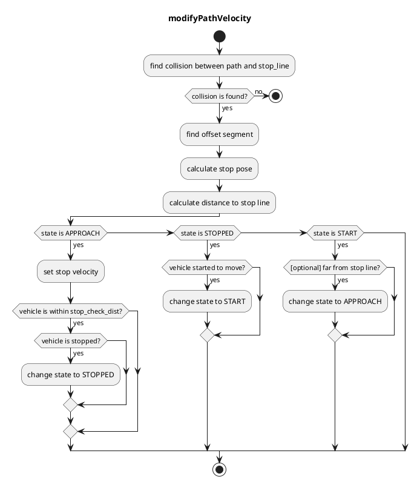
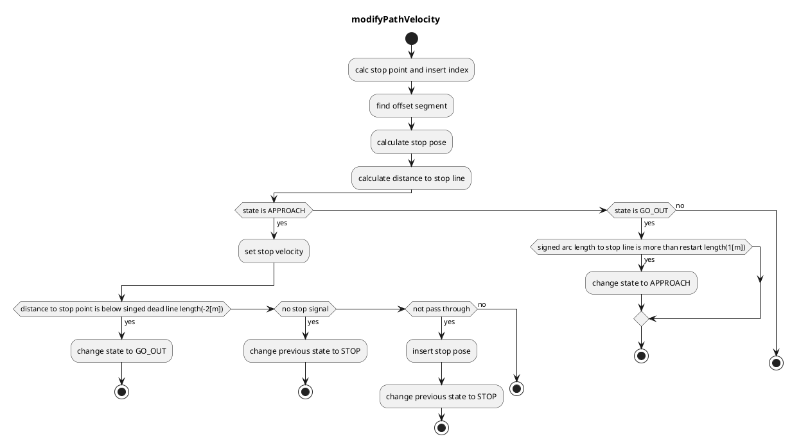
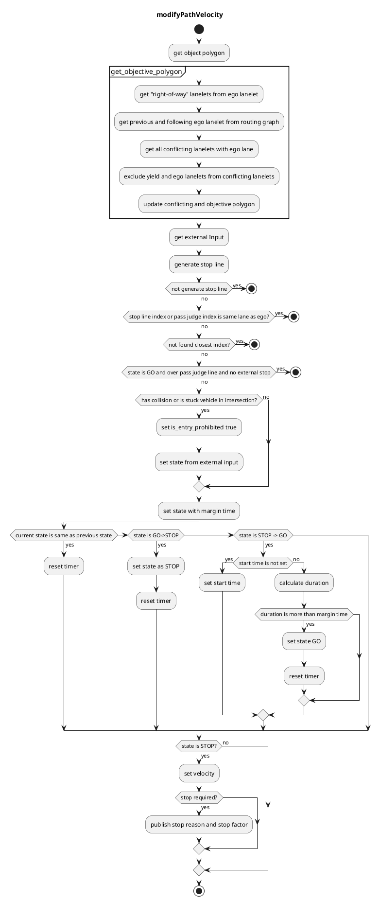
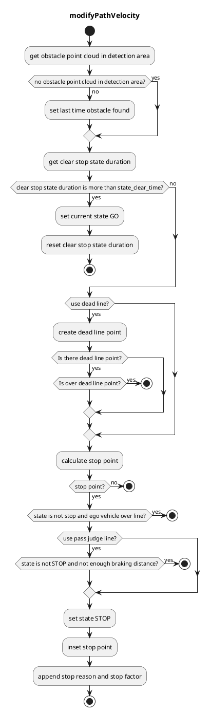
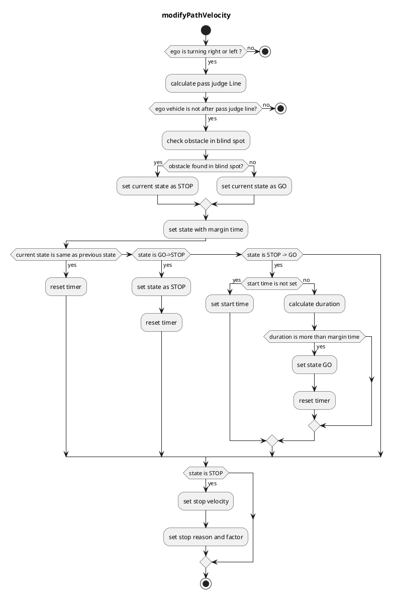
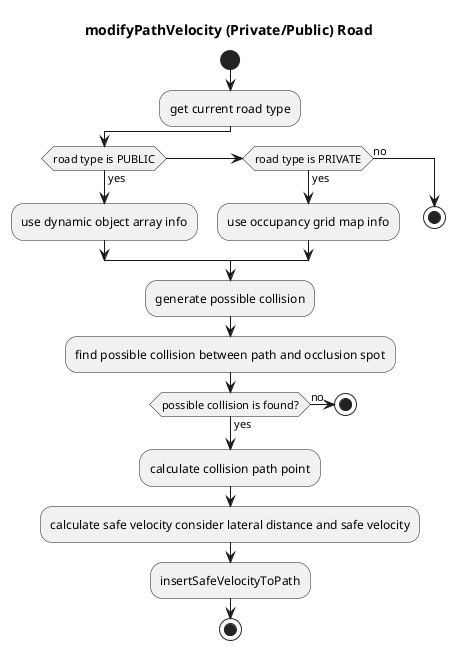

# Behavior Velocity Planner

## Overview

`behavior_velocity_planner` is a planner that adjust velocity based on the traffic rules.
It consists of several modules.

- Blind Spot
- Crosswalk
- Detection Area
- Intersection
- Stop Line
- Traffic Light
- Occlusion Spot

When each module plans velocity, it considers based on `base_link`(center of rear-wheel axis) pose.
So for example, in order to stop at a stop line with the vehicles' front on the stop line, it calculates `base_link` position from the distance between `base_link` to front and modifies path velocity from the `base_link` position.

## Input topics

| Name                          | Type                                                   | Description          |
| ----------------------------- | ------------------------------------------------------ | -------------------- |
| `~input/path_with_lane_id`    | autoware_auto_planning_msgs::msg::PathWithLaneId       | path with lane_id    |
| `~input/vector_map`           | autoware_auto_mapping_msgs::msg::HADMapBin             | vector map           |
| `~input/vehicle_odometry`     | nav_msgs::msg::Odometry                                | vehicle velocity     |
| `~input/dynamic_objects`      | autoware_auto_perception_msgs::msg::PredictedObjects   | dynamic objects      |
| `~input/no_ground_pointcloud` | sensor_msgs::msg::PointCloud2                          | obstacle pointcloud  |
| `~input/traffic_signals`      | autoware_auto_perception_msgs::msg::TrafficSignalArray | traffic light states |

## Output topics

| Name                   | Type                                         | Description                            |
| ---------------------- | -------------------------------------------- | -------------------------------------- |
| `~output/path`         | autoware_auto_planning_msgs::msg::Path       | path to be followed                    |
| `~output/stop_reasons` | autoware_planning_msgs::msg::StopReasonArray | reasons that cause the vehicle to stop |

## Node parameters

| Parameter               | Type   | Description                                                                         |
| ----------------------- | ------ | ----------------------------------------------------------------------------------- |
| `launch_blind_spot`     | bool   | whether to launch blind_spot module                                                 |
| `launch_crosswalk`      | bool   | whether to launch crosswalk module                                                  |
| `launch_detection_area` | bool   | whether to launch detection_area module                                             |
| `launch_intersection`   | bool   | whether to launch intersection module                                               |
| `launch_traffic_light`  | bool   | whether to launch traffic light module                                              |
| `launch_stop_line`      | bool   | whether to launch stop_line module                                                  |
| `launch_occlusion_spot` | bool   | whether to launch occlusion_spot module                                             |
| `forward_path_length`   | double | forward path length                                                                 |
| `backward_path_length`  | double | backward path length                                                                |
| `max_accel`             | double | (to be a global parameter) max acceleration of the vehicle                          |
| `delay_response_time`   | double | (to be a global parameter) delay time of the vehicle's response to control commands |

## Modules

### Stop Line

#### Role

This module plans velocity so that the vehicle can stop right before stop lines and restart driving after stopped.

#### Module Parameters

| Parameter         | Type   | Description                                                                                    |
| ----------------- | ------ | ---------------------------------------------------------------------------------------------- |
| `stop_margin`     | double | a margin that the vehicle tries to stop before stop_line                                       |
| `stop_check_dist` | double | when the vehicle is within `stop_check_dist` from stop_line and stopped, move to STOPPED state |

#### Flowchart

This algorithm is based on `segment`.
`segment` consists of two node points. It's useful for removing boundary conditions because if `segment(i)` exists we can assume `node(i)` and `node(i+1)` exist.

First, this algorithm finds a collision between reference path and stop line.
Then, we can get `collision segment` and `collision point`.

Next, based on `collision point`, it finds `offset segment` by iterating backward points up to a specific offset length.
The offset length is `stop_margin`(parameter) + `base_link to front`(to adjust head pose to stop line).
Then, we can get `offset segment` and `offset from segment start`.

After that, we can calculate a offset point from `offset segment` and `offset`. This will be `stop_pose`.

### Traffic Light

#### Role

Judgement of a stop and a velocity planning according to a traffic light color.

#### Launch Timing

Launches when there is a traffic light on a target lane

#### Algorithm

1. Obtains a traffic light mapped to the route and a stop line correspond to the traffic light from a map information.

2. Uses the highest reliability one of the traffic light recognition result and if the color of that was red, generates a stop point.

3. When vehicle current velocity is

   - higher than 2.0m/s ⇒ pass judge(using next slide formula)

   - lower than 2.0m/s ⇒ stop

4. When it to be judged that vehicle can’t stop before stop line, autoware chooses one of the following behaviors

   - "can pass through" stop line during yellow lamp => pass

   - "can’t pass through" stop line during yellow lamp => emergency stop

#### Dilemma Zone

- yellow lamp line

  It’s called “yellow lamp line” which shows the distance traveled by the vehicle during yellow lamp.

- dilemma zone

  It’s called “dilemma zone” which satisfies following conditions:

  - vehicle can’t pass through stop line during yellow lamp.(right side of the yellow lamp line)

  - vehicle can’t stop under deceleration and jerk limit.(left side of the pass judge curve)

    ⇒emergency stop(relax deceleration and jerk limitation in order to observe the traffic regulation)

- optional zone

  It’s called “optional zone” which satisfies following conditions:

  - vehicle can pass through stop line during yellow lamp.(left side of the yellow lamp line)

  - vehicle can stop under deceleration and jerk limit.(right side of the pass judge curve)

    ⇒ stop(autoware selects the safety choice)

#### Module Parameters

| Parameter                   | Type   | Description                                     |
| --------------------------- | ------ | ----------------------------------------------- |
| `stop_margin`               | double | [m] margin before stop point                    |
| `tl_state_timeout`          | double | [s] time out for detected traffic light result. |
| `external_tl_state_timeout` | double | [s] time out for external traffic input         |
| `yellow_lamp_period`        | double | [s] time for yellow lamp                        |
| `enable_pass_judge`         | bool   | [-] weather to use pass judge                   |

#### Flowchart

### Intersection

#### Role

Judgement whether a vehicle can go into an intersection or not by a dynamic object information, and planning a velocity of the start/stop

#### Launch Timing

Launches when there is an intersection area on a target lane

#### Module Parameters

| Parameter                                     | Type   | Description                                                                   |
| --------------------------------------------- | ------ | ----------------------------------------------------------------------------- |
| `intersection/state_transit_margin_time`      | double | [m] time margin to change state                                               |
| `intersection/decel_velocity`                 | double | [m] deceleration velocity in intersection                                     |
| `intersection/path_expand_width`              | bool   | [m] path area to see with expansion                                           |
| `intersection/stop_line_margin`               | double | [m] margin before stop line                                                   |
| `intersection/stuck_vehicle_detect_dist`      | double | [m] this should be the length between cars when they are stopped.             |
| `intersection/stuck_vehicle_ignore_dist`      | double | [m] obstacle stop max distance(5.0m) + stuck vehicle size / 2 (0.0m-)         |
| `intersection/stuck_vehicle_vel_thr`          | double | [m/s] velocity below 3[km/h] is ignored by default                            |
| `intersection/intersection_velocity`          | double | [m/s] velocity to pass intersection. 10[km/h] is by default                   |
| `intersection/intersection_max_accel`         | double | [m/s^2] acceleration in intersection                                          |
| `intersection/detection_area_margin`          | double | [m] range for expanding detection area                                        |
| `intersection/detection_area_length`          | double | [m] range for lidar detection 200m is by default                              |
| `intersection/detection_area_angle_threshold` | double | [rad] threshold of angle difference between the detection object and lane     |
| `intersection/min_predicted_path_confidence`  | double | [-] minimum confidence value of predicted path to use for collision detection |
| `merge_from_private_road/stop_duration_sec`   | double | [s] duration to stop                                                          |

#### Flowchart

NOTE current state is treated as `STOP` if `is_entry_prohibited` = `true` else `GO`

### CrossWalk

#### Role

Judgement whether a vehicle can go into a crosswalk and plan a velocity of the start/stop.

#### Launch Timing

Launches when there is a crosswalk on the target lane.

#### Module Parameters

| Parameter                                                | Type   | Description                                                              |
| -------------------------------------------------------- | ------ | ------------------------------------------------------------------------ |
| `crosswalk/stop_line_distance`                           | double | [m] make stop line away from crosswalk when no explicit stop line exists |
| `crosswalk/stop_margin`                                  | double | [m] a margin that the vehicle tries to stop before stop_line             |
| `crosswalk/slow_margin`                                  | bool   | [m] a margin that the vehicle tries to slow down before stop_line        |
| `crosswalk/slow_velocity`                                | double | [m] a slow down velocity                                                 |
| `crosswalk/stop_predicted_object_prediction_time_margin` | double | [s] time margin for decision of ego vehicle to stop or not               |
| `walkway/stop_line_distance`                             | double | [m] make stop line away from crosswalk when no explicit stop line exists |
| `walkway/stop_margin`                                    | double | [m] a margin that the vehicle tries to stop before walkway               |
| `walkway/stop_duration_sec`                              | double | [s] time margin for decision of ego vehicle to stop                      |

#### Flowchart

flow chart is almost the same as stop line.

### Detection Area

#### Role

If pointcloud is detected in a detection area defined on a map, the stop planning will be executed at the predetermined point.

#### Launch Timing

Launches if there is a detection area on the target lane.

### Algorithm

1. Gets a detection area and stop line from map information and confirms if there is pointcloud in the detection area
2. Inserts stop point l[m] in front of the stop line
3. Inserts a pass judge point to a point where the vehicle can stop with a max deceleration
4. Sets velocity as zero behind the stop line when the ego-vehicle is in front of the pass judge point
5. If the ego vehicle has passed the pass judge point already, it doesn’t stop and pass through.

#### Module Parameters

| Parameter             | Type   | Description                                                                                        |
| --------------------- | ------ | -------------------------------------------------------------------------------------------------- |
| `stop_margin`         | double | [m] a margin that the vehicle tries to stop before stop_line                                       |
| `use_dead_line`       | bool   | [-] weather to use dead line or not                                                                |
| `dead_line_margin`    | double | [m] ignore threshold that vehicle behind is collide with ego vehicle or not                        |
| `use_pass_judge_line` | bool   | [-] weather to use pass judge line or not                                                          |
| `state_clear_time`    | double | [s] when the vehicle is stopping for certain time without incoming obstacle, move to STOPPED state |

#### Flowchart

### Blind Spot

#### Role

Blind spot check while turning right/left by a dynamic object information, and planning and planning of a velocity of the start/stop.

### Definition

Sets a stop line, a pass judge line, a detection area and conflict area based on a map information and a self position.

- Stop line : Automatically created based on crossing lane information.

- Pass judge line : A position to judge if stop or not to avoid a rapid brake.

- Detection area : Right/left side area of the self position.

- Conflict area : Right/left side area from the self position to the stop line.

#### Module Parameters

| Parameter                       | Type   | Description                                                                 |
| ------------------------------- | ------ | --------------------------------------------------------------------------- |
| `stop_line_margin`              | double | [m] a margin that the vehicle tries to stop before stop_line                |
| `backward_length`               | double | [m] distance from closest path point to the edge of beginning point.        |
| `ignore_width_from_center_line` | double | [m] ignore threshold that vehicle behind is collide with ego vehicle or not |
| `max_future_movement_time`      | double | [s] maximum time for considering future movement of object                  |

#### Flowchart

### Occlusion Spot

#### Role

This module plans safe velocity to slow down before reaching collision point that hidden object is darting out from `occlusion spot` where driver can't see clearly because of obstacles.

#### Occlusion Spot Private

This module only works in private road and use occupancy grid map to detect occlusion spots.

#### Occlusion Spot Public

This module only works in public road and use dynamic objects to detect occlusion spots.

Considering all occupancy grid cells inside focus range requires a lot of computation cost, so this module ignores to search farther occlusion spot which is longitudinally or laterally slice once occlusion spot is found.

##### Definition

This module insert safe velocity at collision point and show virtual wall at intersection below.

#### Module Parameters

| Parameter            | Type   | Description                                                               |
| -------------------- | ------ | ------------------------------------------------------------------------- |
| `pedestrian_vel`     | double | [m/s] maximum velocity assumed pedestrian coming out from occlusion point |
| `safety_time_buffer` | double | [m/s] time buffer for the system delay                                    |

| Parameter /threshold    | Type   | Description                                               |
| ----------------------- | ------ | --------------------------------------------------------- |
| `detection_area_length` | double | [m] the length of path to consider occlusion spot         |
| `stuck_vehicle_vel`     | double | [m/s] velocity below this value is assumed to stop        |
| `lateral_distance`      | double | [m] maximum lateral distance to consider hidden collision |

| Parameter /(public or private)\_road | Type   | Description                                                          |
| ------------------------------------ | ------ | -------------------------------------------------------------------- |
| `min_velocity`                       | double | [m/s] minimum velocity to ignore occlusion spot                      |
| `ebs_decel`                          | double | [m/s^2] maximum deceleration to assume for emergency braking system. |
| `pbs_decel`                          | double | [m/s^2] deceleration to assume for predictive braking system         |

| Parameter /sidewalk       | Type   | Description                                                     |
| ------------------------- | ------ | --------------------------------------------------------------- |
| `min_occlusion_spot_size` | double | [m] the length of path to consider occlusion spot               |
| `focus_range`             | double | [m] buffer around the ego path used to build the sidewalk area. |

| Parameter /grid  | Type   | Description                                                     |
| ---------------- | ------ | --------------------------------------------------------------- |
| `free_space_max` | double | [-] maximum value of a free space cell in the occupancy grid    |
| `occupied_min`   | double | [-] buffer around the ego path used to build the sidewalk area. |

#### Flowchart

