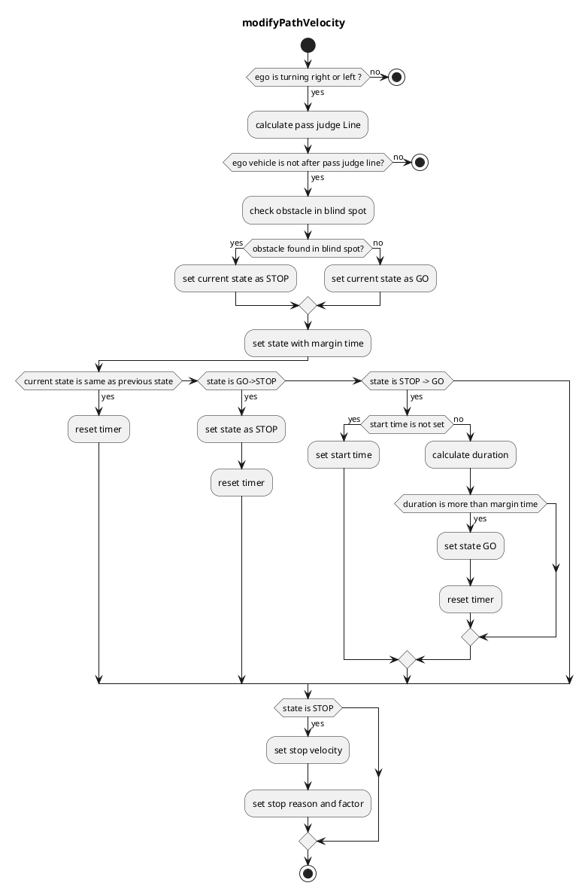

## ブラインドスポット

### 役割

ブラインドスポットモジュールは、交差点での左折/右折時、左/右側に走行する自転車や歩行者との衝突可能性をチェックします。

### 起動タイミング

この機能は、ターゲットパスのレーンIDに交差点ラベル（すなわち「`turn_direction`」属性が「`left`」または「`right`」）がある場合に起動されます。

### 内部動作/アルゴリズム

マップ情報と自車位置に基づいて、停止線、通過判定線、検出エリア、衝突エリアを設定します。

- 停止線: 交差するレーンの情報に基づいて自動作成されます。

- 通過判定線: 急ブレーキを回避するために、停止するかしないかを判断する位置です。

- 検出エリア: 自車位置の左右のエリアです。

- 衝突エリア: 自車位置から停止線までの左右のエリアです。

停止/走行状態: 各オブジェクトのいずれかで両方の条件が満たされた場合、このモジュールの状態は「停止」状態に移行し、ゼロ速度を挿入して車両を停止します。

- オブジェクトが検出エリア上にあります
- オブジェクトの予測パスが衝突エリアにあります

急停止を避けるために、「停止」判定は判定線が通過された後には実行されません。

「停止」が判定されると、状態のチャタリング（例: 2秒）を防ぐため、「走行」判定が一定時間継続するまで「走行」状態に移行しません。

### モジュールパラメータ

| パラメータ                       | タイプ   | 説明                                                                                      |
| ------------------------------- | ------ | ---------------------------------------------------------------------------------------------- |
| `stop_line_margin`              | double | [m] 車両が停止線手前で停止しようとするマージン                                              |
| `backward_length`               | double | [m] 最も近いパスポイントから始点のエッジまでの距離                                            |
| `ignore_width_from_center_line` | double | [m] 自車の後方の車両が自車と衝突するかどうかを無視するしきい値                                 |
| `max_future_movement_time`      | double | [s] オブジェクトの将来の移動を考慮するための最大時間                                       |
| `adjacent_extend_width`         | double | [m] 隣接する車線（例：自転車専用車線）が存在する場合、死角領域はこの長さだけ拡張される |

### フローチャート

