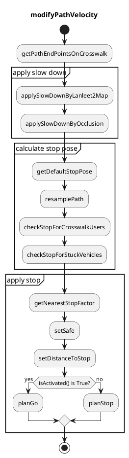
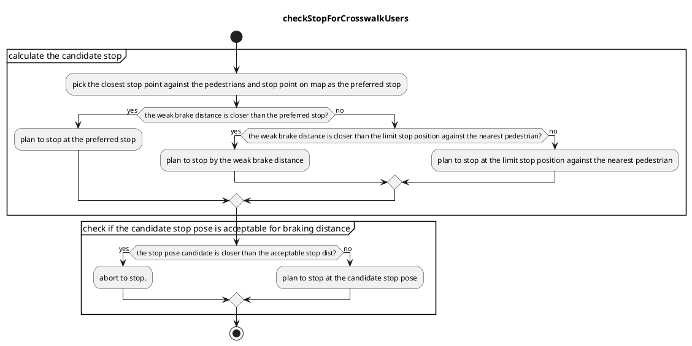

# 横断歩道

## 役割

本モジュールは、歩行者や自転車などの横断歩道利用者が安全に通行するために、車両が横断歩道前で停止する必要があるかどうかを、オブジェクトの挙動や周囲の交通状況に基づいて判断します。

<figure markdown>
  {width=1100}
</figure>

## フローチャート







## 機能

### 歩行者への優先権の譲与

#### ターゲットオブジェクト

crosswalkモジュールは、`object_filtering.target_object` 名前空間で定義された次のパラメータのタイプを持つオブジェクトを処理します。

| パラメータ    | 単位 | 型 | 説明                                    |
| ------------ | ---- | ---- | ---------------------------------------------- |
| `unknown`    | [-]  | bool | `UNKNOWN` 物体を探して停止するかどうか    |
| `pedestrian` | [-]  | bool | `PEDESTRIAN` 物体を探して停止するかどうか |
| `bicycle`    | [-]  | bool | `BICYCLE` 物体を探して停止するかどうか    |
| `motorcycle` | [-]  | bool | `MOTORCYCLE` 物体を探して停止するかどうか |

横断歩道外の周囲を横断する歩行者を処理するために、横断歩道モジュールは横断歩道周囲に注意領域を作成し、図の黄色の多角形で示されます。オブジェクトの予測パスが注意領域と衝突した場合、オブジェクトは譲歩の対象となります。

<figure markdown>
  {width=600}
</figure>

周囲は `object_filtering.target_object` ネームスペース内の次のパラメータによって定義されます。

| パラメータ | 単位 | 型 | 説明 |
|---|---|---|---|
| `crosswalk_attention_range` | [m] | double | 検出エリアは -X メートルから +X メートルの間の横断歩道として定義されます |

#### 停止位置

まず、安全性のため自己位置と対象物体の距離は常に `stop_distance_from_object [m]` 以上維持されます。

レーンのマップに停止線が存在する場合、停止位置は線に基づいて算出されます。レーンのマップに停止線が **存在しない** 場合、停止位置は自己位置と横断歩道の距離を `stop_distance_from_crosswalk [m]` に保つことで算出されます。

<div align="center">
    <table>
        <tr>
            <td></td>
            <td></td>
        </tr>
    </table>
</div>

例外ケースとして、 スクランブル交差点で見られる**幅広の**横断歩道を歩行者（または自転車）が横断しており、歩行者の位置が停止線から `far_object_threshold` メートル以上離れている場合、実際の停止位置は停止線ではなく、`stop_distance_from_object` と歩行者の位置によって決まります。

<figure markdown>
  {width=700}
</figure>

`stop_position` 名前空間では、以下のパラメータが定義されています。

| パラメータ                      |     | 型   | 説明                                                                                                                                                                                                                         |
| ------------------------------ | --- | ------ | -------------------------------------------------------------------------------------------------------------------------------------------------------------------------------------------------------------------------------------- |
| `stop_position_threshold`      | [m] | double | 自車位置が停止線からこの値よりも近い場合は、このモジュールは自車が譲歩を完了したとみなします。                                                                                                        |
| `stop_distance_from_crosswalk` | [m] | double | 明示的な停止線が設定されていないLanelet2マップの場合、停止線を横断歩道から離す                                                                                                                                         |
| `far_object_threshold`         | [m] | double | 物体が停止線のXメートル後ろを通過した場合、停止位置は、横断歩道の幅が非常に広い場合のケースに対して、オブジェクト位置に基づいて決定されます（オブジェクトの`stop_distance_from_object`メートル前） |
| `stop_distance_from_object`    | [m] | double | Vehicle decelerates to be able to stop in front of object with margin |

#### Yield判断

モジュールは歩行者信号が**緑**または**不明**の場合にのみ譲る判断を行います。
判断は、衝突点の計算とともに、以下の変数に基づきます。

- Time-To-Collision (TTC): **自車**が仮想衝突点に到達する時間。
- Time-To-Vehicle (TTV): **対象物**が仮想衝突点に到達する時間。

TTCとTTVの相対的な関係に基づき、横断歩道での**自車**の挙動を3つのカテゴリに分類します[1]。

- A. **TTC >> TTV**: 対象物は**自車**よりも先に横断する十分な時間があります。
  - 停止計画なし。
- B. **TTC ≒ TTV**: 衝突の危険性があります。
  - **自車の経路に停止点が挿入されます。**
- C. **TTC << TTV**: **自車**は対象物よりも先に横断する十分な時間があります。
  - 停止計画なし。

<div align="center">
    <table>
        <tr>
            <td></td>
            <td></td>
        </tr>
    </table>
</div>

AとBの境界は、`ego_pass_later_margin_x`と`ego_pass_later_margin_y`から補間されます。
上の図の場合、`ego_pass_later_margin_x`は`{0, 1, 2}`で、`ego_pass_later_margin_y`は`{1, 4, 6}`です。
同様に、BとCの境界は`ego_pass_first_margin_x`と`ego_pass_first_margin_y`から計算されます。
上の図の場合、`ego_pass_first_margin_x`は`{3, 5}`で、`ego_pass_first_margin_y`は`{0, 1}`です。

横断歩道に対応する赤信号が表示されている場合、**自車**は歩行者に対して譲りません。

<div align="center">
    <table>
        <tr>
            <td></td>
            <td></td>
        </tr>
    </table>
</div>

`pass_judge`ネームスペースで、以下のパラメータが定義されています。

| パラメーター                         |       | 型   | 説明                                                                                                                                     |
| ---------------------------------- | ----- | ------ | ----------------------------------------------------------------------------------------------------------------------------------------------- |
| `ego_pass_first_margin_x`          | [[s]] | double | ego_pass_first状況のタイム・トゥ・コリジョン・マージンベクトル（モジュールは、TTC + マージン < TTV条件ではegoが停止する必要がないと判断します） |
| `ego_pass_first_margin_y`          | [[s]] | double | ego_pass_first状況のタイム・トゥ・ビークル・マージンベクトル（モジュールは、TTC + マージン < TTV条件ではegoが停止する必要がないと判断します） |
| `ego_pass_first_additional_margin` | [s]   | double | チャッタリングを抑止するための、ego_pass_first状況の追加タイムマージン                                                                      |
| `ego_pass_later_margin_x`          | [[s]] | double | オブジェクトパスファースト状況のタイム・トゥ・ビークル・マージンベクトル（モジュールは、TTV + マージン < TTC条件ではegoが停止する必要がないと判断します） |
| `ego_pass_later_margin_y`          | [[s]] | double | オブジェクトパスファースト状況のタイム・トゥ・コリジョン・マージンベクトル（モジュールは、TTV + マージン < TTC条件ではegoが停止する必要がないと判断します） |
| `ego_pass_later_additional_margin` | [s]   | double | チャッタリングを抑止するための、オブジェクトパスファースト状況の追加タイムマージン                                                                   |

#### スムーズ歩行者譲り判定

歩行者が横断歩道付近で停止しており、歩行の意図がない場合、自車が歩行者に通行権を譲り続ける状況が発生することがあります。
このようなデッドロック状態を防ぐため、自車は状況に応じて譲歩をキャンセルします。

横断歩道付近で停止しており、歩行の意図が（\*1）ない歩行者については、自車が一定時間（\*2）譲歩のため停車を継続した後、譲歩をキャンセルして走行を開始します。

\*1：
時間は、物体と横断歩道間の距離を `distance_set_for_no_intention_to_walk` と `timeout_set_for_no_intention_to_walk` で補間して計算されます。

`pass_judge` 名前空間では、以下のパラメータが定義されています。

| パラメータ                                   |       | タイプ   | 説明                                                                                            |
| -------------------------------------------- | ----- | ------ | -------------------------------------------------------------------------------------------------- |
| `distance_set_for_no_intention_to_walk`     | [[m]] | double | 歩行の意思なしのタイムアウトを補間で計算するためのキーを設定します                            |
| `timeout_set_for_no_intention_to_walk`      | [[s]] | double | 歩行の意思なしのタイムアウトを補間で計算するための値を設定します                              |

**パス判定**

`pass_judge`名前空間に、以下のパラメータが定義されています。

| パラメータ | | タイプ | 説明 |
|---|---|---|---|
| `timeout_ego_stop_for_yield` | [s] | double | 自動運転車が停止を保持する時間がこの期間に達した場合、自動運転車は十分な時間停止したとみなし、走行を再開します。 |

#### 新規オブジェクトの取り扱い

認識の限界のため、木や電柱が歩行者として認識された場合、あるいは群衆や閉塞状況により追跡が失敗した場合、周囲の環境が変わっていないにもかかわらず、新しい歩行者（= 新しいIDの歩行者）が突然出現することがあります。
これが自車が横断歩道を通り抜けようとしているときに発生すると、自車は急停止します。

この問題に対処するために、オプション「disable_yield_for_new_stopped_object」が用意されています。
trueを設定すると、信号機のある横断歩道の周辺における減速決定は、新しい停止オブジェクトを無視します。

`pass_judge`ネームスペースでは、以下のパラメータが定義されています。

| パラメータ                               |       |      タイプ | 説明                                                                                  |
|------------------------------------------|--------|---------|------------------------------------------------------------------------------------------|
| `disable_yield_for_new_stopped_object`  |   [X]  | bool | trueの場合、信号機の付いた横断歩道付近にある停止中の新しい障害物は無視されます |

### 歩行者横断歩道での停止防止

この機能は、自車が歩行者横断歩道上で停止しないようにします。
歩行者横断歩道の直前に低速または停止している車両があり、歩行者横断歩道と車両との間に十分なスペースがない場合、歩行者や自転車がいない場合でも、歩行者横断歩道手前で停止するようPlanningモジュールが計画します。

`min_acc`、`min_jerk`、および`max_jerk`が満たされます。これらのパラメータを使用して自車が歩行者横断歩道手前で停止できない場合、停止位置は前進します。

<figure markdown>
  {width=600}
</figure>

`stuck_vehicle`名前空間で、次のパラメータが定義されます。

| パラメータ                               | 単位 | 型       | 説明                                                                 |
| ---------------------------------------- | ---- | -------- | --------------------------------------------------------------------- |
| `stuck_vehicle_velocity`                  | [m/s] | double   | 車両停止状態の最大速度しきい値                                    |
| `max_stuck_vehicle_lateral_offset`       | [m]   | double   | 目標車両の最大横方向オフセット                                      |
| `required_clearance`                     | [m]   | double   | 自車と前方の車両との確保するクリアランス                            |
| `min_acc`                                | [m/ss] | double   | 停止するための最小加速度                                            |
| `min_jerk`                               | [m/sss] | double   | 停止するための最小ジャーク                                          |
| `max_jerk`                               | [m/sss] | double   | 停止するための最大ジャーク                                          |

### 安全減速挙動

現在の Autoware の実装では、横断歩道の周辺にターゲット オブジェクトが検出されない場合、自車位置は横断歩道で減速しません。
ただし、たとえば死角がある場合など、減速することも考えられます。
この状況は、[lanelet2_format_extension.md](https://github.com/autowarefoundation/autoware_lanelet2_extension/blob/main/autoware_lanelet2_extension/docs/lanelet2_format_extension.md)
ドキュメントの指示に従って、関連する横断歩道にタグを設定することによって処理できます。

| パラメーター             | 単位 | タイプ | 説明                                                                                                             |
| --------------------- | ---- | ------ | ------------------------------------------------------------------------------------------------------------------- |
| `slow_velocity`       | m/s   | double | モジュールが FOA から減速コマンドを受信したときのターゲット車両速度                                               |
| `max_slow_down_jerk`  | m/sss | double | 安全なブレーキのための最小ジャーク減速度                                                                               |
| `max_slow_down_accel` | m/ss  | double | 安全なブレーキのための最小アクセル減速度                                                                              |
| `no_relax_velocity`   | m/s   | double | 現在速度が X m/s 未満の場合、エゴは常に停止位置で停止する（減速制約を緩和しない）                                  |

### オクルージョン

この機能を有効にすると、自動運転車は遮られた横断歩道手前で減速します。

横断歩道のオクルージョンは、オキュパンシーグリッドを使用して判断されます。
オクルージョンとは、`min_size`サイズの正方形のオクルージョンセルです（つまり、その値は`free_space_max`と`occupied_min`の間）。
横断歩道範囲内にオクルージョンが見つかった場合、横断歩道での速度制限は`slow_down_velocity`に設定されます。（ただし、`max_slow_down_jerk`と`max_slow_down_accel`で設定された制限を超えない範囲）
この範囲は、自動運転車の走行経路と横断歩道の交点から算出され、自動運転車が横断歩道に到達するまでの時間と`occluded_object_velocity`を掛けたものになります。
この範囲は、自動運転車が横断歩道から遠い場合は大きく、近い場合は小さくなります。

ちらつきを伴う判断を避けるために、時間バッファを使用できます。これにより、「減速を追加する（または削除する）」という決定は、オクルージョンが`time_buffer`パラメーターで定義された連続した時間検出（または未検出）された後にのみ行われます。

横断歩道の信号が赤のときにオクルージョンを無視するには、`ignore_with_traffic_light`をtrueに設定する必要があります。

移動中のオブジェクトによる一時的なオクルージョンを無視するには、
`ignore_behind_predicted_objects`をtrueに設定する必要があります。
デフォルトでは、`ignore_velocity_thresholds.default`より速度の高いオブジェクトの背後のオクルージョンは無視されます。
この速度閾値は、パラメータリスト`ignore_velocity_thresholds.custom_labels`と`ignore_velocity_thresholds.custom_thresholds`でオブジェクトクラスのラベルと速度閾値を指定することによって、オブジェクトタイプに応じて指定できます。
オブジェクトのマスクを膨らませるには、`extra_predicted_objects_size`を使用してフットプリントを大きくすることができます。

<figure markdown>
  {width=600}
</figure>

| パラメータ                                      | 単位 | タイプ        | 説明                                                                                                                                  |
| ---------------------------------------------- | ------ | ----------- | ------------------------------------------------------------------------------------------------------------------------------------------ |
| `enable`                                       | [-]   | ブール型        | trueの場合、エゴは、遮蔽されている横断歩道の周囲で減速します。                                                                              |
| `occluded_object_velocity`                     | [m/s] | ダブル型      | 遮蔽された空間から現れる可能性のあるオブジェクトの想定速度                                                                           |
| `slow_down_velocity`                           | [m/s] | ダブル型      | 減速速度                                                                                                                          |
| `time_buffer`                                  | [s]   | ダブル型      | 減速を追加/削除するための、遮蔽あり/なしの連続時間                                                                                |
| `min_size`                                     | [m]   | ダブル型      | 遮蔽の最小サイズ（正方形の1辺の長さ）                                                                                             |
| `free_space_max`                               | [-]   | ダブル型      | オキュパンシーグリッド内の空きセルの最大値                                                                                         |
| `occupied_min`                                 | [-]   | ダブル型      | オキュパンシーグリッド内の占有セルの最小値                                                                                         |
| `ignore_with_traffic_light`                    | [-]   | ブール型        | trueの場合、信号機のある横断歩道の遮蔽は無視されます。                                                                               |
| `ignore_behind_predicted_objects`              | [-]   | ブール型        | trueの場合、予測されたオブジェクトの背後にある遮蔽は無視されます。                                                                  |
| `ignore_velocity_thresholds.default`           | [m/s] | ダブル型      | 遮蔽は、速度が同じかそれよりも高いオブジェクトの背後でのみ無視されます。                                                           |
| `ignore_velocity_thresholds.custom_labels`     | [-]   | 文字列リスト | 既定以外の速度しきい値を定義するラベル（すべてのラベルについては、`autoware_perception_msgs::msg::ObjectClassification`を参照してください） |
| `ignore_velocity_thresholds.custom_thresholds` | [-]   | ダブルリスト | カスタムラベルの速度                                                                                                                |
| `extra_predicted_objects_size`                 | [m]   | ダブル型      | 遮蔽をマスクするためにオブジェクトに追加される余分なサイズ                                                                         |

### その他

`common` 名前空間では、以下のパラメータが定義されています。

| パラメータ                      | ユニット | 種類   | 説明                                                                                                                                                  |
| ------------------------------- | ------ | ------ | --------------------------------------------------------------------------------------------------------------------------------------------------- |
| `show_processing_time`          | [-]     | ブール値 | 処理時間を表示するかどうか                                                                                                                        |
| `traffic_light_state_timeout`   | [s]     | double | 信号のタイムアウトしきい値                                                                                                                        |
| `enable_rtc`                    | [-]     | ブール値 | true の場合、シーンモジュールは (rtc 関数の協力を要求して) rtc によって承認される必要があります。false の場合、モジュールは rtc から承認なしに実行できます。 |

##既知の問題

- ケースによっては譲歩の決定が積極的または消極的になることがあります。
  - 主な理由は、横断歩道モジュールが車両の将来の位置を知らないことです。車両の正確な位置は、すべての計画の後で決定されます。
  - 現在、このモジュールは車両が一定の速度で移動すると想定しています。

##デバッグ

### デバッグマーカーの可視化

`/planning/scenario_planning/lane_driving/behavior_planning/behavior_velocity_planner/debug/crosswalk` は、次のマーカーを表示します。

<figure markdown>
  {width=1000}
</figure>

- 黄色い多角形
  - 衝突チェックを計算するための車両フットプリントの多角形。
- ピンクの多角形
  - 衝突チェックを計算するためのオブジェクトフットプリントの多角形。
- 横断歩道の色
  - 信号の色を考慮して、赤はターゲットの横断歩道を、白は無視される横断歩道を示します。
- テキスト
  - モジュールID、TTC、TTV、およびモジュールの状態を示します。

### 衝突時間（TTC）の可視化


```sh
ros2 run autoware_behavior_velocity_crosswalk_module time_to_collision_plotter.py
```

## **Troubleshooting**

### **Behavior**

- Q. 交差点ユーザーオブジェクトがいないのに、自車位置が交差点付近で停止した
  - A. [スタックビークル検出](https://autowarefoundation.github.io/autoware.universe/pr-5583/planning/autoware_behavior_velocity_crosswalk_module/#stuck-vehicle-detection)を参照してください。
- Q. 交差点仮想ウォールが突然現れて、急停止した
  - A. 自車位置が交差点の近くにいたときに、交差点ユーザーが動き始めた可能性があります。
- Q. 歩行者信号が赤色でも、交差点モジュールが停止を決定する
  - A. レーンレットマップが正しくない可能性があります。歩行者信号と交差点は関連付けられている必要があります。
- Q. Planningシミュレーションで、交差点モジュールがすべての交差点で停止する譲渡動作を行う
  - A. これは、歩行者信号が既定で不明であるためです。この場合、交差点は安全のために譲渡動作を行います。

### **パラメータ調整**

- Q. 自車の譲渡動作が保守的すぎる
  - A. [譲渡決定](https://autowarefoundation.github.io/autoware.universe/pr-5583/planning/autoware_behavior_velocity_crosswalk_module/#stuck-vehicle-detection)に記載されている「`ego_pass_later_margin`」を調整します。
- Q. 自車の譲渡動作が攻撃的すぎる
  - A. [譲渡決定](https://autowarefoundation.github.io/autoware.universe/pr-5583/planning/autoware_behavior_velocity_crosswalk_module/#stuck-vehicle-detection)に記載されている「`ego_pass_later_margin`」を調整します。

## **参考文献/外部リンク**

[1] 佐藤 みなみ, 早坂 祥一, 清水 政行, 村野 隆彦, 横断歩行者に対するドライバのリスク回避行動のモデル化, 自動車技術会論文集, 2013, 44 巻, 3 号, p. 931-936.

