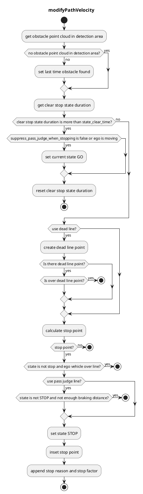

## 検知領域

### 役割

地図上に定義された検知領域で点群が検知された場合、設定された地点で停止するプランニングが実行されます。

### 稼働タイミング

このモジュールは、対象レーン上に検知領域が存在する場合に稼働します。

### モジュールパラメータ

| パラメータ                           | 型   | 説明                                                                                                      |
| ----------------------------------- | ------ | ---------------------------------------------------------------------------------------------------------- |
| `use_dead_line`                     | 論理型 | [-] デッドラインを使用するかどうか                                                                            |
| `use_pass_judge_line`               | 論理型 | [-] 通過判定ラインを使用するかどうか                                                                          |
| `state_clear_time`                  | double | [s] オブジェクトが一定時間検出されず、車両が停止している場合、STOPPED 状態に遷移する                       |
| `stop_margin`                       | double | [m] 車両が停止線前に停止しようとするマージン                                                               |
| `dead_line_margin`                  | double | [m] 後続車が自車と衝突するかどうかを無視するしきい値                                                             |
| `hold_stop_margin_distance`         | double | [m] 再始動防止のための設定 (アルゴリズム セクションを参照)                                                     |
| `distance_to_judge_over_stop_line`  | double | [m] 停止線を越えたことを判定するためのパラメータ                                                               |
| `suppress_pass_judge_when_stopping` | 論理型 | [m] 停止時に通過判定を抑制するためのパラメータ                                                                 |

### 内部動作/アルゴリズム

1. マップ情報から検出領域と停止線を取得し、検出領域に点群があることを確認する
2. 停止線から前方 l[m] に停止点を挿入する
3. 車両が最大減速度で停止可能な点に通過判定点を挿入する
4. 自車位置が通過判定点前方にいる場合、停止線後方に速度をゼロに設定する
5. 自車位置が通過判定点をすでに通過している場合、停止せずに通過する

#### フローチャート

#### 再始動防止

車両制御性能が低いため、動き始めたら0.5メートルなどの距離（Xメートル）が必要な場合、車両は停止地点を超えて進み、停止寸前の地点（例：0.3メートル先）に近づくため、厳守する必要があります。

このモジュールには、このような重複する再始動を防ぐためのパラメーター「hold_stop_margin_distance」があります。車両がモジュール停止位置（_front_to_stop_line < hold_stop_margin_distance）から「hold_stop_margin_distance」メートル以内で停止した場合、車両はモジュールの停止位置で停止していると判断し、車両が他の要因で停止した場合でも現在の位置で停止を続けることを計画します。

<figure markdown>
  {width=1000}
  <figcaption>パラメーター</figcaption>
</figure>

<figure markdown>
  {width=1000}
  <figcaption>hold_stop_margin_distanceの外側</figcaption>
</figure>

<figure markdown>
  {width=1000}
  <figcaption>hold_stop_margin_distanceの内側</figcaption>
</figure>

