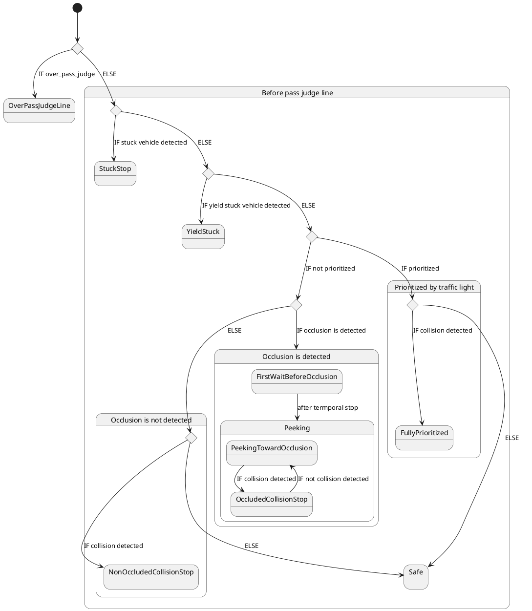
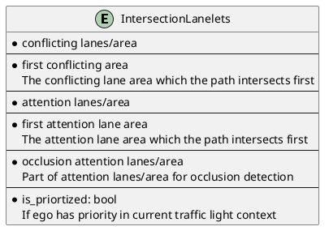
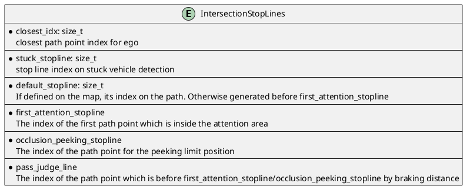
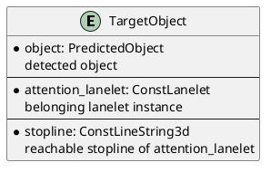
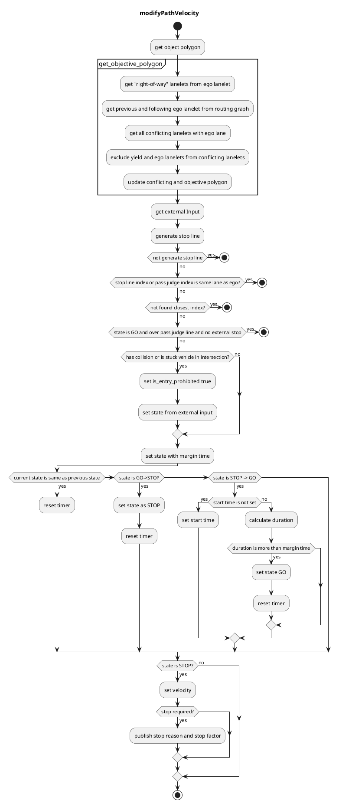

## 交差点

### 役割

交差点モジュールは、以下の方法により都市部の交差点を安全に通過する責任を負っています。

1. 前方の車両との衝突を確認する
2. 交差点内の隠れたエリアを認識する
3. 関連する信号機の各色/形状に対応する

このモジュールは左ハンドル/右ハンドルの交通規則に依存せず、十字路、T字路などで動作するように設計されています。このモジュールではラウンドアバウトは正式にサポートされていません。


### アクティブ条件

このモジュールは、パスに `turn_direction` タグを持つレーンが含まれる場合にアクティブになります。より正確には、パスの `lane_ids` がこれらのレーンの `id` を含む場合、対応する交差点モジュールのインスタンスがそれぞれレーンごとにアクティブになります。

### 要件/制限事項

- HDマップには、交差点内のすべてのレーンに関する `turn_direction` タグ（`straight`、`left`、`right` のいずれか）の情報と、特定のレーンに関する `right_of_way` タグ（詳細については [RightOfWay](#how-towhy-set-rightofway-tag) セクションを参照）が必要です。詳細については、[autoware_lanelet2_extension ドキュメント](https://github.com/autowarefoundation/autoware_lanelet2_extension/blob/main/autoware_lanelet2_extension/docs/lanelet2_format_extension.md) を参照してください。
- WIP(認識要件/制限事項)
- WIP(センサー視認性の要件/制限事項)

### 注視領域

交差点内の注視領域は、エゴパスと競合するレーンとその先行する最大 `common.attention_area_length` メートルのレーンとして定義されます。既定では `RightOfWay` タグが設定されていないため、注視領域は最初の行に示すように、すべての競合するレーンとその先行するレーンをカバーします。`RightOfWay` タグは、信号機の関係と `turn_direction` の優先順位に基づいて各レーンが優先権を持つレーンを除外するために使用されます。2 行目では、紫色のレーンは `RightOfWay` タグ内のエゴレーンの `yield_lane` として設定されています。


HDマップ上に定義されている `intersection_area` は、交差点全体を変換する領域です。

### 同相/逆相信号群

「同相信号群」と「逆相信号群」という用語は、次図に示すように、信号機規制のタイミングによってレーンを区別するために導入されました。


レーン L1 と色が同期している交差点レーン群を L1 の同相信号群と呼び、残りのレーン群を逆相信号群と呼びます。

### RightOfWay タグの設定方法/理由

理想的には、エゴがすべての信号情報に完全にアクセスできる場合、RightOfWay タグは不要です。なぜなら：

- 現在 GREEN であるためにチェックする必要がある競合レーンと、そのレーン上の車両との衝突が発生する可能性があります。
- 現在 RED であるために無視できる競合レーンと、そのレーン上の車両との衝突は、交通規則に違反しない限り発生しません。

これにより、エゴはリアルタイムの信号情報を使用して注視領域を動的に生成できます。ただし、この理想的な条件は、信号情報がインフラストラクチャを介して提供されない限り、ほとんど満たされません。また、複数のレーンが複雑に重なる非常に複雑で悪い交差点のマップがある可能性があります。

- 完全な信号機信号に完璧にアクセスできる場合は、`common.use_map_right_of_way` を false に設定できます。RightOfWay タグをマップ上に設定する必要はありません。交差点モジュールは、信号機と対応する競合レーンを確認して注視領域を生成します。この機能はまだ実装されていません。
- 信号情報が完璧でない場合は、`common.use_map_right_of_way` を true に設定します。逆相信号群レーンの車両を検出しない場合は、それらをエゴレーンの `yield_lane` として設定します。
- 信号がなくても、交差点レーンが醜い方法で重なっている場合は、RightOfWay タグを設定する必要がある場合があります。たとえば、同じ同相群の隣接する交差点レーンが境界線を共有せず、少し重なっている場合は、そのような無関係なレーンで不必要に停止しないようにお互いに RightOfWay を設定する必要がある場合があります。

交差点モジュールが限られたレーンのセットのみを処理できるようにするには、RightOfWay タグを適切に設定する必要があります。

次の表は、**例**として、信号のない交差点の各レーンに `yield_lane` を設定する方法を示しています。幾何学的/トポロジ的な方法で交差点レーンのセットの一意の信号位相グループを決定する方法は明らかでないため、`yield_lane` を手動で設定する必要があります。信号機のある直進レーンは、通常他のすべてのレーンよりも優先順位が高いため、レーンの検出がされないように特別に処理されます。したがって、RightOfWay の設定は必要ありません。

| 進路と優先道路の関係 | 交差点での減速車線（信号有り）                                                       | 交差点での減速車線（信号無し）                    |
| ---------------------- | ---------------------------------------------------------------------------------------- | --------------------------------------------------- |
| 直進                   | 減速車線を設定する必要はない（このケースは特殊）                                      | 同相車の対向車線                                  |
| 左折（左ハンドル車）   | 反相車の対抗車線と対向車線の同相車の右側から対抗する車線                              | 同相車の対向車線の右側の車線                      |
| 右折（左ハンドル車）   | 反相車の対抗車線                                                                 | 減速車線を設定しない                                |
| 左折（右ハンドル車）   | 反相車の対抗車線                                                                 | 減速車線を設定しない                                |
| 右折（右ハンドル車）   | 反相車の対抗車線と対向車線の同相車の右側から対抗する車線                              | 同相車の対向車線の左側の車線                      |

この設定は、次の `attention_area` 設定を提供します。


以下のように示される複雑/不良な交差点のマップの場合、追加の RightOfWay 設定が必要になる場合があります。


不良な点は次のとおりです。

1. ego 車線は同期グループの隣接車線と重複しています。この場合、他に注意領域が先行車線にも生成され、望ましくない停止が発生する可能性があるため、この車線を yield_lane として追加で設定する必要があります。
2. ego 車線は無関係な車線と重複しています。この場合、理論的には右折専用車線であり、衝突の可能性はありません。ただし、(1) と同じ理由でこの車線を yield_lane として追加設定する必要があります。

## 停止線

次の図は、交差点モジュールで使用される重要な位置を示しています。各実線は ego 車両のフロントラインの位置を表し、対応するドットは車両フレームの実際の挿入停止点の位置、つまり後輪の中心を表しています。


停止位置を正確に計算するために、経路は `common.path_interpolation_ds` の特定の間隔で補間されます。

- closest_idx は、ego 位置に最も近い経路ポイントインデックスを示します。
- first_attention_stopline は、ego フットプリントが attention_area と交差する最初の経路ポイントを示します。
- 停止線がマップ上の交差点車線に関連付けられている場合、その線は衝突検出用の default_stopline として使用されます。そうでない場合、first_attention_stopline の `common.default_stopline_margin` メートル後ろの点が代わりに default_stopline として定義されます。
- occlusion_peeking_stopline は、後で説明するように、first_attention_stopline より少し先です。
- occlusion_wo_tl_pass_judge_line は、ego フットプリントが最初の attention_area 車線のセンターラインと交差する最初の位置です。

## 標的オブジェクト

[立ち往生車両の検出](#stuck-vehicle-detection) と [衝突検出](#collision-detection) の場合、このモジュールは **乗用車**、**バス**、**トラック**、**トレーラー**、**モーターサイクル**、**自転車** タイプのオブジェクトを確認します。

次の条件をすべて満たすオブジェクトは、標的オブジェクト（衝突の可能性のあるオブジェクト）と見なされます。

- オブジェクトの中心は注目車線から **一定の距離以内** にある (しきい値 = `common.attention_area_margin`)。
  - (オプションの条件) オブジェクトの中心が **交差点エリア** にある。
    - 交差点内の車線でカバーされていない領域にあるオブジェクトを処理するため。
- オブジェクトの姿勢は **注目車線と同じ方向** である (しきい値 = `common.attention_area_angle_threshold`)。
- ego の **隣接車線にいない**。

## 意思決定プロセスの概要

シーンに応じて、いくつかの動作があります。

| 挙動             | シーン                                                                                            | アクション                                                                             |
| ---------------- | ------------------------------------------------------------------------------------------------- | ----------------------------------------------------------------------------------- |
| 安全             | 自車が遮蔽と衝突を検出しない                                                           | 自車が交差点を通過する                                                        |
| 停止維持         | 交差点の出口が渋滞によって塞がれている                                                    | 自車が交差点または注意領域の境界手前で停止する                               |
| 譲歩による停止     | 他の車両が自車に道を譲るために停車する                                                         | 自車が交差点または注意領域の境界手前で停止する                               |
| 遮蔽なし衝突停止 | 自車が遮蔽を検出しないが衝突を検出する                                                    | 自車がデフォルトの停止線で停止する                                               |
| 遮蔽範囲前に待機する | 交差点への進入時に自車が遮蔽を検出する                                                      | 自車が最初にデフォルトの停止線で停止する                                       |
| 遮蔽のほうを伺う     | 自車が遮蔽を検出し、視野内では衝突を検出しない（遮蔽範囲前に待機した後）                | 自車が注意領域の境界にゆっくりと接近する                                   |
| 遮蔽により衝突停止 | 自車が遮蔽と衝突の両方を検出する（遮蔽範囲前に待機した後）                              | 自車が直ちに停止する                                                          |
| 完全優先          | 自車が赤/矢印信号によって完全に優先されている                                                | 自車は交差点内でまだ走行中の車両のみを考慮する。遮蔽は無視される                |
| 通過判断線通過     | 自車がすでに注意領域内にある、または注意領域の境界手前で停止できないことを検出している | 自車は衝突/遮蔽を検出せず、交差点を通過する                                    |




## スタック車両検出

交差点内部および交差点出口（最大 `stuck_vehicle.stuck_vehicle_detect_dist` レーン）の経路上にオブジェクトがあり、その速度がしきい値（`stuck_vehicle.stuck_vehicle_velocity_threshold`）未満の場合、オブジェクトはスタック車両とみなされます。スタック車両が存在する場合、このモジュールは他のレーンとの重複領域より手前の特定の距離（=`default_stopline_margin`）に停止線を挿入します。スタック車両検出領域は計画された経路に基づいて生成されるため、上流のモジュールが回避経路を生成している場合はスタック車両停止線は挿入されません。


## 一時停止車両検出

エゴパスとの交差点点と、その位置から `yield_stuck.distance_threshold` 前の位置の間の注意レーンの停止オブジェクトがある場合、オブジェクトはエゴ車両に対して一時停止していると見なされます。この場合、エゴは一時停止オブジェクトによって優先権を与えられますが、このモジュールは交差点への進入を防ぐ停止線を挿入します。このシーンは、オブジェクトがエゴに対して一時停止しているか、交差点の出口付近の横断歩道前でオブジェクトが待機しているときに発生します。


## 衝突検出

エゴが交差点を安全に通過できるかどうかを判断するために、次の処理がターゲットオブジェクトに対して行われます。エゴが十分な余裕をもって交差点を通過できないと判断された場合、このモジュールは経路上に停止線を挿入します。

1. 予測された経路時間ステップから、オブジェクトが最初にエゴパスと交差する時間`t`を予測します。信頼度が`collision_detection.min_predicted_path_confidence`よりも大きい予測のみが使用されます。
2. 以下のプロセスで予測された経路とエゴの予測された経路間の衝突を検出します
   1. [$t$ - `collision_detection.collision_start_margin_time`, $t$ + `collision_detection.collision_end_margin_time`]の衝突インターバルを計算します
   2. 平滑化された速度プロファイルによって取得された（時間、距離）の配列から、衝突インターバル中のエゴ通過領域を計算します。
   3. エゴ通過領域とオブジェクトの予測パスインターバルが衝突するかどうかをチェックします
3. 衝突が検出された場合、モジュールは停止線を挿入します
4. エゴが[通過判定ライン](#通過判定ライン)を超えている場合、急ブレーキや交差点の中央での不要な停止を避けるために、衝突チェックはスキップされます

パラメータ`collision_detection.collision_start_margin_time`と`collision_detection.collision_end_margin_time`は次のように解釈できます。

- エゴがターゲットオブジェクトよりも早く交差点を通過する場合は、2つの間の時間差が`collision_detection.collision_start_margin_time`未満の場合に衝突が検出されます。
- エゴがターゲットオブジェクトよりも遅く交差点を通過する場合は、2つの間の時間差が`collision_detection.collision_end_margin_time`未満の場合に衝突が検出されます。

衝突が検出されると、状態はすぐに「STOP」に移行します。一方、決定のチャタリングを防ぐために、セーフな判断が一定期間`collision_detection.collision_detection_hold_time`にわたって続かない限り、状態は「GO」に移行しません。

現在、交差点モジュールは`motion_velocity_smoother`機能を使用して、縦方向/横方向の制約の下で交差点レーンに沿ったエゴの速度プロファイルを正確に計算しています。フラグ`collision_detection.velocity_profile.use_upstream`がtrueの場合、元々のパスのターゲット速度プロファイルが使用されます。そうでない場合、ターゲット速度は`collision.velocity_profile.default_velocity`に設定されます。軌跡平滑化処理では、エゴの軌跡ポイントで/その前のターゲット速度は、エゴの現在の速度に設定されます。滑らかにされた軌跡はその後、現在のエゴの位置から経路上の各軌跡ポイントへの到着時間を示す（時間、距離）の配列に変換されます。レーンIDを`debug.ttc`に追加して実行することでこの配列を視覚化できます。


```bash
ros2 run behavior_velocity_intersection_module ttc.py --lane_id <lane_id>
```


### upstream_velocity フラグについて

一部のユースケースでは、交差点の出口付近の歩道/横断歩道モジュールにより一時停止が考慮されるため、その停止位置が交差点内にある可能性があり、進行中の車両に影響を与える可能性があるため、ego が交差点に入る前に衝突を確認する必要があります。フラグ `collision_detection.velocity_profile.use_upstream` を true に設定し、このモジュールより前に歩道/横断歩道モジュールを実行すると、ego の速度プロファイルがそれらの速度と停止位置を考慮して計算されます。

下図に示すように、アップストリームモジュールが停止線を追加した場合、ego の位置プロファイルはそこには無限に残り、このため ego が [$t$ - `collision_detection.collision_start_margin_time`, $t$ + `collision_detection.collision_end_margin_time`] の間隔で交差点から出られないと判断されます。この方法では、ego の位置より先に停止線が存在する場合、無限に衝突の可能性を考慮します（実際には予測の範囲は制限されているため、衝突チェックの範囲は限定されています）。


## オクルージョン検出

フラグ `occlusion.enable` が true の場合、このモジュールは `occlusion.occlusion_attention_area_length` までの注目範囲の視野 (FOV) が十分にあるかどうかを確認します。FOV が十分にクリアでない場合、ego は最初に `occlusion.temporal_stop_time_before_peeking` の間 default_stopline で短時間停止し、その後オクルージョン_ピーキング_ストップラインにゆっくりと進みます。`occlusion.creep_during_peeking.enable` が true の場合、`occlusion.creep_during_peeking.creep_velocity` がオクルージョン_ピーキング_ストップラインまで挿入されます。そうでない場合、停止線のみが挿入されます。

忍び寄っている間に衝突が検出された場合、このモジュールはすぐに ego の前に停止線を追加し、FOV が十分にクリアになると交差点_オクルージョン壁は消えます。オクルージョンがクリアされ、衝突が検出されなかった場合、ego は交差点を通過します。

オクルージョンは、オクルージョン注目範囲（通常注目範囲と部分的に同じ）と占有グリッドマップの不明セルとの共通領域として検出されます。占有グリッドマップは `occlusion.denoise_kernel` のウィンドウサイズを使用して形態学を用いてノイズを除去されます。オクルージョン注目範囲のレーンは直線ストリングに離散化され、それらを使用して、下の図のように各セルがレーンに沿った ego パスの距離を表すグリッドを生成します。


最も近いオクルージョンセル値がしきい値 `occlusion.occlusion_required_clearance_distance` よりも低い場合、ego の FOV はクリアではないことを意味します。オクルージョンは、車両がオクルージョン監視停止線に近づくとクリアされると予想されます。

### 信号機のある交差点でのオクルージョンソースの推定

信号機のある交差点では、ego と最も近いオクルージョンセルとの間に物体があるかどうかをチェックすることで、オクルージョンの所在推定が行われます。オクルージョンが何らかの物体によって引き起こされていると推定される間 (動的にオクルージョンされる)、交差点_ウォールは常に表示されます。ego と最も近いオクルージョンセルとの間に物体が見つからない場合（静的にオクルージョンされる）、ego は `occlusion.static_occlusion_with_traffic_light_timeout` の期間と `occlusion.occlusion_detection_hold_time` の期間停止した後、意図的にオクルージョンを無視してスタックを回避します。

残り時間は交差点_オクルージョン仮想ウォールに視覚化されます。


### 信号機のない交差点でのオクルージョン処理

信号機のない交差点でオクルージョンが検出された場合、ego は default_stopline と first_attention_stopline でそれぞれ短時間停止します。first_attention_area_stopline で停止した後、このモジュールはオクルージョンがクリアされない間、ego と occlusion_wo_tl_pass_judge_line の間に `occlusion.absence_traffic_light.creep_velocity` の速度を挿入します。衝突が検出された場合、ego はすぐに停止します。オクルージョンがクリアされたか、ego が occlusion_wo_tl_pass_judge_line を通過すると、ego のフットプリントはすでに交差点内にあるため、このモジュールは衝突やオクルージョンを検出しません。


ego が進んでいる間、黄色の交差点_ウォールが ego の前に表示されます。


## 交通信号固有の挙動

### 衝突検出

TTC パラメータは信号機の色や形状によって次のように変化します。

| 交通信号色 | ttc(開始)                                                               | ttc(終了)                                                               |
| ------------------- | ---------------------------------------------------------------------- | ---------------------------------------------------------------------- |
| GREEN               | `collision_detection.not_prioritized.collision_start_margin`           | `collision_detection.not_prioritized.collision_end_margin`             |
| AMBER               | `collision_detection.partially_prioritized.collision_start_end_margin` | `collision_detection.partially_prioritized.collision_start_end_margin` |
| RED / Arrow         | `collision_detection.fully_prioritized.collision_start_end_margin`     | `collision_detection.fully_prioritized.collision_start_end_margin`     |

### グリーンスロー中での譲り

信号がグリーンに変化し、自分車が交差点レーン入り口に `collision_detection.yield_on_green_traffic_light.distance_to_assigned_lanelet_start` 以内で接近し、ストップラインまでの距離が `collision_detection.yield_on_green_traffic_light.object_dist_to_stopline` 未満のオブジェクトがある場合、このモジュールはデフォルト・ストップラインに `collision_detection.yield_on_green_traffic_light.duration` 間停止することを指示します。

### アンバー中でのスキップ

信号がアンバーですが、オブジェクトが `collision_detection.ignore_on_amber_traffic_light.object_expected_deceleration` の減速度でストップラインより手前で停止すると予想される場合、衝突チェックはスキップされます。

### レッド中でのスキップ

信号がレッドまたは矢印信号が点灯している場合、自分車レーンと交差しない注意レーンは検出に使用されません。さらに、オブジェクトがストップラインからある程度オーバーシュートして停止する場合でも、`collision_detection.ignore_on_amber_traffic_light.object_expected_deceleration` の減速度で予想される停止位置が衝突地点から `collision_detection.ignore_on_red_traffic_light.object_margin_to_path` 以上の距離にある場合、そのオブジェクトは無視されます。

### オクルージョン検出

信号の色/形状がレッド/矢印の場合、オクルージョン検出はスキップされます。


## パス判定線

一般的に、交差点内の無保護領域の真ん中に交通優先順位の低い車両が停車することは許容されず、衝突の危険がある場合はその前に停止する必要があります。これにより次の2つの要件が生じます。

1. 車両は、停止する場合、少なくとも制動距離分、無保護領域の境界線より手前でブレーキを開始する必要がある
2. 車両は、走行する場合、十分な制動距離マージンで先行車両を認識し、安全性を事前に確認する必要がある
  1. そして、安全の判断は絶対に確実であり、将来の予測期間にわたって有効である必要がある。そのため、安全条件は、自分車が無保護領域内を走行している間、常に満たされる必要があります。
3. (TODO): 制限された検出範囲/速度追跡性能を考慮すると、完璧に安全な判断を事前に下すことはほとんど不可能であるため、交差点モジュールは、安全上の判断が次の理由により後に "裏切られた" 場合に、リスク回避的加速速度プロファイルの計画と/または横方向加速度制限の緩和を行う必要があります。
  1. 状況がその後に危険になった場合、主に速度追跡が過小評価されたか、またはオブジェクトが TTC マージンを超えて加速したため
  2. 状況がその後に危険になった場合、主にオブジェクトが突然どこからともなく検出されたため

$$
\dfrac{v_{\mathrm{ego}}^{2}}{2a_{\mathrm{max}}} + v_{\mathrm{ego}} * t_{\mathrm{delay}}
$$

によって得られる制動距離分、無保護領域の境界線より手前の位置をパス判定線と呼び、自分車がこの位置を通過する前に安全上の判断が行われなければなりません。自分車はこれ以上停車しなくなるからです。

1st_pass_判定線は最初の先行レーンより手前にあり、複数の先行レーンがある交差点では、2nd_pass_判定線は制動距離分、最初の注意レーンのセンターラインより手前の位置として定義されます。1st/2nd_pass_判定線は次の図で示されています。


交差点モジュールは次の場合に走行を指示します。

- 自分車がデフォルト・ストップラインを越えている場合 (または `common.enable_pass_judge_before_default_stopline` が true の場合)
- 自分車が 1st_pass_判定線を越えている場合
- 自分車が以前に SAFE と判断されている場合
- (自分車が 2nd_pass_判定線を越えている場合、または自分車が 1st と 2nd のパス判定線の間にあるが、最も可能性の高い衝突が 1st の注意レーンで発生すると予想される場合)

以下の場合は、停止するか停止判断を継続すると予想されるためです。

1. 自分車がデフォルト・ストップラインより前で `common.enable_pass_judge_before_default_stopline` が false の場合
  1. 理由: デフォルト・ストップラインはマップ上に定義されており、尊重する必要があります
2. 自分車が 1st_pass_判定線より前
  1. 理由: 制動距離マージンが十分にある
3. 自分車は以前に UNSAFE と判断されました
  1. 理由: 自分車は現在停止しようとしており、減速中に 1st_pass_判定線を越えたとしても、衝突が検出されたら停止判断を続ける必要があります
4. (自分車は 1st と 2nd のパス判定線の間で、最も可能性の高い衝突が 2nd の注意レーンで発生すると予想される)

3 番目の条件では、自分車が衝突検出のために停止しようとしている場合、無保護領域にオーバーシュートして停止する可能性があります。これは、自分車が減速中に 1st_pass_判定線を越えた場合でも UNSAFE 判断が行われたままで、停止判断を続ける必要があるためです。

交差点の4番目の条件では、2番目の注意車線が交わる交差点で、自車が1番目のpass_judge_lineを超えたとしても、2番目の注意車線で最も衝突が起こりそうな場合は、交差点モジュールは停止するように指示します。

また、`occlusion.enable`がtrueの場合、1st_pass_judgeラインの位置は、自車がのぞき見中に元の1st_pass_judgeラインの位置を通過した場合は、occlusion_peeking_stoplineに変更されます。そうしないと、自車がのぞき見中に無意識のうちに1st_pass_judgeを超えたと判断し、のぞき見を中止してしまう可能性があります。

## データ構造

各データ構造は`util_type.hpp`で定義されています。


### `IntersectionLanelets`




### `IntersectionStopLines`

各停止線は、補間されたパス点から生成され、正確な位置を取得します。




### `TargetObject`

`TargetObject` は、対象物、その所属車線、および対応する停止線情報を保持します。




## モジュールパラメータ

### 共通

| パラメータ                                 | タイプ | 説明 |
| ------------------------------------------- | ------ | ---------------------------------------- |
| `.attention_area_length`                     | double | [m] 物体検出範囲                       |
| `.attention_area_margin`                     | double | [m] アテンションエリアの幅の拡張マージン |
| `.attention_area_angle_threshold`            | double | [rad] 検出オブジェクトと車線の角度差の閾値 |
| `.use_intersection_area`                     | bool   | [-] 衝突検出に交差領域を使用するフラグ |
| `.default_stopline_margin`                   | double | [m] 停止線手前マージン                    |
| `.stopline_overshoot_margin`                 | double | [m] 停止線への進入マージン                  |
| `.max_accel`                                 | double | [m/ss] 停止時の最大加速度                |
| `.max_jerk`                                  | double | [m/sss] 停止時の最大ジャーク             |
| `.delay_response_time`                       | double | [s] 停止前のアクション遅延時間            |
| `.enable_pass_judge_before_default_stopline` | bool   | [-] ego が pass_judge_line を超えていても default_stopline で停止しないフラグ |

### stuck_vehicle/yield_stuck

自動車が駐車されたり、故障したりして動けなくなっている車両に遭遇した場合の対処法を定義する。

| パラメータ | 型 | 説明 |
|---|---|---|
| `stuck_vehicle.turn_direction` | - | [-] 自動停止車両検出のための turn_direction 指定 |
| `stuck_vehicle.stuck_vehicle_detect_dist` | double | [m] 自動停止車両検出のための交差点出口からの方向 |
| `stuck_vehicle.stuck_vehicle_velocity_threshold` | double | [m/s] 自動停止車両検出のための速度しきい値 |
| `yield_stuck.distance_threshold` | double | [m/s] 自車経路に沿って停止車両から ego まで距離しきい値 |

### 衝突検出

このコンポーネントは、自車位置、検出可能なオブジェクト、およびPlanningモジュールによって生成されたパスから、衝突のリスクを評価します。
衝突リスク評価は、衝突確率とその衝突までの時間、衝突した場合の逸脱量を考慮して行われます。
衝突は、自車および周囲のオブジェクトの間の距離が一定のしきい値を下回った場合に検出されます。
検出された衝突は、`post resampling`によって調整されます。

| パラメータ | 種類 | 説明 |
|---|---|---|
| `.consider_wrong_direction_vehicle` | bool | [-] 逆走車両を検出するためのフラグ |
| `.collision_detection_hold_time` | double | [s] 衝突検出のホールド時間 |
| `.min_predicted_path_confidence` | double | [-] 衝突検出に使用される予測パスの最小信頼値 |
| `.keep_detection_velocity_threshold` | double | [s] パスジャッジラインを通過するまでの衝突検出を継続するための自車速度閾値 |
| `.velocity_profile.use_upstream` | bool | [-] 上流モジュールで計画された速度プロファイルを使用するためのフラグ |
| `.velocity_profile.minimum_upstream_velocity` | double | [m/s] ゼロ除算を回避するための上流速度プロファイルの最小速度 |
| `.velocity_profile.default_velocity` | double | [m/s] use_upstreamがfalseの場合の一定速度プロファイル |
| `.velocity_profile.minimum_default_velocity` | double | [m/s] ゼロ除算を回避するためのデフォルト速度プロファイルの最小速度 |
| `.yield_on_green_traffic_light` | - | [-] [説明](#yield-on-green) |
| `.ignore_amber_traffic_light` | - | [-] [説明](#skip-on-amber) |
| `.ignore_on_red_traffic_light` | - | [-] [説明](#skip-on-red) |

### 閉塞

| パラメータ                                     | 型     | 説明                                                                                         |
| --------------------------------------------- | -------- | ----------------------------------------------------------------------------------------------- |
| `.enable`                                     | bool     | [-] オクルージョン検出を計算するフラグ                                                         |
| `.occlusion_attention_area_length`            | double   | [m] オクルージョン検出のための注目領域の長さ                                                   |
| `.free_space_max`                             | int      | [-] オクルージョンとして扱うために、占有グリッドセルの最大値                                      |
| `.occupied_min`                               | int      | [-] オクルージョンとして扱うために、占有グリッドセルの最小値                                      |
| `.denoise_kernel`                             | double   | [m] 生の占有グリッドを前処理するための形態学的ウィンドウサイズ                               |
| `.attention_lane_crop_curvature_threshold`    | double   | [m] レーンの曲線部を切り取るための曲率のしきい値                                              |
| `.attention_lane_crop_curvature_ds`           | double   | [m] レーンの曲率を計算するためのセンターラインの離散化間隔                                 |
| `.creep_during_peeking.enable`              | bool     | [-] 交差点のオクルージョン停止線にピーキング中に `creep_velocity` を挿入するためのフラグ       |
| `.creep_during_peeking.creep_velocity`        | double   | [m/s] 交差点のオクルージョン停止線にピーキング中に使用するコマンド速度                          |
| `.peeking_offset`                            | double   | [m] ピーキング中のオクルージョンのために、車両前面を注意領域にオフセットする距離                  |
| `.occlusion_required_clearance_distance`     | double   | [m] エゴパスからの最寄りのオクルージョンセルまでの距離のしきい値                               |
| `.possible_object_bbox`                       | [double] | [m] オクルージョンポリゴンが十分に小さいかどうかを確認するための最小バウンディングボックスサイズ |
| `.ignore_parked_vehicle_speed_threshold`      | double   | [m/s] 駐車車両の確認のための速度しきい値                                                    |
| `.occlusion_detection_hold_time`              | double   | [s] オクルージョン検出のホールド時間                                                            |
| `.temporal_stop_time_before_peeking`          | double   | [s] ピーキングを開始する前に、`default_stopline` でのタイムスタンプの停止時間              |
| `.temporal_stop_before_attention_area`        | bool     | [-] `attention_area` にピーキングする前に、`first_attention_stopline` で一時停止するフラグ |
| `.creep_velocity_without_traffic_light`      | double   | [m/s] `occlusion_wo_tl_pass_judge_line` へのクリープ速度                                      |
| `.static_occlusion_with_traffic_light_timeout` | double   | [s] 交通信号のある交差点での静的オクルージョンを無視するためのタイムアウトの期間                  |

## トラブルシューティング

### 交差点モジュールが関係のない車両に対して停止してしまう

この場合は、まず `/planning/scenario_planning/lane_driving/behavior_planning/behavior_velocity_planner/debug/intersection` トピックを視覚化し、`attention_area` ポリゴンを確認します。交差点モジュールはこのポリゴン上で走行する車両に対して衝突チェックを実行するため、意図しない車線にまで拡張されている場合は、[RightOfWay タグ](#how-towhy-set-rightofway-tag) を付ける必要があります。

`common.attention_area_length` を下げることで、どの車線が交差点車線とコンフリクトしているかを調べることができます。次に、コンフリクトしている車線の部分を Yield Lane として設定します。

### 交差点の停止線がフラフラする

パラメータ `collision_detection.collision_detection_hold_time` は、SAFE 決定が最終的に行われるまで UNSAFE 決定をこの時間保持することでフラッターを抑えます。このパラメータの役割は、対象物の不安定な検出/追跡を考慮することです。この値を増やすことでチャタリングを抑えることができます。ただし、停止時間が過度に長くなる可能性があります。

チャタリングが対象車両の加速度/減速度に起因する場合は、`collision_detection.collision_detection.collision_end_margin_time` と/または `collision_detection.collision_detection.collision_end_margin_time` を増やします。

### 停止線が早すぎたり遅すぎたり解除される

交差点壁があまりにも早く現れたり、自我は前方車両に対してあまりにも保守的に停止する傾向がある場合は、パラメータ `collision_detection.collision_detection.collision_start_margin_time` を下げます。対象車両が通過した後に停止が長すぎる場合は、パラメータ `collision_detection.collision_detection.collision_end_margin_time` を下げます。

### 自己が信号のある交差点で突然停止する

信号の色が AMBER/RED から UNKNOWN に変わると、交差点モジュールは GREEN カラーモードで動作します。したがって、衝突と遮蔽が再び検出される可能性があります。

### 遮蔽が過剰検出される

`/planning/scenario_planning/lane_driving/behavior_planning/behavior_velocity_planner/debug/intersection/occlusion_polygons` を可視化することで、どの領域が遮蔽として検出されているかを確認できます。

自我から遠くの遮蔽を検出し nech6たい/無視したい場合、または遮蔽検出の計算コストを下げたい場合は、`occlusion.occlusion_attention_area_length` を低い値に設定する必要があります。

自我近くの遮蔽をより慎重に配慮したい場合は、`occlusion.occlusion_required_clearance_distance` をより大きな値に設定します。次に、自己は遮蔽のぞき見停止線により近づいて、より明確な FOV が確保されます。

`occlusion.possible_object_bbox` は、検出された遮蔽領域が小さすぎて、このサイズよりも大きい車両が内部に存在できないかどうかをチェックするために使用されます。このサイズを小さくすると、自己は小さな遮蔽領域を無視します。

#### オキュパンシー グリッド マップの調整

詳細については、[autoware_probabilistic_occupancy_grid_map](https://autowarefoundation.github.io/autoware.universe/main/perception/autoware_probabilistic_occupancy_grid_map/) のドキュメントを参照してください。明らかに自由なスペースで遮蔽が検出される傾向がある場合は、`occlusion.free_space_max` を増やしてそれらを無視します。

#### simple_planning_simulator の場合

laserscan_based_occupancy_grid_map は 2D 方式で不自然な UNKNOWN セルを生成するため、intersection_occlusion 機能は Planning Simulator での使用はお勧めしません。

- 歩行者の後ろのすべてのセルは UNKNOWN です
- グラウンド ポイント クラウドは生成されません

また、多くのユーザーは非常に重要な交差点の遮蔽（および実際の交通環境でも）のために頻繁に信号情報を設定しません。

これらの理由により、`occlusion.enable` はデフォルトで false です。

#### 実車 / エンドツーエンドシミュレータの場合

実車または [AWSIM](https://tier4.github.io/AWSIM/) などのエンドツーエンドシミュレータでは、次の pointcloud_based_occupancy_grid_map 設定を強くお勧めします。


```yaml
scan_origin_frame: "velodyne_top"

grid_map_type: "OccupancyGridMapProjectiveBlindSpot"
OccupancyGridMapProjectiveBlindSpot:
  projection_dz_threshold: 0.01 # [m] for avoiding null division
  obstacle_separation_threshold: 1.0 # [m] fill the interval between obstacles with unknown for this length
```

`scan_origin_frame`として最上部のLiDARリンクを設定する必要があります。例では`velodyne_top`です。`OccupancyGridMapProjectiveBlindSpot`メソッドは、`scan_origin`から障害物までまたは地面までの射影線投影を実行し、オブジェクトの「影」上のセルをUNKNOWNとして埋めて視野を推定します。

## フローチャート

作業中




## 私有地からの合流

### 機能

自車が私有地（例：駐車場）から公道に入る場合、安全を確認するために公道手前で停止する必要があります。

このモジュールは、車が公道に進入する私有地エリアに交差点がある場合に有効になります。停止線は、目標地点が交差点車線にあるときと、経路が交差点車線を越えるときの両方で生成されます。基本的な動作は交差点モジュールと同じですが、自車は停止線で1回停止する必要があります。


### 起動タイミング

このモジュールは、次の条件を満たしている場合に起動します。

- 自車線に「private」タグが付けられている
- 自車線は、他の非私有レーンレットと衝突している

| パラメータ                               | 型   | 説明                     |
| ------------------------------------------ | ------ | ------------------------ |
| `merge_from_private_road/stop_duration_sec` | double | 状態変更のマージンタイム |

### 既知の問題

自車が停止線を超過すると、停止状態から遷移しません。

## テストマップ

交差点レーンのマップには、次のようなさまざまな交差点があります。

- 信号機のある4方向交差点
- 信号機のない4方向交差点
- 信号のないT字路
- ラウンドアバウトのある交差点
- 複雑な交差点


