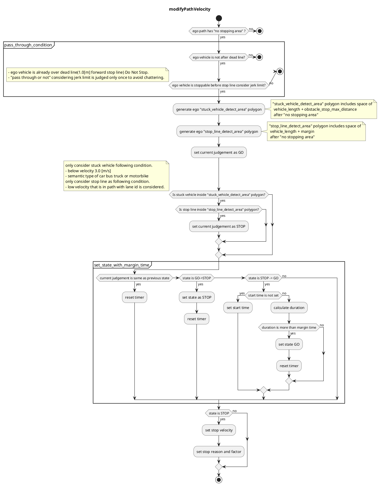

### 停车禁止区域

#### 角色

该模块计划避免在“停车禁止区域”停车。

- 直通过去的情况
  - 如果本车已通过通过判断点，则本车无法以最大加加减减速停车，因此该模块也不会插入停车速度。在这种情况下就需要 Override 或外部操作。
- 停车情况
  - 如果“停车禁止区域”周围有处在停滞状态的车辆或停车速度，则车辆会在“停车禁止区域”内停车，因此该模块会在“停车禁止区域”前设定停车速度。
- 行驶情况
  - 其他情况

### 限制

该模块允许开发人员使用特定规则设计“停车禁止区域”模块中的车辆速度。一旦本车通过过境点后，本车就不会插入停车速度，也不会改变 GO 的决策。此外，该模块仅考虑动态物体，以避免不必要地停车。

#### ModelParameter

| パラメーター                     | タイプ   | 説明                                                        |
| ---------------------------- | ------ | ------------------------------------------------------------ |
| `state_clear_time`           | 数値   | [s] 停止状態を解除する時間                                |
| `stuck_vehicle_vel_thr`      | 数値   | [m/s] この速度以下の車両は停止車両とみなす。                |
| `stop_margin`                | 数値   | [m] 停止禁止区域での停止線へのマージン                     |
| `dead_line_margin`           | 数値   | [m] 自車がこの位置を通過すると進路を許可                    |
| `stop_line_margin`           | 数値   | [m] 停止禁止区域での自動生成停止線へのマージン              |
| `detection_area_length`      | 数値   | [m] 検索ポリゴンの長                                      |
| `stuck_vehicle_front_margin` | 数値   | [m] 障害物停止最大距離                                     |

#### フローチャート

