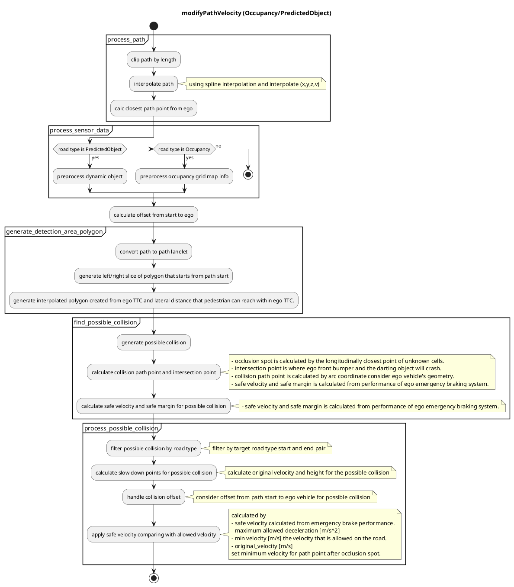
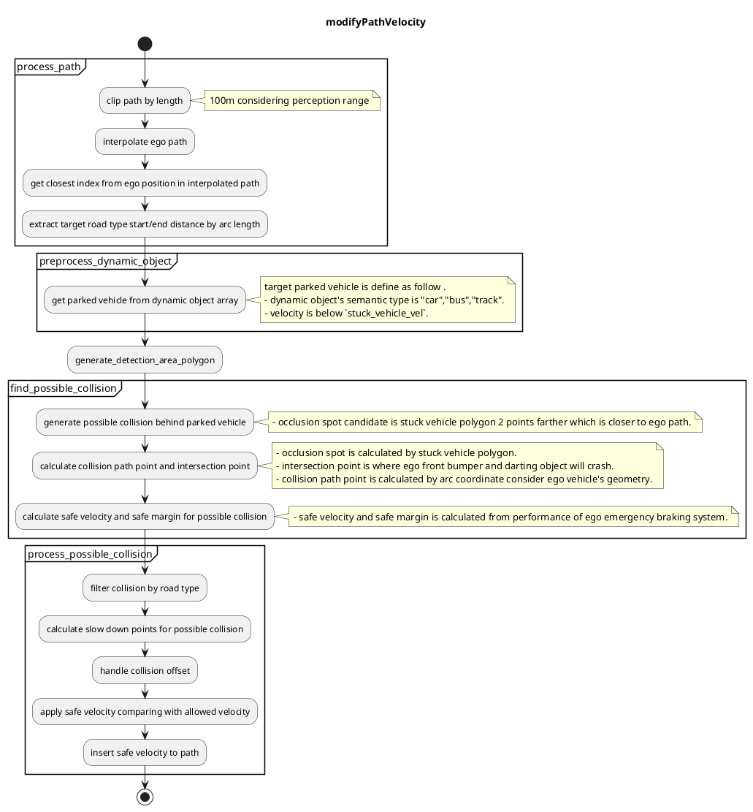
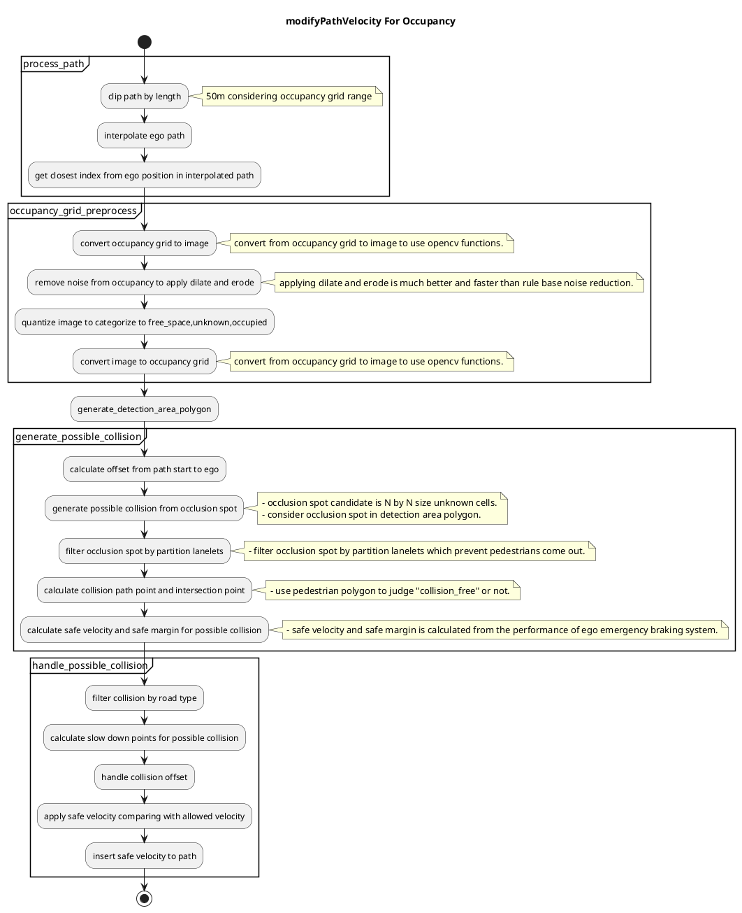

## 遮蔽スポット

### 役割

このモジュールは、運転者が障害物によって見通しが悪い「遮蔽スポット」から隠れた物体が飛び出してくる衝突地点に到達する前に安全速度を計画し、減速します。

### 起動タイミング

このモジュールは、`launch_occlusion_spot` が true になった場合に起動します。歩行者優先ゾーンのマップタグを作成することは TODO の 1 つです。

### 制限事項と TODO

このモジュールは、遮蔽スポットをケアするためのプロトタイプ実装です。認識の誤検出による過剰な減速に対処するために、検出方法のロジックを選択できます。このポイントはまだ詳細に議論されておらず、改善が必要です。

- 計画用のオキュパンシーグリッドを作成します。
- 遮蔽スポットのマップタグを作成します。
- 最適な安全動作について。

TODO は各内側の仕組み/アルゴリズムに記載されています（以下の説明を参照）。

### 内側の仕組み/アルゴリズム

#### ロジックの仕組み

遮蔽には、「駐車車両によって発生する遮蔽」や「障害物による遮蔽」など、いくつかのタイプがあります。**障害物のある道路**で運転するなど、人々が頻繁に飛び出す状況では、考えられるすべての遮蔽スポットを考慮する必要があります。このモジュールは**オキュパンシーグリッド**から計算されたすべての遮蔽スポットを考慮しますが、ガードレールの後ろや走行中の車の後ろから飛び出す人などのすべての遮蔽スポットを考慮するのは合理的ではありません。そのため、現在、検出エリアは**予測オブジェクト**情報を使用するように限定されています。

この決定ロジックはまだ開発中であり、改善する必要があります。

#### 検出エリアのポリゴン

このモジュールは、歩行者の速度と遮蔽スポットまでの横方向の距離から TTV を考慮します。TTC は、自己速度と加速度、モーション速度スムージングを使用した衝突点までの縦方向の距離から計算されます。高速に計算するために、このモジュールは TTC よりも TTV が小さく、「最大横方向距離」内の領域のみを考慮します。

#### オキュパンシーグリッドベースの遮蔽スポット

このモジュールは、オキュパンシーグリッドから計算されたエゴパス周辺の遮蔽スポットを考慮します。計算コストにより、オキュパンシーグリッドは高解像度ではなく、これによりオキュパンシーグリッドがノイズだらけになるので、このモジュールはオキュパンシーグリッドマップにオキュパンシー情報を追加します。

TODO: オキュパンシーグリッドを生成するための障害物点群の高さを考慮します。

##### 衝突なしの判断

遮蔽スポットから飛び出せる障害物は、エゴ車から交差するまで自由な隙間がある必要があります。

##### 車線レットのパーティション

「ガードレール」、「フェンス」、「壁」タグの車線レット情報を使用すると、不要な遮蔽スポットを削除できます。

静的オブジェクト情報を使用すると、オキュパンシーグリッドをより正確にすることができます。

計画用のオキュパンシーグリッドを作成することは TODO の 1 つです。

##### 衝突の可能性

動く車両によって遮蔽から飛び出す可能性のある障害物。

#### 安全な走行について

##### 安全速度とマージンのコンセプト

安全な減速速度は、自車の緊急ブレーキシステムと衝突時間のパラメータから以下のように計算されます。
以下の計算では velocity は含まれていますが、プランナーにとっては動的 velocity の変更はお勧めしません。

- ジャーク限界[m/s^3]
- 減速限界[m/s2]
- 応答遅延時間[s]
- 歩行者の衝突時間[s]
  これらのパラメータにより、理想的な環境での遮蔽スポット手前の安全な走行を簡単に定義できます。

  

このモジュールは、自車が停止するまでの距離と衝突経路の点の距離を幾何学的に考慮して安全マージンを定義します。
自車が安全マージンから衝突経路の点まで巡航している間、自車は遮蔽スポットの安全速度と同じ速度を維持します。

注: このロジックは、高精度の車両速度の追跡を前提としており、減速ポイントのマージンが最善の解決策ではない場合があります。歩行者が実際に遮蔽スポットから飛び出してきた場合は、手動による運転者のオーバーライドが検討されます。

TODO: 最善の選択肢の 1 つを検討する

1. 遮蔽スポットの前に停止する
2. 遮蔽スポットの前に 1km/h の速度を挿入する
3. このように減速する
4. など... .

##### 最大減速速度

最大減速速度は、過剰な減速を避けるために、最大減速ジャークと最大減速加速度での自車の現在の速度と加速度のパラメータから計算されます。

- $j_{max}$ 減速ジャーク限界[m/s^3]
- $a_{max}$ 減速減速度限界[m/s2]
- $v_{0}$ 現在の速度[m/s]
- $a_{0}$ 現在の加速度[m/s]

#### モジュールパラメータ

| パラメータ           | 型   | 説明                                                                             |
| ------------------- | ------ | ----------------------------------------------------------------------------------- |
| `pedestrian_vel`    | double | [m/s] 障害物出現点から出てくる歩行者の仮定最大速度。                          |
| `pedestrian_radius` | double | 障害物スポットにフィットする仮定歩行者半径。                                 |

| パラメータ | 型 | 説明 |
| ----------- | --- | ---------------------------------------------------------------- |
| `use_object_info` | bool | [-] オブジェクト情報を占有グリッドマップに反映するかどうか |
| `use_partition_lanelet` | bool | [-] パーティションLaneletマップデータを使用するかどうか |

| パラメータ /デバッグ | 型 | 説明 |
|---|---|---|
| `is_show_occlusion` | bool | 遮蔽点のマーカーを表示するかどうか |
| `is_show_cv_window` | bool | OpenCVデバッグウィンドウを表示するかどうか |
| `is_show_processing_time` | bool | 処理時間を表示するかどうか |

| パラメータ/しきい値     | 型     | 説明                                                |
| ------------------------ | ------- | --------------------------------------------------- |
| `detection_area_length` | double | [m] オクルージョン地点を考えるパス長             |
| `stuck_vehicle_vel`     | double | [m/s] この値より速度が低い場合は停止していると判断     |
| `lateral_distance`      | double | [m] 隠れた衝突を考える最大横方向距離           |

| パラメーター/モーション | タイプ | 説明 |
| ---------------------------- | ------ | ---------------------------------------------- |
| `safety_ratio`               | double | [-] じゃーと加速度の安全性係数 |
| `max_slow_down_jerk`         | double | [m/s^3] 安全なブレーキのじゃー                                |
| `max_slow_down_accel`        | double | [m/s^2] 安全なブレーキの減速度                              |
| `non_effective_jerk`         | double | [m/s^3] 速度Plannningの弱いじゃー |
| `non_effective_acceleration` | double | [m/s^2] 速度Plannningの弱い減速度 |
| `min_allowed_velocity`       | double | [m/s] 許容最小速度 |
| `safe_margin`                | double | [m] 緊急ブレーキシステムで停止するための最大許容誤差 |

| パラメーター / detection_area | 型   | 説明                                                                                 |
| ---------------------------- | ------ | -------------------------------------------------------------------------------------- |
| `min_occlusion_spot_size` | double | [m] オクルージョンを考慮するパスの長さ                                                   |
| `slice_length`             | double | [m] 検出エリアを分割する距離                                                           |
| `max_lateral_distance`    | double | [m] 検出_エリア領域を構築するために使用される自己パスの周りのバッファ.                    |

| パラメータ/グリッド | 型   | 説明                                                                 |
| ---------------- | ------ | ----------------------------------------------------------------------- |
| `free_space_max` | double | [-] 占有グリッド内の空きスペースセルの最大値                            |
| `occupied_min`   | double | [-] detection_area 領域の構築に使用される自車パス周辺のバッファー |

#### フローチャート

##### 全体過程のフローアウトライン

##### 予測オブジェクトの詳細プロセス（未更新）

##### 点群ベースの空間グリッドの細部プロセス

1. 1パス目
    - 点群データを `post resampling` 処理して、空間グリッド上に等間隔で配置します。
    - 自車位置の周りの空間グリッドセルに、点群データを割り当てます。
    - 各空間グリッドセルに、占有確率を割り当てます。

2. 2パス目
    - 占有確率に基づいて、空間グリッドセルを「占有」、「非占有」、「不明」に分類します。
    - 隣接する空間グリッドセルの分類を考慮して、分類結果を洗練します。

3. 障害物検出
    - 占有確率が高い空間グリッドセルを、障害物として検出します。
    - 障害物の形状や位置を推定します。

4. **Planning**
    - 障害物の予測と回避を考慮した経路を生成します。
    - 速度、加速度、逸脱量に基づく制約を考慮します。

5. **Control**
    - **Planning** モジュールからの経路に従って、車両を制御します。
    - ステアリング、アクセル、ブレーキなどのアクチュエーターを制御します。

6. 反復
    - システムは、点群データの更新を受け取り、プロセスを繰り返します。

